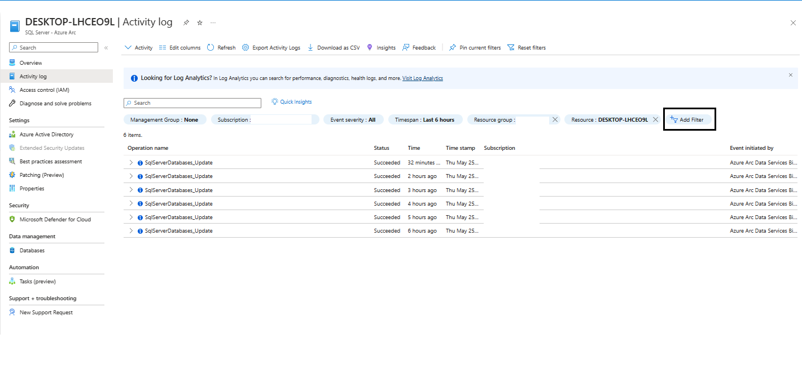
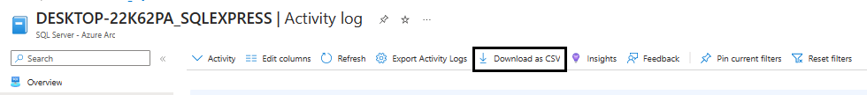
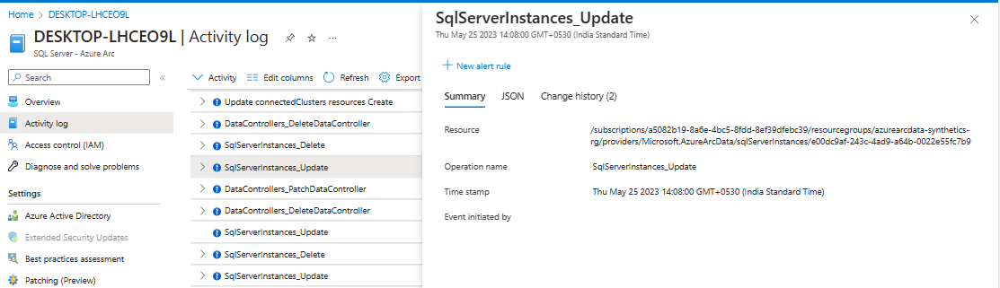

# Azure Arc-enabled SQL Server and Databases Activity logs

The Azure activity logs for Arc-enabled SQL Server provide an insight into [SQL Server - Azure Arc](overview.md) and [SQL Server databases - Azure Arc](view-databases.md) related events. The activity log includes information like when a resource is created or modified.  
One can access these activity logs by going to the SQL Server - Azure Arc resource > Activty Log. With the help of activity logs one can identify events like SQL Server instance update, *SqlServerInstance_Update* SQL Server Databases Update, *SqlServerDatabases_Update*, writing of tags to the resource etc. 
This helps in auditing different operations performed on the resource along with other crucial information such as time at which operation was initiated, it's status and party responsible for event creation. 

## View the activity log
You can access the activity log from most menus in the Azure portal. The menu that you open it from determines its initial filter. You can always change the filter to view all other entries. Select **Add Filter** to add more properties to the filter.

## Download the activity log

Select **Download as CSV** to download the events in the current view.

## View change history
For some events, you can view the change history, which shows what changes happened during that event time. Select an event from the activity log you want to look at more deeply. Select the **Change history** tab to view any associated changes with that event.
If any changes are associated with the event, you'll see a list of changes that you can select. Selecting a change opens the Change history page. This page displays the changes to the resource.

## Next Steps

For more information on Activity Logs and it's retention visit [Azure Monitor activity log](https://learn.microsoft.com/en-us/azure/azure-monitor/essentials/activity-log).
