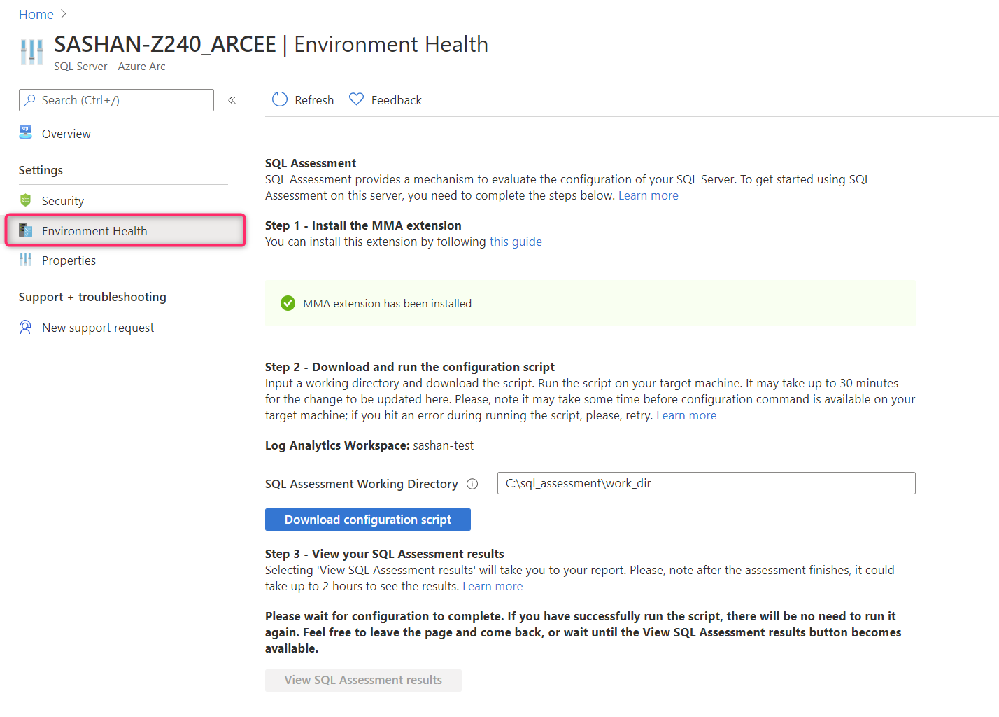
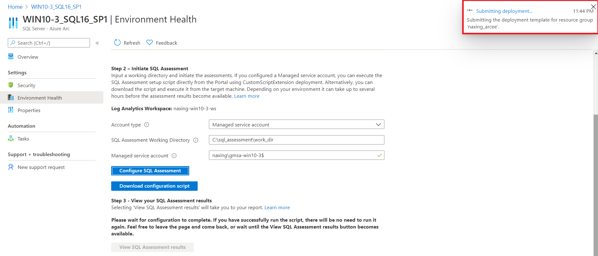
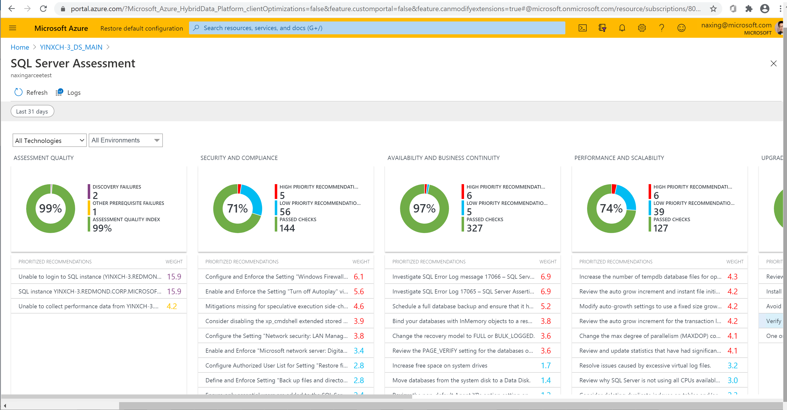
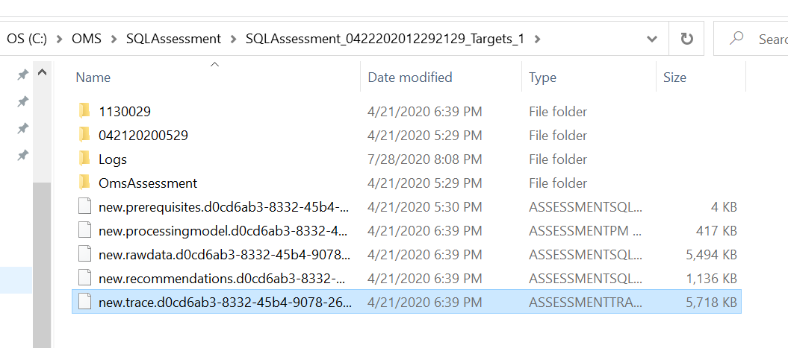
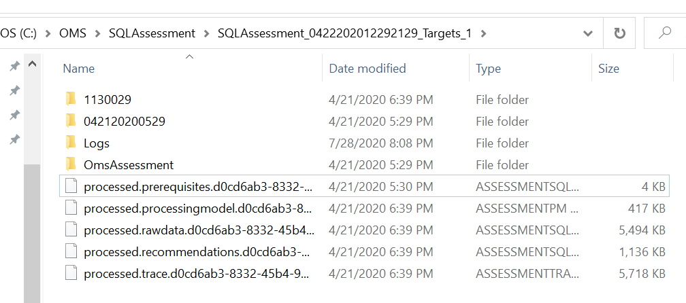

# Configure SQL Assessment on an Azure Arc enabled SQL Server instance

SQL Assessment provides a mechanism to evaluate your configuration of SQL Server. This article provides instructions for using SQL Assessment on an Azure Arc enabled SQL Server instance.

## Prerequisites

* Your Windows-based SQL Server instance is connected to Azure Arc. Follow the instructions to [onboard your SQL Server instance to  Arc-enabled SQL Server](connect.md).
   
   > [!NOTE]
   > On-demand SQL Assessment is currently limited to SQL Server running on Windows machines. This will not work for SQL on Linux machines.

* The Microsoft Monitoring Agent (MMA) extension must be installed and configured on the machine. View the [Install MMA](configure-advanced-data-security.md#install-microsoft-monitoring-agent-mma) article for instructions. You can also get more information on the [Log Analytics Agent](/azure/azure-monitor/platform/log-analytics-agent) article.

* Your SQL Server instance must have the [TCP/IP protocol enabled](../../database-engine/configure-windows/enable-or-disable-a-server-network-protocol.md).

* The [SQL Server browser service](../../tools/configuration-manager/sql-server-browser-service.md) must be running if you're operating a named instance of SQL Server.

* Make sure you've reviewed the SQL Server document at [Services Hub On-Demand Assessments Prerequisites](/services-hub/health/assessment-prereq-docs#on-demand-assessment-prerequisite-documents).

## Run on-demand SQL Assessment

1. Open your SQL Server – Azure Arc resource and select **Environment Health** in the left pane.

   > [!div class="mx-imgBorder"]
   > [  ](media/assess/sql-assessment-heading-sql-server-arc.png#lightbox)

> [!IMPORTANT]
> If MMA extension is not installed, you will not be able to initiate the on-demand SQL Assessment.

2. Select the  account type. If you have a Managed service account, it will allow you to initiate SQL Assessment directly from the Portal. Specify the account name.

> [!NOTE]
> Specifying a *Managed service account* will activate the **Configure SQL Assessment** button so you could initiate the assessment from the Portal by deploying a *CustomScriptExtension*. Because only one *CustomScriptExtension* can be deployed at a time, the script extension for SQL Assessment 
will be automatically removed after execution. If you already have another *CustomScriptExtension* deployed to the hosting machine,  the **Configure SQL Assessment** button will not be activated.

3. Specify a working directory on the data collection machine if you want to change the default. By default, `C:\sql_assessment\work_dir` is used. During collection and analysis, data is temporarily stored in that folder. If the folder doesn't exist, it's created automatically.

4. If you initiate SQL Assessment from the Portal by clicking **Configure SQL Assessment**, a standard deployment bubble will show up.

> [!div class="mx-imgBorder"]
   > [  ](media/assess/sql-assessment-custom-script-deployment.png#lightbox)

5. If you prefer initiating SQL Assessment from the target machine, click **Download configuration script**, copy the downloaded script to the target machine and and execute one of the following code blocks in a admin instance of **powershell.exe**:

   * _Domain account_:  You'll be prompted for the user account and password.

      ```powershell
      Set-ExecutionPolicy -Scope Process -ExecutionPolicy Bypass -Force
      & '.\AddSqlAssessment.ps1'
      ```

   * _Managed Service Account (MSA)_

      ```powershell
      Set-ExecutionPolicy -Scope Process -ExecutionPolicy Bypass -Force
      & '.\AddSqlAssessment.ps1' -ManagedServiceAccountName <MSA account name>
      ```

> [!NOTE]
> The script schedules a task named *SQLAssessment*, which triggers data collection. This task executes within an hour after you've run the script. It then repeats every seven days.

> [!TIP]
> You can modify the task to run on a different date and time or even force it to run immediately. In the the task scheduler library, find **Microsoft** > **Operations Management Suite** > **AOI\*\*\*** > **Assessments** > **SQLAssessment**.

## View SQL Assessment results

* On the _Environment Health_ pane, select the **View SQL Assessment results** button.

   > [!NOTE]
   > The **View SQL Assessment results** button remains disabled until the results are ready in Log Analytics. This process might take up to two hours after the data files are processed on the target machine.

   > [!div class="mx-imgBorder"]
   > [  ](media/assess/sql-assessment-results.png#lightbox)

* You can see the state of data processing on the collection machine by checking the files in the working folder. After the scheduled task is completed, you should see several files with the _new._ prefix in the working directory.

   > [!div class="mx-imgBorder"]
   > [  ](media/assess/sql-assessment-data-files-ready.png#lightbox)

* The Microsoft Monitoring Agent scans the working folder every 15 minutes. It looks for _new.*_ files and sends the data to the Log Analytics workspace. After MMA uploads the file, it changes the prefix change from _new._ to _processed._

   > [!div class="mx-imgBorder"]
   > 

## Next steps

* Get more information by viewing the prerequisite documents at [Services Hub On-Demand Assessments](/services-hub/health/assessment-prereq-docs#on-demand-assessment-prerequisite-documents).

* To obtain comprehensive support of the on-demand SQL Assessment feature, a Premier or Unified support subscription is required. For details, see [Azure Premier Support](https://azure.microsoft.com/support/plans/premier).
