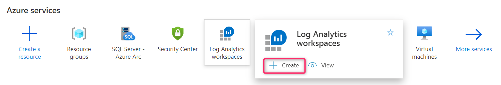
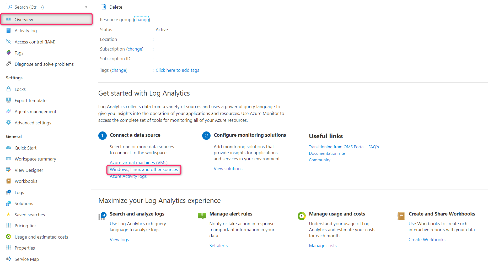
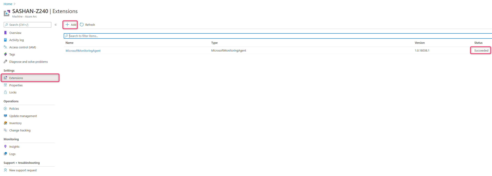
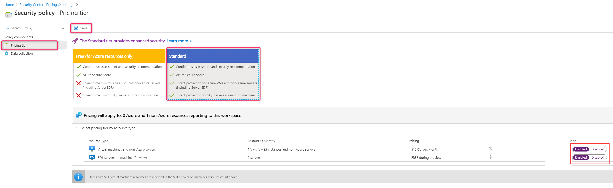
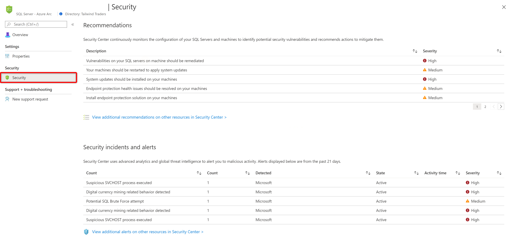
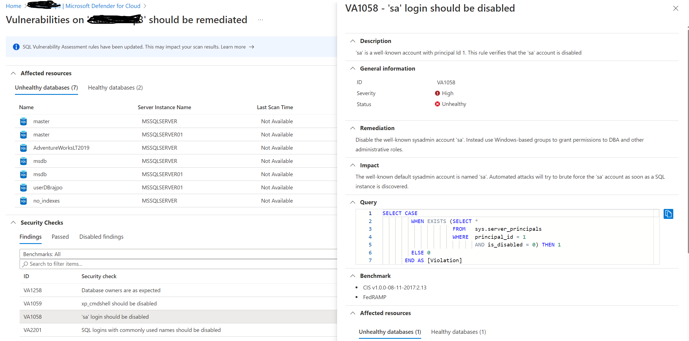
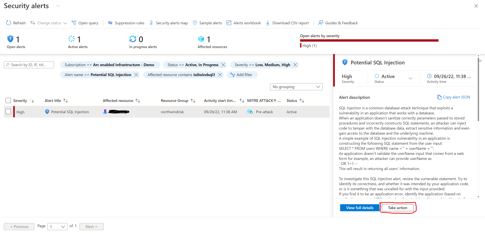
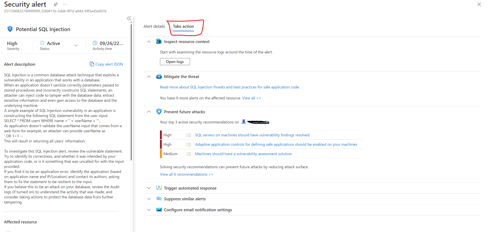

# Configure advanced data security for Azure Arc enabled SQL Server instance

You can enable advanced data security for your SQL Server instances on premises by following these steps.

## Prerequisites

* Your SQL Server instance is onboarded to Arc-enabled SQL Server. Follow these the instructions to [onboard your SQL Server instance to  Arc-enabled SQL Server](connect.md).

* Your user account is assigned one of the [Security Center Roles (RBAC)](/azure/security-center/security-center-permissions)

## Create a Log Analytics workspace

1. Search for __Log Analytics workspaces__ resource type and add a new one through the creation blade.

   

   > [!NOTE]
   > You can use a Log Analytics workspace in any region so if you already have one, you can use it. But we recommend creating it in the same region where your __Machine - Azure Arc__ resource is created.

1. Go to the overview page of the Log Analytics workspace resource and select “Windows, Linux and other sources”. Copy the workspace ID and primary key for later use.

   

## Install Microsoft Monitoring Agent (MMA)

The next step is needed only if you have not yet configured the MMA agent on the remote machine yet.

1. Select the __Machine - Azure Arc__ resource for the virtual or physical server where the SQL Server instance is installed and add the extension __Microsoft Monitoring Agent - Azure Arc__ using the  **Extensions** feature. When asked to configure the Log Analytics workspace, use the workspace ID and primary you saved in the previous step.

   

1. After validation succeeds, click **Create** to start the MMA Arc Extension deployment workflow. When deployment completes the status will be updated to **Succeeded**.

1. For more details, see [Extension management with Azure Arc](/azure/azure-arc/servers/manage-vm-extensions)

## Enable advanced data security

Next, you need to enable advanced data security for SQL Server instance.

1. Go to Security Center and open the **Pricing & settings** page from the sidebar.

1. Select the workspace that you have configured for the MMA extension in the previous step

1. Select **Standard**. Make sure the option for **SQL servers on Machine (Preview)** is enabled.

   

 > [!NOTE]
   > The first scan to generate the vulnerability assessment will happen within 24 hours after enabling advanced data security. After that, auto scans will be performed every week on Sunday.

## Explore

Explore security anomalies and threats in Azure Security Center.

1. Open your SQL Server – Azure Arc resource and select **Security** in the left menu. to see the recommendations and alerts for that instance.

   

1. Click on any of the recommendations to see the vulnerability details in __Security Center__ .

   

1. Click on any security alert for full details and further explore the attack in [Azure Sentinel](https://docs.microsoft.com/azure/sentinel/overview). The following diagram is an example of the brute force alert.

   

1. Click on **Take action** to mitigate the alert.

   

> [!NOTE]
> The general __Security Center__ link at the top of the page does not use the Preview portal URL so your __SQL Server - Azure Arc__ resources will not be visible there. We recommend following the links for the individual recommendations or alerts.

## Next steps

You can further investigate the security alerts and attacks using [Azure Sentinel](/azure/sentinel/overview). Follow these instructions to [on-board Azure Sentinel](/azure/sentinel/connect-data-sources).
