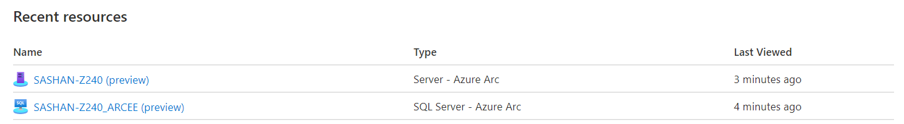

# Connect SQL Server instances to Azure Arc at scale

You can enable Azure Arc enabled SQL Servers (preview) for multiple Windows or Linux machines in your environment with several flexible options depending on your requirements. Using the template script we provide, you can automate every step of the installation, including establishing the connection to Azure Arc. However, you are required to interactively execute this script with an account that has elevated permissions on the target machine and in Azure. The script will connect both the  machines and the installed SQL Server instances on them to Azure Arc. You can use an Azure Active Directory [service principal](https://docs.microsoft.com/azure/active-directory/develop/app-objects-and-service-principals) instead of using your privileged identity to [interactively connect the machine](https://docs.microsoft.com/azure/azure-arc/servers/onboard-portal). A service principal is a special limited management identity that is granted only the minimum permission necessary to connect machines to Azure using the `azcmagent` command and to create the Azure resources for  Azure Arc enabled server and Azure Arc enabled SQL Server. This is safer than using a higher privileged account like a Tenant Administrator, and follows our access control security best practices. The service principal is used only during onboarding, it is not used for any other purpose.  

The installation methods to install and configure the Connected Machine agent requires that the automated method you use has  administrator permissions on the machines. On Linux, by using the root account and on Windows, as a member of the Local Administrators group.

Before you get started, be sure to review the [prerequisites](overview.md#prerequisites) and make sure that you have created a custom role that meets the required permissions.

If you don't have an Azure subscription, create a [free account](https://azure.microsoft.com/free/?WT.mc_id=A261C142F) before you begin.

At the end of this process, you will have successfully connected your hybrid machines to Azure Arc enabled servers (preview).

## Create a Service Principal for onboarding at scale

You can use [Azure PowerShell](/powershell/azure/install-az-ps) to create a service principal with the [New-AzADServicePrincipal](/powershell/module/Az.Resources/New-AzADServicePrincipal) cmdlet. Or you can follow the steps listed under [Create a Service Principal using the Azure portal](/azure/active-directory/develop/howto-create-service-principal-portal) to complete this task.

> [!NOTE]
> When you create a service principal, your account must be an Owner or User Access Administrator in the subscription that you want to use for onboarding. If you don't have sufficient permissions to create role assignments, the service principal might be created, but it won't be able to onboard machines.
>

To create the service principal using PowerShell, perform the following.

1. Run the following command. You must store the output of the [`New-AzADServicePrincipal`](/powershell/module/az.resources/new-azadserviceprincipal) cmdlet in a variable, or you will not be able to retrieve the password needed in a later step.

    ```azurepowershell-interactive
    $sp = New-AzADServicePrincipal -DisplayName "Arc-for-servers" -Role <your custom role>
    $sp
    ```

    ```output
    Secret                : System.Security.SecureString
    ServicePrincipalNames : {ad9bcd79-be9c-45ab-abd8-80ca1654a7d1, https://Arc-for-servers}
    ApplicationId         : ad9bcd79-be9c-45ab-abd8-80ca1654a7d1
    ObjectType            : ServicePrincipal
    DisplayName           : Hybrid-RP
    Id                    : 5be92c87-01c4-42f5-bade-c1c10af87758
    Type                  :
    ```

> [!NOTE]
> To create a custom role, follow the instructions
>

2. To retrieve the password stored in the `$sp` variable, run the following command:

    ```azurepowershell-interactive
    $credential = New-Object pscredential -ArgumentList "temp", $sp.Secret
    $credential.GetNetworkCredential().password
    ```

3. In the output, find the password value under the field **password** and copy it. Also find the value under the field **ApplicationId** and copy it also. Save them for later in a secure place. If you forget or lose your service principal password, you can reset it using the [`New-AzADSpCredential`](/powershell/module/azurerm.resources/new-azurermadspcredential) cmdlet.

The values from the following properties are used with parameters passed to the `azcmagent`:

* The value from the **ApplicationId** property is used for the `--service-principal-id` parameter value
* The value from the **password** property is used for the  `--service-principal-secret` parameter used to connect the agent.

> [!NOTE]
> Note that Azure Arc for servers doesn’t currently support signing in with a certificate, so the service principal must have a secret to authenticate with.
>

The **Azure Connected Machine Resource Administrator** has the permissions required to onboard a machine and to register SQL Server instance. You can assign the service principal permission to allow its scope to include a resource group or a subscription. To add role assignment, see [Add or remove role assignments using Azure RBAC and the Azure portal](/azure/role-based-access-control/role-assignments-portal) or [Add or remove role assignments using Azure RBAC and Azure CLI](/azure/role-based-access-control/role-assignments-cli).

## Register the installed SQL Server instances on multiple machines

To discover and register the installed SQL Server instances on multiple machines, you can use the same script your downloaded from the Portal as described in the [Connect your SQL Server to Azure Arc](connect.md) article with a small change described below. As a result, each machine will be connected and registered as a __Machine - Azure Arc__ resource, and each installed SQL Server instance will be registered as a __SQL Server - Azure Arc__ resource.

### Windows 

Before you run the registration script on a machine, you must install the Azure powershell module with "Install-Module -Name Az -AllowClobber", and connect the service principal account to Azure with [Connect-AzAccount](/powershell/module/az.accounts/connect-azaccount). Use the following steps to connect SQL Server instances on multiple Windows machines. 

1. Download the PowerShell script from the Portal as described in the [Connect your SQL Server to Azure Arc](connect.md) article

2. Open the script in an admin instance of PowerShell ISE and replace the following environment variables using the values generated during the service principal provisioning described earlier. These variable are initially empty.

    ```azurepowershell-interactive
    $servicePrincipalAppId="{serviceprincipalAppID}"
    $servicePrincipalSecret="{serviceprincipalPassword}"
    ```
3. Execute the script on each target machines

>[!NOTE]
>The script only supports running from a 64-bit version of Windows PowerShell.
>

### Linux

Each target machine must have the [Azure CLI installed](/cli/azure/install-azure-cli). On Linux machines the registration script will automatically sign in to azure with the service principal credentials if they’re provided and no other user is already signed in. Use the following steps to connect SQL Server instances on multiple Linux machines.

1. Download the Linux shell script from the Portal as described in the [Connect your SQL Server to Azure Arc](connect.md) article

2. Replace the following variables in the script using the values generated during the service principal provisioning described earlier. These variable are initially empty.

    ```bash
    servicePrincipalAppId="{serviceprincipalAppID}"
    servicePrincipalSecret="{serviceprincipalPassword}"
    ```

3. Execute the script on each target machines

## Validate successful onboarding

After you register SQL Server instances with Azure Arc enabled SQL Server (preview), go to the [Azure portal](https://aka.ms/azureportal) and view the newly created Azure Arc resources. You will see a new __Machine - Azure Arc__ for each connected machine and a new __SQL Server - Azure Arc__ resource for each registered SQL Server instance. 



## Next steps

- Learn how to manage your machine using [Azure Policy](/azure/governance/policy/overview), for such things as VM [guest configuration](/azure/governance/policy/concepts/guest-configuration), verifying the machine is reporting to the expected Log Analytics workspace, enable monitoring with [Azure Monitor with VMs](/azure/azure-monitor/insights/vminsights-enable-policy), and much more.

- Learn more about the [Log Analytics agent](/azure/azure-monitor/platform/log-analytics-agent). The Log Analytics agent for Windows and Linux is required when you want to proactively monitor the OS and workloads running on the machine, manage it using Automation runbooks or solutions like Update Management, or use other Azure services like [Azure Security Center](/azure/security-center/security-center-intro).

- Learn how to [Configure your SQL Server instance for periodic environment health check using on-demand SQL assessment](assess.md)

- Learn how to [Configure advanced data security for your SQL Server instance](configure-advanced-data-security.md)
