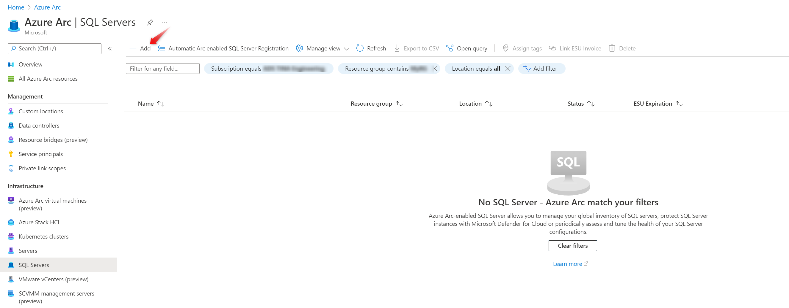
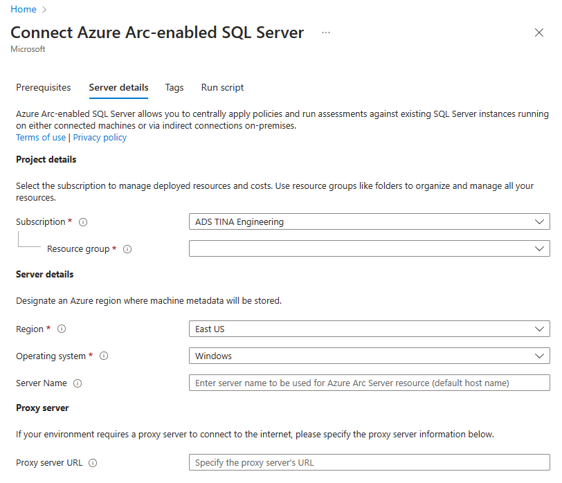
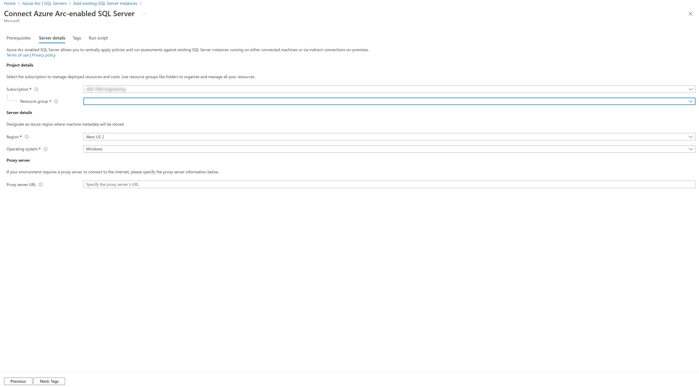
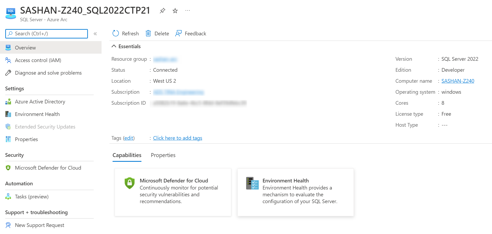
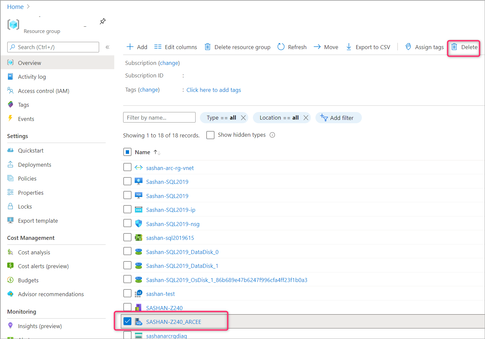

# Connect your SQL Server to Azure Arc

You can connect your SQL Server instance on premises to Azure Arc by following these steps.

## Prerequisites

* Your machine has at least one instance of SQL Server installed
* For Linux machines, you have downloaded AZ CLI and connected your Azure account. Follow the instructions on how to [install Azure CLI](/cli/azure/install-azure-cli-apt).

## Generate a registration script for SQL Server

In this step you generate a script that discovers all SQL Server instances installed on the machine and registers them as __SQL Server - Azure Arc__ resources. If the hosting physical or virtual machine is not registered with Azure Arc, the script automatically does it.

1. Search for__SQL Server - Azure Arc__ resource type and add a new one through the creation blade.


    
1. Review the pre-requisites and go to the **Server details** tab.  

1. Select the the subscription, resource group, Azure region and the host operating system. If required, also specify the proxy that your network uses to connect to Internet.



1. Go to the **Run script** tab and download the displayed registration script. The portal generates the script for the hosting OS you specified.



## Connect the installed SQL Server instances to Azure Arc

In this step you will take the script you downloaded from Azure portal and execute it on the target physical or virtual machine. As a result, each installed SQL Server instance on the machine will be registered as a __SQL Server - Azure Arc__ resource. In addition, if the machines itself does not have the guest configuration agent installed, it will be installed automatically and registered as a __Machine - Azure Arc__ resource.

### Windows

1. Open the script in an admin instance of PowerShell ISE

1. Execute the script

> [!NOTE]
> You may see issues the first time if you haven't previously installed the AZ module for powershell. In that case follow the instructions in the script to install and connect your account and run the script again.

### Linux

1. Follow these [instructions](/cli/azure/install-azure-cli-apt) to download AZ CLI and connect your Azure account.

1. Grand the execution permission to the downloaded script and execute it.

```bash
sudo chmod +x ./<filename>.sh
./<filename>.sh
```

## Register SQL Server instances on multiple machines

You can automate registration of multiple SQL Servers using any enterprise management tool that supports launching the same script on a set of target machines. No modifications of the downloaded script will be required. Each of the target machines must meet the same [prerequisites](#prerequisites).

## Validate the SQL Server - Azure Arc resources

Go [Azure portal](https://ms.portal.azure.com/#home) and open the newly registered __SQL Server - Azure Arc__ resource to validate.



## Un-register the SQL Server - Azure Arc resources

To remove an existing __SQL Server - Azure Arc__ resource, go to the resource group that contains it and remove it from the list of resources in the group.



## Next steps

[Configure advanced data security for your SQL Server instance](configure-advanced-data-security.md)

[Configure on-demand SQL assessment for your SQL Server instance](assess.md)