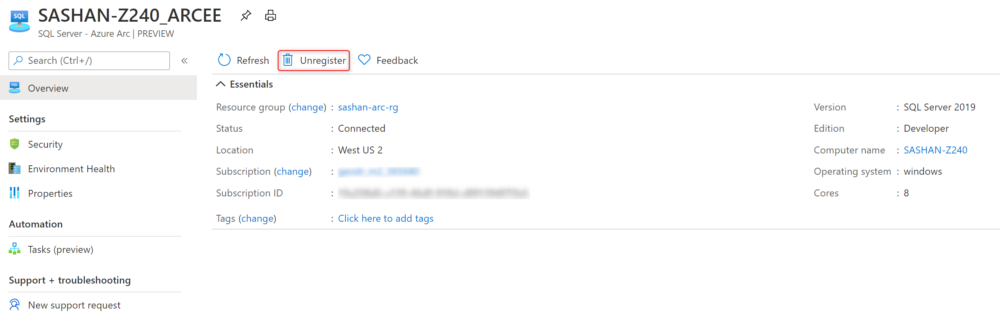

# Connect your SQL Server to Azure Arc

You can connect your SQL Server instance to Azure Arc by following these steps.

## Prerequisites

* Your machine has at least one instance of SQL Server installed
* The **Microsoft.AzureArcData** resource provider has been registered.

To register the resource provider, use one of the methods below:  

# [Azure portal](#tab/azure)

1. Select **Subscriptions** 
2. Choose your subscription
3. Under **Settings**, select **Resource providers**
4. Search for `Microsoft.AzureArcData` and select **Register**

# [PowerShell](#tab/powershell)

Run:

```powershell
Register-AzResourceProvider -ProviderNamespace Microsoft.AzureArcData
```

# [Azure CLI](#tab/az)

Run:

```azurecli
az provider register --namespace 'Microsoft.AzureArcData'
```
---


## Initiate the connection from Azure

If the machine with SQL Server is already connected to Azure Arc, you can register the SQL Server instances on that machine by installing the SQL Server extension (*WindowsAgent.SqlServer*).  Once installed, the SQL Server extension will recognize all the installed SQL Server instances and register them with Azure Arc. The extension will run continuously to detect changes of the SQL Server configuration. For example, if a new SQL Server instance is installed on the machine, if will be automatically registered with Azure. See [virtual machine extension management](/azure/azure-arc/servers/manage-vm-extensions) for instructions how to install and uninstall extensions using  the Azure portal, Azure PowerShell or Azure CLI.

> [!IMPORTANT]
>1. The Managed System Identity for the corresponding **Machine - Azure Arc** must have the *Azure Connected SQL Server Onboarding* role at resource group level.
>2. The __SQL Server - Azure Arc__ resource for each SQL Server instance installed on the machine will be created in the same region and the resource group as the corresponding __Machine - Azure Arc__ resource.

# [Azure portal](#tab/azure)

To assign the *Azure Connected SQL Server Onboarding* role to Arc machine managed identity, use the following steps:

1. Select the resource group with the **Machine - Azure Arc** resource.
1. Select **Access control (IAM)**
1. Click **+ Add** and select **Add role assignment**
   - For **Role**, select `Azure Connected SQL Server Onboarding`
   - For **Assign access to**, select `User, group or service principal`
   - For **Select**, search for your **Machine - Azure Arc** name and select it.
1. Click **Save**.

To install the SQL Server extension, use the following steps:

1. Open the __Machine - Azure Arc__ resource. 
2. Under __Extensions__, click __+ Add__ 
1. Select `WindowsAgent.SqlServer` from the list and click __Create__.

# [PowerShell](#tab/powershell)

To assign *Azure Connected SQL Server Onboarding* role to the machine's managed identity, run:

```powershell
$spID = (Get-AzADServicePrincipal -DisplayName $arcMachineName).Id
New-AzRoleAssignment -ObjectId $spID RoleDefinitionName "Azure Connected SQL Server Onboarding" -ResourceGroupName {resource group name}
```

To install the SQL Server extension, run:

```powershell
$Settings = @{\"SqlManagement\":{\"IsEnabled\":true},  \"excludedSqlInstances\":[]}
New-AzConnectedMachineExtension -Name "WindowsAgent.SqlServer" -ResourceGroupName {your resource group name} -MachineName {your machine name} -Location {azure region} -Publisher "Microsoft.AzureData" -Settings $Settings -ExtensionType "WindowsAgent.SqlServer"
```

# [Azure CLI](#tab/az)

To assign the *Azure Connected SQL Server Onboarding* role to Arc machine managed identity, run:

```azurecli
spID=$(az resource list -n <ArcMachineName> --query [*].identity.principalId --out tsv)
az role assignment create --assignee $spID --role 'Azure Connected SQL Server Onboarding ' --scope /subscriptions/<mySubscriptionID>/resourceGroups/<myResourceGroup>
```

To install the SQL Server extension, run:

```azurecli
   az connectedmachine extension create --machine-name "{your machine name}" --location {"azure region"} --name "WindowsAgent.SqlServer" --resource-group "{your resource group name}" --type "WindowsAgent.SqlServer" --publisher "Microsoft.AzureData" --settings '{\"SqlManagement\":{\"IsEnabled\":true},  \"excludedSqlInstances\":[]}'
```

---

> [!NOTE]
> The specified resource group must match the resource group of the corresponding __Machine - Azure Arc__ resource. Otherwise, the command will fail.

## Initiate the connection from the target machine

If you want to customize the process of connecting the SQL Server instance to Azure Arc, you can initiate the connection from the target machine using the onboarding script.

### Generate a onboarding script for SQL Server

If the machine with SQL Server is already connected to Azure Arc, you can register the SQL Server instances on that machine by installing the SQL Server extension (*WindowsAgent.SqlServer*).  Once installed, the SQL Server extension will recognize all the installed SQL Server instances and register them with Azure Arc. The extension will run continuously to detect changes of the SQL Server configuration. For example, if a new SQL Server instance is installed on the machine, the extension automatically registers it with Azure. See [virtual machine extension management](/azure/azure-arc/servers/manage-vm-extensions) for instructions how to install and uninstall extensions using  Azure portal, Azure PowerShell, or Azure CLI.

1. Search for __SQL Server - Azure Arc__ resource type and add a new one through the creation blade.
   

2. Review the prerequisites and go to the **Server details** tab.  

3. Select the subscription, resource group, Azure region, and the host operating system. If required, also specify the proxy that your network uses to connect to Internet.

   > [!IMPORTANT]
   > If the machine hosting the SQL Server instance is already [connected to Azure Arc](/azure/azure-arc/servers/onboard-portal), make sure to select the same resource group that contains the corresponding __Machine - Azure Arc__ resource.

   

4. Go to the **Run script** tab and download the onboarding script. The portal generates the script for the hosting OS you specified.

   

### Connect SQL Server instances to Azure Arc

In this step you will take the script you downloaded from Azure portal and execute it on the target machine. The script installs the SQL Server extension. If the machine itself does not have the guest configuration agent installed, the script first installs it then installs the SQL Server extension. The guest agent and the SQL extension will in turn register the connected server and the SQL Server instances on it as the __Machine - Azure Arc__ and __SQL Server - Azure Arc__ resources respectively.

> [!IMPORTANT]
> Make sure to execute the script using an account that meets the minimum permission requirements described in [prerequisites](overview.md#prerequisites).

# [Windows](#tab/windows)

1. Launch an admin instance of __powershell.exe__ and sign in your PowerShell module with your Azure credentials. Follow the [sign in instructions](/powershell/azure/install-az-ps#sign-in).

2. Execute the downloaded script

   ```powershell
   & '.\RegisterSqlServerArc.ps1'
   ```

   > [!NOTE]
   > If you haven't previously installed the [Az PowerShell module](/powershell/azure/new-azureps-module-az) and see issues the first time you run it, follow the instructions in the script and run it again.

# [Linux](#tab/linux)

1. Use Azure CLI to sign in with your Azure credentials. Follow the [sign in instructions](/cli/azure/authenticate-azure-cli)

2. Grant the execution permission to the downloaded script and execute it.

   ```console
   sudo chmod +x ./RegisterSqlServerArc.sh
   ./RegisterSqlServerArc.sh
   ```

---

## Validate the SQL Server - Azure Arc resources

Go [Azure portal](https://ms.portal.azure.com/#home) and open the newly registered __SQL Server - Azure Arc__ resource to validate.


## Disconnect your SQL Server instance

To disconnect your SQL Server instance from Azure Arc, go to Azure portal, open the __SQL Server - Azure Arc__ resource for that instance, and click the **Unregister** button. It will delete this resource and instruct the SQL Server extension on the machine to stop monitoring this SQL Server instance.  



> [!IMPORTANT]
> Because there could be multiple SQL Server instances installed on the same machine, the *Unregister* button will not uninstall the SQL Server extension.  To uninstall it, follow the [uninstall extension](/azure/azure-arc/servers/manage-vm-extensions-portal#uninstall-extension) steps.

## Restore a deleted SQL Server - Azure Arc resource

If you disconnected your SQL Server instance by mistake, you can restore its __SQL Server - Azure Arc__ resource with the following steps.

1. If you also uninstalled the SQL Server extension by mistake, reinstall it.

```console
   az connectedmachine extension create --machine-name "{your machine name}" --location {"azure region"} --name "WindowsAgent.SqlServer" --resource-group "{your resource group name}" --type "WindowsAgent.SqlServer" --publisher "Microsoft.AzureData" --settings '{\"SqlManagement\":{\"IsEnabled\":true},  \"excludedSqlInstances\":[]}'
```
 > [!NOTE]
   > The location property must match the location of the **Machine - Azure Arc** resource for the server specified by the *--machine-name* parameter.

2. Check to make sure your instance is in the exclusion list (see the value of the _excludedSqlInstances_ property).

```console
    az connectedmachine extension show --machine-name "{your machine name}" --resource-group "{your resource group name}" -n WindowsAgent.SqlServer
```

3. Make sure to remove your instance from the exclusion list and update the extension settings.

```console
    az connectedmachine extension create --machine-name "{your machine name}" --location {"azure region"} --name "WindowsAgent.SqlServer" --resource-group "{your resource group name}" --type "WindowsAgent.SqlServer" --publisher "Microsoft.AzureData" --settings '{\"SqlManagement\":{\"IsEnabled\":true},  \"excludedSqlInstances\":[\"{named instance 1}\",\"{named instance 3}}\"]}'
```
The instance will be restored after the next sync with the agent. For information on how to manage vm extensions using Portal or PowerShell, see [virtual machine extension management](/azure/azure-arc/servers/manage-vm-extensions).

## Next steps

* [Configure advanced data security for your SQL Server instance](configure-advanced-data-security.md)

* [Configure on-demand SQL assessment for your SQL Server instance](assess.md)
