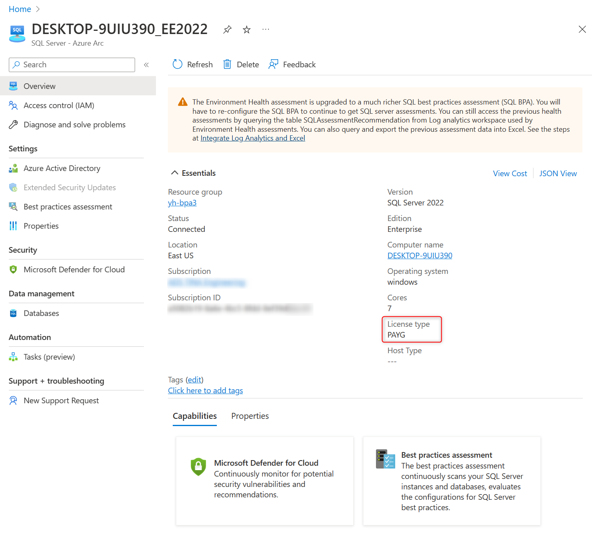

# Manage SQL Server license and billing options

[!INCLUDE [sqlserver](../../includes/applies-to-version/sqlserver.md)]

This article explains how to manage SQL Server licenses and set billing options.

> [!TIP]
> To modify the license type for a larger scope, such as a resource group, subscription, or multiple subscriptions with a single command, use the [Modify license type](https://github.com/microsoft/sql-server-samples/tree/master/samples/manage/azure-arc-enabled-sql-server/modify-license-type) PowerShell script. It is published as an open source SQL Server sample and includes the step-by-step instructions.

You can use Azure Arc-enabled SQL Server to accurately track your usage of the SQL Server software and manage your license compliance. You may also elect to pay for the SQL software usage directly through Microsoft Azure using a pay-as-you-go billing option. You can control how you pay for SQL Server software through Azure portal or API. [!INCLUDE [sssql22-md](../../includes/sssql22-md.md)] allows you to select a pay-as-you-go billing option during setup.

License type is a property of Azure extension for SQL Server resource. It applies to all instances installed on the server where the extension is running. For your convenience it is also included in Azure portal overview for an Arc-enabled SQL Server instance as **Host License Type**.

[!INCLUDE [license-types](includes/license-types.md)]

## Prerequisites

* You're in a [Contributor role](/azure/role-based-access-control/built-in-roles#contributor) in at least one of the Azure subscriptions your organization created. Learn how to [create a new billing subscription](/azure/cloud-adoption-framework/ready/azure-best-practices/initial-subscriptions).
* You're in a [Contributor role](/azure/role-based-access-control/built-in-roles#contributor) for the resource group in which the SQL Server instance will be registered. See [Managed Azure resource groups](/azure/azure-resource-manager/management/manage-resource-groups-portal) for details.
* The **Microsoft.AzureArcData** and **Microsoft.HybridCompute** resource providers are registered in each subscription you use for SQL Server pay-as-you-go billing.

To register the resource providers, use one of the methods below:  

### [Azure portal](#tab/azure)

1. Select **Subscriptions** 
2. Choose your subscription
3. Under **Settings**, select **Resource providers**
4. Search for `Microsoft.AzureArcData` and `Microsoft.HybridCompute` and select **Register**

### [PowerShell](#tab/powershell)

Run:

```powershell
Register-AzResourceProvider -ProviderNamespace Microsoft.AzureArcData
```

### [Azure CLI](#tab/az)

Run:

```azurecli
az provider register --namespace 'Microsoft.AzureArcData'
```

---

## Overview

License type is a configuration setting of Azure Extension for SQL Server that defines how you prefer to pay for the usage of SQL Server software installed on the physical or virtual machine. It also allows you to track software usage in the Cost Management + Billing portal and ensure you are compliant with SQL Server license requirements. License type is a required parameter when you install Azure Extension for SQL Server and each supported onboarding method includes the license type options.

## License types

You can set the license type to apply to your server. See [Select license type](#select-license-type).

The following license types are supported:

| License type | Long description | Short description |  
|---|---|---|
| PAYG | Standard or Enterprise edition with pay-as-you-go billing through Microsoft Azure | Pay-as-you-go |
| Paid | Standard or Enterprise edition license with Software Assurance or SQL Subscription  | License with software assurance |
| LicenseOnly | Developer, Evaluation, Express, Web, Standard or Enterprise edition license only without Software Assurance | License only |

* **PAYG**: Pay for your SQL Server software usage through Microsoft Azure. See [SQL Server prices and licensing](https://www.microsoft.com/sql-server/sql-server-2022-pricing).

  > [!IMPORTANT]
  > For correct billing, servers that use **PAYG** license type should stay continuously connected to Azure. 
  >
  > Intermittent connectivity disruptions are tolerated with built-in resilience.

* **Paid** and **LicenseOnly**: Use an existing license agreement. Usage implies that you already have the necessary licenses. In these cases, your software usage will be reported to you using $0 meters. You can analyze your usage in the [Cost Management + Billing portal](/azure/cost-management-billing/) to make sure you have enough licenses for all your installed SQL Server instances.

The billing granularity is one hour. Pay-as-you-go charges are calculated based on the SQL Server edition and the size of the hosting server at any time during that hour. The size is measured in cores if the SQL Server instance is installed on a physical server, and logical cores (vCores) if the SQL Server instance is installed on a virtual machine. When multiple instances of SQL Server are installed on the same OS, only one instance must be licensed for the full size of the host, subject to minimum core size. See [SQL Server licensing guide](https://www.microsoft.com/licensing/docs/view/SQL-Server) for details. The following rules apply:

* The instance with the highest edition of all instances installed on the same operating system determines the required license.
* If two or more instances of the same edition are installed, the first instance in alphabetical order is billed.
* The configured license type defines how the winning instance is billed.

In addition to billing differences, license type determines what features will be available to your Arc-enabled SQL Server. The following features are not included in the LicenseOnly license type:

* Licensing benefit for fail-over servers. Azure extension for SQL Server supports free fail-over servers by automatically detecting if the instance is a replica in an availability group and reporting the usage with a separate meter. You can track the usage of the DR benefit in Cost Management + Billing. See [SQL Server licensing guide](https://www.microsoft.com/licensing/docs/view/SQL-Server) for details.
* Detailed database inventory. You can manage your SQL database inventory in Azure portal. See [View databases](view-databases.md) for details.
* Managing automatic updates of SQL Server from Azure.
* Best practices assessment. You can generate best practices reports and recommendations by periodic scans of your SQL Server configurations. See [Configure your SQL Server instance for Best practices assessment](assess.md)

The following table shows the meters that track usage and billing for different license types and SQL Server editions:

| Installed edition | Projected edition | License type | AG replica | Meter SKU |
|--|--|--|--|--|
| Enterprise Core | Enterprise | PAYG | No | Ent edition - PAYG |
|  Enterprise Core | Enterprise | Paid | No | Ent edition - AHB |
| Standard | Standard | PAYG | No | Std edition - PAYG |
|  Standard | Standard | Paid | No | Std edition - AHB |
| Enterprise Core | Enterprise | LicenseOnly | Yes or No | Ent edition - License only |
| Enterprise (Server/CAL) | Enterprise | LicenseOnly | Yes or No | n/a <sup>1</sup>|
|  Standard | Standard | LicenseOnly | No | Std edition - License only |
| Enterprise Core | Enterprise | PAYG or Paid | Yes | Ent edition - DR replica |
| Standard | Standard | PAYG or Paid | Yes | Std edition - DR replica |
| Evaluation | Evaluation | LicenseOnly | Yes or No | Eval edition |
| Developer | Developer | LicenseOnly | Yes or No | Dev edition |
| Web | Web | LicenseOnly | n/a | Web edition |
| Express | Express | LicenseOnly | n/a | Express edition |

<sup>1</sup> Enterprise Server/CAL is allowed to connect but usage meters are not emitted because it is not a core-based license.

## Select license type

License type is a property of Azure extension for SQL Server. Only one instance of the extension can be installed on each machine. It manages all SQL Server instances installed on that server.

All instances share the license type value. The value is in the portal overview for Arc-enabled SQL Server as shown.



The overview also identifies:

* All instances of SQL Server on the server
* Host license type
* Enhanced security update (ESU) status

### Modify license type

You can change the license type of an installed Azure extension for SQL Server by using one of the following methods.

### [Azure portal](#tab/azure)

To manage the license in the portal. On the Arc-enabled SQL Server overview, select the computer name.

Azure portal opens **SQL Server Configuration** for the server.

:::image type="content" source="media/billing/sql-server-instance-configuration.png" alt-text="Screenshot of Azure portal SQL Server instance configuration.":::

#### Set license type

Choose one of the license types. See [License types](#license-types) for descriptions.

#### Subscribe to Extended Security Updates

Extended security updates (ESU)  subscription only applies to servers covered with Software Assurance or pay-as-you-go license type. If the server license type is license only, the option to select ESU is disabled.

If you want to change the license type to license only you need to:

1. Unsubscribe from ESU.
1. Save the change.
1. Wait approximately 5 minutes for the saved change to complete.
1. Set the new license type.

#### Exclude instances

If you do not want Arc-enable one or more instances, add those instances under **Skip Instances**.

After you verify the license type, ESU setting, and any instance to exclude, select **Save** to apply changes.

### [PowerShell](#tab/powershell)

The following command will set the license type to "PAYG":

```powershell
//Updated settings object
$Settings = @{ SqlManagement = @{ IsEnabled = $true }; ExcludedSqlInstances = @( "Foo","Bar">); LicenseType="PAYG"}

// Command stays the same as before, only settings is changed above:
New-AzConnectedMachineExtension -Name "WindowsAgent.SqlServer" -ResourceGroupName {your resource group name} -MachineName {your machine name} -Location {azure region} -Publisher "Microsoft.AzureData" -Settings $Settings -ExtensionType "WindowsAgent.SqlServer"
```

To modify the license type for a larger scope, such as a resource group, subscription, or multiple subscriptions with a single command, use the [Modify license type](https://github.com/microsoft/sql-server-samples/tree/master/samples/manage/azure-arc-enabled-sql-server/modify-license-type) PowerShell script. It is published as an open source SQL Server sample and includes the step-by-step instructions.

> [!TIP]  
> Run the script from Azure Cloud shell as it has the required Azure PowerShell modules pre-installed and you will be automatically authenticated. For details, see [Running the script using Cloud Shell](https://github.com/microsoft/sql-server-samples/tree/master/samples/manage/azure-arc-enabled-sql-server/modify-license-type#running-the-script-using-cloud-shell).

### [Azure CLI](#tab/az)

The following command will set the license type to "PAYG":

```azurecli
az connectedmachine extension update --machine-name "simple-vm" -g "<resource-group>" --name "WindowsAgent.SqlServer" --type "WindowsAgent.SqlServer" --publisher "Microsoft.AzureData" --settings '{"LicenseType":"PAYG", "SqlManagement": {"IsEnabled":true}}'    
```

---
> [!IMPORTANT]  
>
> - The update command overwrites all settings. If your extension settings have a list of excluded SQL Server instances, make sure to specify the full exclusion list with the update command.
> - If you already have an older version of the Azure extension installed, make sure to upgrade it first, and then use one the modify methods to set the correct license type. For details, see [How to upgrade a machine extension](/azure/azure-arc/servers/manage-automatic-vm-extension-upgrade) for details. 

## Deployment options

To select the appropriate deployment option, see [Deployment options for Azure Arc-enabled SQL Server](deployment-options.md)

## Query resources

You can use [Azure Resource Graph](/azure/governance/resource-graph/overview) to query resources to describe license type of your enabled instances. See the following examples.

### Count by license type

This example returns the count by license type.

```kusto
resources
| where type == "microsoft.hybridcompute/machines/extensions"
| where properties.type in ("WindowsAgent.SqlServer","LinuxAgent.SqlServer")
| extend licenseType = iff(properties.settings.LicenseType == '', 'Configuration needed', properties.settings.LicenseType)
| summarize count() by tostring(licenseType)
```

### Identify instances where license type is null

This query returns a list of instances where the license type is null.

```kusto
resources
| where type == "microsoft.hybridcompute/machines/extensions"
| where properties.type in ("WindowsAgent.SqlServer","LinuxAgent.SqlServer")
| where isnull(properties.settings.LicenseType)
| project ['id'], resourceGroup, subscriptionId
```

### List details for each instance including license type

This query identifies many details about each instance, including the license type, and enabled features.

```kusto
resources
| where type == "microsoft.hybridcompute/machines/extensions"
| where properties.type in ("WindowsAgent.SqlServer","LinuxAgent.SqlServer")
| project name, resourceGroup, subscriptionId,
    properties.provisioningState,
    properties.settings.LicenseType,
    properties.instanceView.status.message,
    properties.instanceView.typeHandlerVersion,
    properties.ExcludedSqlInstances,
    iff(notnull(properties.settings.ExternalPolicyBasedAuthorization),"Purview enabled",""),
    iff(notnull(properties.settings.AzureAD),"Azure AD enabled",""),
    iff(notnull(properties.settings.AssessmentSettings),"BPA enabled","")

```

For more examples of Azure Resource Graph Queries, see [Starter Resource Graph queries](/azure/governance/resource-graph/samples/starter).

## Next steps

- [Review SQL Server 2022 Pricing](https://www.microsoft.com/sql-server/sql-server-2022-pricing)
- [Install SQL Server 2022 using the pay-as-you-go activation option](../../database-engine/install-windows/install-sql-server.md)
- [Frequently asked questions](faq.yml#billing)
- [Configure automated patching for Arc-enabled SQL Servers preview](patch.md)

