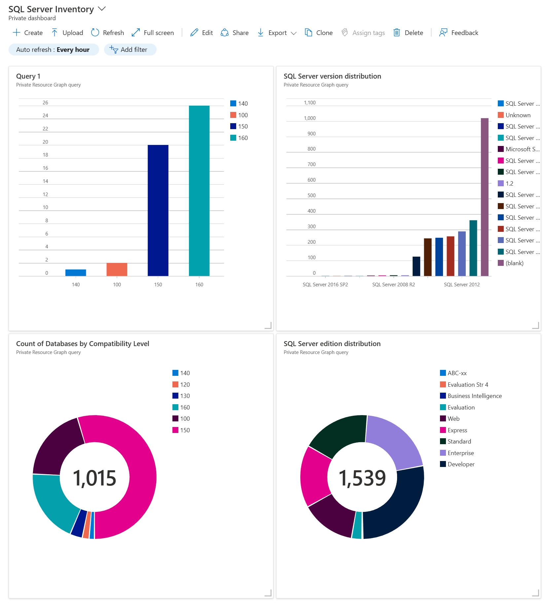
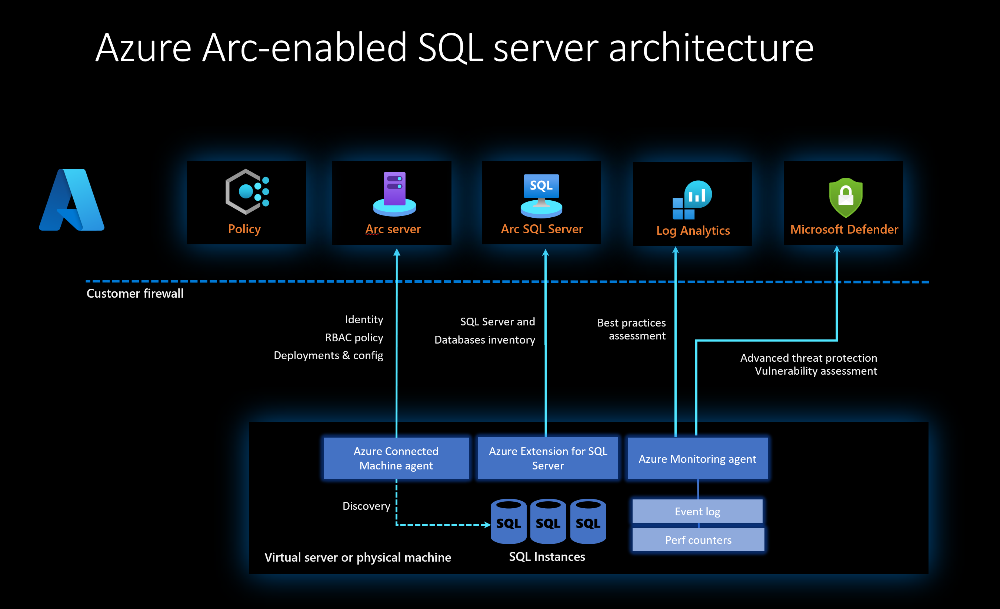

# Azure Arc-enabled SQL Server

[!INCLUDE [sqlserver](../../includes/applies-to-version/sqlserver.md)]

Azure Arc-enabled SQL Server extends Azure services to SQL Server instances hosted outside of Azure: in your data center, in edge site locations like retail stores, or any public cloud or hosting provider.

## Manage your SQL Servers at-scale from a single point of control

Azure Arc enables you to manage all of your SQL Servers from a single point of control: Azure. As you connect your SQL Servers to Azure, you get a single place to view the detailed inventory of your SQL Servers and databases.  

- Look at details for a given SQL Server in the Azure portal such as the name, version, edition, number of cores, and host operating system.
- Query across all of your SQL Servers using Azure Resource Graph Explorer to answer questions like:
  - "How many SQL Servers do I have that are SQL Server 2014?"
  - "What are the names of all the SQL Servers that are running on Linux?"  
- Quickly create charts from these queries and pin them to customizable dashboards.
- View a list of every database on a SQL Server and do cross-SQL Server queries of databases to see:
  - Databases that haven't been backed up recently.
  - Databases that aren't encrypted.

## Best practices assessment

You can optimize the configuration of your SQL Servers for best performance and security by running a best practices assessment.  The assessment report shows you specific ways to improve your configuration to match the best practices established by Microsoft Support through many years of experience learning from real-world usage of SQL Server.  Each suggestion includes the details on how to change the configuration.

## Azure Active Directory authentication

New in SQL Server 2022, you can enable Azure Active Directory for authentication to SQL Server.  This feature requires using Azure Arc-enabled SQL Server to establish the secure connection to Azure Active Directory for performing the authentication.

## Microsoft Defender for Cloud

Microsoft Defender for Cloud helps you discover and mitigate potential database vulnerabilities and alerts you to anomalous activities that may be an indication of a threat to your databases on Arc-enabled SQL Servers

- Vulnerability assessment: Scan databases to discover, track, and remediate vulnerabilities.
- Threat protection: Receive detailed security alerts and recommended actions based on SQL Advanced Threat Protection to provide to mitigate threats.

When you enable Microsoft Defender through Azure Arc-enabled SQL Server, you can get substantial cost savings on Defender.

## Microsoft Purview

Microsoft Purview provides a unified data governance solution to help manage and govern your on-premises, multicloud, and software as a service (SaaS) data. Easily create a holistic, up-to-date map of your data landscape with automated data discovery, sensitive data classification, and end-to-end data lineage. Enable data consumers to access valuable, trustworthy data management.

Azure Arc-enabled SQL Server powers some of the Microsoft Purview features such as access policies and it generally makes it easier for you to get your SQL Servers connected into Purview.

## Pay-as-you-go for SQL Server

Now, with Azure Arc-enabled SQL Servers connected to Azure, you have the option of purchasing SQL Server using a 'pay-as-you-go' model instead of purchasing licenses.  This model is a great alternative if you are looking to save costs on SQL Servers that have variable demand for compute capacity over time such as when you can turn off a SQL Server at night or on weekends, or even just scale down the number of cores used during less busy times.  It's also a great option if you only plan to use a SQL Server for a short period of time and then won't need it anymore. Pay-as-you-go, billed through Azure, is now available for all versions of SQL Server from 2012 to 2022.

## Extended Security Updates

Once [!INCLUDE [ssNoVersion](../../includes/ssnoversion-md.md)] has reached the end of its support lifecycle, you can sign up for an Extended Security Update (ESU) subscription for your servers and remain protected for up to three years. When you upgrade to a newer version of [!INCLUDE [ssNoVersion](../../includes/ssnoversion-md.md)], your ESU subscription is automatically canceled. When you [migrate to Azure SQL](/azure/azure-sql/migration-guides/), the ESU charges automatically stop but you continue to have access to the ESUs.

## Architecture

The SQL Server instance that you want to enable with Azure Arc can be installed in a virtual or physical machine running Windows or Linux.  The [Azure Connected Machine agent](/azure/azure-arc/servers/agent-overview) and the Azure Extension for SQL Server securely connect to Azure to establish communication channels with multiple Azure services using only outbound HTTPS traffic on TCP port 443 using SSL. The Azure Connected Machine agent can communicate through a configurable HTTPS proxy server over Azure Express Route, Azure Private Link or over the Internet. Review the [overview](/azure/azure-arc/servers/agent-overview), [network requirements](/azure/azure-arc/servers/network-requirements) and [prerequisites](/azure/azure-arc/servers/prerequisites) for the Azure Connected Machine agent.

Some of the services provided by Azure Arc-enabled SQL Server, such as Microsoft Defender for Cloud and best practices assessment, require the Azure Monitoring agent (AMA) extension to be installed and connected to an Azure Log Analytics workspace for data collection and reporting.

The following diagram illustrates the architecture of Azure Arc-enabled SQL Server.

## Feature availability depending on license type

[!INCLUDE [license-types](includes/license-types.md)]

## Feature availability by operating system

[!INCLUDE [features-operating-systems](includes/features-operating-system.md)]

## Feature availability by version

| Feature | 2012 | 2014 | 2016 | 2017 | 2019 | 2022 |
| ---- | ---- | ---- | ---- | ---- | ---- | ---- |
| [Azure pay-as-you-go billing](manage-configuration.md) | Yes | Yes | Yes | Yes | Yes | Yes |
| [Best practices assessment](assess.md) | Yes | Yes | Yes | Yes | Yes | Yes |
| [Detailed database inventory](view-databases.md#inventory-databases) | Yes | Yes | Yes | Yes | Yes | Yes |
| [Azure Active Directory authentication for SQL Server](../../relational-databases/security/authentication-access/azure-ad-authentication-sql-server-overview.md) | No | No | No | No | No | Yes |
| [Microsoft Defender for Cloud](/azure/defender-for-cloud/defender-for-sql-usage) | Yes | Yes | Yes | Yes | Yes | Yes |
| [Microsoft Purview: DevOps policies](/azure/purview/how-to-policies-devops-authoring-generic) | No | No | No | No | No | Yes |
| [Microsoft Purview: data owner policies (preview)](/azure/purview/how-to-policies-data-owner-authoring-generic) | No | No | No | No | No | Yes |
| [Automated backups](point-in-time-restore.md) | Yes | Yes | Yes | Yes | Yes | Yes |
| [Automated patching](patch.md) | No | Yes | Yes | Yes | Yes | Yes | 

## Feature availability by edition

|Feature | Enterprise | Standard | Web | Express | Developer | Evaluation |
| ---- | ---- | ---- | ---- | ---- | ---- | ---- |
| [Azure pay-as-you-go billing](manage-configuration.md) | Yes | Yes | Yes | Yes | Yes | Yes |
| [Best practices assessment](assess.md) | Yes | Yes | Yes | Yes | Yes | Yes |
| [Detailed database inventory](view-databases.md#inventory-databases) | Yes | Yes | Yes | Yes | Yes | Yes |
| [Azure Active Directory authentication](../../relational-databases/security/authentication-access/azure-ad-authentication-sql-server-overview.md) | Yes | Yes | Yes | Yes | Yes | Yes |
| [Microsoft Defender for Cloud](/azure/defender-for-cloud/defender-for-sql-usage) | Yes | Yes | Yes | Yes    [Express LocalDB is not supported.](/azure/purview/register-scan-on-premises-sql-server#supported-capabilities) | Yes | Yes |
| [Microsoft Purview: Govern using DevOps and data owner policies](/azure/purview/tutorial-register-scan-on-premises-sql-server) | Yes | Yes | Yes | Yes | Yes | Yes |
| [Automated backups](point-in-time-restore.md) | Yes | Yes | Yes | Yes | Yes | Yes |
| [Automated patching](patch.md) | Yes | Yes | Yes | Yes | Yes | Yes |

## Supported Azure regions

[!INCLUDE [azure-arc-data-regions](includes/azure-arc-data-regions.md)]

## Next steps

- [Learn about the prerequisites to connect your SQL Server to Azure Arc](prerequisites.md)
- [Automatically connect your SQL Server to Azure Arc](automatically-connect.md)
- [Learn more about Microsoft Defender for Cloud](/azure/defender-for-cloud/defender-for-sql-usage)
- [Lean more about Microsoft Purview](/azure/purview/register-scan-azure-arc-enabled-sql-server)
