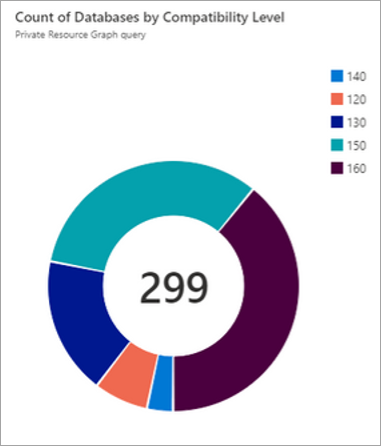

# View SQL Server databases - Azure Arc

[!INCLUDE [sqlserver](../../includes/applies-to-version/sqlserver.md)]

You can inventory and view SQL Server databases in Azure.

## Prerequisites

Before you begin, verify that the SQL Server instance that hosts the databases:

* Is hosted on a physical or virtual machine running Windows operating system.
* Is [!INCLUDE [sssql14-md](../../includes/sssql14-md.md)] or later.
* Is connected to Azure Arc. See [Connect your SQL Server to Azure Arc](connect.md).
* Is connected to the internet directly or through a proxy server.
   
## Inventory databases

1. Locate the Azure Arc-enabled SQL Server instance in Azure portal
1. **Select** the SQL Server resource.
1. Under **Data management**, select **Databases**.

   :::image type="content" source="media/view-databases/databases.png" alt-text="Screenshot of Azure portal, SQL Server databases - Azure Arc.":::

Azure portal shows **SQL Server databases - Azure Arc**. Use this area to view the databases that belong to the instance.

## View database properties

To view database properties for a specific database, select the database on the portal.

After you create, modify, or delete a database, changes are visible in Azure portal within an hour.

:::image type="content" source="media/view-databases/database-properties.png" alt-text="Screenshot of Azure portal, SQL Server database properties.":::

## How to Leverage Azure Resource Graph to Query Data

Here are some example scenarios showing how you use [Azure Resource Graph ](/azure/governance/resource-graph/overview)to query data which is available with the public preview of viewing Databases for Azure Arc-enabled SQL Server.

### Scenario 1: Get 10 databases

Get 10 databases and return what properties are available to query:

```kusto
Resources
| where type =~ 'Microsoft.AzureArcData/sqlServerInstances/databases'
| limit 10
```

Many of the most interesting properties to query on are in the `properties` property. To explore the available properties run this query and then select **See details** on a row.  This returns the properties in a json viewer on the right side.

```kusto
Resources
| where type =~ 'Microsoft.AzureArcData/sqlServerInstances/databases'
| project properties
```

You can navigate the hierarchy of the properties json by using a period in between each level of the properties json.

### Scenario 2: Get all the databases that are not encrypted

```kusto
Resources
| where type =~ 'Microsoft.AzureArcData/sqlServerInstances/databases'
| where properties.databaseOptions.isEncrypted == false
```

### Scenario 3: Obtain the count of databases which are encrypted vs not encrypted

```kusto
Resources
|extend isEncrypted =properties.databaseOptions.isEncrypted
|where type contains("microsoft.azurearcdata/sqlserverinstances/databases")
|project name,isEncrypted
|summarize count() by tostring(isEncrypted)
| order by ['isEncrypted'] asc
```
 
### Scenario 4: Show all the databases which are not encrypted

```kusto
Resources
|extend isEncrypted =properties.databaseOptions.isEncrypted
|where type contains("microsoft.azurearcdata/sqlserverinstances/databases") and isEncrypted ==false
|project name,isEncrypted
```

### Scenario 5: Get all the databases by region and compatibility level

This example returns all databases in `westus3` location with compatibility level of 160:

```kusto
Resources
| where type =~ 'Microsoft.AzureArcData/sqlServerInstances/databases'
| where location == "westus3"
| where  properties.compatibilityLevel == "160"
```

### Scenario 6: Show the SQL Server version distribution

```kusto
Resources
|extend SQLversion =properties.version
|where type contains("microsoft.azurearcdata/sqlserverinstances")
|project name,SQLversion
|summarize count() by tostring(SQLversion)
```
 
### Scenario 7: SQL Server by version, edition, and license type

```kusto
Resources
|extend SQLversion =properties.version
|extend SQLEdition =properties.edition
|extend lincentype =properties.licenseType
|where type contains("microsoft.azurearcdata/sqlserverinstances")
|project name,SQLversion,SQLEdition,lincensetype
```

### Scenario 8: Show a count of databases by compatibility

This example returns the number of databases, ordered by the compatibility level:

```kusto
Resources
| where type =~ 'Microsoft.AzureArcData/sqlServerInstances/databases'
| summarize count() by tostring(properties.compatibilityLevel)
| order by properties_compatibilityLevel asc
```

You can also [create charts and pin them to dashboards](/azure/governance/resource-graph/first-query-portal).




## Next steps

* [Protect Azure Arc-enabled SQL Server with Microsoft Defender for Cloud](configure-advanced-data-security.md)

* [Configure SQL Assessment | Azure Arc-enabled SQL Server](assess.md)


