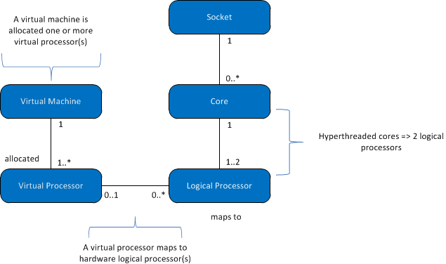

# Compute capacity limits by edition of SQL Server
[!INCLUDE[sqlserver](../includes/applies-to-version/sqlserver.md)]
  This article discusses compute capacity limits for editions of [!INCLUDE[ssnoversion](../includes/ssnoversion-md.md)] and how they differ in physical and virtualized environments with hyperthreaded processors.  
  
   
  
 This table describes the notations in the preceding diagram:  
  
|Value|Description|  
|-----------|-----------------|  
|0..1|Zero or one|  
|1|Exactly one|  
|1..\*|One or more|  
|0..\*|Zero or more|  
|1..2|One or two|  
  
> [!IMPORTANT]  
> To elaborate further:  
>   
> - A virtual machine (VM) has one or more virtual processors.  
> - One or more virtual processors are allocated to exactly one virtual machine.  
> - Zero or one virtual processor is mapped to zero or more logical processors. When the mapping of virtual processors to logical processors is: 
>     -   One to zero, it represents an unbound logical processor not used by the guest operating systems.  
>     -   One to many, it represents an overcommit.  
>     -   Zero to many, it represents the absence of virtual machine on the host system. So VMs don't use any logical processors.  
> - A socket is mapped to zero or more cores. When the socket-to-core mapping is:  
>     -   One to zero, it represents an empty socket. No chip is installed.  
>     -   One to one, it represents a single-core chip installed in the socket. This mapping is rare these days.  
>     -   One to many, it represents a multi-core chip installed in the socket. Typical values are 2, 4, and 8.  
> - A core is mapped to one or two logical processors. When the mapping of cores to logical processors is:  
>     -   One to one, hyperthreading is off.  
>     -   One to two, hyperthreading is on.  
  
 The following definitions apply to the terms used in this article:  
  
-   A thread or logical processor is one logical computing engine from the perspective of [!INCLUDE[ssNoVersion](../includes/ssnoversion-md.md)], the operating system, an application, or a driver.  
  
-   A core is a processor unit. It can consist of one or more logical processors.  
  
-   A physical processor can consist of one or more cores. A physical processor is the same as a processor package or a socket.  
  
Systems with more than one physical processor or systems with physical processors that have multiple cores and/or hyperthreads enable the operating system to execute multiple tasks simultaneously. Each thread of execution appears as a logical processor. For example, if your computer has two quad-core processors with hyperthreading enabled and two threads per core, you have 16 logical processors: 2 processors x 4 cores per processor x 2 threads per core. It's worth noting that:  
  
-   The compute capacity of a logical processor from a single thread of a hyperthreaded core is less than the compute capacity of a logical processor from that same core with hyperthreading disabled.  
  
-   The compute capacity of the two logical processors in the hyperthreaded core is greater than the compute capacity of the same core with hyperthreading disabled.  
  
Each edition of [!INCLUDE[ssNoVersion](../includes/ssnoversion-md.md)] has two compute capacity limits:  
  
- A maximum number of sockets (or physical processors or processor packages)  
  
- A maximum number of cores as reported by the operating system  
  
These limits apply to a single instance of [!INCLUDE[ssNoVersion](../includes/ssnoversion-md.md)]. They represent the maximum compute capacity that a single instance will use. They do not constrain the server where the instance may be deployed. In fact, deploying multiple instances of [!INCLUDE[ssNoVersion](../includes/ssnoversion-md.md)] on the same physical server is an efficient way to use the compute capacity of a physical server with more sockets and/or cores than the capacity limits allow.  
  
The following table specifies the compute capacity limits for a single instance of each edition of [!INCLUDE[ssnoversion](../includes/ssnoversion-md.md)]:  
  
|[!INCLUDE[ssNoVersion](../includes/ssnoversion-md.md)] edition|Maximum compute capacity for a single instance ([!INCLUDE[ssNoVersion](../includes/ssnoversion-md.md)][!INCLUDE[ssDE](../includes/ssde-md.md)])|Maximum compute capacity for a single instance (AS, RS)|  
|---------------------------------------|--------------------------------------------------------------------------------------------------------|-------------------------------------------------------------------|  
|Enterprise Edition: Core-based Licensing\*|Operating system maximum|Operating system maximum|  
|Developer|Operating system maximum|Operating system maximum|  
|Standard|Limited to lesser of 4 sockets or 24 cores|Limited to lesser of 4 sockets or 24 cores|  
|Express|Limited to lesser of 1 socket or 4 cores|Limited to lesser of 1 socket or 4 cores|  

\*Enterprise Edition with Server + Client Access License (CAL) licensing is limited to 20 cores per [!INCLUDE[ssNoVersion](../includes/ssnoversion-md.md)] instance. (This licensing is not available for new agreements.) There are no limits under the Core-based Server Licensing model.  
  
In a virtualized environment, the compute capacity limit is based on the number of logical processors, not cores. The reason is that the processor architecture is not visible to the guest applications. 

For example, a server that has four sockets populated with quad-core processors and the ability to enable two hyperthreads per core contains 32 logical processors with hyperthreading enabled. But it contains only 16 logical processors with hyperthreading disabled. These logical processors can be mapped to virtual machines on the server. The virtual machines' compute load on that logical processor is mapped to a thread of execution on the physical processor in the host server.  
  
You might want to disable hyperthreading when the performance for each virtual processor is important. You can enable or disable hyperthreading by using a BIOS setting for the processor during the BIOS setup. But it's typically a server-scoped operation that will affect all workloads running on the server. This might suggest separating workloads that will run in virtualized environments from workloads that would benefit from the hyperthreading performance boost in a physical operating system environment.  
  
## See also  
 [Editions and components of SQL Server 2016](../sql-server/editions-and-components-of-sql-server-2016.md)   
 [Features supported by the editions of SQL Server 2016](~/sql-server/editions-and-supported-features-for-sql-server-2016.md)   
 [Maximum capacity specifications for SQL Server](../sql-server/maximum-capacity-specifications-for-sql-server.md)   
 [Quickstart installation of SQL Server 2016](../database-engine/install-windows/install-sql-server.md)  

[!INCLUDE[get-help-options](../includes/paragraph-content/get-help-options.md)]

[!INCLUDE[contribute-to-content](../includes/paragraph-content/contribute-to-content.md)]