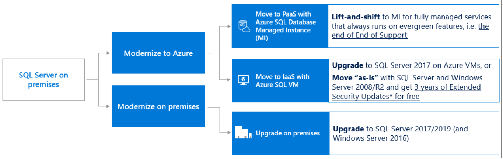
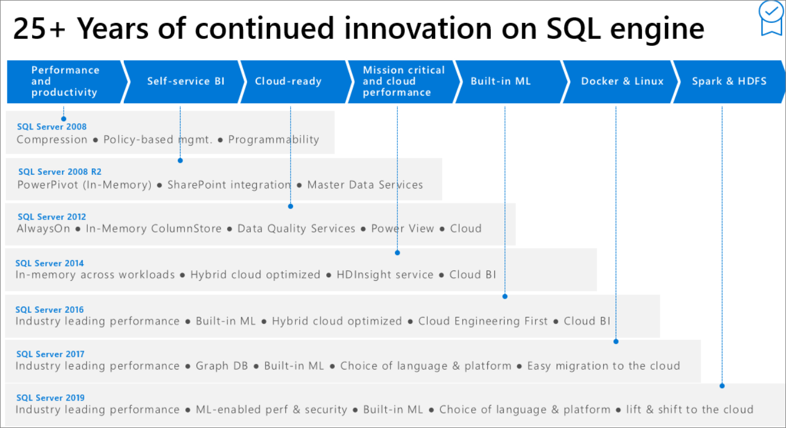

# SQL Server end of support options 
[!INCLUDE[appliesto-ss-xxxx-xxxx-xxx-md-winonly](../../includes/appliesto-ss-xxxx-xxxx-xxx-md-winonly.md)]
 
Each version of SQL Server is backed by a minimum of 10 years support, which includes 5 years in mainstream support, and five years in extended support, including regular security updates. End of support means the end of security updates, which can cause security and compliance issues as well as put applications and their business at risk. Additionally, support options are limited for customers who call into Microsoft Support for a product that has reached the end of its support cycle. 

Once your SQL Server has reached the end of its support lifecycle, you can choose to:
- Upgrade to current version of SQL Server.
- Purchase an [Extended Security Updates subscription](https://www.microsoft.com/en-us/cloud-platform/extended-security-updates). 
- Migrate your workload to an Azure virtual machine as-is for [free Extended Security Updates](/azure/virtual-machines/windows/sql/virtual-machines-windows-sql-server-2008-eos-extend-support).
- Migrate your workload to an [Azure SQL Database service](https://docs.microsoft.com/azure/sql-database/sql-database-paas-vs-sql-server-iaas). 

For more information, guidance, and tools to plan and automate your upgrade or migration, see [SQL Server 2005 end of support](https://www.microsoft.com/sql-server/sql-server-2005) and [SQL Server 2008 end of support](https://www.microsoft.com/cloud-platform/windows-sql-server-2008).  

## Upgrade SQL Server

You can upgrade your existing SQL Server to a newer and supported version of SQL Server. 

### Benefits
- **Latest technology**: Get the most out of innovation by taking advantage of the latest features and security improvements. 
- **Control**: You have the most control over features and scalability because you manage both hardware and software.
- **Familiar environment**: If you're upgrading from an older instance of SQL Server, this is the most similar environment.
- **Wide applicability**: Applicable for database applications of any kind, including OLTP systems and data warehousing. 

### Considerations
0
- **Costly**: You have to make the biggest up-front investment and provide the most ongoing management, because you have to buy, maintain, and manage your own hardware and software.
- **Downtime**: There could be downtime, plus the inherent risk of running into issues during an in-place upgrade process.
- **Potentially risky**: If you're on Windows 2008 or 2008 R2, you will also need to upgrade the OS as the newer versions of SQL may not be supported on Windows 2008 or 2008 R2. There is added risk during the OS upgrade process, so doing a side-by-side migration may be the more prudent, yet more costly, approach. Additionally, in-place OS upgrades are not supported on failover cluster instances.

### Resources

- [Installation media](https://www.microsoft.com/evalcenter/evaluate-sql-server-2017-rtm)
- What's new in [SQL Server 2016](../what-s-new-in-sql-server-2016.md), [SQL Server 2017](../what-s-new-in-sql-server-2017.md), and [SQL Server 2019](/sql-server/what-s-new-in-sql-server-ver15)
- [Upgrade SQL Server using Installation Wizard](../../database-engine/install-windows/upgrade-sql-server-using-the-installation-wizard-setup.md)
- Hardware requirements for [SQL Server 2017 and prior](../install/hardware-and-software-requirements-for-installing-sql-server.md) and [SQL Server 2019](../install/hardware-and-software-requirements-for-installing-sql-server-ver15.md) 
- Supported version and edition upgrades for [SQL Server 2016](../../database-engine/install-windows/supported-version-and-edition-upgrades.md?view=sql-server-2016), [SQL Server 2017](../../database-engine/install-windows/supported-version-and-edition-upgrades-2017.md), and [SQL Server 2019](../../database-engine/install-windows/supported-version-and-edition-upgrades-version-15.md)
- Tools:
    - [Database Experimentation Assistant](../../dea/database-experimentation-assistant-overview.md) can help evaluate the target version of SQL Server for a specific workload. 
    - [Data Migration Assistant](../../dma/dma-overview.md) can help detect compatibility issues that can impact database functionality in your new version of SQL Server. 

|            |          |          |          | 
|:---------- | :------- | :--------| :------- | 
| Installation |  [Upgrade SQL Server using Installation Wizard](../../database-engine/install-windows/upgrade-sql-server-using-the-installation-wizard-setup.md) | [Installation media](https://www.microsoft.com/evalcenter/evaluate-sql-server-2017-rtm) | 
| What's new | [SQL Server 2016](../what-s-new-in-sql-server-2016.md) | [SQL Server 2017](../what-s-new-in-sql-server-2017.md) | [SQL Server 2019](/sql-server/what-s-new-in-sql-server-ver15) | 
|Supported version & edition upgrades | [SQL Server 2016](../../database-engine/install-windows/supported-version-and-edition-upgrades.md?view=sql-server-2016) | [SQL Server 2017](../../database-engine/install-windows/supported-version-and-edition-upgrades-2017.md) | [SQL Server 2019](../../database-engine/install-windows/supported-version-and-edition-upgrades-version-15.md) | 
| Hardware requirements | [SQL Server 2017 and prior](../install/hardware-and-software-requirements-for-installing-sql-server.md) | [SQL Server 2019](../install/hardware-and-software-requirements-for-installing-sql-server-ver15.md) | 
| Tools | [Database Experimentation Assistant](../../dea/database-experimentation-assistant-overview.md) can help evaluate the target version of SQL Server for a specific workload.  | [Data Migration Assistant](../../dma/dma-overview.md) can help detect compatibility issues that can impact database functionality in your new version of SQL Server. | 

## Extend support 

You can purchase an Extended Security Updates subscription to receive **Critical** security updates. 

| **Benefit** | **Description** | 
| :----------- | :--------------| 
| **Application support** | This is the best option if your application has not yet been certified for a newer version of SQL Server. | 
| **Consistent infrastructure** | You don't have to change your infrastructure in any way. | 
| **Technical support** | If you have Software Assurance, or another support plan, you can continue receiving technical support from Microsoft on your end-of-support SQL product. This is the only way to get support for SQL Server 2008 and SQL Server 2008 R2 after the end of the support date. | 
| **Time** | This option is available for three years, giving you extra time to prepare your strategy, and certify your applications. | 

| **Consideration** | **Description** | 
| :----------- | :--------------| 
| **Limited availability** | This option is only available to customers with Software Assurance or subscription licenses. |
| **Costly** | This option can prove costly, as Extended Security Updates are approximately 75% of the on-premises license cost annually. | 
| **Limited timeframe** | This option is only available for three years so you will still need to upgrade or migrate at the end of the three year period if you want to ensure your security and compliance.| 
| **No bug fixes** | If you encounter a bug with the product, Microsoft will not release a bug-fix for it. |
| **Limited support** | Extended Security Updates do not include new features, customer-requested non-security hotfixes, or design change requests. | 

### Benefits 

- **Application support**: This is the best option if your application has not yet been certified for a newer version of SQL Server. 
- **Consistent infrastructure**: You don't have to change your infrastructure in any way. 
- **Technical support**: If you have Software Assurance, or another support plan, you can continue receiving technical support from Microsoft on your end-of-support SQL product. This is the only way to get support for SQL Server 2008 and SQL Server 2008 R2 after the end of the support date. 
- **Time**| This option is available for three years, giving you extra time to certify your applications. 

### Considerations 

- **Limited availability**: This option is only available to customers with Software Assurance or subscription licenses. 
- **Costly**: This option can prove costly, as Extended Security Updates are approximately 75% of the on-premises license cost annually.
- **Limited timeframe**: This option is only available for three years so you will still need to upgrade or migrate at the end of the three year period if you want to ensure your security and compliance. 
- **No bug fixes**: If you encounter a bug with the product, Microsoft will not release a bug-fix for it. 
- **Limited support**: Extended Security Updates do not include new features, customer-requested non-security hotfixes, or design change requests. 

### Resources

- [Extended Security Updates (ESU) overview](sql-server-extended-security-updates.md)
- [Detailed ESU frequently asked questions](https://www.microsoft.com/cloud-platform/extended-security-updates)
- [Extend support for free by migrating as-is to an Azure VM](/azure/virtual-machines/windows/sql/virtual-machines-windows-sql-server-2008-eos-extend-support)
- [Software Assurance](https://www.microsoft.com/licensing/licensing-programs/software-assurance-default)

## Azure virtual machine

You can migrate your workload to a virtual machine hosted in Azure. 

### Benefits

- **Free Extended Security Updates**: If you choose to keep your SQL Server as-is using SQL Server 2008 or SQL Server 2008 R2, you can get free Extended Security Updates for three years past the end of the support date, without having Software Assurance. 
- **Cost-saving**: You save the cost of hardware and server software, only paying for hourly usage. 
- **Hosted environment**: You will get the benefits of a hosted environment, such as offloading hardware, and software maintenance. Additionally, 
- **Automation**: If you're on Windows 2008 R2 and greater, you will get the benefit of automated patching, and automated backups. 
- **OS Control**: You have control over the operating environment, but with the familiar feature set of SQL Server. 
- **Deployability**: You can quickly deploy from a library of virtual machine images. 
- **Scalability**: You can add additional storage without downtime. 
- **License mobility**: You can bring your license, allowing you to decrease operating cost. 
- **High availability**: Not only do you benefit from the built-in virtual machine high availability provided by availability set, or availability zone Azure infrastructure, but you can take advantage of high availability options such as failover cluster instances and Always On availability groups. 

### Considerations

- **Manageability**: You still have to manage both SQL Server and operating system software. 
- **Networking**: You have to configure the virtual machine to integrate with your networking and active directory infrastructure, which is an added layer of complexity. 
- **Shared storage FCI**: Azure virtual machines only support failover cluster instances using Storage Spaces Direct or Premium File Shares, and do not support a failover cluster instance using shared storage. 

### Resources

- [SQL Server VM overview](/azure/virtual-machines/windows/sql/virtual-machines-windows-sql-server-iaas-overview)
- [Choosing an Azure SQL option](/azure/sql-database/sql-database-paas-vs-sql-server-iaas)
- [Migrate SQL Server to an Azure VM](/azure/virtual-machines/windows/sql/virtual-machines-windows-migrate-sql)
- [Free Extended Security Updates (ESUs) for migrating to Azure as-is](/azure/virtual-machines/windows/sql/virtual-machines-windows-sql-server-2008-eos-extend-support)
- [Extended Security Updates (ESU) overview](sql-server-extended-security-updates.md)
- [Detailed ESU frequently asked questions](https://www.microsoft.com/cloud-platform/extended-security-updates)
- [SQL virtual machine automated patching](/azure/virtual-machines/windows/sql/virtual-machines-windows-sql-automated-patching)
- [SQL virtual machine automated backup](/azure/virtual-machines/windows/sql/virtual-machines-windows-sql-automated-backup-v2)
- [SQL virtual machine high availability](/azure/virtual-machines/windows/sql/virtual-machines-windows-sql-high-availability-dr)
- [SQL virtual machine frequently asked questions](/azure/virtual-machines/windows/sql/virtual-machines-windows-sql-server-iaas-faq)

## Azure SQL Database single database

You can migrate your workload to an Azure SQL Database single database or elastic pool.  

### Benefits

| **Benefits** | **Description** | 
| :----------- | :--------------| 
| **Cost**     | Single database can be very cost-effective, since hardware, software, and maintenance is offloaded, and you can pay for usage by the second or the hour. | 
| **Flexibility** | Single database is particularly well suited for cloud-designed applications when developer productivity and fast time-to-market solutions are critical, or that have require external access. | 
| **Common features** | The most commonly used SQL Server features are available, but not as many as for an Azure SQL Database managed instance. | 
| **Deployability** | You can quickly deploy a single database. |
| **Scalability** | You can quickly and easily scale up and down as is needed for your business, providing additional cost-saving benefits. |
| **Availability** | The cost of the service includes both storage and high availability, with 99.995% availability guaranteed. | 
| **Automation** | Patching and backups happening automatically, saving you valuable maintenance time. | 
| **Intelligent Insights** | Gain insight about the performance of your database with built-in intelligence analytics. | 

### Considerations

| **Consideration** | **Description** | 
| :----------- | :--------------| 
| **Limited migration options** | You can only migrate a single database at a time, rather than an entire instance. | 
| **Limited features** | The feature set for a single database is limited when compared to an Azure SQL Database managed instance or a fully-fledged SQL Server deployment on an Azure virtual machine. |
| **T-SQL differences** | There are some Transact-SQL (T-SQL) differences between a single database and an on-premises SQL Server. | 
| **Size limitations** | A single database has a maximum database size of 100 TB, compared to a 524 PB size for SQL Server. | 

### Resources

- [Azure SQL Database overview](/azure/sql-database/sql-database-technical-overview)
- [Choosing an Azure SQL option](/azure/sql-database/sql-database-paas-vs-sql-server-iaas)
- [SQL Database feature comparison](/azure/sql-database/sql-database-features)
- [Migrate SQL Server to a single database](/azure/sql-database/sql-database-single-database-migrate)
- [Single database T-SQL differences](/azure/sql-database/sql-database-transact-sql-information)
- [vCore](/azure/sql-database/sql-database-vcore-resource-limits-single-databases) and [DTU](/azure/sql-database/sql-database-dtu-resource-limits-single-databases) resource limits
- [Intelligent Insights](/azure/sql-database/sql-database-intelligent-insights)
- Tools:
    - [Data migration assistant](../../dma/dma-overview.md)
    - [Database Migration Service](/azure/dms/dms-overview)

## Azure SQL Database managed instance

You can migrate your workload to an Azure SQL Database managed instance or instance pool. 

### Benefits

| **Benefits** | **Description** | 
| :----------- | :--------------| 
| **Cost**     | You can save costs by offloading software and hardware maintenance. | 
| **Lift and shift** | You can lift and shift your entire SQL Server on-premises instance to a managed instance, including all databases with minimal to no database change. | 
| **Features** | The feature set of a managed instance closely matches that of an on-premises instance of SQL Server, such as cross-database queries, transactional replication publishing and distribution, SQL job scheduling, and CLR support.| 
| **Scalability** | All databases within a managed instance share resources, and it is possible to scale up and down at any time. | 
| **Automation** | Patching and backups happening automatically, saving you valuable maintenance time. | 
| **Availability** | The cost of the service includes both storage and high availability, with 99.995% availability guaranteed. | 
| **Intelligent Insights** | Gain insight about the performance of your databases with built-in intelligence analytics. | 

### Considerations

| **Consideration** | **Description** | 
| :----------- | :--------------| 
| **Cost** | The managed instance option can be more costly than the single database option. | 
| **T-SQL differences** | There are some Transact-SQL (T-SQL) differences between a single database and an on-premises SQL Server. | 
| **Deployability** | Deploying a managed instance can take significantly more time than a single database. | 
| **Feature limitation** | Although a managed instance shares most features with SQL Server, there are still some features that are unsupported. | 
| **Networking** | The networking requirements for a managed instance add an extra layer of complexity to your infrastructure. | 

### Resources

- [Azure SQL Database managed instance overview](/azure/sql-database/sql-database-managed-instance)
- [Choosing an Azure SQL option](/azure/sql-database/sql-database-paas-vs-sql-server-iaas)
- [SQL Database feature comparison](/azure/sql-database/sql-database-features)
- [Migrate SQL Server to a managed instance](/azure/sql-database/sql-database-managed-instance-migrate)
- Tools:
    - [Data migration assistant](../../dma/dma-overview.md)
    - [Database Migration Service](/azure/dms/dms-overview)

## Non-SQL options

You may also want to consider a non-relational or NoSQL solution for certain data and applications.

|Non-relational solution|Benefits|  
|------------------------------|--------------|  
|**Azure Cosmos DB**   Consider this option for modern, scalable, mobile, and web applications that use JSON data and require a combination of robust querying and transactional data processing.   For more info, see [Cosmos DB](https://azure.microsoft.com/services/cosmos-db/).   For info about importing data, see [Import data to Cosmos DB](https://docs.microsoft.com/azure/cosmos-db/import-data/).|Your documents are indexed and you can use familiar SQL syntax to query them.   The database is schema-free.   You can add properties to documents without having to rebuild indexes.   You get JSON and JavaScript support right inside the database engine.   You get native support for geospatial data and integration with other Azure Services including Azure Search, HDInsight, and Data Factory.   You get low latency, high-performance storage with reserved throughput levels.|  
|**Azure table storage**   Consider this option to store petabytes of semi-structured data in a cost-effective solution.   For more info, see [Table Storage](https://azure.microsoft.com/services/storage/tables/).|You can evolve your apps and your table schema without taking the data offline.   You can scale up without sharding your dataset.   You get geo-redundant storage that replicates data across multiple regions.|  
 

## Lifecycle dates

The following table provides an approximation of lifecycle dates for SQL Server products. For greater details and accuracy, see the [Microsoft Lifecycle Policy](https://support.microsoft.com/hub/4095338/microsoft-lifecycle-policy) page. 

| **Version**     | **Release year** | **Mainstream Support end year** | **Extended Support end year** |
| :---------------| :--------------- |:------------------------------- |
| [SQL Server 2019](https://support.microsoft.com/lifecycle/search?alpha=SQL%20Server%202019) | 2019 | 2025 | 2030 |
| [SQL Server 2017](https://support.microsoft.com/lifecycle/search?alpha=SQL%20Server%202017) | 2017 | 2022 | 2027 |
| [SQL Server 2016](https://support.microsoft.com/lifecycle/search?alpha=SQL%20Server%202016) | 2016 | 2021 | 2026 |
| [SQL Server 2014](https://support.microsoft.com/lifecycle/search?alpha=SQL%20Server%202014) | 2014 | 2019 | 2024 |
| [SQL Server 2012](https://support.microsoft.com/lifecycle/search?alpha=SQL%20Server%202012) | 2012 | 2017 | 2022 |
| [SQL Server 2008 R2](https://support.microsoft.com/lifecycle/search?alpha=SQL%20Server%202008%20R2) | 2010 | 2012 | [2019](https://www.microsoft.com/sql-server/sql-server-2008) |
| [SQL Server 2008](https://support.microsoft.com/lifecycle/search?alpha=SQL%20Server%202008) | 2008 | 2012 | [2019](https://www.microsoft.com/sql-server/sql-server-2008) |
| [SQL Server 2005](https://support.microsoft.com/lifecycle/search?alpha=SQL%20Server%202005) | 2006 | 2011 | [2016](https://www.microsoft.com/sql-server/sql-server-2005) |
| [SQL Server 2000](https://support.microsoft.com/lifecycle/search?alpha=SQL%20Server%202000) | 2000 | 2005 | [2013](https://blogs.technet.microsoft.com/cdnitmanagers/2012/12/06/sql-server-2000-end-of-support-april-2013/) |

  > [!IMPORTANT]
  > If any discrepancy exists between this table, and the Microsoft Lifecycle page, then the Microsoft Lifecycle supersedes this table, as this table is meant to be used as an approximate reference.  

## Get SQL Server  
 To download an evaluation copy of SQL Server, see [SQL Server downloads](https://www.microsoft.com/sql-server/sql-server-downloads).  
  
## Next Steps  
 [SQL Server 2017](https://www.microsoft.com/sql-server/sql-server-2017)   
 [SQL Server 2005 end of support](https://www.microsoft.com/sql-server/sql-server-2005)   
 [SQL Server 2008 end of support](https://www.microsoft.com/cloud-platform/windows-sql-server-2008)
  
  
