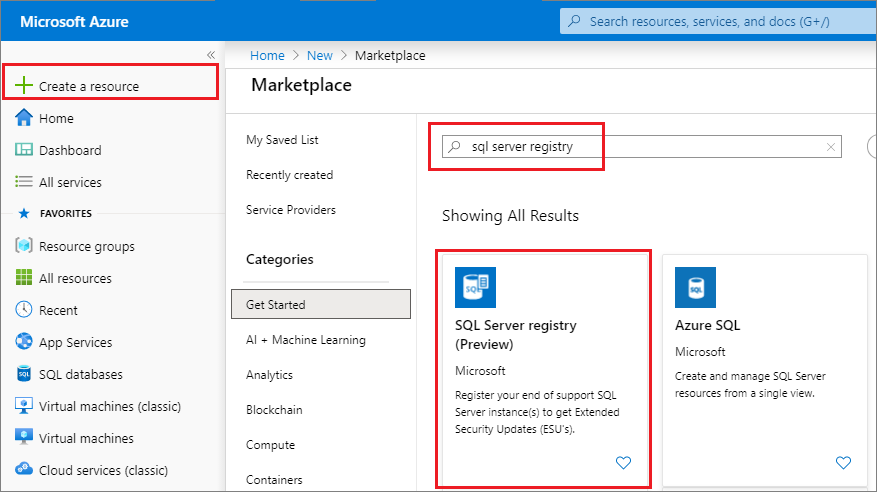
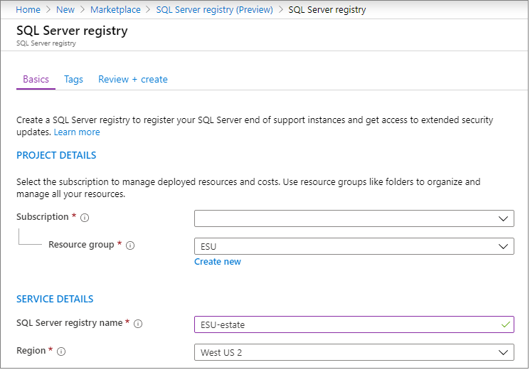
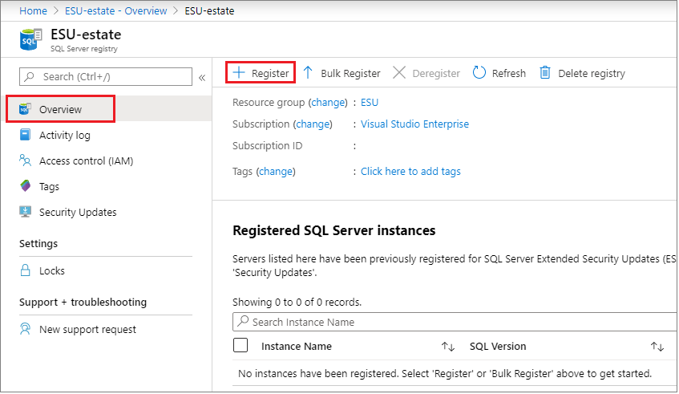
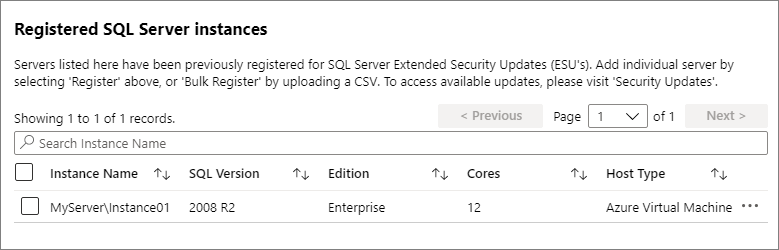
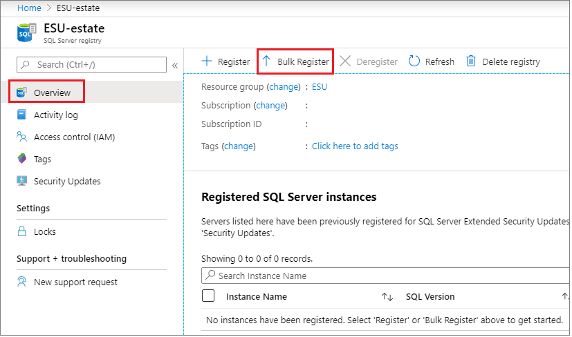
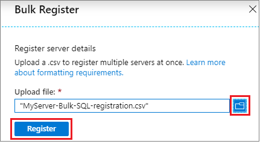
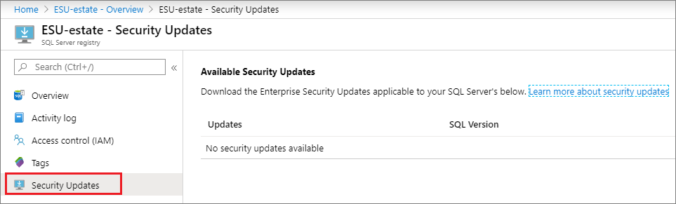

# Extended security updates for SQL Server

[!INCLUDE[appliesto-ss-xxxx-xxxx-xxx-md-winonly](../../includes/appliesto-ss-xxxx-xxxx-xxx-md-winonly.md)]
 
Once SQL Server has reached the end of its support life cycle, you have the option to purchase an Extended Security Update subscription for your servers and remain protected for up to three years, until you are ready to upgrade to a newer version of SQL Server. 

This article provides details about extended security updates for SQL Server 2008 and SQL Server 2008 R2. For more information about other options, see [End of support options](sql-server-end-of-life-overview.md). 

Microsoft recommends applying ESU patches as soon as they are available to keep your SQL Server instance protected. For detailed information and clarification, see the [ESU FAQ page](https://www.microsoft.com/en-us/cloud-platform/extended-security-updates). 

[Extended support for SQL Server 2008 and SQL Server 2008 R2 ended on July 10, 2019](https://www.microsoft.com/cloud-platform/windows-sql-server-2008). 

## What are Extended Security updates
Extended Security Updates (ESUs) for SQL Server and SQL Server 2008 R2 include provision of security updates for customers who have purchased an Extended Support Update subscription. 

ESUs are distributed **if and when available**, when a security vulnerability is discovered and is rated as **Critical** by [Microsoft Security Response Center (MSRC)](https://portal.msrc.microsoft.com). Therefore, there is no regular release cadence for SQL Server ESUs. 

ESUs do not include:
- New features
- Customer-requested non-security hotfixes
- Design change requests. 

### Support

ESUs do not include technical support, but you can use an active support contract such as [Software Assurance](https://www.microsoft.com/en-us/licensing/licensing-programs/software-assurance-default?activetab=software-assurance-default-pivot%3aprimaryr3) or Premier/Unified Support on SQL Server 2008 / 2008 R2 to get technical support on workloads covered by ESUs if you choose to stay on-premises. Alternatively, if you're hosting on Azure, you can use an Azure Support plan to get technical support. 

  > [!NOTE]
  > Microsoft cannot provide technical support for SQL Server 2008 / 2008 R2 instances (both on-premises, and in hosting environments) that are not covered with an ESU subscription. 


## ESU Availability

ESUs are available to customers running their workload in Azure, on-premises, or hosted environments. 

**In Azure**: If you migrate your workloads to Azure Virtual Machines (IaaS), you will have access to Extended Security Updates for SQL Server 2008 and 2008 R2 for three years after the End of Support for **no additional charges** above the cost of running the virtual machine. Customers do not need Software Assurance to receive Extended Security Updates in Azure. 

**On-premises or hosted environments**: If you have Software Assurance, you can purchase Extended Security Updates for three years after the End of Support date, under an Enterprise Agreement (EA), Enterprise Subscription Agreement (EAS), a Server & Cloud Enrollment (SCE), or an Enrollment for Education Solutions **EES**. You can purchase Extended Security Updates only for the servers you need to cover. Extended Security Updates can be purchased directly from Microsoft or a Microsoft licensing partner. 

For more information, see the [Extended Security Updates frequently asked questions](https://www.microsoft.com/en-us/cloud-platform/extended-security-updates). 

## ESU Delivery

**Azure virtual machines**: SQL Server customers running on Windows Server 2008 R2 and greater will receive ESUs automatically through existing SQL Server update channels using [automated patching](/azure/virtual-machines/windows/sql/virtual-machines-windows-sql-automated-patching). Azure virtual machines running on Windows Server 2008 or ones that have _not_ been configured for automatic patching will need to manually implement the on-premises registration and download method.  

**On-premises or hosted environments**: Customers covered by Extended Security Update agreements can [register eligible instances](#register-instances-for-esus) with the **SQL Server Registry**. Once registered, whenever ESUs are available, customers can download them from the Azure portal to deploy to their on-premises or hosted environments. This is also the process that customers will need to follow for Azure Stack and Azure Virtual Machines that are not configured to receive automatic updates.

## Create SQL Server registry

To register your ESU-enabled SQL Server instances, you'll first need to create the SQL Server registry in the Azure portal. 

  > [!IMPORTANT]
  > It's not necessary to register SQL Server instances for ESUs when running an Azure virtual machine that is configured for [automatic updates](/azure/virtual-machines/windows/sql/virtual-machines-windows-sql-automated-patching). 

To create the SQL Server registry, follow these steps:

1. Sign into the [Azure portal](https://portal.azure.com). 
1. Select the option to **Create a resource**. 
1. Type `SQL Server registry` in the search box.  
1. Choose the **SQL Server registry** option published by Microsoft, and then select **Create**. 

   

1. Under **Project Details**, choose your subscription from the drop-down. Then either choose an existing **Resource group** or select **Create new** to create a new resource group for your new SQL Server registry service. 
1. Under **Service Details**, provide a name and region for your new **SQL Server registry** resource: 

   

1. Select **Review + create** to review the details for your **SQL Server registry**. Select **Create** once validation has passed. 


## Register instances for ESUs

After the **SQL Server registry** resource is deployed, you can choose to register a [single](#single-sql-server-instance) SQL Server instance, or you can register a number of SQL Server instances in [bulk](#multiple-sql-server-instances-in-bulk). It's required that at least one SQL Server instance is registered in the scope of your SQL Server registry in order to download any ESU packages. 

### Single SQL Server instance

To register a single SQL Server instance, follow these steps:

1. Sign into the [Azure portal](https://portal.azure.com). 
1. Navigate to your **SQL Server registry** resource. 
1. Select **+ Register** from the **Overview** pane: 

   

1. Provide the required information as is detailed in this table, and then select **Register**: 

   |**Value**| **Description**|
   | :-------| :------------- |
   | **Instance** | Enter the output of command `SELECT @@SERVERNAME`, such `MyServer\Instance01`. | 
   | **SQL Version** | Select either 2008 or 2008 R2 from the drop-down. | 
   | **Edition** | Select the applicable edition from the drop-down: Datacenter, Developer (free to deploy if purchased ESUs), Enterprise, Standard, Web, Workgroup. | 
   | **Cores** | Enter the number of cores for this instance | 
   | **Host Type** | Select the applicable host type from the drop-down: Virtual machine (on-premises), Physical Server (on-premises), Azure Virtual Machine, Amazon EC2, Google Compute Engine, Other. |
   | **SubscriptionID**<sup>1</sup> | Enter the SubscriptionID where the VM is created.  |
   | **Resource Group**<sup>1</sup> | Enter the resource group where the VM is created.  | 
   | **Azure VM name**<sup>1</sup>  | Enter the VM resource name.  | 
   | **Azure VM operating system**<sup>1</sup> | Select the applicable Windows Server operating system version from the drop-down. | 

   <sup>1</sup> Only necessary for Azure virtual machines. 

The newly registered SQL Server instance is now visible in the **Register SQL Server instances** section of the **Overview** pane: 



Once a SQL Server instance has been registered, the **Security Updates** section becomes available. Any available ESUs will be posted there. 

### Multiple SQL Server instances in bulk

Multiple SQL Server instances can be registered in bulk by uploading a .CSV file. Once your [.CSV file has been formatted correctly](#formatting-requirements-for-csv-file), you can follow these steps to bulk register your SQL Server instances with the SQL Server registry resource: 

1. Sign into the [Azure portal](https://portal.azure.com). 
1. Navigate to your **SQL Server registry** resource. 
1. Select **Bulk Register** from the **Overview** pane:  

   

1. Select the file icon to browse to your .CSV file location. Select the .CSV file. Then select **Register** to upload the file and register multiple instances of SQL Server. 

   


### Formatting requirements for CSV file
- Values are comma-separated
- Values are not single or double-quoted
- Column names are case-insensitive but must be **named** as below: 
  - name
  - version
  - edition
  - cores
  - hostType
  - subscriptionID<sup>1</sup>
  - resourceGroup<sup>1</sup>
  - azureVmName<sup>1</sup>
  - AzureVmOS<sup>1</sup>

<sup>1</sup> Only necessary for Azure virtual machines. 

#### CSV Example 1 - on-premises

For on-premises SQL Server instances, the CSV file should look like this: 

```csv
name,version,edition,cores,hostType
Server1\SQL2008,2008,Enterprise,12,Physical Server
Server1\SQL2008 R2,2008 R2,Enterprise,12,Physical Server
Server2\SQL2008 R2,2008 R2,Enterprise,24,Physical Server
Server3\SQL2008 R2,2008 R2,Enterprise,12,Virtual Machine
Server4\SQL2008,2008,Developer,8,Physical Server  
```

Refer to [MyPhysicalServers.csv](https://github.com/microsoft/sql-server-samples/blob/master/samples/manage/sql-server-extended-security-updates/scripts/MyPhysicalServers.csv) for a CSV file example.


#### CSV Example 2 - Azure VM

For Azure virtual machine SQL Server instances, the CSV file should look like this: 

```csv
name,version,edition,cores,hostType,subscriptionId,resourceGroup,azureVmName,azureVmOS    
ProdServerUS1\SQL01,2008 R2,Enterprise,12,Azure Virtual Machine,61868ab8-16d4-44ec-a9ff-f35d05922847,RG,VM1,2012    
ProdServerUS1\SQL02,2008 R2,Enterprise,24,Azure Virtual Machine,61868ab8-16d4-44ec-a9ff-f35d05922847,RG,VM1,2012    
ServerUS2\SQL01,2008,Enterprise,12,Azure Virtual Machine,61868ab8-16d4-44ec-a9ff-f35d05922847,RG,VM2,2012 R2    
ServerUS2\SQL02,2008,Enterprise,8,Azure Virtual Machine,61868ab8-16d4-44ec-a9ff-f35d05922847,RG,VM2,2012 R2    
SalesServer\SQLProdSales,2008 R2,Developer,8,Azure Virtual Machine,61868ab8-16d4-44ec-a9ff-f35d05922847,RG,VM3,2008 R2  
```

Refer to [MyAzureVMs.csv](https://github.com/microsoft/sql-server-samples/blob/master/samples/manage/sql-server-extended-security-updates/scripts/MyAzureVMs.csv) for an Azure VM targeted CSV file example. 


> [!TIP]
> For Transact-SQL and PowerShell example scripts that can generate the required SQL Server instance registration information into a .CSV file, see [ESU registration script examples](https://github.com/microsoft/sql-server-samples/blob/master/samples/manage/sql-server-extended-security-updates/scripts.md). 


## Download ESUs

Once your SQL Server instances have been registered with the SQL Server registry service, you can download the Extended Security Updates from the Azure portal if and when they are made available. 

To download ESUs, follow these steps: 

1. Sign into the [Azure portal](https://portal.azure.com). 
1. Navigate to your **SQL Server registry** resource. 
1. Select **Security Updates** on the navigation pane. 

   

1. Download security updates from here, if and when they are made available. 

## FAQ

General frequently asked questions about Extended Security updates can be found at the [Extended security updates FAQ](https://www.microsoft.com/cloud-platform/extended-security-updates). SQL Server-specific frequently asked questions are listed below. 

**When is the End of Support for SQL Server 2008 and 2008 R2?**

The End of Support date for SQL Server 2008 and 2008 R2 is July 9, 2019. 

**What does End of Support mean?**
Microsoft Lifecycle Policy offers 10 years of support (5 years for Mainstream Support and 5 years for Extended Support) for Business and Developer products (such as SQL Server and Windows Server). As per the policy, after the end of the Extended Support period there will be no patches or security updates, which may cause security and compliance issues, and expose customers’ applications and business to serious security risks.

**What editions of SQL Server are eligible for Extended Security Updates?**

Enterprise, Datacenter, Standard, Web, and Workgroup editions of SQL Server 2008 and SQL Server 2008 R2 are eligible for Extended Security Updates for both x86 and x64 versions. 

**When will the Extended Security Updates offer be available?**

Extended Security Updates are now available for purchase and can be ordered from Microsoft or a Microsoft licensing partner. The delivery of Extended Security Updates will begin after the End of Support dates, if and when available. Customers interested in migrating to Azure can do so immediately. 

**What do Extended Security Updates include?** 

Extended Security Updates include provision of Security Updates and Bulletins rated **critical** for a maximum of three years after July 9, 2019.  Extended Security Updates will be distributed if and when available. Extended Security Updates do not include technical support, but you may use other Microsoft support plans to get assistance on your Server 2008 and 2008 R2 questions on workloads covered by Extended Security Updates. Extended Security Updates do not include new features, customer-requested non-security hotfixes, or design change requests. However, Microsoft may include non-security fixes as deemed necessary.

**Why do Extended Security Updates for SQL Server 2008 and 2008 R2 only offer "critical" updates?**

For End of Support events in the past, SQL Server provided only Critical Security Updates, which meets the compliance criteria of our enterprise customers. SQL Server does not ship a general monthly security update. Microsoft only provides on-demand SQL Server security updates (GDRs) for MSRC bulletins where SQL Server is identified as an affected product.
If there are situations where new SQL Server important updates will not be provided and it is deemed critical by the customer but not by MSRC, we will work with the customer on a case-by-case basis to suggest appropriate mitigation.

**What Licensing programs are eligible for Extended Security Updates?**
Software Assurance customers can purchase Extended Security Updates on-premises under an Enterprise Agreement (EA), Enterprise Subscription Agreement (EAS), a Server & Cloud Enrollment (SCE), or an Enrollment for Education Solutions (EES). Software Assurance does not need to be on the same enrollment.

**Do SQL Server customers need to be running the most current Service Pack to benefit from Extended Security Updates?**

Yes, customers need to run SQL Server or Windows Server 2008 and 2008 R2 with the latest Service Pack to apply Extended Security Updates. Microsoft will only produce updates which can be applied on the latest Service Pack.

**What are the options for SQL Server customers without Software Assurance?** 

For customers who do not have Software Assurance, the alternative option to get access to Extended Security Updates is to migrate to Azure. For variable workloads, we recommend that customers migrate on Azure via Pay-As-You-Go, which allows for scaling up or down at any time. For predictable workloads, we recommend that customers migrate to Azure via Server Subscription and Reserved Instances.
  
**Does this offer also apply to SQL Server 2005?**

No. For these older versions, we recommend upgrading to the most current versions, but customers could upgrade to 2008 or 2008 R2 versions to take advantage of this offer.

**Can I deploy a brand new SQL Server 2008 or 2008 R2 instance on Azure and still get Extended Security Updates?**

Yes, customers can start a new 2008 or 2008 R2 instance on Azure and have access to Extended Security Updates.

**Can I get technical support on-premises for SQL Server 2008 or 2008 R2 after the End of Support date, without purchasing  Extended Security Updates?**

No. If a customer has SQL Server 2008 or 2008 R2 and chooses to remain on-premises during a migration without Extended Security Updates, they cannot log a support ticket, even if they have a support plan. If they migrate to Azure, however, they can get support using their Azure Support Plan.

**If a SQL Server 2008 and 2008 R2 customer wants to bring their own license (BYOL), are they required to have Software Assurance coverage?**

Yes, customers need to have Software Assurance to take advantage of the BYOL program for SQL Server on Azure Virtual Machines as part of the License Mobility program. For customers without Software Assurance, we recommend customers move to Azure SQL Database Managed Instance for their 2008 environments. Customers can also migrate to pay-as-you-go Azure Virtual Machines. Software Assurance customers who license SQL by core also have the option of migrating to Azure using the Azure Hybrid Benefit.

Azure SQL Database Managed Instance is a service in Azure providing nearly 100% compatibility with SQL Server on-premises. Managed Instance provides built-in high availability/disaster recovery capabilities plus intelligent performance features and the ability to scale on the fly. Managed Instance also provides a version-less experience that takes away the need for manual security patching and upgrades. See the Azure pricing guidance page for more information on the BYOL program.

**What options do customers have to run SQL Server in Azure?**

Customers can move legacy SQL Server environments to Azure SQL Database Managed Instance, a fully managed data platform service (PaaS) that offers a "version-free" option to eliminate concerns with End of Support dates, or to Azure Virtual Machines to have access to Security Updates. Extended Security Updates will be available for SQL Server 2008 and 2008 R2 in Azure Virtual Machines after the End of Support date of July 9, 2019, for the next three years. For customers looking to upgrade from SQL Server 2008 and 2008R2, all subsequent versions of SQL Server will be supported. For SQL Server 2012 through 2016, customers are required to be on the latest supported Service Pack. Starting with SQL Server 2017, customers are advised to be on the latest Cumulative Update. Note that Service Packs will not be available starting with SQL Server 2017, only Cumulative Updates and General Distribution Releases (GDRs).

Azure SQL Database Managed Instance is an instance-scoped deployment option in SQL Database that provides the broadest SQL Server engine compatibility and native virtual network (VNET) support, so you can migrate SQL Server databases to Managed Instance without changing apps. It combines the rich SQL Server surface area with the operational and financial benefits of an intelligent, fully managed service. Leverage the new Azure Database Migration Service to move SQL Server 2008 and 2008 R2 to Azure SQL Database Managed Instance with few or no application code changes.

**Can customers leverage the Azure Hybrid Benefit for SQL Server 2008 and 2008 R2 versions?**

Yes, customers with active Software Assurance or equivalent Server Subscriptions can leverage the Azure Hybrid Benefit using existing on-premises license investments for discounted pricing on SQL Server running on Azure SQL Database and Azure Virtual Machines.

**Can customers get free Extended Security Updates on Azure Government regions?**

Yes, Extended Security Updates will be available on Azure Virtual Machines on Azure Government regions.

**Can customers get free Extended Security Updates on Azure Stack?**


Yes, customers can migrate SQL Server and Windows Server 2008 and 2008 R2 to Azure Stack and receive Extended Security Updates for no additional cost after the End of Support dates.

**For customers with a 2008 and 2008 R2 SQL cluster using shared storage, what is the guidance to migrating to Azure?**

Azure does not currently support shared storage clustering. For advice on how to configure a highly available SQL Server instance on Azure, refer to the [SQL Server High Availability guide](/azure/virtual-machines/windows/sql/virtual-machines-windows-sql-high-availability-dr).

**Can customers leverage Extended Security Updates for SQL Server with a third-party hoster?**

Customers cannot leverage Extended Security Updates if they move their SQL Server 2008 environment to a PaaS implementation on other cloud offerings. If customers are looking to move to virtual machines (IaaS), they can leverage License Mobility for SQL Server via Software Assurance to make the move, and purchase Extended Security Updates from Microsoft to manually apply patches to the SQL Server 2008 instances running in a VM (IaaS) on an authorized SPLA hoster’s server. However, free updates in Azure is the more attractive offer.

**What are the best practices for enhancing performance of SQL Server in Azure virtual machines?** 

For advice on how to optimize performance for SQL Server on Azure virtual machines, see the [SQL Server optimization guide](/azure/virtual-machines/windows/sql/virtual-machines-windows-sql-performance). 


## See also

- [SQL Server 2008 / 2008 R2 lifecycle page](https://support.microsoft.com/en-us/lifecycle/search?alpha=sql%20server%202008)
- [SQL Server 2008 / 2008 R2 end of support page](https://aka.ms/sqleos)
- [Extended Security Updates frequently asked questions (FAQ)](https://aka.ms/sqleosfaq)
- [Microsoft Security Response Center (MSRC)](https://portal.msrc.microsoft.com/security-guidance/summary)
- [Manage Windows updates by using Azure Automation](https://docs.microsoft.com/azure/automation/automation-tutorial-update-management)
- [SQL Server VM automated patching](/azure/virtual-machines/windows/sql/virtual-machines-windows-sql-automated-patching)
- [Microsoft Data Migration Guide](https://datamigration.microsoft.com/)
- [Azure migrate: lift-and-shift options to move your current SQL Server 2008 / 2008 R2 into an Azure VM](https://azure.microsoft.com/services/azure-migrate/)
- [Cloud adoption framework for SQL migration](/azure/cloud-adoption-framework/migrate/expanded-scope/sql-migration)
- [ESU-related scripts on GitHub](https://github.com/microsoft/sql-server-samples/tree/master/samples/manage/sql-server-extended-security-updates/scripts)


