# Migration guide: Access to SQL Server

[!INCLUDE[sqlserver](../../../includes/applies-to-version/sqlserver.md)]

In this guide, you learn how to migrate your Microsoft Access databases to SQL Server by using SQL Server Migration Assistant for Access (SSMA for Access).

For other migration guides, see [Azure Database Migration Guides](https://datamigration.microsoft.com/).

## Prerequisites

Before you begin migrating your Access database to SQL Server:

- Verify that your source environment is supported.
- Get [SSMA for Access](https://www.microsoft.com/download/details.aspx?id=54255).
- Get connectivity and sufficient permissions to access both the source and target.

## Pre-migration

After you've met the prerequisites, you're ready to discover the topology of your environment and assess the feasibility of your migration.

### Assess

By using SSMA for Access, you can review database objects and data and assess databases for migration. To learn more about the tool, see [SQL Server Migration Assistant for Access](../../../ssma/access/sql-server-migration-assistant-for-access-accesstosql.md).

To create an assessment:

1. Open [SSMA for Access](https://www.microsoft.com/download/details.aspx?id=54255).
1. Select **File**, and then select **New Project**.
1. Enter a project name and a location to save your project. Then select a SQL Server migration target from the drop-down list, and select **OK**.

   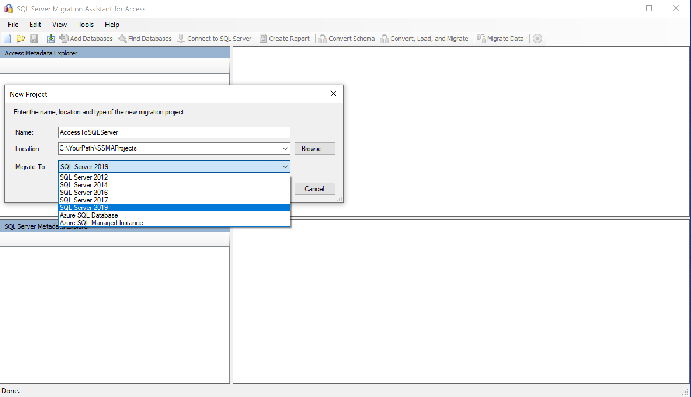

1. Select **Add Databases**, and select the databases to add to your project.

   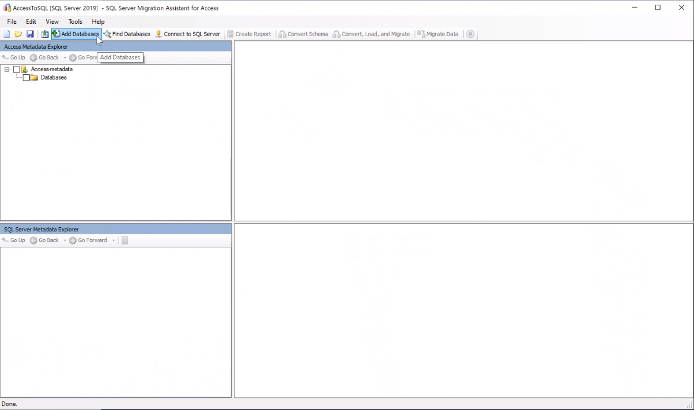

1. In **Access Metadata Explorer**, right-click the database you want to assess and then select **Create Report**. Alternatively, you can select the **Create Report** tab in the upper-right corner.

   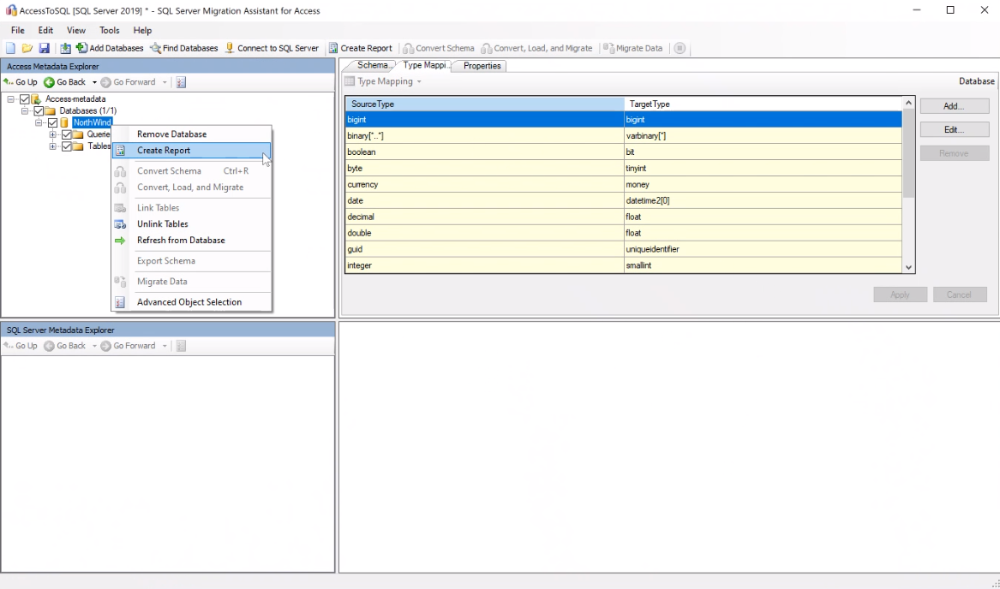

1. Review the HTML report to understand conversion statistics and any errors or warnings. You can also open the report in Excel to get an inventory of Access objects and the effort required to perform schema conversions. The default location for the report is in the report folder within SSMAProjects, as shown here:

   `drive:\<username>\Documents\SSMAProjects\MyAccessMigration\report\report_2020_11_12T02_47_55\`.

   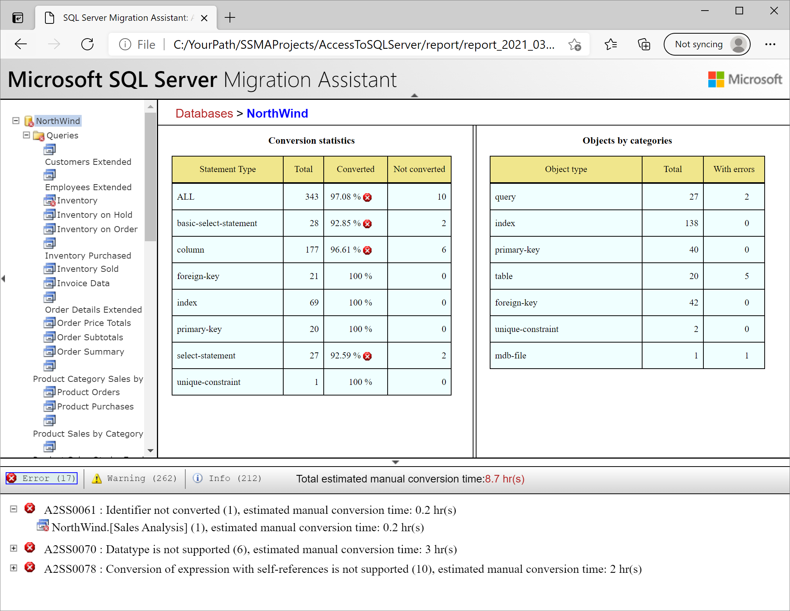

### Validate the data types

Validate the default data type mappings and change them based on requirements, if necessary. To do so:

1. On the **Tools** menu, select **Project Settings**.
1. Select the **Type Mapping** tab.

   

1. You can change the type mapping for each table by selecting the table in **Access Metadata Explorer**.

### Convert

To convert database objects:

1. Select **Connect to SQL Server**, and enter connection details.

   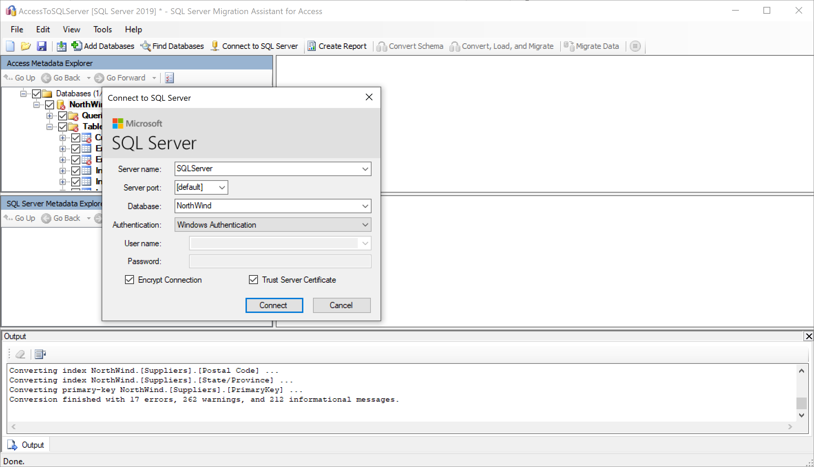

1. Right-click the database in **Access Metadata Explorer**, and select **Convert Schema**. Alternatively, you can select the **Convert Schema** tab in the upper-right corner.

   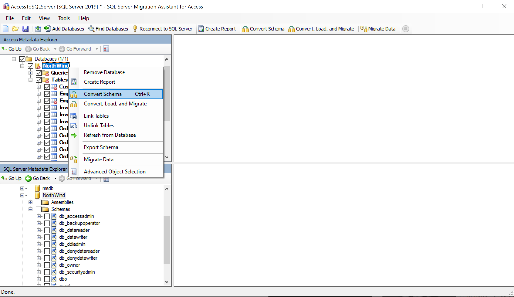

1. After the conversion finishes, compare and review the converted objects to the original objects to identify potential problems and address them based on the recommendations.

   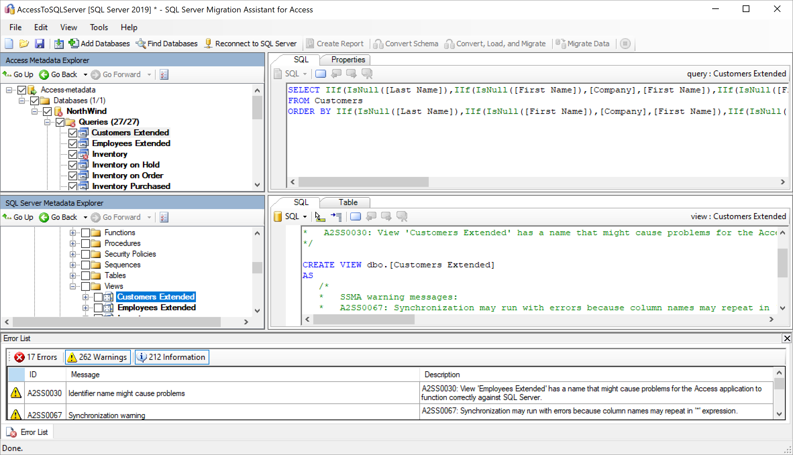

1. Compare the converted Transact-SQL text to the original code, and review the recommendations.

   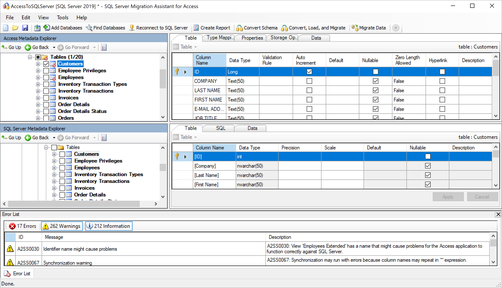

1. (Optional) To convert an individual object, right-click the object and select **Convert Schema**. An object that has been converted appears bold in **Access Metadata Explorer**.

   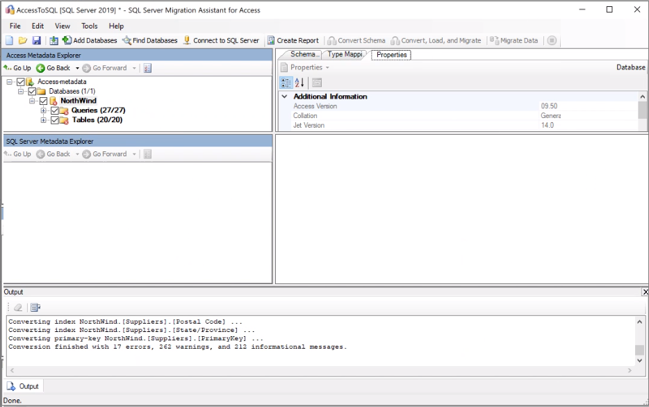
 
1. In the output pane, select **Review results**, and review the errors in the **Error List** pane.
1. Save the project locally for an offline schema remediation exercise. On the **File** menu, select **Save Project**. This step gives you an opportunity to evaluate the source and target schemas offline and perform remediation before you publish the schema to SQL Server.

## Migrate

After you've assessed your databases and addressed any discrepancies, the next step is to run the migration process. Migrating data is a bulk-load operation that moves rows of data into SQL Server in transactions. The number of rows to be loaded into SQL Server in each transaction is configured in the project settings.

To publish your schema and migrate the data by using SSMA for Access:

1. If you haven't already, select **Connect to SQL Server** and enter connection details.

1. Publish the schema by right-clicking the database in **SQL Server Metadata Explorer** and selecting **Synchronize with Database**. This action publishes the MySQL schema to SQL Server.

   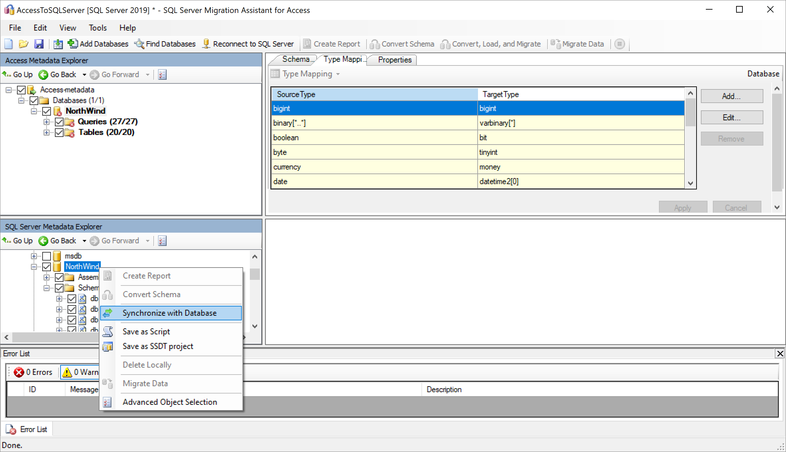

1. Review the mapping between your source project and your target.

   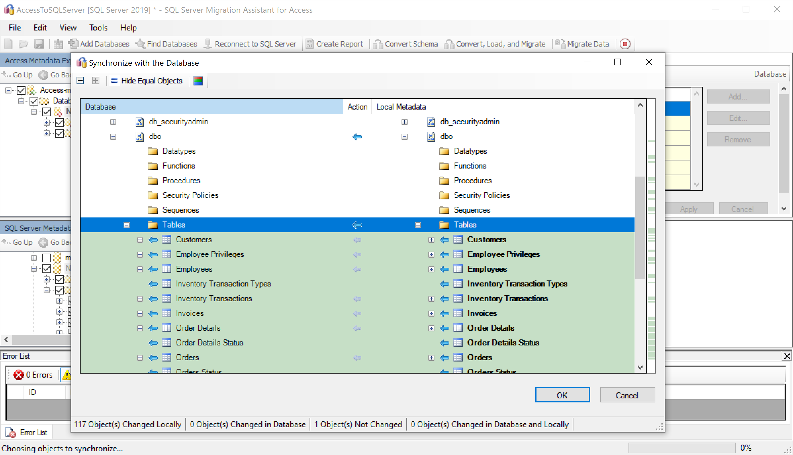

1. Migrate the data by right-clicking the database or object you want to migrate in **Access Metadata Explorer** and selecting **Migrate Data**. Alternatively, you can select the **Migrate Data** tab. To migrate data for an entire database, select the check box next to the database name. To migrate data from individual tables, expand the database, expand **Tables**, and then select the check boxes next to the tables. To omit data from individual tables, clear the check boxes.

   

1. After migration is completed, view the **Data Migration Report**.

   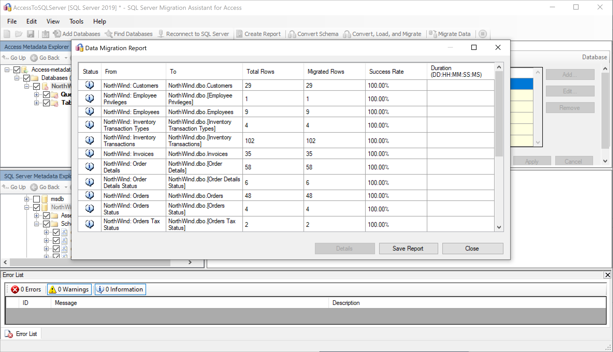

1. Connect to your SQL Server instance by using [SQL Server Management Studio](../../../ssms/download-sql-server-management-studio-ssms.md), and validate the migration by reviewing the data and schema.

   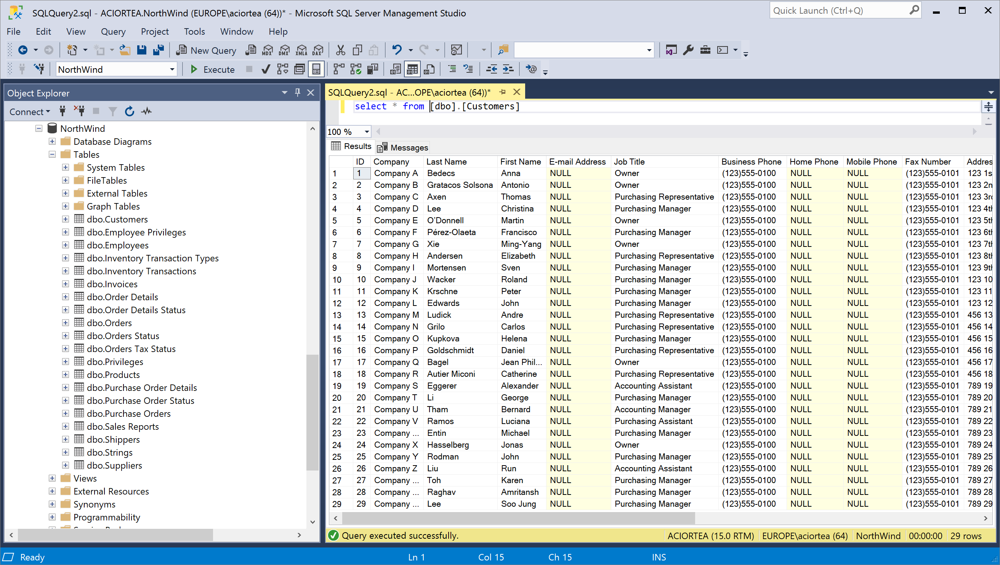

## Post-migration

After you've successfully completed the *migration* stage, you need to complete a series of post-migration tasks to ensure that everything is functioning as smoothly and efficiently as possible.

### Remediate applications

After you've migrated the data to the target environment, all the applications that formerly consumed the source need to start consuming the target. Accomplishing this task will require changes to the applications in some cases.

### Perform tests

The test approach for database migration consists of the following activities:

1. **Develop validation tests**: To test database migration, you need to use SQL queries. You must create the validation queries to run against both the source and the target databases. Your validation queries should cover the scope you've defined.
1. **Set up a test environment**: The test environment should contain a copy of the source database and the target database. Be sure to isolate the test environment.
1. **Run validation tests**: Run validation tests against the source and the target, and then analyze the results.
1. **Run performance tests**: Run performance tests against the source and the target, and then analyze and compare the results.

### Optimize

The post-migration phase is crucial for reconciling any data accuracy issues, verifying completeness, and addressing performance issues with the workload.

> [!Note]
> For more information about these issues and the steps to mitigate them, see the [Post-migration validation and optimization guide](../../../relational-databases/post-migration-validation-and-optimization-guide.md).

## Migration assets

For more assistance with completing this migration scenario, see the following resource. It was developed in support of a real-world migration project engagement.

| Title | Description |
| -------------- | --------------- |
| [Data Workload Assessment Model and Tool](https://www.microsoft.com/download/details.aspx?id=103130) | This tool provides suggested "best fit" target platforms, cloud readiness, and application or database remediation level for a given workload. It offers simple, one-click calculation and report generation that helps to accelerate large estate assessments by providing an automated and uniform target platform decision process. |

The Data SQL Engineering team developed these resources. This team's core charter is to unblock and accelerate complex modernization for data platform migration projects to Microsoft's Azure data platform.

## Next steps

- After the migration, review the [Post-migration validation and optimization guide](../../../relational-databases/post-migration-validation-and-optimization-guide.md).
- For a matrix of Microsoft and third-party services and tools that are available to assist you with various database and data migration scenarios and specialty tasks, see [Data migration services and tools](/azure/dms/dms-tools-matrix).
- For other migration guides, see [Azure Database Migration Guides](https://datamigration.microsoft.com/).
- For migration videos, see [Overview of the migration journey](https://azure.microsoft.com/resources/videos/overview-of-migration-and-recommended-tools-services/).
