# Migration guide: MySQL to SQL Server

[!INCLUDE[sqlserver](../../../includes/applies-to-version/sqlserver.md)]

In this guide, you learn how to migrate your MySQL databases to SQL Server.

For other migration guides, see [Azure Database Migration Guides](https://docs.microsoft.com/data-migration). 

## Prerequisites

Before you begin migrating your MySQL database to SQL Server:

- Verify that your source environment is supported. Currently, MySQL 5.6 and 5.7 are supported.
- Have [SQL Server Migration Assistant for MySQL (SSMA for MySQL)](https://www.microsoft.com/download/details.aspx?id=54257).
- Have connectivity and sufficient permissions to access both source and target.

## Pre-migration

After you've met the prerequisites, you're ready to discover your source MySQL environment and assess the feasibility of your migration.

### Assess

By using SSMA for MySQL, you can review database objects and data and assess databases for migration.

To create an assessment:

1. Open SSMA for MySQL.
1. On the **File** menu, select **New Project**.
1. Enter the project name and a location to save your project and the migration target. Then select **SQL Server** in the **Migrate To** option.

   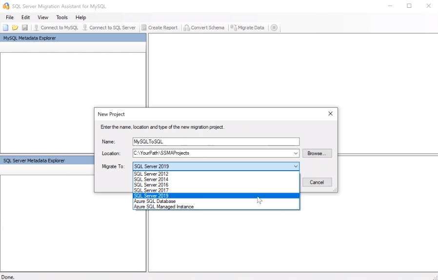

1. In the **Connect to MySQL** dialog box, enter connection details, and then connect to your MySQL server.

   

1. Select the MySQL databases you want to migrate.

   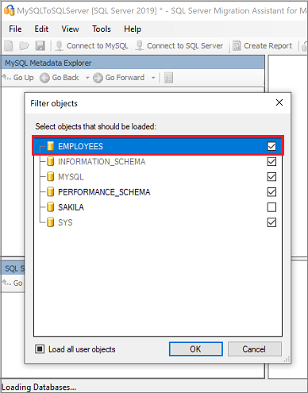

1. Right-click the MySQL database in **MySQL Metadata Explorer**, and select **Create Report**. Alternatively, you can select your MySQL database and then select the **Create Report** tab.

   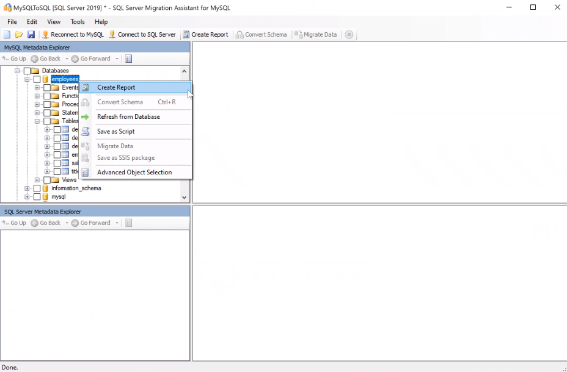

1. Review the HTML report to understand conversion statistics and any errors or warnings. You can also open the report in Excel to get an inventory of MySQL objects and the effort required to perform schema conversions. The default location for the report is in the report folder within SSMAProjects.

   For example, see `drive:\Users\<username>\Documents\SSMAProjects\MySQLMigration\report\report_2016_11_12T02_47_55\`.
   
   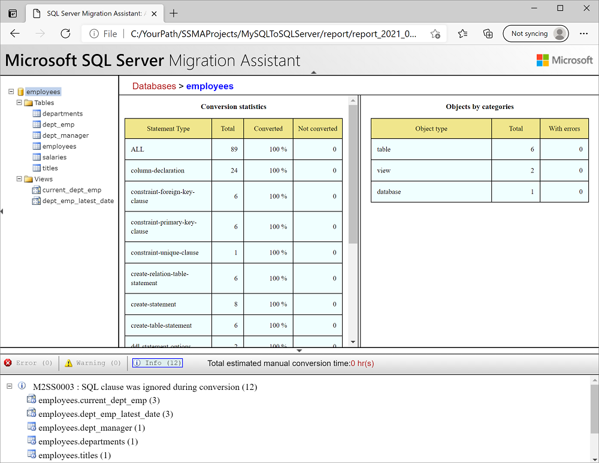

### Validate the type mappings

Validate the default data type mappings and change them based on requirements if necessary. To do so, follow these steps:

1. On the **Tools** menu, select **Project Settings**.
1. Select the **Type Mapping** tab.

   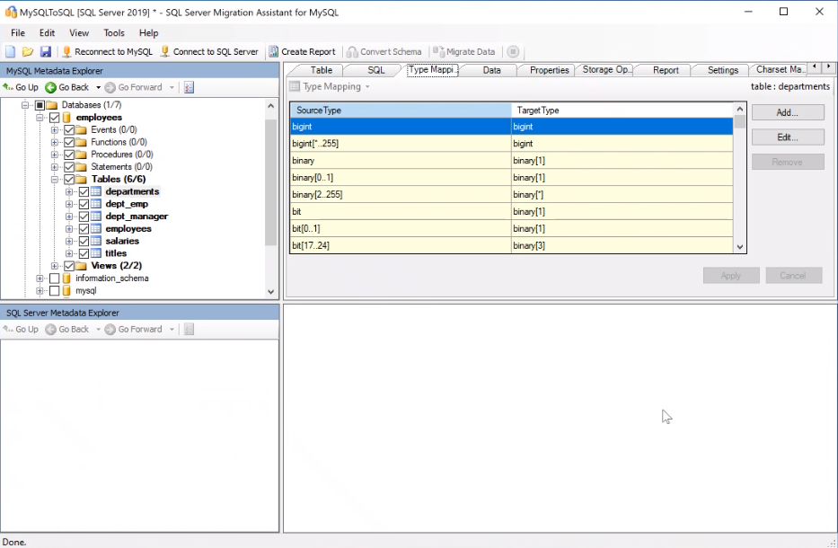

1. You can change the type mapping for each table by selecting the table in **MySQL Metadata Explorer**.

To learn more about conversion settings in SSMA for MySQL, see [Project Settings](../../../ssma/mysql/project-settings-conversion-mysqltosql.md).

### Convert the schema

Converting database objects takes the object definitions from MySQL, converts them to similar SQL Server objects, and then loads this information into the SSMA for MySQL metadata. It doesn't load the information into the instance of SQL Server. You can then view the objects and their properties by using SQL Server Metadata Explorer.

During the conversion, SSMA for MySQL prints output messages to the output pane and error messages to the **Error List** pane. Use the output and error information to determine whether you have to modify your MySQL databases or your conversion process to obtain the desired conversion results.

To convert the schema:

1. (Optional) To convert dynamic or ad-hoc queries, right-click the node and select **Add Statement**.
1. Select the **Connect to SQL Server** tab.
     1. Enter connection details for your SQL Server instance.
     1. Select your target database from the drop-down list, or enter a new name, in which case a database will be created on the target server.
     1. Enter authentication details, and then select **Connect**.

   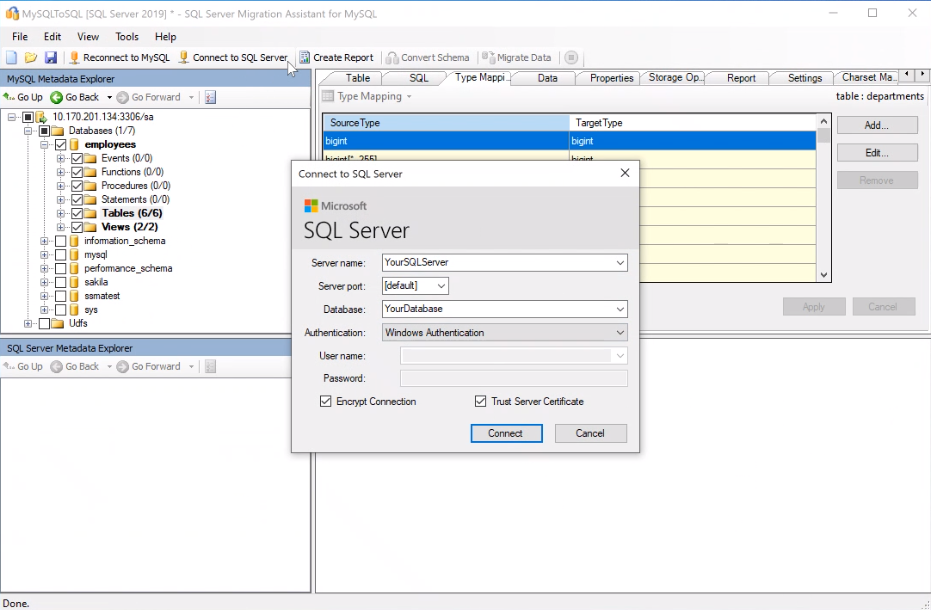

1. Right-click the MySQL database in **MySQL Metadata Explorer**, and then select **Convert Schema**. Alternatively, you can select your MySQL database and then select the **Convert Schema** tab.

   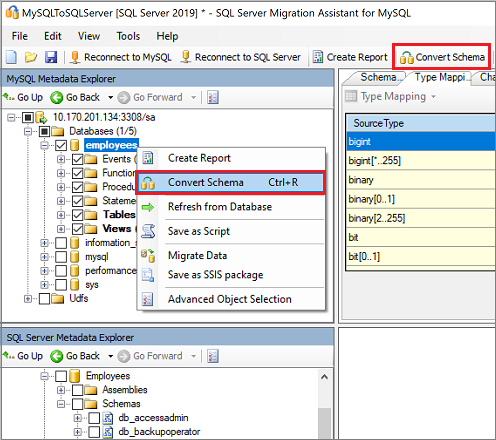

1. After the conversion completes, compare and review the converted objects to the original objects to identify potential problems and address them based on the recommendations.

   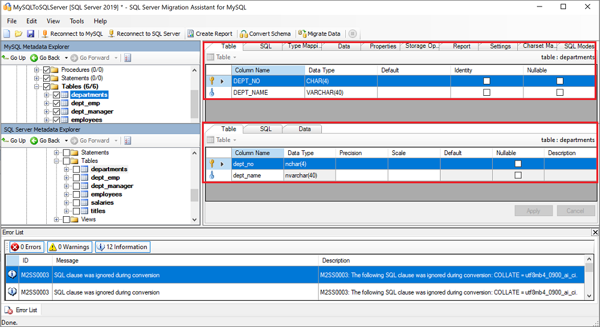

1. Compare the converted Transact-SQL text to the original code, and review the recommendations.

   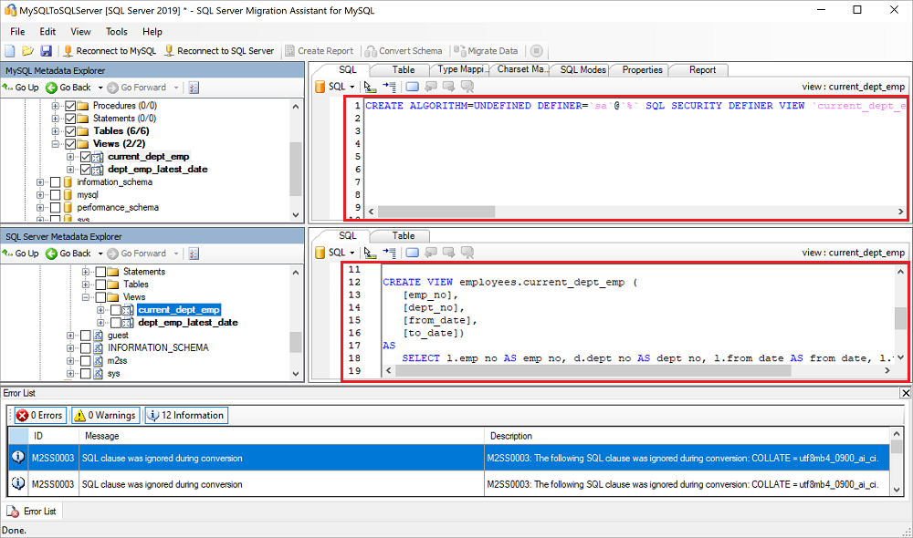
   
1. In the output pane, select **Review results** and review the errors in the **Error List** pane.
1. Save the project locally for an offline schema remediation exercise. On the **File** menu, select **Save Project**. This step gives you an opportunity to evaluate the source and target schemas offline and perform remediation before you publish the schema to SQL Server.

To learn more, see [Screenshot that shows converting MySQL databases.](../../../ssma/mysql/converting-mysql-databases-mysqltosql.md).

## Migration

After you have the necessary prerequisites in place and have completed the tasks associated with the *pre-migration* stage, you're ready to perform the schema and data migration.

You have two options for migrating data:

- **Client-side data migration**
	 -   To perform client-side data migration, select the **Client Side Data Migration Engine** option in the **Project Settings** dialog box.

    > [!NOTE]
    > When SQL Express edition is used as the target database, only client-side data migration is allowed and server-side data migration isn't supported.

- **Server-side data migration**
	-   Before you perform data migration on the server side, ensure that:
	    - The SSMA for MySQL Extension Pack is installed on the instance of SQL Server.
	    - The SQL Server Agent service is running on the instance of SQL Server.
	-   To perform server-side data migration, select the **Server Side Data Migration Engine** option in the **Project Settings** dialog box.

> [!IMPORTANT]  
> If you plan to use the Server Side Data Migration Engine, before you migrate data, you must install the SSMA for MySQL Extension Pack and the MySQL providers on the computer that's running SSMA for MySQL. The SQL Server Agent service must also be running. For more information about how to install the extension pack, see [Installing SQL Server Migration Assistant Components on SQL Server (MySQL to SQL)](../../../ssma/mysql/installing-ssma-components-on-sql-server-mysqltosql.md).

To publish your schema and migrate the data:

1. Publish the schema by right-clicking the database in **SQL Server Metadata Explorer** and selecting **Synchronize with Database**. This action publishes the MySQL database to the SQL Server instance.

   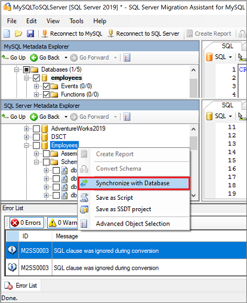

1. Review the mapping between your source project and your target.

   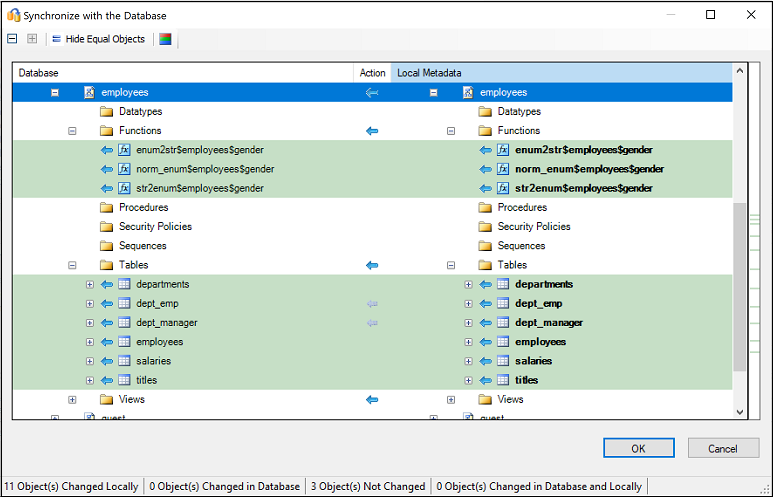

1. Migrate the data by right-clicking the database or object you want to migrate in **MySQL Metadata Explorer** and selecting **Migrate Data**. Alternatively, you can select the **Migrate Data** tab. To migrate data for an entire database, select the check box next to the database name. To migrate data from individual tables, expand the database, expand **Tables**, and then select the check boxes next to the tables. To omit data from individual tables, clear the check boxes.

   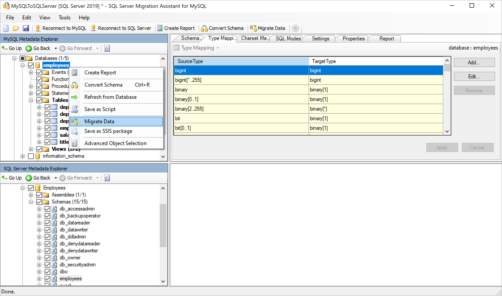

1. After migration is completed, view the **Data Migration Report**.

   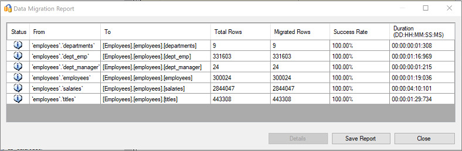

1. Connect to your SQL Server instance by using [SQL Server Management Studio](/sql/ssms/download-sql-server-management-studio-ssms), and validate the migration by reviewing the data and schema.

   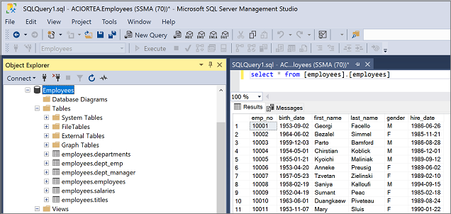

## Post-migration

After you've successfully completed the *migration* stage, you need to complete a series of post-migration tasks to ensure that everything is functioning as smoothly and efficiently as possible.

### Remediate applications

After the data is migrated to the target environment, all the applications that formerly consumed the source need to start consuming the target. Accomplishing this task will require changes to the applications in some cases.

### Perform tests

The test approach for database migration consists of the following activities:

1. **Develop validation tests**: To test database migration, you need to use SQL queries. You must create the validation queries to run against both the source and the target databases. Your validation queries should cover the scope you've defined.
2. **Set up a test environment**: The test environment should contain a copy of the source database and the target database. Be sure to isolate the test environment.
3. **Run validation tests**: Run validation tests against the source and the target, and then analyze the results.
4. **Run performance tests**: Run performance tests against the source and the target, and then analyze and compare the results.

### Optimize

The post-migration phase is crucial for reconciling any data accuracy issues, verifying completeness, and addressing performance issues with the workload.

> [!Note]
> For more information about these issues and the steps to mitigate them, see the [Post-migration validation and optimization guide](../../../relational-databases/post-migration-validation-and-optimization-guide.md).

## Migration assets

For more assistance with completing this migration scenario, see the following resource. It was developed in support of a real-world migration project engagement.

| Title/link                    | Description            |
| ----------------------------- | ---------------------- |
| [Data Workload Assessment Model and Tool](https://github.com/Microsoft/DataMigrationTeam/tree/master/Data%20Workload%20Assessment%20Model%20and%20Tool) | This tool provides suggested "best fit" target platforms, cloud readiness, and application or database remediation level for a given workload. It offers simple, one-click calculation and report generation that helps to accelerate large estate assessments by providing an automated and uniform target platform decision process.                |

The preceding resource was developed by the Data SQL Engineering team. A core charter of this team is to unblock and accelerate complex modernization and complete data platform migration projects to the Microsoft Azure Data platform.

## Next steps

- To learn more about migrating MySQL databases to SQL Server, see [SQL Server Migration Assistant documentation for MySQL](../../../ssma/mysql/sql-server-migration-assistant-for-mysql-mysqltosql.md).
- For a matrix of Microsoft and third-party services and tools that are available to assist you with various database and data migration scenarios and specialty tasks, see [Services and tools for data migration](https://docs.microsoft.com/azure/dms/dms-tools-matrix).
- For other migration guides, see [Azure Database Migration Guides](https://datamigration.microsoft.com/).

