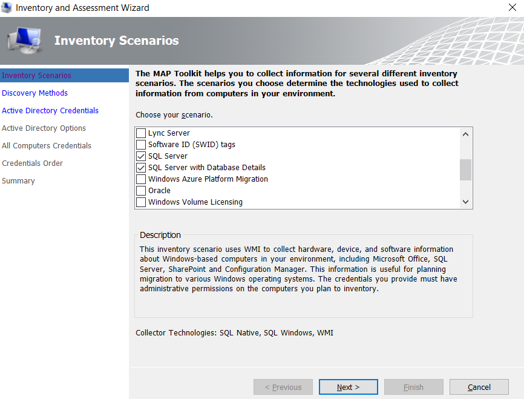
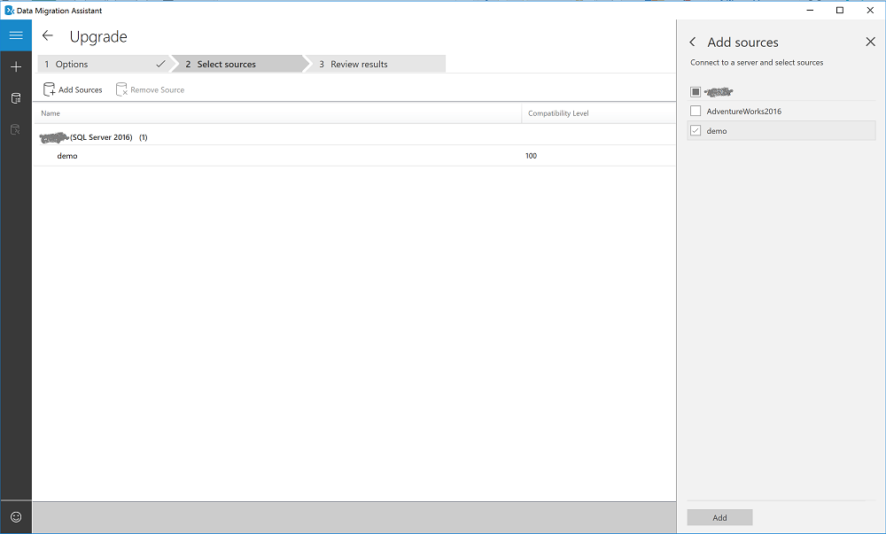
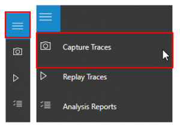
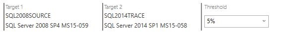
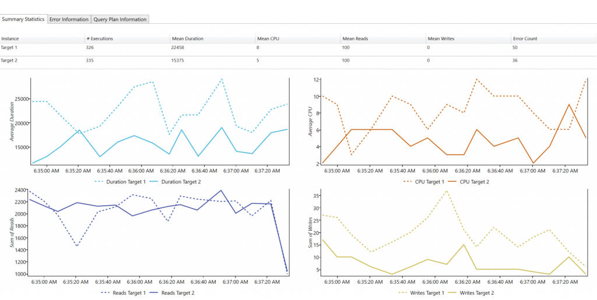

# Upgrade SQL Server to SQL Server

## Preparing for database migration

As you prepare for migration your SQL Server database to a later version of SQL Server, consider the versions of SQL Server that are supported and to address any prerequisites. This will help to ensure an efficient and successful migration.

### Supported upgrade technologies

This section describes all supported scenarios and options for an upgrade from and older version of SQL Server to a newer version of SQL Server, current as of March 2019.

Supported source and target versions are shown in the following list.

- SQL Server source versions
  - SQL Server 2005
  - SQL Server 2008, SQL Server 2008 R2
  - SQL Server 2012
  - SQL Server 2014
  - SQL Server 2016
- SQL Server target versions
  - SQL Server 2014
  - SQL Server 2016
  - SQL Server 2017 on Linux
  - SQL Server 2017 on Windows

The following data migration options are discussed:

- Backup and restore
- Transactional replication
- Always On availability groups
- Data Migration tool set (Azure Database Migration Service \[Azure DMS\] and Data Migration Assistant \[DMA\])
- Database mirroring
- Log shipping
- Bulk load

#### Upgrading from SQL Server 2005

When upgrading from SQL Server 2005, the following migration options are supported.

- Target version: SQL Server 2017
  - Migration tools: Migration is supported through [Data Migration Assistant (DMA)](https://aka.ms/dma).
  - Backup and restore: A backup taken on SQL Server 2005 can be restored to SQL Server 2017.
  - Bulk load: Tables can be bulk copied from SQL Server 2005 to SQL Server 2017.
- Target version: SQL Server 2016
  - Migration tools: Migration is supported through [DMA](https://aka.ms/dma).
  - Backup and restore: A backup taken on SQL Server 2005 can be restored to SQL Server 2016.
  - Bulk load: Tables can be bulk copied from SQL Server 2005 to SQL Server 2016.
- Target version: SQL Server 2014
  - Migration tools: Migration is supported through [DMA](https://aka.ms/dma).
  - Backup and restore: A backup taken on SQL Server 2005 can be restored to SQL Server 2014.
  - Bulk load: Tables can be bulk copied from SQL Server 2005 to SQL Server 2014.

#### Upgrading from SQL Server 2008 or SQL Server 2008 R2

When upgrading from SQL Server 2008 or SQL Server 2008 R2, the following migration options are supported.

- Target version: SQL Server 2017
  - Migration tools: Migration is supported through [Data Migration Assistant (DMA)](https://aka.ms/dma).
  - Backup and restore: A backup taken on SQL Server 2008 or SQL Server 2008 R2 can be restored to SQL Server 2017.
  - Database mirroring: Database mirroring is supported if principal is running SQL Server 2008 SP3 or later, or SQL Server 2008 R2 SP2 or later, and mirror is running SQL Server 2017. If a failover, either automatic or manual, happens such that SQL Server 2017 instance becomes principal, SQL Server 2008 or SQL Server 2008 R2 instance becomes mirror and will NOT receive changes from principal.
  - Log shipping: Log shipping is supported if primary is running SQL Server 2008 SP3 or later, or SQL Server 2008 R2 SP2 or later, and secondary is running SQL Server 2017. If a failover, either automatic or manual, happens such that SQL Server 2017 instance becomes primary, SQL Server 2008 or SQL Server 2008 R2 instance becomes secondary and will NOT receive changes from primary.
  - Bulk load: Tables can be bulk copied from SQL Server 2008 or SQL Server 2008 R2 to SQL Server 2017.
- Target version: SQL Server 2016
  - Migration tools: Migration is supported through [DMA](https://aka.ms/dma).
  - Backup and restore: A backup taken on SQL Server 2008 or SQL Server 2008 R2 can be restored to SQL Server 2016.
  - Database mirroring: Database mirroring is supported if principal is running SQL Server 2008 SP3 or later, or SQL Server 2008 R2 SP2 or later, and mirror is running SQL Server 2016. If a failover, either automatic or manual, happens such that SQL Server 2016 instance becomes principal, SQL Server 2008 or SQL Server 2008 R2 instance becomes mirror and will NOT receive changes from principal.
  - Log shipping: Log shipping is supported if primary is running SQL Server 2008 SP3 or later, or SQL Server 2008 R2 SP2 or later, and secondary is running SQL Server 2016. If a failover, either automatic or manual, happens such that SQL Server 2016 instance becomes primary, SQL Server 2008 or SQL Server 2008 R2 instance becomes secondary and will NOT receive changes from primary.
  - Bulk load: Tables can be bulk copied from SQL Server 2008 or SQL Server 2008 R2 to SQL Server 2016.
- Target version: SQL Server 2014
  - Migration tools: Migration is supported through [DMA](https://aka.ms/dma).
  - Backup and restore: A backup taken on SQL Server 2008 or SQL Server 2008 R2 can be restored to SQL Server 2014.
  - Transactional replication: SQL Server replication from SQL Server 2008/2008R2 to SQL Server is supported. Replication upgrade options are outlined in detail in the blog [here](https://blogs.msdn.microsoft.com/sql_server_team/upgrading-a-replication-topology-to-sql-server-2016/).
  - Database mirroring: Database mirroring is supported if principal is running SQL Server 2008 SP3 or later, or SQL Server 2008 R2 SP2 or later, and mirror is running SQL Server 2014. If a failover, either automatic or manual, happens such that SQL Server 2014 instance becomes principal, SQL Server 2008 or SQL Server 2008 R2 instance becomes mirror and will NOT receive changes from principal.
  - Log shipping: Log shipping is supported if primary is running SQL Server 2008 SP3 or later, or SQL Server 2008 R2 SP2 or later, and secondary is running SQL Server 2014. If a failover, either automatic or manual, happens such that SQL Server 2014 instance becomes primary, SQL Server 2008 or SQL Server 2008 R2 instance becomes secondary and will NOT receive changes from primary.
  - Bulk load: Tables can be bulk copied from SQL Server 2008 or SQL Server 2008 R2 to SQL Server 2014.

#### Upgrading from SQL Server 2012

When upgrading from SQL Server 2012, the following migration options are supported.

- Target version: SQL Server 2017
  - Migration tools: Migration is supported through [Data Migration Assistant (DMA)](https://aka.ms/dma).
  - Backup and restore: A backup taken on SQL Server 2012 can be restored to SQL Server 2017.
  - Availability group: Always On availability groups are supported if primary replica is running SQL Server 2012 SP2 or later and secondary replicas are running SQL Server 2017. If a failover, either automatic or manual, happens such that a SQL Server 2017 instance becomes primary, SQL Server 2012 instance becomes secondary and will NOT be able to receive changes from primary.
  - Database mirroring: Database mirroring is supported if principal is running SQL Server 2012 SP1 or later and mirror is running SQL Server 2017. If a failover, either automatic or manual, happens such that SQL Server 2017 instance becomes principal, SQL Server 2012 instance becomes mirror and will NOT receive changes from principal.
  - Log shipping: Log shipping is supported if primary is running SQL Server 2012 SP1 or later and secondary is running SQL Server 2017. If a failover, either automatic or manual, happens such that SQL Server 2017 instance becomes primary, SQL Server 2012 instance becomes secondary and will NOT receive changes from primary.
  - Bulk load: Tables can be bulk copied from SQL Server 2012 to SQL Server 2017.
- Target version: SQL Server 2016
  - Migration tools: Migration is supported through [DMA](https://aka.ms/dma).
  - Backup and restore: A backup taken on SQL Server 2012 can be restored to SQL Server 2016.
  - Transactional replication: SQL Server transactional replication from SQL Server 2012 to SQL Server 2016 is supported.
  - Availability group: Always On availability groups are supported if primary replica is running SQL Server 2012 SP2 or later and secondary replicas are running SQL Server 2016. If a failover, either automatic or manual, happens such that a SQL Server 2016 instance becomes primary, SQL Server 2012 instance becomes secondary and will NOT be able to receive changes from primary.
  - Database mirroring: Database mirroring is supported if principal is running SQL Server 2012 SP1 or later and mirror is running SQL Server 2016. If a failover, either automatic or manual, happens such that SQL Server 2016 instance becomes principal, SQL Server 2012 instance becomes mirror and will NOT receive changes from principal.
  - Log shipping: Log shipping is supported if primary is running SQL Server 2012 SP1 or later and secondary is running SQL Server 2016. If a failover, either automatic or manual, happens such that SQL Server 2016 instance becomes primary, SQL Server 2012 instance becomes secondary and will NOT receive changes from primary.
  - Bulk load: Tables can be bulk copied from SQL Server 2012 to SQL Server 2016.
- Target version: SQL Server 2014
  - Migration tools: Migration is supported through [DMA](https://aka.ms/dma).
  - Backup and restore: A backup taken on SQL Server 2012 can be restored to SQL Server 2014.
  - Transactional replication: SQL Server transactional replication from SQL Server 2012 to SQL Server 2014 is supported.
  - Availability group: Always On availability groups are supported if primary replica is running SQL Server 2012 SP1 or later and secondary replicas are running SQL Server 2014. If a failover, either automatic or manual, happens such that a SQL Server 2014 instance becomes primary, SQL Server 2012 instance becomes secondary and will NOT be able to receive changes from primary.
  - Database mirroring: Database mirroring is supported if principal is running SQL Server 2012 SP1 or later and mirror is running SQL Server 2014. If a failover, either automatic or manual, happens such that SQL Server 2014 instance becomes principal, SQL Server 2012 instance becomes mirror and will NOT receive changes from principal.
  - Log shipping: Log shipping is supported if primary is running SQL Server 2012 SP1 or later and secondary is running SQL Server 2014. If a failover, either automatic or manual, happens such that SQL Server 2014 instance becomes primary, SQL Server 2012 instance becomes secondary and will NOT receive changes from primary.
  - Bulk load: Tables can be bulk copied from SQL Server 2012 to SQL Server 2014.

#### Upgrading from SQL Server 2014

When upgrading from SQL Server 2014, the following migration options are supported.

- Target version: SQL Server 2017
  - Migration tools: Migration is supported through [Data Migration Assistant (DMA)](https://aka.ms/dma).
  - Backup and restore: A backup taken on SQL Server 2014 can be restored to SQL Server 2017.
  - Transactional replication: SQL Server transactional replication from SQL Server 2014 to SQL Server 2017 is supported.
Availability group: Always On availability groups are supported if primary replica is running SQL Server 2014 and secondary replicas are running SQL Server 2017. If a failover, either automatic or manual, happens such that a SQL Server 2017 instance becomes primary, SQL Server 2014 instance becomes secondary and will NOT be able to receive changes from primary.
  - Database mirroring: Database mirroring is supported if principal is running SQL Server 2014 and mirror is running SQL Server 2017. If a failover, either automatic or manual, happens such that SQL Server 2017 instance becomes principal, SQL Server 2014 instance becomes mirror and will NOT receive changes from principal.
  - Log shipping: Log shipping is supported if primary is running SQL Server 2014 and secondary is running SQL Server 2017. If a failover, either automatic or manual, happens such that SQL Server 2017 instance becomes primary, SQL Server 2014 instance becomes secondary and will NOT receive changes from primary.
  - Bulk load: Tables can be bulk copied from SQL Server 2014 to SQL Server 2017.
- Target version: SQL Server 2016
  - Migration tools: Migration is supported through [DMA](https://aka.ms/dma).
  - Backup and restore: A backup taken on SQL Server 2014 can be restored to SQL Server 2016.
  - Transactional replication: SQL Server transactional replication from SQL Server 2014 to SQL Server 2016 is supported.
  - Availability group: Always On availability groups are supported if primary replica is running SQL Server 2014 and secondary replicas are running SQL Server 2016. If a failover, either automatic or manual, happens such that a SQL Server 2016 instance becomes primary, SQL Server 2014 instance becomes secondary and will NOT be able to receive changes from primary.
  - Database mirroring: Database mirroring is supported if principal is running SQL Server 2014 and mirror is running SQL Server 2016. If a failover, either automatic or manual, happens such that SQL Server 2016 instance becomes principal, SQL Server 2014 instance becomes mirror and will NOT receive changes from principal.
  - Log shipping: Log shipping is supported if primary is running SQL Server 2014 and secondary is running SQL Server 2016. If a failover, either automatic or manual, happens such that SQL Server 2016 instance becomes primary, SQL Server 2014 instance becomes secondary and will NOT receive changes from primary.
  - Bulk load: Tables can be bulk copied from SQL Server 2014 to SQL Server 2016.

#### Upgrading from SQL Server 2016

When upgrading from SQL Server 2016, the following migration options are supported.

- Target version: SQL Server 2017
  - Migration tools: Migration is supported through [Data Migration Assistant (DMA)](https://aka.ms/dma).
Backup and restore: A backup taken on SQL Server 2016 can be restored to SQL Server 2017.
  - Transactional replication: SQL Server transactional replication from SQL Server 2016 to SQL Server 2017 is supported.
  - Availability group: Always On availability groups are supported if primary replica is running SQL Server 2016 and secondary replicas are running SQL Server 2017. If a failover, either automatic or manual, happens such that a SQL Server 2017 instance becomes primary, the SQL Server 2016 instance becomes secondary and will NOT be able to receive changes from primary.
  - Database mirroring: Database mirroring is supported if principal is running SQL Server 2016 and mirror is running SQL Server 2017. If a failover, either automatic or manual, happens such that a SQL Server 2017 instance becomes principal, the SQL Server 2016 instance becomes a mirror and will NOT receive changes from principal.
  - Log shipping: Log shipping is supported if primary is running SQL Server 2016 and secondary is running SQL Server 2017. If a failover, either automatic or manual, happens such that SQL Server 2017 instance becomes primary, the SQL Server 2016 instance becomes secondary and will NOT receive changes from primary.
  - Bulk load: Tables can be bulk copied from SQL Server 2016 to SQL Server 2017.

### Prerequisites

Before beginning your migration project, it is important to address the associated prerequisites. To prepare for the migration, download and install the:

- Latest version of the [MAP Toolkit](http://go.microsoft.com/fwlink/?LinkID=316883).
- [Data Migration Assistant](https://www.microsoft.com/download/details.aspx?id=53595) v3.3 or later.
- Latest version of the [Database Experimentation Assistant](https://www.microsoft.com/en-us/download/details.aspx?id=54090).

### Migration assets from real-world engagements

For additional assistance with completing this migration scenario, please see the following resources, which were developed in support of a real-world migration project engagement.

| **Title/link** | **Description** |
| -------------- | --------------- |
| [Data Workload Assessment Model and Tool](https://github.com/Microsoft/DataMigrationTeam/tree/master/Data%20Workload%20Assessment%20Model%20and%20Tool) | This tool provides suggested “best fit” target platforms, cloud readiness, and application/database remediation level for a given workload. It offers simple, one-click calculation and report generation that greatly helps to accelerate large estate assessments by providing and automated and uniform target platform decision process.                                                                        |
| [Optimization Guide for Mainframe App/Data recompiled to .NET & SQL Server](https://aka.ms/dmj-wp-mainframe-optimize)                                   | This guide offers optimization advice for executing point-lookups against SQL Server from .NET as efficiently as possible. Customers wishing to migrate from mainframe databases to SQL Server may desire to migrate existing mainframe-optimized design patterns, especially when using 3rd party tools (such as Raincode Compiler) to automatically migrate mainframe code (COBOL/JCL etc) to T-SQL and C\## .NET. |

> [!NOTE]
> These resources were developed as part of the Data Migration Jumpstart Program (DM Jumpstart), which is sponsored by the Azure Data Group engineering team. The core charter DM Jumpstart is to unblock and accelerate complex modernization and compete data platform migration opportunities to Microsoft’s Azure Data platform. If you think your organization would be interested in participating in the DM Jumpstart program, please contact your account team and ask that they submit a nomination.

### Additional resources

- For an overview of the Azure Database Migration Guide and the information it contains, see the video [How to Use the Database Migration Guide](https://azure.microsoft.com/resources/videos/how-to-use-the-azure-database-migration-guide/).
- For a walk through of the phases of the migration process and detail about the specific tools and services recommended to perform assessment and migration, see the video [Overview of the migration journey and the tools/services recommended for performing assessment and migration](https://azure.microsoft.com/resources/videos/overview-of-migration-and-recommended-tools-services/).

## Pre-migration overview

After verifying that your source environment is supported and ensuring that you have addressed any prerequisites, you are ready to start the Pre-migration stage. This part of the process involves conducting an inventory of the databases that you need to migrate, assessing those databases for potential migration issues or blockers, and then resolving any items you might have uncovered. For heterogenous migrations (such as Oracle to Azure Database for PostgreSQL), this stage also involves converting the schema(s) in the source database(s) to be compatible with the target environment. For homogenous migrations, such as SQL Server to SQL Server, conversion of the source schema to work in the target environment is not required.

### Discover

The goal of the Discover phase is to identify existing data sources and details about the features that are being used to get a better understanding of and plan for the migration. This process involves scanning the network to identify all your organization’s SQL instances together with the version and features in use.

To use the MAP Toolkit to perform an inventory scan, perform the following steps.

#### Steps for the Discover phase

1. Download the [MAP Toolkit](http://go.microsoft.com/fwlink/?LinkID=316883), and then install it.
1. Run the MAP Toolkit.
   1. Open the MAP Toolkit, and then on the left pane, select **Database**.
      You will be on the following screen:

      
   1. Select **Create/Select database**.

      
   1. Ensure that **Create an inventory database** is selected, enter a name for the database, a brief description, and then select **OK**.

      

      The next step is to collect data from the database created.

   1. Select **Collect inventory data**.

      
   1. In the Inventory and Assessment Wizard, select **SQL Server** and **SQL Server with Database Details**, and then select **Next**.

      
   1. Select the best method option to search the computers on which Microsoft Products are hosted, and then select **Next**.

      
   1. Enter credentials or create new credentials for the systems that you want to explore, and then select **Next**.

      
   1. Set the order of the credentials, and then select **Next**.

      

      Now, you need to specify the credentials for each computer that you want to discover. You can use unique credentials for each computer/machine, or you can choose to use the **All Computer Credentials** list.

   1. After setting up the credentials, select **Save**, and then select **Next**.

      
   1. Verify your selection summary, and then select **Finish**.

      
   1. Wait for a few minutes (depending on the number of databases) for the Data Collection summary report.

      
   1. Select **Close**.

      The Main window of the tool appears, showing a summary of the Database Discovery completed so far.
1. Report generation and data collection.

  On the top-right corner of the tool, an **Options** page appears, which you can use to generate report about the SQL Server Assessment and the Database Details.

  

   1. Select both options (one by one) to generate the report.

      This will take a couple of seconds to a few minutes depending on the size of the inventory completed during discovery.

      

### Assess

After identifying the data sources, the next step is to assess the on-premises SQL Server instance(s) upgrading to a later version of SQL Server so that you understand the gaps between the source and target instances. Use the Data Migration Assistant (DMA) to assess your source database before upgrading your SQL Server instance.

#### Steps for the Assess phase

To use DMA to create an assessment, perform the following steps.

1. Download the [DMA tool](https://www.microsoft.com/download/details.aspx?id=53595), and then install it.
1. Create a **New Assessment** project.
   1. Select the New (+) icon, select the **Assessment** project type, specify a project name, select **SQL Server** as the source and target, and then select **Create**.

      
   1. Select the target SQL Server version that you plan to migrate to and against which you need to run an assessment, select one or both of the assessment report types (**Compatibility Issues** and **New features’ recommendation**), and then select **Next**.

      

   1. In the **Connect to a server** fly-out, specify the name of the SQL Server instance to connect to, specify the Authentication type and Connection properties, and then select **Connect**.
   1. In the **Add Sources** fly-out, select the database(s) you that want to assess, and then select **Add**.

      
   1. Select **Start Assessment**.

      Now wait for the assessment results; the duration of the assessment depends on the number of databases added and the schema size of each database. Results will be displayed per database as soon as they are available.
   1. Select the database that has completed assessment, and then switch between **Compatibility issues** and **Feature recommendations** by using the switcher.

      
   1. Review the compatibility issues by analyzing the impacted object and its details for every issue identified under **Breaking changes**, **Behavior changes**, and **Deprecated features**.
   1. Review feature recommendations across the **Performance**, **Storage**, and **Security** areas.

      Feature recommendations cover a variety of features such as In-Memory OLTP and Columnstore, Stretch Database, Always Encrypted (AE), Dynamic Data Masking (DDM), and Transparent Data Encryption (TDE).
1. Review assessment results.
   1. After all database assessments are complete, select **Export report** to export the results to either a JSON or CSV file for analyzing the data at your own convenience.

### Convert

After assessing the source database instance(s) you are migrating, for heterogenous migrations, you need to convert the schema to work in the target environment. Since upgrading to a newer version of SQL Server would be considered a homogeneous migration, the Convert phase is unnecessary.

## Migration overview

After you have the necessary prerequisites in place and have completed the tasks associated with the **Pre-migration** stage, you are ready to perform the schema and data migration.

### Migrate schema and data

After assessing your databases, the next step is to begin the process of migrating the schema and database by using DMA.

#### Steps for the migrate schema and data phase

To use DMA to create a migration project, perform the following steps.

1. Create a **New Migration** project
   1. Select the New icon, select the **Migration** project type, select **SQL Server** as source and target types, and then select **Create**.

      
   1. Provide source and target SQL server connection details, and then select **Next**.

      
   1. Select databases from the source to migrate, and then specify the **Shared location accessible by source and target SQL servers for backup operation**.

      > [!NOTE]
      > Be sure that the service account running the source SQL Server instance has write privileges on the shared location and that the target SQL Server service account has read privileges on the shared location.

      
   1. Select **Next**, select the logins that you want to migrate, and then select **Start Migration**.

      
   1. Now, monitor the progress of migration in the **View Results** screen.

      
2. **Review Migration Results**
   1. Select **Export report** to save the migration results to a .csv or .json file.
   1. Review the saved file for details about data and logins migration and verify successful completion of the process.

### Data sync and Cutover

For minimal-downtime migrations, the source you are migrating continues to change after the one-time migration occurs, and it will drift from the target in terms of data and schema. During this phase, you need to ensure that all changes in the source are captured and applied to the target in near real time. After you verify that all changes in source have been applied to the target, you can cutover from the source to the target environment.

Support for minimal-downtime migrations is not yet available for this scenario, so the Data sync and Cutover phases are not currently applicable.

## Post-migration overview

After you have successfully completed the **Migration** stage, you need to go through a series of post-migration tasks to ensure that everything is functioning as smoothly and efficiently as possible.

### Remediate applications

After the data is migrated to the target environment, all the applications that formerly consumed the source need to start consuming the target. Accomplishing this will in some cases require changes to the applications.

### Perform tests

After the data is migrated to target, perform tests against the databases to verify that the applications perform well against the after the migration. Use the Database Experimentation Assistant (DEA) to assist with evaluating the target SQL Server.

> [!NOTE]
> For assistance with developing and running post-migration validation tests, also consider the Data Quality Solution available from [QuerySurge](http://www.querysurge.com/company/partners/microsoft).

#### Steps for the Perform tests phase

To use DEA for database migration testing, perform the following steps.

1. **Download the [DEA tool](https://www.microsoft.com/en-us/download/details.aspx?id=54090)**, and then install it.
1. **Run a trace capture**
   1. On the left navigation tree, select the camera icon the go to **All Captures**.

      
   1. To start a new capture, select **New Capture**.
   1. To configure the capture, speficy the trace name, duration, SQL Server instance name, database name, and the share location for storing the trace file on the computer running SQL Server.

      
   1. Select **Start** to begin trace capture.
1. **Run a trace replay**
   1. On the left navigation tree, select the play icon the go to **All Replays**.

      
   1. To start a new replay, select **New Replay**.
   1. To configure the replay, specify the replay name, controller machine name, path to source trace file on controller, SQL Server instance name, and the pathfor storing the target trace file on the computer running SQL Server.
   1. Select **Start** to begin replay of your capture.
1. **Create a new Analysis Report**
   1. On the left navigation tree, select the checklist icon to go to **Analysis Reports**.

      
   1. Connect to the SQL Server on which you will store your report databases.

      You will see the list of all reports in the server.
   1. Select **New Report**.
   1. To configure the report, specify the report name, and specify paths to the traces fon the source and target SQL Server instances.

      
1. **Review an analysis report**
   1. On the first page of the report, the version and build information for the target servers on which the experiment was run displays.

      Threshold allows you to adjust the sensitivity or tolerance of your A/B Test analysis.

      > [!NOTE]
      > By default, threshold is set to 5%; any performance improvement that is \>= 5% is categorized as ‘Improved’. The drop-down selector allows you to evaluate the report using different performance thresholds.

      
   1. Select the individual slices of the pie chart to view drill-down metrics on performance.

      

      On the drill-down page for a performance change category, you will see a list of queries in that category.

      
   1. Select an individual query to get performance summary statistics, error information, and query plan information.

      

### Optimize

The post-migration phase is crucial for reconciling any data accuracy issues and verifying completeness, as well as addressing performance issues with the workload.

> [!NOTE]
> For additional detail about these issues and specific steps to mitigate them, see the [Post-migration Validation and Optimization Guide](https://docs.microsoft.com/en-us/sql/relational-databases/post-migration-validation-and-optimization-guide).
