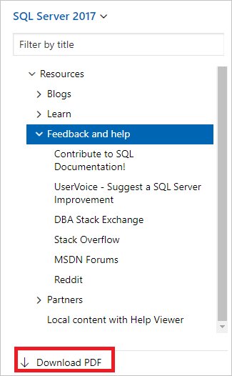
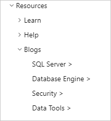
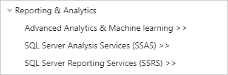
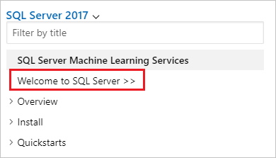
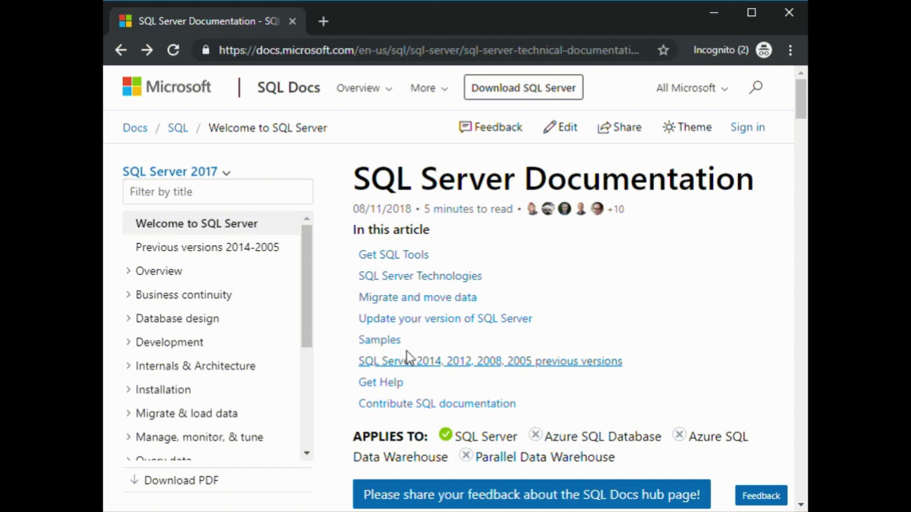
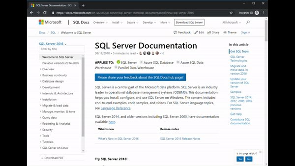
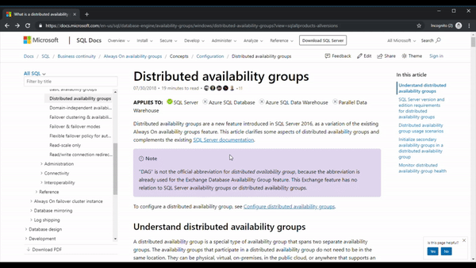
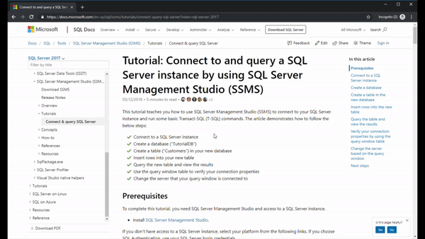
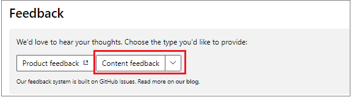

# SQL Server docs navigation guide

This topic provides some tips and tricks for navigating the SQL Server technical documentation space.  

## Hub page

The SQL Server hub page can be found at [https://aka.ms/sqldocs](../index.yml?WT.mc_id=akams) and is the entry point for finding relevant SQL Server content.

You can always navigate back to this page by selecting **SQL Docs** from the header at the top of every page within the SQL Server technical documentation set: 

## Offline documentation

If you would like to view the SQL Server documentation on an offline system, you have two options to do so. You can either create a PDF wherever you are in the SQL Server technical documentation, or you can download the offline content using [SQL Server offline Help Viewer](./sql-server-offline-documentation.md). 

If you'd like to create a PDF, select the **Download PDF** link found at the bottom of every table of contents.

## TOC symbols

Entries in the table of contents (TOC) that have a `>` at the end of the entry indicate that you will be taken to technical documentation with a different table of contents.

Entries in the TOC marked with **>>** indicate that you will be taken to a different website.

If you navigate to one of these pages, you can come back to the main SQL Server technical page, and table of contents, by selecting the **Welcome to SQL Server >** entry found at the top of each of these table of contents.

## TOC search

You can search the entries in the table of contents using the filter search box at the top:

## Version filter
The SQL Server technical documentation provides content for several supported versions and flavors of SQL Server. Features can vary between versions and flavors of SQL Server, and as such, sometimes the content itself can vary. 

You can use the [version filter](versioning-system-monikers-ui-sql-server.md) to ensure that you are seeing content for the appropriate version and flavor of SQL Server: 

## Breadcrumbs

Breadcrumbs can be found below the header and above the table of contents, and indicate where the current article is located in the table of contents.  Not only does this help set the context to what type of content you're reading, but it also allows you to navigate back up the table of contents tree:

## Article section navigation

The right-hand navigation pane allows you to quickly navigate to sections within an article, as well as identify your location within the article.  

## Submit docs feedback

If you find something wrong within an article, you can submit feedback to the SQL Content team for that article by scrolling down to the bottom of the page and selecting **Content feedback**.

You can also submit general documentation feedback and suggestions at [https://aka.ms/sqldocsfeedback](https://aka.ms/sqldocsfeedback). 

[!INCLUDE[contribute-to-content](../includes/paragraph-content/contribute-to-content.md)]

## Next steps

- Get started with the [SQL Server technical documentation](index.yml).
- For more information about submitting feedback for or getting help with SQL Server, see the [Get help](sql-server-get-help.md) page. 
- To quickly access all the quickstarts and tutorials, see [Educational SQL resources](../sql-server/educational-sql-resources.yml).
