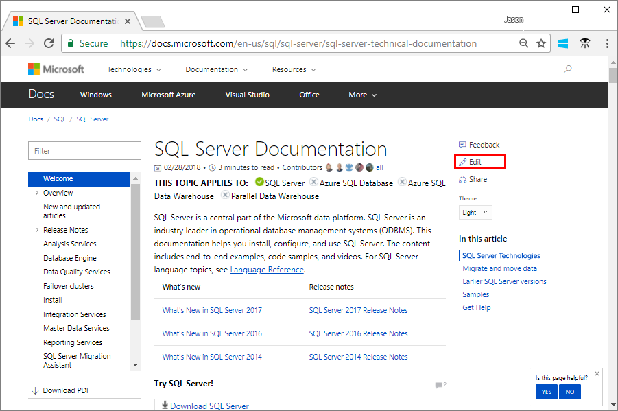

# How to contribute to SQL Server Documentation

[!INCLUDE[appliesto-ss-asdb-asdw-pdw-md.md](../includes/appliesto-ss-asdb-asdw-pdw-md.md)]

Anyone can contribute to SQL Server documentation. This includes correcting typos, suggesting better explanations, and improving technical accuracy. This article explains how to get started with content contributions and how the process works.

There are two main workflows.

| Editing workflow | Good for... |
|---|---|
| [Edit in your browser](#githubui) | Small, quick edits of any topic. |
| [Edit locally with tools](#tools) | More complex edits, edits involving multiple files, and frequent contributions to docs.microsoft.com. |

## <a id="githubui"></a> Edit in your browser

The following steps provide an overview of making simple edits to SQL erver content in your browser. The complete process is documented in the article, [GitHub contribution workflow for minor or infrequent changes](https://docs.microsoft.com/contribute/contribute/light-workflow).

1. Every article, including this one, has an **Edit** button on the right. Click **Edit** to get started.

   

   All of the content on docs.microsoft.com is managed in various GitHub Repositories. When you click the edit button, you are taken to the article in either the **sql-docs** or **azure-docs** repositories depending on the topic you are editing. 

1. Next, click on the pencil icon at the top-right of the article in GitHub.

   

   > [!NOTE]
   > You must be signed in to GitHub to edit an article. If you do not have a GitHub account, see [GitHub account setup](https://docs.microsoft.com/contribute/contribute/get-started-setup-github). After creating a new account, you must also verify your email address with GitHub before you can edit.

1. Edit the article in the browser. All of the articles are written in Markdown. If you need help with Markdown, you can review [Markdown basics](https://help.github.com/articles/getting-started-with-writing-and-formatting-on-github/). You can also learn by observing how published articles render existing Markdown.

1. Scroll down to the bottom of the edit window, enter a title for your change, and click the green **Propose file change** button.

1. On the next page, click **Create pull request**.

1. Enter a title and description for the pull request. Then click **Create pull request** again.

At this point, you should be guided through the rest of the process in the comments of the pull request. The complete process and additional details can be found in the [contributor guide](https://docs.microsoft.com/contribute/contribute/light-workflow).

## <a id="tools"></a> Edit locally with tools

Another editing option is to fork the **sql-docs** or **azure-docs** repositories and clone it locally to your machine. You can then use a Markdown editor and a git client to submit the changes. 

To contribute with this method, see the following articles:

- [Create a GitHub account](https://docs.microsoft.com/contribute/contribute/get-started-setup-github)
- [Install content authoring tools](https://docs.microsoft.com/contribute/contribute/get-started-setup-tools)
- [Set up a Git repository locally](https://docs.microsoft.com/contribute/contribute/get-started-setup-local)
- [Use tools to contribute](https://docs.microsoft.com/contribute/contribute/full-workflow)

If you submit a pull request with significant changes to documentation, you will get a comment in GitHub asking you to submit an online **Contribution License Agreement (CLA)**. You must complete the online form before your pull request can be accepted.

> [!TIP] 
> This is a good option for large submissions, such as a change involving multiple articles. It is also useful for frequent contributors. For small or infrequent changes, [use the GitHub UI](#githubui).


## SQL Server documentation guidance

This section provides some additional guidance on working in the **sql-docs** repository.

> [!IMPORTANT]
> The informartion in this section is specific to **sql-docs**. If you are editing a SQL topic in the Azure documentation, see [the Readme for the azure-docs repository on GitHub](https://github.com/MicrosoftDocs/azure-docs/blob/master/README.md).

### Repository basics

The [sql-docs](https://github.com/MicrosoftDocs/sql-docs) repository uses several standard folders to organize the content.

| Folder | Description |
|---|---|
| [docs](https://github.com/MicrosoftDocs/sql-docs/tree/live/docs) | Contains all published SQL Server content. Subfolders logically organize different areas of the content. |
| [docs/includes](https://github.com/MicrosoftDocs/sql-docs/tree/live/docs/includes) | Contains include files. These are portions of content that can be included in one or more other topics. |
| **./media** | Contains article images are in various **media** subfolders relative to the article location. |
| **TOC.MD** | Table of contents file in each subfolder. |

### Applies-to includes

Each SQL Server article contains an **applies-to** include file after the title. This indicates what areas or versions of SQL Server the article applies to.

Consider the following Markdown example that pulls in the **appliesto-ss-asdb-asdw-pdw-md.md** include file.

```Markdown
[!INCLUDE[appliesto-ss-asdb-asdw-pdw-md](../includes/appliesto-ss-asdb-asdw-pdw-md.md)]
```

This adds the following text at the top of the article:


To find the correct applies-to include for your article, use the following tips:

- Look at other articles that cover the same feature or a related task. If you edit that article, you can copy the Markdown for the applies-to include link (you can cancel the edit without submitting it).
- Search the [docs/includes](https://github.com/MicrosoftDocs/sql-docs/tree/live/docs/includes) directory for files containing the text "applies-to". You can use the **Find** button in github to quickly filter. Click on the file to see how it is rendered.
- Pay attention to the naming convention. If there are x's in the name, they are usually placeholders indicating the lack of support for a service. For example, **appliesto-xx-xxxx-asdw-xxx-md.md** indicates support for only Azure SQL Data Warehouse, because only **asdw** is spelled out, whereas the other fields have x's.
- Some includes specify a version number, such as **tsql-appliesto-ss2017-xxxx-xxxx-xxx-md.md**. Only use these when you know the feature was introduced with a specific version of SQL Server. 

## Contributor resources

- [Contributor guide for docs.microsoft.com](https://docs.microsoft.com/en-us/contribute/)
- [Micrsofot Style Guide](https://docs.microsoft.com/en-us/teamblog/style-guide)
- [Markdown basics](https://help.github.com/articles/getting-started-with-writing-and-formatting-on-github/)

> [!TIP]
> If you have product feedback rather than documentation feedback, [provide feedback on the SQL Server product here](https://feedback.azure.com/forums/908035-sql-server).

## Next steps

Explore the [sql-docs repository](https://github.com/MicrosoftDocs/sql-docs) on GitHub.

Find an article, submit a change, and help the SQL Server community. 

Thank you!


