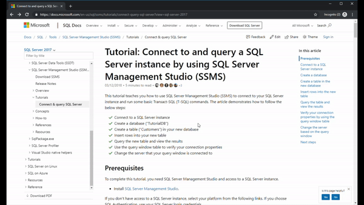
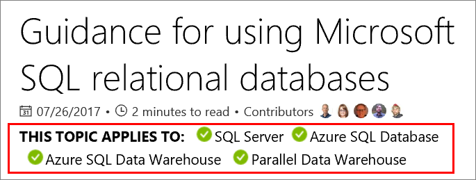

# How to contribute to SQL Server Documentation

[!INCLUDE[sql-asdb-asa-pdw](../includes/applies-to-version/sql-asdb-asa-pdw.md)]

Anyone can contribute to SQL Server documentation. This includes correcting typos, suggesting better explanations, and improving technical accuracy. This article explains how to get started with content contributions and how the process works.

There are two main workflows you can use to contribute:

|Workflow|Description|
|---|---|
| [Edit in your browser](#githubui) | Good for small, quick edits of any article. |
| [Edit locally with tools](#tools) | Good for more complex edits, edits involving multiple articles, and frequent contributions. |

All public contributions are validated by the SQL content team for technical accuracy and consistency.

## <a id="githubui"></a> Edit in your browser

You can make simple edits to SQL Server content in your browser and then submit them to Microsoft. For more information, see the [contributor guide overview](/contribute/#quick-edits-to-existing-documents).

The following steps summarize the process:

1. On the page you have feedback about, select the **Edit** link at the top right.
1. On the next page, select the **Pencil** icon at the top right.
1. On the next page, in the **Edit file** text window, make your edits directly to the text you want to change.
    If you need help with formatting the new or changed text, see the [Markdown Cheatsheet](https://github.com/adam-p/markdown-here/wiki/Markdown-Cheatsheet).
1. After you've made your edits, under **Commit changes**:
    1. In the first text box, enter a brief description of the change you've made.
    1. In the **Add an optional extended description** box, provide a brief explanation of your change.
1. Select **Propose file change**.
1. On the **Comparing changes** page, select **Create pull request**. 
1. On the **Open a pull request** page, select **Create pull request**. 

The following GIF demonstrates the end-to-end process for submitting changes in your browser:



## <a id="tools"></a> Edit locally with tools

Another editing option is to fork the **sql-docs** or **azure-docs** repositories and clone it locally to your machine. You can then use a Markdown editor and a git client to submit the changes. This workflow is good for edits that are more complex or involve multiple files. It is also good for frequent contributors to Microsoft technical documentation.

To contribute with this method, see the following articles:

- [Create a GitHub account](/contribute/get-started-setup-github)
- [Install content authoring tools](/contribute/get-started-setup-tools)
- [Set up a Git repository locally](/contribute/get-started-setup-local)
- [Use tools to contribute](/contribute/how-to-write-workflows-major)

If you submit a pull request with significant changes to documentation, you will get a comment in GitHub asking you to submit an online **Contribution License Agreement (CLA)**. You must complete the online form before your pull request can be accepted.

## Recognition

If your changes are accepted, you are recognized as a contributor at the top of the article.


## sql-docs overview

This section provides some additional guidance on working in the **sql-docs** repository.

> [!IMPORTANT]
> The information in this section is specific to **sql-docs**. If you are editing a SQL article in the Azure documentation, see [the Readme for the azure-docs repository on GitHub](https://github.com/MicrosoftDocs/azure-docs/blob/master/README.md).

The [sql-docs](https://github.com/MicrosoftDocs/sql-docs) repository uses several standard folders to organize the content.

| Folder | Description |
|---|---|
| [docs](https://github.com/MicrosoftDocs/sql-docs/tree/live/docs) | Contains all published SQL Server content. Subfolders logically organize different areas of the content. |
| [docs/includes](https://github.com/MicrosoftDocs/sql-docs/tree/live/docs/includes) | Contains include files. These files are blocks of content that can be included in one or more other topics. |
| **./media** | Each folder can have one **media** subfolder for article images. The **media** folder in turn has subfolders with the same name as the topics that the image appears in. Images should be .png files with all lower-case letters and no spaces. |
| **TOC.MD** | A table-of-contents file. Each subfolder has the option of using one TOC.MD file. |

#### Applies-to includes

Each SQL Server article contains an **applies-to** include file after the title. This indicates what areas or versions of SQL Server the article applies to.

Consider the following Markdown example that pulls in the **applies-to-version/sql-asdb-asa-pdw.md** include file.

```Markdown
[!INCLUDE[SQL Server Azure SQL Database Synapse Analytics PDW](../includes/applies-to-version/sql-asdb-asdbmi-asa-pdw.md)]
```

This adds the following text at the top of the article:



To find the correct applies-to include file for your article, use the following tips:

- For a list of commonly used includes, see [SQL Server version and applies-to include files](applies-to-includes.md).
- Look at other articles that cover the same feature or a related task. If you edit that article, you can copy the Markdown for the applies-to include link (you can cancel the edit without submitting it).
- Search the [docs/includes](https://github.com/MicrosoftDocs/sql-docs/tree/live/docs/includes) directory for files containing the text "applies-to". You can use the **Find** button in GitHub to quickly filter. Select the file to see how it is rendered.
- Pay attention to the naming convention. If there are x's in the name, they are usually placeholders indicating the lack of support for a service. For example, **appliesto-xx-xxxx-asdw-xxx-md.md** indicates support for only Azure Synapse Analytics, because only **asdw** is spelled out, whereas the other fields have x's.
- Some includes specify a version number, such as **tsql-appliesto-ss2017-xxxx-xxxx-xxx-md.md**. Only use these includes when you know the feature was introduced with a specific version of SQL Server.

## Contributor resources

- [Contributor guide](/contribute/)
- [Microsoft Style Guide](/teamblog/style-guide)
- [Markdown basics](https://help.github.com/articles/getting-started-with-writing-and-formatting-on-github/)

> [!TIP]
> If you have product feedback rather than documentation feedback, [provide feedback on the SQL Server product here](https://feedback.azure.com/forums/908035-sql-server).

## Next steps

Explore the [sql-docs repository](https://github.com/MicrosoftDocs/sql-docs) on GitHub.

Find an article, submit a change, and help the SQL Server community.

Thank you!
