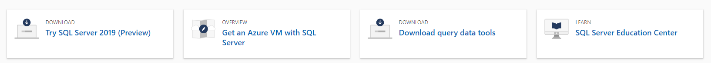
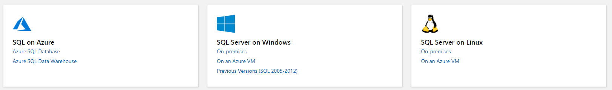
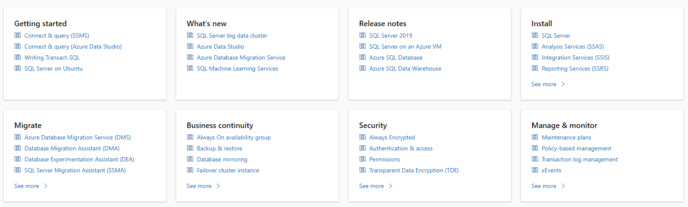
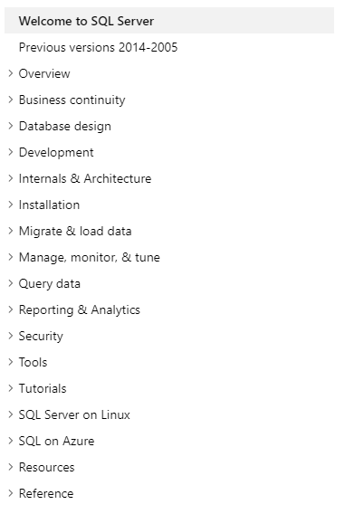
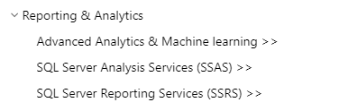
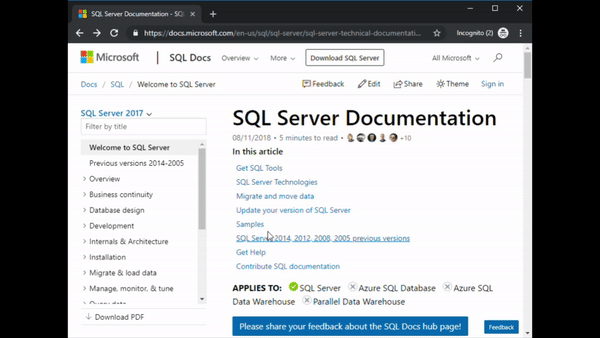
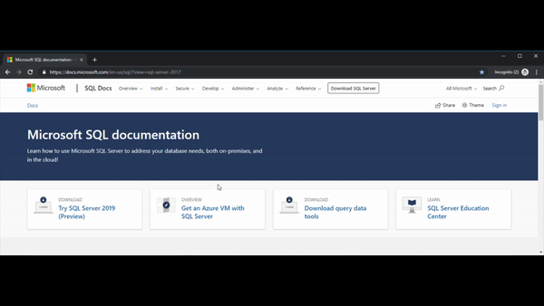

# SQL Server documentation navigation guide 
[!INCLUDE[appliesto-ss-asdb-asdw-pdw-md.md](../includes/appliesto-ss-asdb-asdw-pdw-md.md)]

This topic provides some tips and tricks for navigating the SQL Server technical documentation space.  

## Hubpage

The SQL Server hub page can be found at [https://aka.ms/sqldocs](https://aka.ms/sqldocs) and is the entry point for finding relevant SQL Server content.

The first section provides quick links to download the product, and tools, as well as deploy a SQL Server VM to Azure, and access the education center. The education center is a collection of SQL Server quickstarts, tutorials, and guides about the internals & architecture of SQL Server. 

The second section takes you to general overviews of technical documentation separated by platform. 

The third section takes you directly to content you may find relevant depending on what you're trying to do with the SQL Server database engine. This is also where we highlight content for beginners, and the newest things for SQL Server, as well as release notes for the latest features within each product.  

The fourth and final sections provides additional content, such as Analysis Services, Reporting Services, and Machine Learning Services. This is also where you will find reference content such as Transact-SQL commands, and DMVs. 

You can always navigate back to this page by going to the aforementioned URL ([https://aka.ms/sqldocs](https://aka.ms/sqldocs)), or you can select **SQL Docs** from the header at the top of every page within the SQL Server technical documentation set: 

## Table of contents

The table of contents is the navigation pane found on the left side of each article:

Think of the table of contents (TOC) as being the index in a technical documentation book, where content is categorized into relevant sections. Tthese categories match those on the hub page. The entire SQL Server documentation set can be located from within this table of contents. 

### Navigation hints
Entries in the TOC that have `>>` indicate that you will be taken to technical documentation with a different table of contents. 

If you navigate to one of these pages, you can come back to the main SQL Server technical page, and table of contents, by selecting the "Welcome to SQL Server >>" entry found at the top of each of these table of contents. 

### Filter box
You can search the content in the table of contents by using the filter search box at the top: 

## Header
The header is visible from everywhere within the SQL Server technical documentation space (which is all content found within https://docs.microsoft.com/sql). You can use this to quickly navigate to relevant content within the content set. Most of the links here will keep you within the SQL Server content set, but some (such as content for Azure SQL Database or Azure SQL Server VMs) may take you to the Azure content set, which will have a different header and table of contents. 

The categories found in the header match those on the hub page, and the table of contents:

You can also select **SQL Docs** to navigate back to the SQL Docs hub page. 

## Version filter
The SQL Server technical documentation provides content for several supported versions of SQL Server. Features can vary between versions and flavors of SQL Server, and as such, sometimes the content itself can vary. 

You can use the version filter to ensure that you are seeing content for the appropriate version and flavor of SQL Server: 

Selecting **SQL Server** > **Hide nothing** ensures that nothing is hidden behind the version filter. 

## Breadcrumbs

Breadcrumbs indicate where your article is located in the table of contents. Not only does this help set the context to what type of content you're reading, but it also allows you to navigate back up the table of contents tree. 

## Article section navigation

The right-hand navigation pane allows you to quickly navigate to sections  within an article, as well as identify your location within the article.  

## Submit feedback

If you find something wrong within an article, you can submit feedback to the SQL Content team for that article by scrolling down to the bottom of the page and selecting **Content feedback**. 

You can also submit general documentation feedback and suggestions at [https://aka.ms/sqldocsfeedback](https://aka.ms/sqldocsfeedback). 

## Edit content

As long you have a Github account, you can edit the content yourself on docs.microsoft.com by following these steps:

1. Navigate to the page of interest
1. Select the "Edit" button at the top right of the page
1. Select the "Pencil" icon on the right
1. Modify the text within the text box in markdown format - more info: https://github.com/adam-p/markdown-here/wiki/Markdown-Cheatsheet
1. Name your file change and provide a description, if necessary
1. Select "Propose file change"
1. Select "Create pull request" on the 'Comparing changes' page
1. Select "Create pull request" on the 'Open a pull request' page

You can find detailed information about this at [https://aka.ms/editsqldocs](https://aka.ms/editsqldocs). 

## Next steps

- Get started with the [SQL Server technical documentation](sql-server-technical-documentation.md). 
- For more information about submitting feedback for or getting help with SQL Server, see the [Get help](sql-server-get-help.md) page. 
- To quickly access all the quickstarts and tutorials, go to the [SQL Server Education Center](../lp/sql-server/sql-education-center.md).