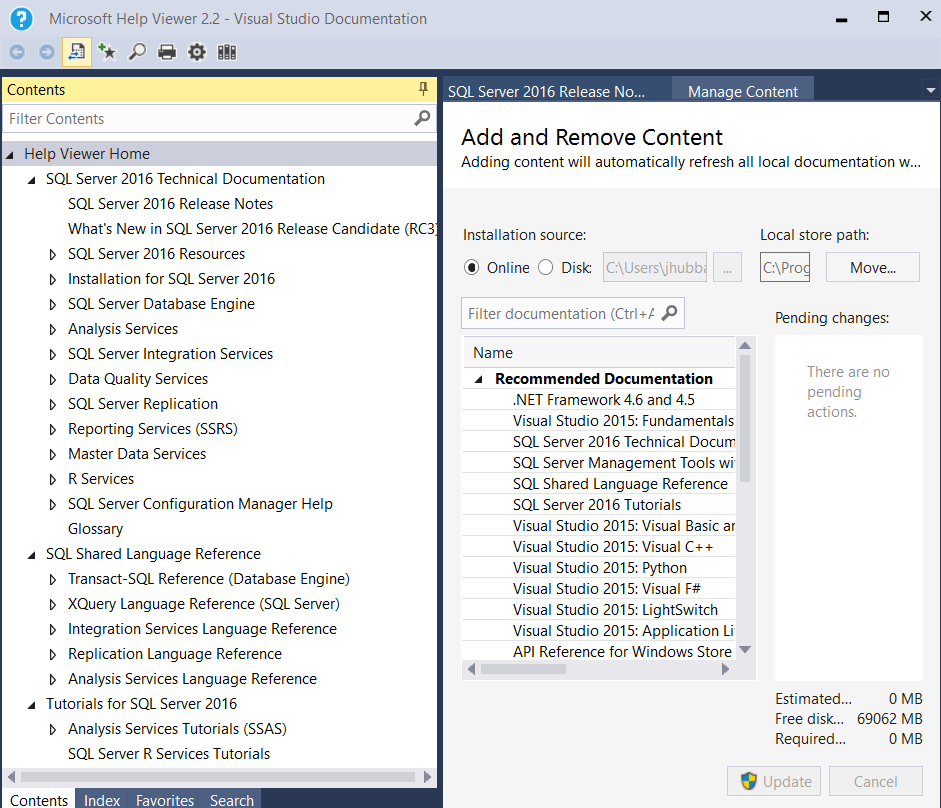

# SQL Server Documentation Offline Access

View SQL Server 2016 technical documentation offline.
  
## Prerequisites
To view SQL Server 2016 technical documentation offline you need HelpViewer 2.2 which installs with: 
- [Visual Studio 2015 (any edition including Community)](https://www.visualstudio.com/products/visual-studio-community-vs.aspx) or
- [SQL Server Management Studio (SSMS) April 2016 Preview (13.0.12500.29) or later](https://msdn.microsoft.com/library/mt238290.aspx)

Install either of these before proceeding to the steps below.
  
## Install SQL Server offline technical documentation 

1. Install any edition of Visual Studio 2015 or SSMS April 2016 Preview build or later. 
2. Launch SSMS or Visual Studio.
3. From the **Help** menu along the top navigation bar, select  **Add and Remove Help Content**. 

#### (This action launches the HelpViewer)

4. In the HelpViewer, choose the default Installation Source: **Online** 
5. Click the **Add** next to all documentation you want to install.
6. Click the **Update** button at the bottom right hand side of the screen to download and install your selected documentation.
 

 >** IMPORTANT!!** Once you click Update, HelpViewer will eventually freeze/hang. It still downloaded and installed your documentation choices. **To resolve this issue**, end HelpViewer in the Task Manager, then restart it by following step 3 from above. The first time HelpViewer freezes/hangs, follow [these steps](https://msdn.microsoft.com/library/mt654096.aspx) too. You only need to do these steps once, but you will probably need to end HelpViewer in the Task Manager whenever you update your content.  
6. Restart the HelpViewer by agan selecting Help/Add and Remove Content. Your offline documention is now ready to use!

   

