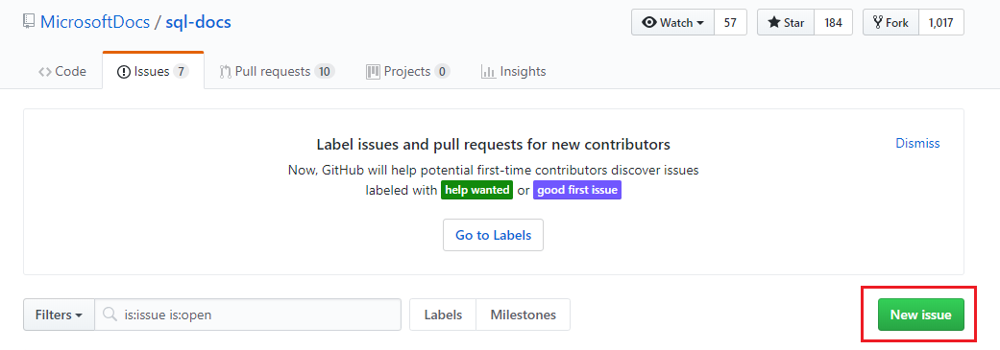

# SQL Server help and feedback

This article explains different ways to get assistance with your issue, or provide feedback for either SQL Server, or the SQL Server technical documentation. 

## Contact Microsoft Support

Customers with a support plan can [open a ticket](https://support.microsoft.com/hub/4343728/support-for-business) with Microsoft support.  Review the [support options for businesses](https://support.microsoft.com/help/4341255/support-for-business) for more information. 

Customers without a support plan can ask the community for help, or submit a bug via UserVoice at [https://aka.ms/sqlfeedback](https://aka.ms/sqlfeedback).

## Ask community for help

If you're interested in engaging the vibrant SQL Server community for assistance, there are multiple options available to you!

### MSDN Forums

There are many MSDN forums that can help you with your SQL Server questions. 
- [SQL Server Database Engine](https://social.msdn.microsoft.com/Forums/en-US/home?forum=sqldatabaseengine&filter=alltypes&sort=lastpostdesc)
- [Setup and upgrade](https://social.msdn.microsoft.com/Forums/en-US/home?forum=sqlsetupandupgrade&filter=alltypes&sort=lastpostdesc)
- [High availability and disaster recovery](https://social.msdn.microsoft.com/Forums/en-US/home?forum=sqldisasterrecovery%2Csqldatabasemirroring&filter=alltypes&sort=lastpostdesc)
- [SQL Server Tools](https://social.msdn.microsoft.com/Forums/en-US/home?forum=sqltools%2Cssdt&filter=alltypes&sort=lastpostdesc) 
- [Security](https://social.msdn.microsoft.com/Forums/en-US/home?forum=sqlsecurity&filter=alltypes&sort=lastpostdesc)
- [Replication](https://social.msdn.microsoft.com/Forums/en-US/home?forum=sqlreplication&filter=alltypes&sort=lastpostdesc)
- [Transact-SQL (T-SQL)](https://social.msdn.microsoft.com/Forums/en-US/home?forum=transactsql)
- [SQL Server Integration Services (SSIS)](https://social.msdn.microsoft.com/Forums/en-US/home?forum=sqlintegrationservices&filter=alltypes&sort=lastpostdesc)
- [SQL Server Reporting Services (SSRS)](https://social.msdn.microsoft.com/Forums/en-US/home?forum=sqlreportingservices&filter=alltypes&sort=lastpostdesc)
- [SQL Server Analysis Services (SSAS)](https://social.msdn.microsoft.com/Forums/en-US/home?forum=sqlanalysisservices&filter=alltypes&sort=lastpostdesc)
- [SQL Server Data Warehouse](https://social.msdn.microsoft.com/Forums/en-US/home?forum=sqldatawarehousing&filter=alltypes&sort=lastpostdesc)

### Communities

There are a few communities that can help you with your SQL Server issues. 

- [Stack Overflow](https://stackoverflow.com/questions/tagged/sql-server)
- [DBA Stack Exchange](https://dba.stackexchange.com/questions/tagged/sql-server)
- [Reddit](https://www.reddit.com/r/SQLServer/)
- [Get help from the community with the #sqlhelp hash tag on twitter](https://twitter.com/hashtag/sqlhelp?src=hash) 
 
## Feedback Suggestions

You can submit suggestions for improvement, as well as submit bugs for:

- **SQL Server feedback**: [https://aka.ms/sqlfeedback](https://aka.ms/sqlfeedback)
- **SQL Server Big Data Clusters feedback**: [SQL Server Big Data Clusters feedback](https://aka.ms/sql-server-bdc-feedback)
- **Azure Data Studio issues**: [Azure Data Studio GitHub](https://github.com/microsoft/azuredatastudio/issues)
 

###  SQL Server documentation

The best way to reach the SQL Server content team is through Git Issues. You'll find an option to submit a Git Issue at the bottom of most of our pages: 

If you have something else to share -- an idea, a suggestion, feedback, anything! -- you can open a general Git Issue by going to [https://aka.ms/SQLDocsFeedback](https://aka.ms/SQLDocsFeedback) and selecting **New Issues**. 

## Social media updates

There are a few social media outlets to get information about the latest SQL Server updates. 

### Updates via Twitter

The following Twitter accounts provide updates about SQL Server: 

- [SQL Docs Twitter](https://twitter.com/sqldocs)
- [SQL Tiger Team Twitter](https://twitter.com/mssqltiger)
- [MashaMSFT Twitter](https://twitter.com/mashamsft)
 
### Blogs

The following SQL Server blogs provide the latest information about SQL Server: 

- [SQL Server Blog](https://cloudblogs.microsoft.com/sqlserver/)
- [SQL Repl Talk](https://blogs.msdn.microsoft.com/repltalk/)
- [SQL Tiger Team](https://blogs.msdn.microsoft.com/sql_server_team/)
- [SQL Support Team](https://techcommunity.microsoft.com/t5/SQL-Server-Support/bg-p/SQLServerSupport/)

## SQL Server license information

If you would like to download and review the license information for SQL Server, it can be found at [Microsoft SQL Server Additional Software License Terms](https://www.microsoft.com/download/details.aspx?id=39299). 

[!INCLUDE[contribute-to-content](../includes/paragraph-content/contribute-to-content.md)]

