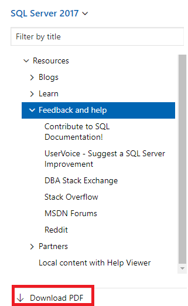

# SQL Server help and feedback
[!INCLUDE[appliesto-ss-asdb-asdw-pdw-md.md](../includes/appliesto-ss-asdb-asdw-pdw-md.md)]

We're interested in your ideas for improving our products and documentation. We can't always respond personally, but we'll make sure that your feedback gets to the right person or team. 

## I want to give feedback on SQL Server
The SQL Server engineering team keeps a close eye on the SQL Server [User Voice](https://feedback.azure.com/forums/908035-sql-server). If you want to report a problem with SQL Server, such as crashes, sluggish performance, unexpected behavior, and so on, the User Voice is the best place to do that. 

The [User Voice](https://feedback.azure.com/forums/908035-sql-server) is also a great place to let the engineering team know what they could do better! If you have any recommendations or feature suggestions, please report it here as well. 

## I want to make a suggestion about SQL Server Management Studio
The SQL Server Management Studio (SSMS) team also closely monitors the SQL Server [User Voice](https://feedback.azure.com/forums/908035-sql-server) so if you have any issues to report, or suggestions to make, the User Voice is the best place to do so. 

## I want to make a suggestion about Azure Data Studio
The Azure Data Studio team closely monitors issues and feature requests on [Azure Data Studio Github](https://github.com/microsoft/azuredatastudio/issues). Please submit an issue or feature request here, and you can see when the issue/feature will be fixed or added.

## I want to access the SQL Server technical documentation offline
If you would like to view the SQL Server documentation on an offline system, you have two options to do so. You can either create a PDF wherever you are in the SQL Server technical documentation, or you can download the offline content using [SQL Server offline Help Viewer](sql-server-help-installation.md). 

If you'd like to create a PDF, click the **Download PDF** link found at the bottom of every table of contents.

## I want to contact Microsoft Support
If you're a business user, please review the [support options](https://support.microsoft.com/gp/support-options-for-business?forceorigin=esmc).

If you're a commercial user, please review the Microsoft [Contact](https://support.microsoft.com/gp/contactus81?forceorigin=esmc&Audience=Commercial) page.

## I want to review license information about SQL Server
If you would like to download and review the license information for SQL Server, it can be found at [Microsoft SQL Server Additional Software License Terms](https://www.microsoft.com/download/details.aspx?id=39299). 

## I want to ask the community for help 
If you're interested in engaging the vibrant SQL Server community for assistance, there are multiple options available to you!

### Blogs
There are a few SQL Server blogs that can bring you the latest information about SQL Server. 

- [SQL Server Blog](https://cloudblogs.microsoft.com/sqlserver/)
- [SQL Repl Talk](https://blogs.msdn.microsoft.com/repltalk/)
- [SQL Tiger Team](https://blogs.msdn.microsoft.com/sql_server_team/)

### MSDN Forums
There are many MSDN forums that can help you with your SQL Server questions. 
- [SQL Server Database Engine](https://social.msdn.microsoft.com/Forums/en-US/home?forum=sqldatabaseengine&filter=alltypes&sort=lastpostdesc)
- [Setup and upgrade](https://social.msdn.microsoft.com/Forums/en-US/home?forum=sqlsetupandupgrade&filter=alltypes&sort=lastpostdesc)
- [High availability and disaster recovery](https://social.msdn.microsoft.com/Forums/en-US/home?forum=sqldisasterrecovery%2Csqldatabasemirroring&filter=alltypes&sort=lastpostdesc)
- [SQL Server Tools](https://social.msdn.microsoft.com/Forums/en-US/home?forum=sqltools%2Cssdt&filter=alltypes&sort=lastpostdesc) 
- [Security](https://social.msdn.microsoft.com/Forums/en-US/home?forum=sqlsecurity&filter=alltypes&sort=lastpostdesc)
- [Replication](https://social.msdn.microsoft.com/Forums/en-US/home?forum=sqlreplication&filter=alltypes&sort=lastpostdesc)
- [Transact-SQL (T-SQL)](https://social.msdn.microsoft.com/Forums/en-US/home?forum=transactsql)
- [SQL Server Integration Services (SSIS)](https://social.msdn.microsoft.com/Forums/en-US/home?forum=sqlintegrationservices&filter=alltypes&sort=lastpostdesc)
- [SQL Server Reporting Services (SSRS)](https://social.msdn.microsoft.com/Forums/en-US/home?forum=sqlreportingservices&filter=alltypes&sort=lastpostdesc)
- [SQL Server Analysis Services (SSAS)](https://social.msdn.microsoft.com/Forums/en-US/home?forum=sqlanalysisservices&filter=alltypes&sort=lastpostdesc)
- [SQL Server Data Warehouse](https://social.msdn.microsoft.com/Forums/en-US/home?forum=sqldatawarehousing&filter=alltypes&sort=lastpostdesc)

### Social media and communities
There are a few communities that can help you with your SQL Server issues. 

- [Stack Overflow](https://stackoverflow.com/questions/tagged/sql-server)
- [DBA Stack Exchange](https://dba.stackexchange.com/questions/tagged/sql-server)
- [Reddit](https://www.reddit.com/r/SQLServer/)
- [Get help from the community with the the #sqlhelp hash tag on twitter](https://twitter.com/hashtag/sqlhelp?src=hash) 

### Updates via Twitter
There are a few Twitter accounts that provide updates about SQL Server. 

- [SQL Docs Twitter](https://twitter.com/sqldocs)
- [SQL Tiger Team Twitter](https://twitter.com/mssqltiger)
- [MashaMSFT Twitter](https://twitter.com/mashamsft)

## I want to contribute to SQL Server documentation

###  Editing content
Did you find something wrong with our documentation? Or do you have a contribution that can improve our documentation? Well, you can edit the content found on docs.microsoft.com yourself. If you do so, not only will our documentation improve, but you'll also be credited as a contributor to the page! Find out more information at [https://aka.ms/editsqldocs](https://aka.ms/editsqldocs). 

All public contributions are reviewed by the SQL content team for technical accuracy and consistency. 

## I want to provide feedback for SQL Docs content
If you've got some time to spare, and would like to share some thoughts on your SQL Docs experience, please take our survey! It can be found at [https://aka.ms/SQLDocSurvey](https://aka.ms/SQLDocSurvey) and should take you about 10-15 minutes. 

If you have something to share with the SQL content team, an idea, a suggestion, feedback, anything! You can do so at [https://aka.ms/SQLDocsFeedback](https://aka.ms/SQLDocsFeedback). 
