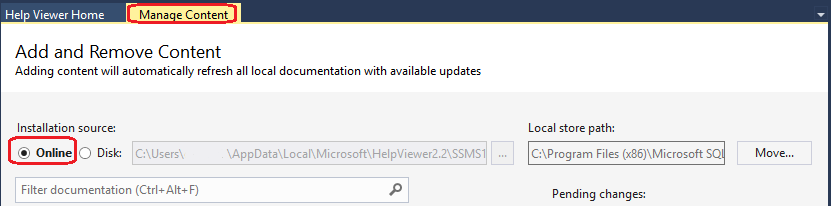

# Help Viewer and Offline Content for SQL Server
  
  
  
This article shows you how to install the Help Viewer and view SQL Server documentation offline. The article covers documentation for [!INCLUDE[ssSQL14_md](../includes/sssql14-md.md)], SQL Server 2016 and SQL Server 2017. 

## Install Help Viewer
The following table lists the tools that install Help Viewer, based on the SQL Server version you’re using. Install one of the tools listed to install Help Viewer.

|**SQL Server Version**|**Tools that Install Help Viewer**|**Version of Help Viewer Installed**|
|---------|---------|---------|
|SQL Server 2017 SQL Server 2016     |   [Latest version of SQL Server Management Studio](https://docs.microsoft.com/sql/ssms/download-sql-server-management-studio-ssms)  [Latest version of SQL Server Data Tools for Visual Studio 2015](https://docs.microsoft.com/sql/ssdt/download-sql-server-data-tools-ssdt)  Visual Studio 2017 (*supports only SQL Server 2016*)  |  v2.x       |
|SQL Server 2014    | SQL Server 2014 Management Studio  Versions of Visual Studio prior to Visual Studio 2012        |  v1.x       |

> [!IMPORTANT]
> SQL Server 2016 installs Help Viewer 1.1 that cannot be used to view documentation for SQL Server 2016 and 2017.
>  
>  
> SQL Server 2017 does not install Help Viewer.
>  
>  
> To install the Help Viewer with Visual Studio 2017, click the **Individual Components** tab in the 
> **Visual Studio Installer** program, click **Help Viewer** in the **Code Tools** category, and then 
> click **Install**. 
>  
>  
> You can view local Help for [!INCLUDE[ssSQL14_md](../includes/sssql14-md.md)] using Help Viewer 2.x only when you 
> **Install content from disk**. 

## SQL Server 2016, SQL Server 2017 Offline Content  
 
**To install offline content**  
1. Open Help Viewer by launching SQL Server Management Studio or Visual Studio, and clicking **Add and Remove Help Content** on the **Help** menu.  
2. Click the **Manage Content** tab.  
3. To install the Help from an online source, click **Online** in the **Installation source** area.  
  
7. Click **Add** next to the documentation you want to install, and then click **Update**.  
     
  
   >[!IMPORTANT] 
   >In SQL Server Management Studio and Visual Studio, the Help Viewer application may freeze (hang) during the process of adding the documentation. To resolve this issue, do the following. For more information about this issue, see [Visual Studio Help Viewer freezes](https://msdn.microsoft.com/library/mt654096.aspx).  
   >>Open the %LOCALAPPDATA%\Microsoft\HelpViewer2.2\HlpViewer_SSMS16_en-US.settings | HlpViewer_VisualStudio14_en-US.settings file in Notepad and change the date in the following code to some date in the future. This file is available on your local machine only when you have installed Visual Studio. 
   >>>Cache LastRefreshed="12/31/2017 00:00:00"  
  
    The table of contents in the left pane automatically updates to include the documentation you've added.  

1. (Optional) The **Local store path** box on the **Manage Content** tab shows where the documentation is installed on the local computer. To move the documentation to a different location, click **Move**, enter a folder path in the **To** field of the **Move Content** dialog box, and then click **Ok**.

   

   After the content is moved, the new location is displayed in the **Local store path**.
      
   >[!IMPORTANT]
   > If a message appears indicating that the move operation has failed, close the message box, close the Help Viewer and then re-open the Help Viewer. The new location for the content should now appear in the **Local store path**.   
 
## [!INCLUDE[ssSQL14_md](../includes/sssql14-md.md)] Offline Content 
 
  
**To install offline content**  
1. Navigate to the [download site](https://www.microsoft.com/en-us/download/details.aspx?id=42557) for the Help content and click **Download**.  
2. Click **Save** in the message box to save the SQLServer2014Documentation_*.exe file to your computer.  

 For firewall and proxy restricted environments, save the download to a USB drive or other portable media that can be carried into the environment.   

3. Double-click the .exe to unpack the Help content file and save the file to a local or shared folder.  
4. Open the **Help Library Manager** by launching SQL Server Management Studio or Visual Studio and clicking **Manage Help Settings** on the **Help** menu.  
5. Click **Install content from disk**, and browse to the folder where you unpacked the Help content file.  
  
     Select Install content from disk  |Browse to Help content file   
     ---------|---------  
         |           
  
     >[!IMPORTANT]
     > To avoid installing local Help content that has only a partial table of contents, use the **Install content from disk** option in the **Help Library Manager**.  
     >>If you've used the **Install content from online** option and the Help Viewer is displaying a partial table of contents, see this [blog post](https://blogs.msdn.microsoft.com/womeninanalytics/2016/06/21/troubleshoot-local-help-for-sql-server-2014/) for troubleshooting steps. 

8. Click the HelpContentSetup.msha file, click **Open**, and then click **Next**.  
9. Click **Add** next to the documentation you want to install, and then click **Update**.  
  
     
10. Click **Finish**, click **Exit**.
11. Open **Help Library Manager** again, click **Choose online or local help**, and then click **I want to use local help**.
12. Open the Help Viewer to see the content by clicking **View Help** on the **Help** menu. You should see the content you've installed listed in the table of contents, in the left pane.  
  
      
  
## View Online Content in Help Viewer

In Help Viewer v2.x, you can view online content by doing one of the following.

- In SQL Server Management Studio, click **View Help** on the **Help** menu. Documentation displays in a browser.

- In Visual Studio, click **Set Help Preference** on the **Help** menu, and click **Launch in Browser**. When you click **View Help** on the **Help** menu, documentation displays in a browser.

   

In Help Viewer v1.x, you can view online content by doing the following.
1. Open the **Help Library Manager** by clicking **Manage Help Settings** on the **Help** menu.  
2. In the **Help Library Manager** dialog box, click **Choose online or local help**.  
  
     
3. Click **I want to use online help**, click **OK**, and click **Exit**.  

   

## F1 Help and other Tips

When you press F1, the corresponding topic appears online. The topic can not be displayed in local Help.

Also, the Help Viewer does not support proxy settings, and does not support the ISO format. 

## Additional information
[Microsoft Help Viewer - Visual Studio 2015](https://msdn.microsoft.com/library/hh580782.aspx)

[!INCLUDE[get-help-options](../includes/paragraph-content/get-help-options.md)]