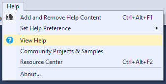
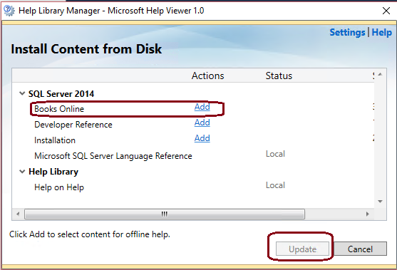
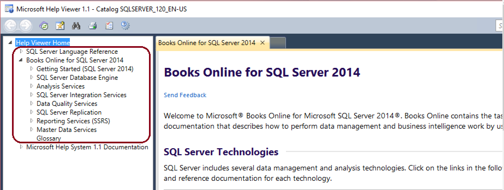
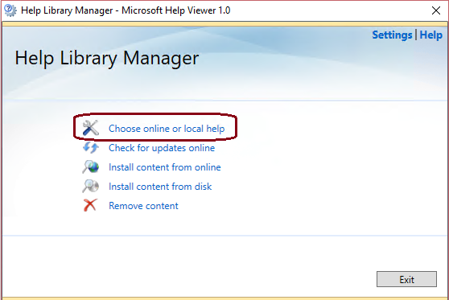

# SQL Server offline help and Help Viewer

[!INCLUDE[appliesto-ss-xxxx-xxxx-xxx-md](../includes/appliesto-ss-xxxx-xxxx-xxx-md.md)]

You can use the Microsoft Help Viewer in to download and install SQL Server help packages from online sources or disk and view them offline. The Help Viewer is installed with either SQL Server Management Studio (SSMS) or Visual Studio (VS).This article describes tools that install the Help Viewer, how to install offline help content, and how to view help for [!INCLUDE[ssSQL14_md](../includes/sssql14-md.md)], SQL Server 2016, and SQL Server 2017.

Internet access is required to download the Help Viewer content. You can then migrate the content to a computer that does not have internet access.

> [!NOTE]
> SQL Server 2016 and SQL Server 2017 help are combined, although some topics apply to individual versions where noted. Most topics apply to both.

## Install the Help Viewer

There are two versions of Help Viewer.  Each version supports different versions of SQL Server content.  The format of the offline books has changed over time and the older versions of Help Viewer do not support the newer versions of the books.:
- v2.x supports SQL Server 2016 and SQL Server 2017 help. 
- v1.x supports [!INCLUDE[ssSQL14_md](../includes/sssql14-md.md)] help. The Help Viewer does not support proxy settings or the ISO format.

The following tools install the Help Viewer:
|**Tool**|**Help Viewer version installed**|
|---------|---------|
|Visual Studio 2017* | v2.3|
|[SQL Server Management Studio 18.x](https://docs.microsoft.com/sql/ssms/download-sql-server-management-studio-ssms)  [SQL Server Management Studio 17.x](https://docs.microsoft.com/sql/ssms/download-sql-server-management-studio-ssms)  [SQL Server Data Tools for Visual Studio 2015](https://docs.microsoft.com/sql/ssdt/download-sql-server-data-tools-ssdt)  Visual Studio 2015 | v2.2|
|SQL Server 2016  SQL Server 2014 Management Studio  Earlier versions of Visual Studio| v1.x|
| | |

\* To install the Help Viewer with Visual Studio 2017, on the Individual Components tab in the Visual Studio Installer, select **Help Viewer** under Code Tools, and then click **Install**. 

>[!NOTE]
> - SQL Server 2016 installs Help Viewer 1.1, which does not support SQL Server 2016 help. 
> - Installing SQL Server 2017 does not install Help Viewer. Help Viewer is no longer included in the SQL Server installation.
> - Help Viewer v2.x can also support [!INCLUDE[ssSQL14_md](../includes/sssql14-md.md)] help, if you install the content from disk.

## Use Help Viewer v2.x

SSMS 17.x and VS 2015 and 2017 use Help Viewer 2.x, which supports SQL Server 2016 and SQL Server 2017 Help. 

**To download and install offline help content with Help Viewer v2.x**

1. In SSMS or VS, click **Add and Remove Help Content** on the Help menu. 

     

   The Help Viewer opens to the Manage Content tab.  
   
2. To install the latest help content package, choose **Online** under Installation source.
   
     
   
   >[!NOTE]
   > To install from disk (SQL Server 2014 help), choose **Disk** under Installation source, and specify the disk location.
   
   The Local store path on the Manage Content tab shows where on the local computer the content will be installed. To change the location, click **Move**, enter a different folder path in the **To** field, and then click **OK**.
   If the help installation fails after changing the Local store path, close and reopen the Help Viewer, ensure the new location appears in the Local store path, and then try the installation again.

3. Click **Add** next to each content package (book) that you want to install. 
   To install all SQL Server help content, add all 13 books under SQL Server. 
   
4. Click **Update** at lower right. 
   The help table of contents on the left automatically updates with the added books. 
   
        
   
> [!NOTE]
> Not all the top-node titles in the SQL Server table of contents exactly match the names of the corresponding downloadable help books. The TOC titles map to the book names as follows:

* indicates content that is from the first general availability version of SQL Server 2017 content along with older 2016 content. These books will be removed as the separate and complete books for SQL Server 2016 and 2017 contain content edits as of January 2019.  

| | Contents pane | SQL Server book |
|-----|-----|-----|
|*|Analysis services language reference | Analysis Services (MDX) language reference|
|*|Data Analysis Expressions (DAX) reference | Data Analysis Expressions (DAX) reference|
|*|Data mining extensions (DMX) reference | Data mining extensions (DMX) reference|
|*|Getting started with Machine learning in SQL Server | Microsoft Machine learning Services|
|*|Power Query M Reference | Power Query M Reference|
||SQL Server 2016 Documentation | SQL Server 2016 Documentation|
||SQL Server 2017 Documentation| SQL Server 2017 Documentation|
|*|Developer Guides for SQL Server | SQL Server Developer Reference|
|*|Download SQL Server Management Studio | SQL Server Management Studio|
|*|Homepage for client programming for Microsoft SQL Server | SQL Server Connection Drivers|
|*|SQL Server on Linux | SQL Server on Linux|
|*|SQL Server Technical Documentation | SQL Server Technical Documentation (SSIS, SSRS, DB engine, setup)|
|*|Tools and utilities for Azure SQL Database | SQL Server tools|
|*|Transact-SQL Reference (Database Engine) | Transact-SQL Reference|
|*|XQuery Language Reference (SQL Server) | XQuery Language Reference (SQL Server)|

> [!NOTE]
> If the Help Viewer freezes (hangs) while adding content, change the Cache LastRefreshed="\<mm/dd/yyyy> 00:00:00" line in the %LOCALAPPDATA%\Microsoft\HelpViewer2.x\HlpViewer_SSMSx_en-US.settings or HlpViewer_VisualStudiox_en-US.settings file to some date in the future. For more information about this issue, see [Visual Studio Help Viewer freezes](/visualstudio/welcome-to-visual-studio).

**To view offline help content in SSMS with Help Viewer v2.x**

To view the installed help in SSMS, press CTRL + ALT + F1, or choose **Add or Remove Content** from the Help menu, to launch the Help Viewer. 

     

The Help Viewer opens to the Manage Content tab, with the installed help table of contents in the left pane. Click topics in the table of contents to display them in the right pane. 
> [!TIP]
> If the contents pane is not visible, click Contents on the left margin. Click the pushpin icon to keep the contents pane open.  

   

**To view offline help content in VS with Help Viewer v2.x**

To view the installed help in Visual Studio:
1. Point to **Set Help Preference** on the Help menu and choose **Launch in Help Viewer**. 

   

2. Click **View Help** in the Help menu to display the content in the Help Viewer. 

   

   The help table of contents shows on the left, and the selected help topic on the right. 

  
## Use Help Viewer v1.x

Earlier versions of SSMS and VS use Help Viewer 1.x, which supports SQL Server 2014 Help. 

**To download and install offline help content with Help Viewer v1.x**

This process uses Help Viewer 1.x to download SQL Server 2014 help from the Microsoft Download Center and install it on your computer.

1. Navigate to the [Product Documentation for Microsoft SQL Server 2014](https://www.microsoft.com/download/details.aspx?id=42557) download site and click **Download**.  
2. Click **Save** in the message box to save the *SQLServer2014Documentation\_\*.exe* file to your computer.  
   
   >[!NOTE]
   >For firewall and proxy restricted environments, save the download to a USB drive or other portable media that can be carried into the environment.   
   
3. Double-click the .exe to unpack the help content file, and save the file to a local or shared folder.  
4. Open the **Help Library Manager** by launching SSMS or VS and clicking **Manage Help Settings** on the Help menu.  
5. Click **Install content from disk**, and browse to the folder where you unpacked the help content file.  
   
   
   
   
   
   > [!IMPORTANT]
   > To avoid installing local help content that has only a partial table of contents, you must use the **Install content from disk** option in the **Help Library Manager**.  If you used **Install content from online** and the Help Viewer is displaying a partial table of contents, see this [blog post](https://blogs.msdn.microsoft.com/womeninanalytics/2016/06/21/troubleshoot-local-help-for-sql-server-2014/) for troubleshooting steps. 
   
8. Click the HelpContentSetup.msha file, click **Open**, and then click **Next**.  
9. Click **Add** next to the documentation you want to install, and then click **Update**.  
   
     
   
10. Click **Finish**, and then click **Exit**.

**To view offline help content with Help Viewer v1.x**

11. To view installed help, open **Help Library Manager**, click **Choose online or local help**, and then click **I want to use local help**.
12. Open the Help Viewer to see the content by clicking **View Help** on the **Help** menu. The content you installed is listed in the left pane.  
   
     
   

## View online help

Online help always shows the most up-to-date content. 

**To view SQL Server online help in SSMS 17.x**

- Click **View Help** in the **Help** menu. The latest SQL Server 2016/2017 documentation from [https://docs.microsoft.com/sql/https://docs.microsoft.com/sql/sql-server/sql-server-technical-documentation](https://docs.microsoft.com/sql/sql-server/sql-server-technical-documentation) displays in a browser. 

   

**To view Visual Studio online help in Visual Studio**

1. Point to **Set Help Preference** on the Help menu and choose either **Launch in Browser** or **Launch in Help Viewer**. 
2. Click **View Help** in the Help menu. The latest Visual Studio help displays in the chosen environment. 

**To view online help with Help Viewer v1.x**

1. Open the **Help Library Manager** by clicking **Manage Help Settings** on the Help menu.  
2. In the Help Library Manager dialog box, click **Choose online or local help**.  
   
     
   
3. Click **I want to use online help**, click **OK**, and then click **Exit**.  
   
   

4. Open the Help Viewer to see the content by clicking **View Help** on the **Help** menu. 

## View F1 help

When you press F1 or click **Help** or the **?** icon in a dialog box in SSMS or VS, a context-sensitive online help topic appears in the browser or Help Viewer. 

**To view F1 help**

1. Point to **Set Help Preference** on the Help menu, and choose either **Launch in Browser** or **Launch in Help Viewer**.
2. Press F1, or click **Help**, or click **?** in dialog boxes where they are available, to see context-sensitive online topics in the chosen environment.

> [!NOTE]
> F1 help only works when you are online. There are no offline sources for F1 help.

## Systems without internet access
After you download offline books on a system that has internet access, you can use the following steps to migrate the content to a system that does not have internet access.

  >[!NOTE]
  >Software that supports the Help Viewer, such as SQL Server Management Studio, must be installed on the offline system.

1. Open Help Viewer (Ctrl + Alt + F1).
1. Select the documentation you're interested in. For example, filter by SQL and select the SQL Server Technical Documentation.
1. Identify the physical path of the files on disk, which can be found under **Local store path**.
1. Navigate to this location using your file system explorer.
    1.  The default location is: `C:\Program Files (x86)\Microsoft SQL Server\140\Tools\Binn\ManagementStudio\Extensions\Application`
1. Select the three folders, **ContentStore**, **Incoming**, **IndexStore** and copy them to the same location on your offline system. You may need to use an interim media device such as a USB or CD.
1. Once these files have been moved, launch Help Viewer on the offline system and the SQL Server technical documentation will be available.

## Next steps
[Microsoft Help Viewer - Visual Studio](/visualstudio/ide/microsoft-help-viewer)  

[!INCLUDE[get-help-options](../includes/paragraph-content/get-help-options.md)]