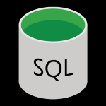
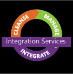
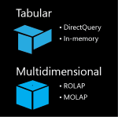
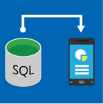
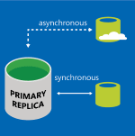
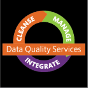
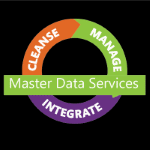

# SQL Server Documentation
[!INCLUDE[appliesto-ss-xxxx-xxxx-xxx-md](../includes/appliesto-ss-xxxx-xxxx-xxx-md.md)]

> [!div class="nextstepaction"]
> [Please share your feedback about the SQL Docs Table of Contents!](https://aka.ms/sqldocsurvey)

::: moniker range=">= sql-server-linux-2017 || >= sql-server-2017  || = sqlallproducts-allversions"
SQL Server is a central part of the Microsoft data platform. SQL Server is an industry leader in operational database management systems (ODBMS). This documentation helps you install, configure, and use SQL Server on both Windows and Linux. The content includes end-to-end examples, code samples, and videos. For SQL Server language topics, see [Language Reference](../t-sql/language-reference.md).
::: moniker-end

::: moniker range="= sql-server-2016"
SQL Server is a central part of the Microsoft data platform. SQL Server is an industry leader in operational database management systems (ODBMS). This documentation helps you install, configure, and use SQL Server on Windows. The content includes end-to-end examples, code samples, and videos. For SQL Server language topics, see [Language Reference](../t-sql/language-reference.md).
::: moniker-end

<!-- Moniker assignments nicely designed so that exactly 1 of these next 3 little WhatsNew tables will be displayed
 at any one time, regardless of user's moniker choice.
-->

::: moniker range="= sqlallproducts-allversions"

|What's new  | Release notes  |
|---------|---------|
|[What's New in SQL Server 2019](../sql-server/what-s-new-in-sql-server-ver15.md)     | [SQL Server 2019 Release Notes](../sql-server/sql-server-ver15-release-notes.md)        |
|[What's New in SQL Server 2017](../sql-server/what-s-new-in-sql-server-2017.md)     | [SQL Server 2017 Release Notes](../sql-server/sql-server-2017-release-notes.md)        |
|[What's New in SQL Server 2016](../sql-server/what-s-new-in-sql-server-2016.md)     | [SQL Server 2016 Release Notes](../sql-server/sql-server-2016-release-notes.md)        |

 The SQL Server **2014** documentation is available [here](https://docs.microsoft.com/sql/2014-toc/index?view=sql-server-2014).
::: moniker-end

::: moniker range="= sql-server-ver15"

|What's new  | Release notes  |
|---------|---------|
|[What's New in SQL Server 2019](../sql-server/what-s-new-in-sql-server-ver15.md)     | [SQL Server 2019 Release Notes](../sql-server/sql-server-ver15-release-notes.md)        |

::: moniker-end

::: moniker range="= sql-server-linux-2017 || = sql-server-2017"

|What's new  | Release notes  |
|---------|---------|
|[What's New in SQL Server 2017](../sql-server/what-s-new-in-sql-server-2017.md)     | [SQL Server 2017 Release Notes](../sql-server/sql-server-2017-release-notes.md)        |

> [!NOTE]
> SQL Server 2019 preview is now available. For more information, see [What's New in SQL Server 2019](../sql-server/what-s-new-in-sql-server-ver15.md?view=sql-server-ver15).
::: moniker-end

::: moniker range="=sql-server-2016"

|What's new  | Release notes  |
|---------|---------|
|[What's New in SQL Server 2016](../sql-server/what-s-new-in-sql-server-2016.md)     | [SQL Server 2016 Release Notes](../sql-server/sql-server-2016-release-notes.md)        |

::: moniker-end

::: moniker range="= sql-server-2016 || = sqlallproducts-allversions"
**Try SQL Server 2016!**
-  [Download SQL Server for Windows](https://go.microsoft.com/fwlink/?LinkID=829477)
-  [Download SQL Server Management Studio (SSMS)](../ssms/download-sql-server-management-studio-ssms.md)
-  [Download SQL Server Data Tools (SSDT)](../ssdt/download-sql-server-data-tools-ssdt.md)
-  [Get a Virtual Machine with SQL Server](https://azure.microsoft.com/services/virtual-machines/sql-server/?wt.mc_id=sqL16_vm)
::: moniker-end

::: moniker range=">= sql-server-2017 || >= sql-server-linux-2017 || = sqlallproducts-allversions"
**Try SQL Server!**
-  [Download SQL Server for Windows](https://go.microsoft.com/fwlink/?LinkID=829477)
-  [Install SQL Server on Linux](../linux/sql-server-linux-setup.md)
-  [Download SQL Server Management Studio (SSMS)](../ssms/download-sql-server-management-studio-ssms.md)
-  [Download SQL Server Data Tools (SSDT)](../ssdt/download-sql-server-data-tools-ssdt.md)
-  [Get a Virtual Machine with SQL Server](https://azure.microsoft.com/services/virtual-machines/sql-server/?wt.mc_id=sqL16_vm)
::: moniker-end

## SQL Server Technologies

|||
|-|-|
||**[Database Engine](../database-engine/sql-server-database-engine-overview.md)**   The Database Engine is the core service for storing, processing, and securing data. The Database Engine provides controlled access and rapid transaction processing to meet the requirements of the most demanding data consuming applications within your enterprise. The Database Engine also provides rich support for sustaining high availability.|
||**[Machine Learning Services](../advanced-analytics/r-services/r-services.md)**   Microsoft Machine Learning Services supports integration of machine learning, using the popular R and Python languages, into enterprise workflows.   Machine Learning Services (In-Database) integrates R and Python with SQL Server, making it easy to build, retrain, and score models by calling stored procedures.  Microsoft Machine Learning Server provides enterprise-scale support for R and Python, without requiring SQL Server.|
||**[Integration Services](../integration-services/sql-server-integration-services.md)**   [!INCLUDE[ssISnoversion](../includes/ssisnoversion-md.md)] is a platform for building high performance data integration solutions, including packages that provide extract, transform, and load (ETL) processing for data warehousing.|
||**[Analysis Services](../analysis-services/analysis-services.md)**   [!INCLUDE[ssASnoversion_md](../includes/ssasnoversion-md.md)] is an analytical data platform and toolset for personal, team, and corporate business intelligence. Servers and client designers support traditional OLAP solutions, new tabular modeling solutions, as well as self-service analytics and collaboration using [!INCLUDE[ssGemini](../includes/ssgemini-md.md)], Excel, and a SharePoint Server environment. [!INCLUDE[ssASnoversion](../includes/ssasnoversion-md.md)] also includes Data Mining so that you can uncover the patterns and relationships hidden inside large volumes of data.|    
||**[Reporting Services](../reporting-services/create-deploy-and-manage-mobile-and-paginated-reports.md)**   Reporting Services delivers enterprise, Web-enabled reporting functionality.  You can create reports that draw content from a variety of data sources, publish reports in various formats, and centrally manage security and subscriptions.|
||**[Replication](../relational-databases/replication/sql-server-replication.md)**   Replication is a set of technologies for copying and distributing data and database objects from one database to another, and then synchronizing between databases to maintain consistency. By using replication, you can distribute data to different locations and to remote or mobile users by means of local and wide area networks, dial-up connections, wireless connections, and the Internet.|
||**[Data Quality Services](../data-quality-services/data-quality-services.md)**   SQL Server Data Quality Services (DQS) provides you with a knowledge-driven data cleansing solution. DQS enables you to build a knowledge base, and then use that knowledge base to perform data correction and deduplication on your data, using both computer-assisted and interactive means. You can use cloud-based reference data services, and you can build a data management solution that integrates DQS with SQL Server Integration Services and Master Data Services.|
||**[Master Data Services](../master-data-services/master-data-services-installation-and-configuration.md)**   [!INCLUDE[ssMDSshort](../includes/ssmdsshort-md.md)] is the [!INCLUDE[ssNoVersion](../includes/ssnoversion-md.md)] solution for master data management. A solution built on [!INCLUDE[ssMDSshort](../includes/ssmdsshort-md.md)] helps ensure that reporting and analysis is based on the right information. Using [!INCLUDE[ssMDSshort](../includes/ssmdsshort-md.md)], you create a central repository for your master data and maintain an auditable, securable record of that data as it changes over time.|
| &nbsp; | &nbsp; |

::: moniker range="= sql-server-2016 || = sqlallproducts-allversions"
## Migrate and move data, in version 2016

- [Import and Export Data with the SQL Server Import and Export Wizard](../integration-services/import-export-data/import-and-export-data-with-the-sql-server-import-and-export-wizard.md)
- [Migrate your SQL Server database to Azure SQL Database](https://docs.microsoft.com/azure/sql-database/sql-database-migrate-your-sql-server-database)
- [Microsoft Data Migration Assistant](https://www.microsoft.com/download/details.aspx?id=53595)
- [Azure migration journey - asses, migrate, optimize](https://azure.microsoft.com/migration/)]
::: moniker-end

::: moniker range=">= sql-server-2017 || >= sql-server-linux-2017 || = sqlallproducts-allversions"
## Migrate and move data

- [Import and Export Data with the SQL Server Import and Export Wizard](../integration-services/import-export-data/import-and-export-data-with-the-sql-server-import-and-export-wizard.md)
- [Migrate data to SQL Server on Linux](../linux/sql-server-linux-migrate-overview.md)
- [Migrate your SQL Server database to Azure SQL Database](https://docs.microsoft.com/azure/sql-database/sql-database-migrate-your-sql-server-database)
- [Microsoft Data Migration Assistant](https://www.microsoft.com/download/details.aspx?id=53595)
- [Import data from Excel to SQL Server or SQL Database](https://docs.microsoft.com/sql/relational-databases/import-export/import-data-from-excel-to-sql?view=sql-server-2017)
::: moniker-end

## Update your version of SQL Server

- [SQL Server Update Center](https://msdn.microsoft.com/library/ff803383.aspx) links and information for all supported versions

## Samples

- [Wide World Importers sample database](https://docs.microsoft.com/sql/samples/wide-world-importers-what-is)
- [AdventureWorks sample databases and scripts for SQL Server 2016](https://docs.microsoft.com/sql/samples/sql-samples-where-are) 
- [SQL Server samples on GitHub](https://github.com/Microsoft/sql-server-samples)

[!INCLUDE[get-help-options](../includes/paragraph-content/get-help-options.md)]

[!INCLUDE[contribute-to-content](../includes/paragraph-content/contribute-to-content.md)]
