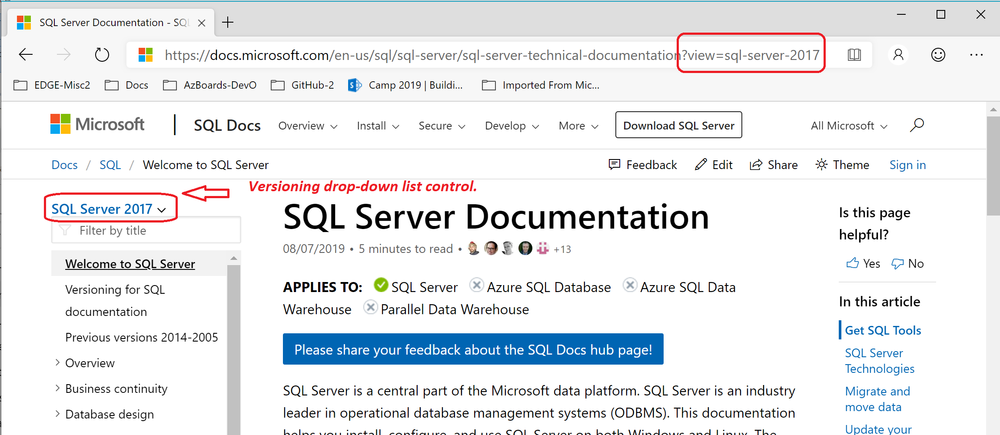
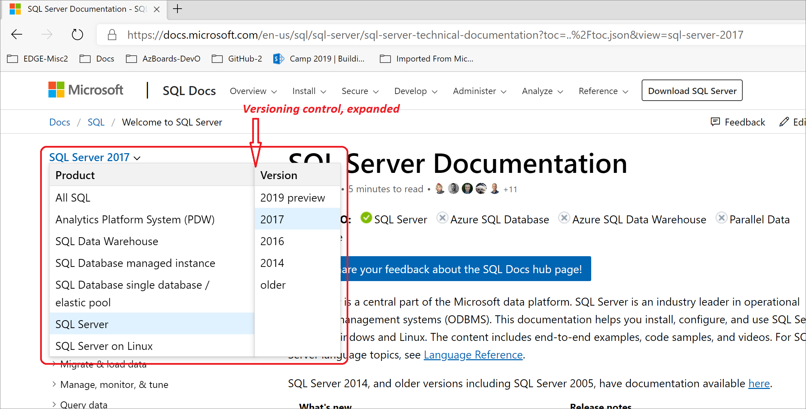
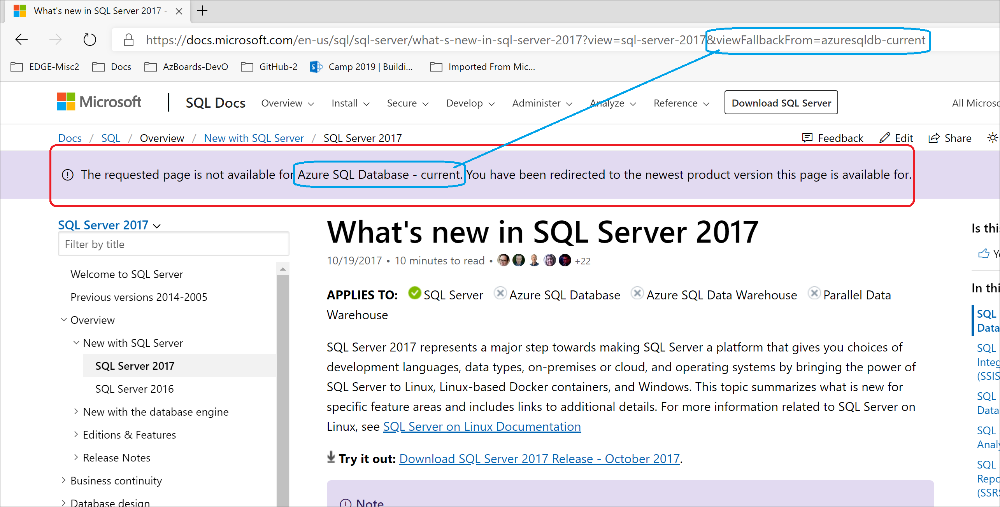

# Versioning system for SQL documentation

[!INCLUDE[sql-asdb-asa-pdw](../includes/applies-to-version/sql-asdb-asa-pdw.md)]

This article explains our _versioning system_ for SQL documentation. The versioning system knows about products and their versions. The system enables you to choose the product and version you are interested in. The system then displays the appropriate documentation.

## _Applies to_ products

Most of the SQL Server articles have the words **Applies to** under their title. On the same line, there follows a handy listing of SQL _products_ with indicators of whether the article is relevant to the product. For example, the product SQL Server could be indicated as relevant, while Azure SQL Database could be indicated as irrelevant to the article.

The **Applies to** line does not know about _versions_ of products. We strive to avoid discrepancies between the **Applies to** line and the products aspect of our versioning system configurations.

## History of separate file sets

For SQL Server 2014 and earlier versions, each version has its own full separate copy of the documentation files. For instance, the documentation for SQL Server 2014 began as a copy of the documentation for SQL Server 2012. The 2014 copy was then edited during the product development cycle.

This old approach meant that if a flaw was discovered in the 2014 documentation, the flaw might also exist in 2012 and 2008. This made fixing flaws and general maintenance more difficult.

## Multiple versions in the same files

For this reason and others, the documentation files for SQL Server 2016 are also for 2017, 2019, and probably for \<vNext\>. This consolidation is made practical because we now assign _versioning monikers_ to our SQL Server documentation files. The versioning monikers are assigned, or are explicitly embedded, at whatever degree of granularity makes sense for each given documentation file.

## Versioning control in the UI

When you view any SQL documentation article by using our :::no-loc text="Docs"::: website, the currently chosen versioning moniker is visible above the table of contents (TOC). The control is a drop-down list.

If you want to see the documentation for a different version of SQL Server, you click the expander arrow located at the end of the current version moniker. Then click to choose any product and version combination you want. When you click a different version, the displayed documentation suddenly changes to show the differences for the newly chosen version. There might or might not be any changes, and both cases are common.

### HTTPS parameter :::no-loc text="view=":::

Each article whose web address begins with `https://learn.microsoft.com/sql/` has a parameter named `?view=` appended to its address. This parameter value is the versioning moniker code.

The moniker _code_ in the `https` address always matches the moniker _name_ that is displayed in the versioning control.

## Products, not editions

### Editions

In the 1990s and into the 2000s, Microsoft SQL Server had only one product. There were various _editions_ of each version of SQL Server, such as the _Developer_ and _Enterprise_ editions of SQL Server 2008. The editions represented slightly different feature sets, but the core product was the same. New SQL Server releases may still have a variety of editions.

### Products

With the more recent rise of cloud computing and Microsoft Azure, Microsoft released its Azure SQL Database product. While there is much code shared by both the traditional SQL Server on-premises product and the Azure SQL Database product, these products are two truly separate products.

For SQL, versioning monikers make distinctions between products, but not between editions.

#### Azure cloud SQL products

For articles whole web addresses start with `https://learn.microsoft.com/sql/`, almost all apply to at least one version of the product named SQL Server. A large subset of those articles also apply to one or more of our SQL service products that are hosted in our Azure cloud. One such SQL cloud product is named Azure SQL Database.

Naturally, the Azure SQL Database product has only one version. Almost all the articles that apply to Azure SQL Database, but not to SQL Server, have web addresses starting with `https://learn.microsoft.com/azure/sql-database/`.

## Scenarios of version filtering

The versioning system works by filtering out all documentation content that does not apply to the currently active moniker. Each time you choose a different versioning moniker, set of content that is hidden changes. The filtering hides content at the following levels:

- Sections or sentences within an article.
- Entries for articles in the table of contents (TOC).

Next are scenarios that explain the effects of choosing a different moniker.

### Scenario 1: Within the current article

The following scenario focuses on sections within your current article:

1. The current versioning moniker is **SQL Server 2017**.
2. You are reading a section that describes a feature that was first added to version 2017 of SQL Server.
3. You change the moniker to **SQL Server 2016**.
4. You notice the section you were reading is gone.
5. You again change the moniker, this time to **SQL Server 2019**.
6. You notice the 2017 section you were reading is back on display.

In the preceding scenario, the section about the new 2017 feature is likely marked with a _moniker range_ that includes the following moniker code:

- `>=sql-server-2017`

When the moniker **SQL Server 2019** was chosen, the versioning system realized that 2019 is greater-than-or-equal-to 2017, and it displayed the section.

### Scenario 2: Click a link to a hidden article

The following uncommon scenario explains what happens if you click a link to an article that is currently hidden from the table of contents (TOC). In brief, the link works:

1. The current versioning moniker is **SQL Server 2017**.
2. In the current article :::no-loc text="A":::, you click a link to an article :::no-loc text="B"::: that applies only to SQL Server 2016.
    - Before the click, the table of contents has its entry for article :::no-loc text="B"::: hidden.
3. After the click, article :::no-loc text="B"::: is displayed.
    - The display of article :::no-loc text="B"::: forces the versioning control to switch to the **SQL Server 2016** moniker.
    - Because the original moniker **SQL Server 2017** had to be abandoned. This abandoning causes an informational message to be displayed near the top of the webpage. The [message](#anchor-message-unavailable-for-moniker) explains that the current moniker had to be switched to accommodate the new article :::no-loc text="B":::.

### Scenario 3: Navigate to an https address

The following article was added new for SQL Server 2017. The article describes features that were added to SQL Server in version 2017. Most or all of those new features are also part of version 2019. Here are the attributes of the article.

| Attribute | Value |
| :-------- | :---- |
| Title | What's new in SQL Server 2017 |
| moniker range | `=">= sql-server-2017"` |
| `https` address | `https://learn.microsoft.com/sql/sql-server/what-s-new-in-sql-server-2017` |

Given the base `https` address, the following table explains what happens when the `?view=` parameter is appended by the user, and with various values.

| Value of `?view=` | Behavior of the `https` address navigation |
| :---------------- | :------------------------------ |
| _(No parameter.)_ | The versioning system would try its default moniker value. Usually we set this to the latest non-Preview version of SQL Server.  A default of SQL Server 2017 or 2019 would satisfy the attribute `>= sql-server-2017`.  The system would append the parameter to the `https` address, perhaps as `?view=sql-server-2017`. The versioning drop-down list control would then be set to the match moniker name. |
| `sql-server-2016` | The versioning system would realize that the moniker range of the article does not include version 2016.  The system would then choose one of the monikers that does satisfy the range.  Then as in the version 2016 case, the parameter `?view=` would be appended, and the control name would match the parameter value. |
| `sql-server-2017` | The versioning system understands that the parameter value is included in the moniker range of the article.  The versioning control would be set to match the parameter value. |
| `sql-server-2019` | Same as for the case of value `sql-server-2017`, except the parameter and control are set to 2019. |

###  All SQL - Hide nothing, special moniker

There is one special moniker product name of **All SQL**, and its only version is **Hide nothing**. The purpose of this moniker is for internal testing of certain changes. If used by a customer, this moniker is more likely to mislead than to inform.

Some articles have information pertaining to multiple versions of SQL Server. Every regular moniker hides versioned sections that could otherwise display information that is inaccurate, confusing, or contradictory for the moniker's version. The special **All SQL** moniker would display all the version sections, and it might not be obvious that inaccurate information is being displayed.

##  Message: The requested page is not available for \<moniker\>

The following scenario leads to the display of an informational message near the top of the :::no-loc text="Docs"::: webpage:

1. Currently the versioning moniker is **SQL Server 2017**.
2. You are reading an article that is relevant to SQL Server 2017.
    - The article is _not_ relevant to the product Azure SQL Database.
3. You attempt to change the moniker to **Azure SQL Database - current**.
4. You see your attempt was rejected, and a message is displayed.

At the end of this scenario, you see the following informational message displayed near the top of the Docs webpage:

> The requested page is not available for Azure SQL Database - current. You have been redirected to the newest product version this page is available for.

The _newest_ version might exclude versions that are not yet fully released and are in _Preview_ status.

## Previous versions of SQL Server

The versioning system is fully implemented for SQL Server version 2016 onward.

- _2012 and earlier:_ &nbsp; The versioning system is not used for SQL Server 2012 or earlier versions.
    - The special moniker of **SQL Server - older** is meant to hide almost all articles. The rare exceptions are a couple of articles that customers of older versions might need once.
    - [Previous versions of SQL Server, 2012-2005](./previous-versions-sql-server.md)

- _2014:_ &nbsp; The versioning system is half implemented for SQL Server 2014. You can choose SQL Server 2014 in the versioning control, and it works. Yet internally the files for 2014 are dedicated to just 2014, the same way the files for 2008 are dedicated to just 2008.
    - [SQL Server 2014 offline documentation](./sql-server-offline-documentation.md)

- _2016 and later:_ &nbsp; The versioning system is fully implemented for SQL Server 2016 and later versions.
    - [Welcome to SQL Server documentation 2016 and later](./index.yml?preserve-view=true&view=sql-server-2016)
    - [SQL Server 2016 offline documentation](sql-server-offline-documentation.md)

## See also

[Previous versions of SQL Server, 2014-2005](./previous-versions-sql-server.md)  
[SQL Server docs navigation guide](sql-docs-navigation-guide.md)  
[How to contribute to SQL Server Documentation](sql-server-docs-contribute.md)
