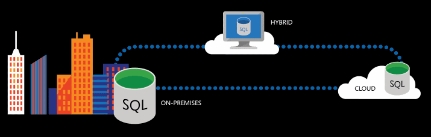

# What's new in SQL Server 2016
[!INCLUDE [SQL Server 2016](../includes/applies-to-version/sqlserver2016.md)]    
 With SQL Server 2016, you can build intelligent, mission-critical applications using a scalable, hybrid database platform that has everything built in, from in-memory performance and advanced security to in-database analytics. The SQL Server 2016 release adds new security features, querying capabilities, Hadoop and cloud integration, R analytics and more, along with numerous improvements and enhancements. 

This page provides summary information and links to more detailed SQL Server 2016 what's new information for each SQL Server component. 

 **Try SQL Server today!** 
- Download the **free** [**SQL Server newest edition!**](https://www.microsoft.com/sql-server/sql-server-downloads).
- Download the latest version of [SQL Server Management Studio (SSMS)](../ssms/download-sql-server-management-studio-ssms.md). 
- Have an Azure account? Spin up a [Virtual Machine with SQL Server 2016 already installed](https://azuremarketplace.microsoft.com/marketplace/apps/microsoftsqlserver.sql2017-ws2019?tab=Overview).

## SQL Server 2016 Database Engine
- You can now configure **multiple tempDB** database files during SQL Server installation and setup.
- New **Query Store** stores query texts, execution plans, and performance metrics within the database, allowing easy monitoring and troubleshooting of performance issues. A dashboard shows which queries consumed the most time, memory or CPU resources.
- **Temporal tables** are history tables which record all data changes, complete with the date and time they occurred.
- New built-in **JSON support** in SQL Server supports JSON imports, exports, parsing and storing.
- New **PolyBase** query engine integrates SQL Server with external data in Hadoop or Azure Blob storage. You can import and export data as well as executing queries.
- The new **Stretch Database** feature lets you dynamically, securely archive data from a local SQL Server database to an Azure SQL database in the cloud. SQL Server automatically queries both local and remote data in the linked databases. 
- **In-memory OLTP:** 
    - Now supports FOREIGN KEY, UNIQUE and CHECK constraints, and native compiled stored procedures OR, NOT, SELECT DISTINCT, OUTER JOIN, and subqueries in SELECT.
    - Supports tables up to 2TB (up from 256GB). 
    - Has column store index enhancements for sorting and Always On Availability Group support.
- New security features:
    - **Always Encrypted:** When enabled, only the application that has the encryption key can access the encrypted sensitive data in the SQL Server 2016 database. The key is never passed to SQL Server.
    - **Dynamic Data Masking:** If specified in the table definition, masked data is hidden from most users, and only users with UNMASK permission can see the complete data.
    - **Row Level Security:** Data access can be restricted at the database engine level, so users see only what is relevant to them. 

## SQL Server 2016 Analysis Services (SSAS)
SQL Server 2016 Analysis Services provides improved performance, authoring, database management, filtering, processing, and much more for tabular model databases based on the **1200 compatibility level**.
- **[SQL Server R Services](~/machine-learning/what-s-new-in-sql-server-machine-learning-services.md)** integrate the R programming language, used for statistical analysis, into SQL Server. 
- New **Database Consistency Checker (DBCC)** runs internally to detect potential data corruption issues.
- **Direct Query**, which queries live external data rather than importing it first, now supports more data sources, including Azure SQL, Oracle and Teradata. 
- There are numerous new **DAX (Data Access Expressions) functions**.
- New **[Microsoft.AnalysisServices.Tabular](/dotnet/api/microsoft.analysisservices.tabular)** namespace manages tabular mode instances and models. 
- [Analysis Services Management Objects (AMO)](/dotnet/api/) is re-factored to include a second assembly, **Microsoft.AnalysisServices.Core.dll**.

See [Analysis Services Engine (SSAS)](/analysis-services/what-s-new-in-analysis-services). 

## SQL Server 2016 Integration Services (SSIS)
- Support for **Always On Availability Groups**
- **Incremental package deployment**
- **Always Encrypted** support
- New **ssis_logreader** database-level role
- New **custom logging level**
- **Column names for errors** in the data flow 
- New **connectors**
- Support for the **Hadoop file system (HDFS)**

See [Integration Services (SSIS)](../integration-services/what-s-new-in-integration-services-in-sql-server-2016.md).

## SQL Server 2016 Master Data Services (MDS)
- **Derived hierarchy improvements**, including support for recursive and many-to-many hierarchies
- **Domain-based attribute** filtering
- **Entity syncing** for sharing entity data between models
- Approval workflows via **changesets**
- **Custom indexes** to improve query performance
- New **permission levels** for improved security
- Redesigned **business rules management** experience

See [Master Data Services (MDS)](../master-data-services/what-s-new-in-master-data-services-mds.md).

## SQL Server 2016 Reporting Services (SSRS)
Microsoft has thoroughly revamped Reporting Services in this release. 
- New **web Report Portal** with KPI feature
- New **Mobile Report Publisher**
- **Redesigned report rendering engine** that supports HTML5 
- New treemap and sunburst **chart types** 

See [Reporting Services (SSRS)](../reporting-services/what-s-new-in-sql-server-reporting-services-ssrs.md).

## Next steps   
- [SQL Server setup](../database-engine/install-windows/install-sql-server.md)   
- [SQL Server 2016 Release Notes](../sql-server/sql-server-2016-release-notes.md) 
- [SQL Server 2016 datasheet](https://download.microsoft.com/download/C/5/3/C53C3AEF-653C-4598-8721-D522E8AC6A3A/SQL_Server_2016_Everything_Built-In_Datasheet_EN_US.pdf)
- [Features supported by Editions of SQL Server](./editions-and-components-of-sql-server-2016.md)
- [Hardware and Software Requirements for Installing SQL Server 2016](../sql-server/install/hardware-and-software-requirements-for-installing-sql-server.md)
- [Install SQL Server 2016 from the Installation Wizard](../database-engine/install-windows/install-sql-server-from-the-installation-wizard-setup.md)
- [Setup and Servicing Installation](../database-engine/install-windows/install-sql-server-servicing-updates.md)
- [New SQL PowerShell module](https://blogs.technet.microsoft.com/dataplatforminsider/2016/06/30/sql-powershell-july-2016-update/)

[!INCLUDE[get-help-options](../includes/paragraph-content/get-help-options.md)]

[!INCLUDE[contribute-to-content](../includes/paragraph-content/contribute-to-content.md)]
