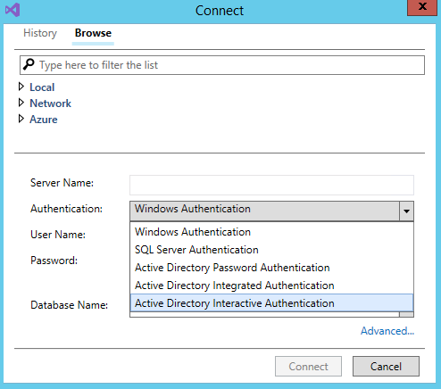
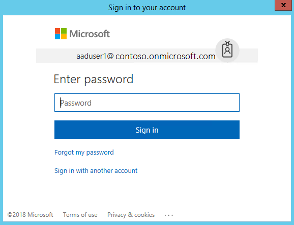

# Azure Active Directory support in SQL Server Data Tools (SSDT)

[!INCLUDE[appliesto-xx-asdb-asdb-xxx-md.md](../includes/appliesto-xx-asdb-asdw-xxx-md.md)]

SQL Server Data Tools (SSDT) provides several [Azure Active Directory (Azure AD)](/azure/active-directory/active-directory-whatis) authentication methods.

In Visual Studio, open the **SQL Server Object Explorer** (in the **View** menu), and select **Add SQL Server**:

#### Which Azure SQL products?

This article discusses Azure AD for the following list of *Azure SQL products* in the [Azure cloud](https://azure.microsoft.com/):

- Azure SQL Database
- Azure Synapse Analytics

## Active Directory Password Authentication

*Active Directory Password Authentication* is a mechanism of connecting to the Azure SQL products that were listed earlier. The mechanism uses identities in Azure Active Directory (Azure AD). Use this method for connecting when:

- You are logged in to Windows with credentials from a domain that is not federated with Azure, or
- You are using Azure AD authentication with Azure AD, and it is based on the initial or client domain.

For more information, see [Connecting to SQL Database By Using Azure Active Directory Authentication](/azure/sql-database/sql-database-aad-authentication).  

## Active Directory Integrated Authentication

*Active Directory Integrated Authentication* is a mechanism of connecting to the listed Azure SQL products by using identities in Azure Active Directory (Azure AD). Use this method for connecting if you are logged in to Windows using your Azure Active Directory credentials from a federated domain. For more information, see [Connecting to SQL Database By Using Azure Active Directory Authentication](/azure/sql-database/sql-database-aad-authentication).

## Active Directory Interactive Authentication

*Active Directory Interactive Authentication* is available when connecting to the listed Azure SQL products with SSDT, but only with [.NET Framework 4.7.2](/dotnet/api/?view=netframework-4.7.2&preserve-view=true) or a later version.

- [Download and install for .NET Framework, any version](https://www.microsoft.com/net/download/all).
- [Visual Studio 2017 version 15.6](/visualstudio/releasenotes/vs2017-relnotes), or a later version.

#### Multi-Factor Authentication (MFA)

Active Directory Interactive Authentication supports an interactive authentication allowing you to use Azure Active Directory (AD) Multi-Factor Authentication (MFA) to authenticate with the listed Azure SQL products. This method supports native and federated Azure AD users, and guest users from other accounts. The other types of account include:

- Business-to-Business (Azure AD B2B) users.
- Microsoft accounts, such as @outlook.com, @hotmail.com, @live.com.
- Non-Microsoft accounts, such as @gmail.com.

If the MFA method is specified, the **User Name** must be specified, and the **Password** field is disabled. 

#### Password Entry

When authenticating with *Active Directory Interactive Authentication*, an authentication window opens that requires users to enter a password manually.

The MFA enforcement is provided by Azure AD through this additional MFA pop-up window.

> [!NOTE]
> Automated workflows would be blocked by the use of *Active Directory Interactive Authentication*. There must be a person available to interact with the authentication process, in the form of manually entering a password.

## Known issues and limitations

- *Active Directory Interactive Authentication* is only supported when connecting to the Azure SQL products that were listed at the start of this article. It is not supported for SQL Server (on-premises or on a VM).
- *Active Directory Interactive Authentication* is not supported in the connection dialog in *Server Explorer*. You must connect by using SSDT with *SQL Server Object Explorer*.
- Single sign-on integration with the currently logged in Visual Studio account is not supported for SSDT.
- The SQLPackage.exe that is installed into the Extensions directory during Visual Studio installation is not meant to be used from that location. To use SQLPackage.exe with Azure AD, go to [Data-Tier Application Framework](https://www.microsoft.com/download/details.aspx?id=55088) 

## See Also  

[Multi-factor authentication](/azure/sql-database/sql-database-ssms-mfa-authentication)  
[Azure Active Directory authentication with SQL Database](/azure/sql-database/sql-database-aad-authentication-configure)  
[SSDT MSDN Forum](https://social.msdn.microsoft.com/Forums/sqlserver/home?forum=ssdt)  
[SSDT Team Blog](/archive/blogs/ssdt/)  
[Download SQL Server Management Studio (SSMS)](../ssms/download-sql-server-management-studio-ssms.md)
