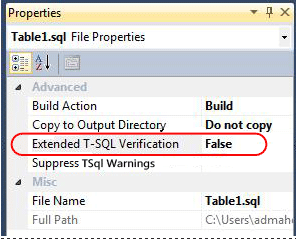

# Database Project Settings

You use database project settings to control aspects of your database, debugging and build configurations. These settings fall into the following categories.  
  
-   [Project Settings](#bkmk_proj_settings)  
  
-   [Extended Transact-SQL Verification](#bkmk_evf)  
  
-   [SQLCLR](#bkmk_sqlclr)  
  
-   [SQLCLR and SQLCLR Build](#bkmk_sqlclr_sqlclrbuild)  
  
-   [Build](#bkmk_build)  
  
-   [SQLCMD Variables](#bkmk_sqlcmd_variables)  
  
-   [Build Events](#bkmk_build_events)  
  
-   [Debug](#bkmk_debug)  
  
-   [Reference Paths](#bkmk_ref_paths)  
  
-   [Code Analysis](#bkmk_code_analysis)  
  
### To configure properties for your database project  
  
1.  In **Solution Explorer**, right-click the database project for which you want to configure properties, and select **Properties**.  
  
    Alternatively, double click the **Properties** node of the project in **Solution Explorer**.  
  
2.  The properties sheet for your database project appears.  
  
3.  Click the **Project Settings** tab. You can now configure general properties of your database project properties. Notice the availability of various tabs (representing different categories) on the left pane.  
  
## Project Settings  
The settings in the following table apply to all configurations of this database project.  
  
|Field|Default value|Description|  
|---------|-----------------|---------------|  
|Target Platform|Microsoft SQL Server 2012|Specifies the version of SQL Server that you are targeting with this database project.|  
|Enable extended Transact\-SQL verification for common objects.|Not enabled when you create a new project.  Enabled when you create a project from SQL Server Object Explorer connected to SQL Azure, import an Azure SQL Database into the project, or change a project's Target Platform to SQL Azure.|When this option is enabled, errors found in the project that failed SQL Server Compiler verification are reported. If you change your target platform to SQL Azure, Extended Verification becomes enabled. The option will not be unchecked if you change your Target Platform.  You can enable this option for other versions of SQL Server, but validation is limited to Microsoft SQL Server 2012 Partially Contained Databases and SQL Azure. Not all Transact\-SQL syntax is supported for all versions of SQL Server.  For more detailed information, see [Extended Transact-SQL Verification](#bkmk_evf) later in this topic|  
|Output types|||  
|Data-tier Application (.dacpac file)|Enabled and locked. The build output of a database project always produces a .dacpac package when the project is built.|If you are using the version of SQL Server Data Tools (SSDT) that has the "Create additional down-level .dacpac file (v2.0)" option, check it if you want for the package to be compatible with SQL Server Management Studio or SQL Azure Management Portal. You can deploy a .dacpac package directly from (SSDT), but you can deploy only a version 2.0 .dacpac file through SQL Server Management Studio at the time SQL Server Data Tools is released.|  
|Create Script (.sql File)||Specifies whether a full .sql CREATE script is generated for all the objects in the project, and placed in the bin\debug folder when the project is built. You can create an incremental update script using the **Project Publish** command or SQL Compare utility.|  
|Generic|||  
|Default schema|dbo|Specifies the default schema in which both SQLCLR and Transact\-SQL objects are created. You can override this setting by specifying schema directly on objects."|  
|Include schema name in file name|no|Specifies whether file names include the schema as a prefix (for example, dbo.Products.table.sql). If this check box is cleared, file names for objects take the form ObjectName.ObjectType.sql (for example, Products.table.sql).|  
|Validate Casing on Identifiers|yes|Specifies whether casing on identifiers in the SQL objects in the project are validated when the project is built. This option applies to database projects that specify case-sensitive collation for the database.|  
|Database Settings|Default settings based on the standard configuration settings for a database|Examples of settings you can specify include the collation method and database level settings for a SQL Server database.|  
  
## Extended Transact-SQL Verification  
  
> [!IMPORTANT]  
> The Extended Transact-SQL Verification feature will be removed from the next feature release of SQL Server Data Tools and next major release of Visual Studio.  
  
Extended Transact-SQL Verification is a feature within the database project system that allows developers to submit their database project to the Transact-SQL Compiler Service at build time to validate their code against the SQL Server Engine's parser and interpreter.  
  
### Transact-SQL Compiler Service  
Transact-SQL Compiler Service is a component based on the Microsoft SQL Server 2012 Database Engine. This service can validate the syntax and semantics of DDL statements with the same fidelity as a Microsoft SQL Server 2012 Database engine. This inherently means that the Compiler Service does not support syntax or features that have been deprecated in Microsoft SQL Server 2012. For more information about deprecated features, see [Discontinued Database Engine Functionality in SQL Server 2012](../database-engine/discontinued-database-engine-functionality-in-sql-server.md).  
  
For purpose of validation of the database project, the Compiler Service creates a partially contained database and simulates execution of the DDL statements against that database. For more information, see [Partially Contained Databases](/previous-versions/sql/sql-server-2012/ff929071(v=sql.110)).  
  
The Compiler Service has two categories of limitations.  
  
Features that rely on database or instance configuration including:  
  
-   3 or 4-part object references  
  
-   FileTables  
  
-   Change Tracking  
  
-   Rowset functions - OPENROWSET, OPENQUERY, OPENDATASOURCE  
  
-   FullText Semantic Search  
  
Features that are not currently supported for validation including:  
  
-   Service Broker  
  
-   Partitioned Schemas with user-defined FileGroups  
  
-   SQL Azure Metadata Collation (Compiler Service uses SQL Server 2012 Partially Contained Database metadata collation - Latin1_General_100_CI_AS_KS_WS_SC)  
  
### Enabling/Disabling Extended Verification  
Extended Transact-SQL Verification is enabled by default in a database project that is created directly from an Azure SQL Database or a project whose target platform is set to SQL Azure. It is recommended that Extended Verification be used when developing for SQL Azure or an application-scoped database targeting SQL Server 2012. For more information about application scoped databases, see [Partially Contained Databases](/previous-versions/sql/sql-server-2012/ff929071(v=sql.110)).  
  
The Extended Verification feature can also be used when developing an application-scoped database for SQL Server 2008/R2 to achieve compatibility with Microsoft SQL Server 2012 and SQL Azure.  
  
##### To enable or disable Extended Verification at the project level  
  
1.  In **Solution Explorer**, right-click on the project file, and then click **Properties**.  
  
2.  In **Project Settings**, under **Target Platform**, check or uncheck **Enable extended Transact-SQL verification for common objects**.  
  
##### To disable Extended Verification at the file level  
  
1.  In **Solution Explorer**, right-click on a .sql file.  
  
    > [!NOTE]  
    > In order to disable the Extended Transact\-SQL Verification feature at the file level, the file's **Build Action** property must be set to **Build**.  
  
2.  In **Properties**, change the **Extended T-SQL Verification** property to **False**.  
  
      
  
### Special Considerations for Collations  
For more information regarding collations in partially contained databases, see [Contained Database Collations](/previous-versions/sql/sql-server-2012/ff929080(v=sql.110)).  
  
## SQLCLR  
For information about the Assembly options, see [Assembly Information Dialog Box](/visualstudio/ide/reference/assembly-information-dialog-box?queryresult=true).  
  
For information about signing, see the **Assembly Signing** section of the [Signing Page, Project Designer](/visualstudio/ide/reference/signing-page-project-designer?queryresult=true) topic.  
  
## SQLCLR and SQLCLR Build  
The **SQLCLR** and **SQLCLR Build** property pages contain many settings for using SQL CLR objects in your project. Specifically, the **SQLCLR** property page has a permission level setting to set permissions on the SQLCLR assembly. It also has a "generate DDL" setting to control whether Dynamic Data Language (DDL) is generated for the SQLCLR objects that have been added to the project. The SQLCLR **Build** property page contains all the compiler options that you can set to configure the compilation of SQLCLR code in the project.  
  
The **SQLCLR Build** property page contains advanced build settings for building your SQL CLR objects. Different options are provided based on the language (VB or C#) used to code the SQL CLR objects.  
  
1.  If the object is written in C#, you can access the options by clicking the **Advanced** button in the **SQLCLR Build** property page. Descriptions for C# options can be found at [Advanced Build Settings Dialog Box (C#)](/visualstudio/ide/reference/advanced-build-settings-dialog-box-csharp).  
  
2.  If the object is written in VB, you can first choose VB in the **Language** dropdown list, then click the **Advanced** button. Descriptions for VB options can be found at [Advanced Compiler Settings Dialog Box (Visual Basic)](/visualstudio/ide/reference/advanced-compiler-settings-dialog-box-visual-basic)  
  

## Build  
You can choose a build configuration for each database project in your solution. By default there is a single configuration, but you can add custom configurations. You might choose to do this, for example, if you wanted a custom configuration in which you always deleted and re-created the database. In solutions that contain different project types, you can create a custom solution configuration that contains a particular build configuration for each project.  
  
#### To specify a build configuration for a solution  
  
1.  In **Solution Explorer**, click the solution node for which for which you want specify a build configuration.  
  
2.  On the **Build** menu, click **Configuration Manager**. The **Configuration Manager** dialog box appears.  
  
    Specify the configuration settings that you want to use for each project in your solution.  
  
#### To specify a build configuration for a database project  
  
1.  In **Solution Explorer**, right-click the database project for which for which you want specify a build configuration, and select **Properties**.  
  
2.  On the **Build** tab, use the **Configuration** dropdown list to specify the configuration settings that you want to use for this project.  
  
The settings in the following table apply to build configurations of this database project.  
  
|Field|Default value|Description|  
|---------|-----------------|---------------|  
|Build output path|bin\Debug\|Specifies where the build output is generated when you build or deploy the database project. If you specify a relative path, you must specify it relative to the database project path. If the path does not exist, it is created.|  
|Build output file name|*DatabaseProjectName*|Specifies the name that you want to give the output that is generated when you build the database project|  
|Treat Transact\-SQL warnings as errors|No|Specifies whether a Transact\-SQL warning should cause the build and deployment process to be canceled. If this check box is cleared, warnings appear, but the build and deployment process continues. This setting is specific to the project, not the user, and is stored in the .sqlproj file.|  
|Suppress Transact\-SQL Warnings|Blank|Specifies a list of warning numbers, delimited by commas or semi-colons that identify warnings that are suppressed.  Suppressed warnings do not appear in the **Error List** window, and they do not affect the build success, even if you select the **Treat Transact\-SQL warnings as errors** check box.|  
  
## SQLCMD Variables  
In SQL Server Database Projects you can utilize SQLCMD variables to provide dynamic substitution to be used for debugging or publishing. You enter the variable name and values and during build, the values will be substituted. If there are no local values, the default value will be used. By entering these variables in project properties, they will automatically be offered in publishing and are stored in publishing profiles. You can pull in the project values of the variables into publish via the Load Values button.  
  
Make sure the right variables are entered in project properties, because these variables are not validated against a script in the project, nor are the variables used in script automatically populated.  
  
Additionally, command line publishing enables you to override these values at the command line or using a profile.  
  
## Build Events  
You can use these settings to specify a command line to execute before the build operation starts and a command line to execute after the build operation is completed.  
  
|Field|Default value|Description|  
|---------|-----------------|---------------|  
|Pre-build event command line|None|Specifies the command line to execute before the project is built. Click **Edit Pre-build** to modify the command line.|  
|Post-build event command line|None|Specifies the command line to execute after the project is built. Click **Edit Post-build** to modify the command line.|  
|Run the post-build event|On successful build|Specifies whether the post-build command line should be run always, only if the build was successful, or only when the build updated the project output (the build script).|  
  
## Debug  
You can use these settings to control the debugging of your database project.  
  
|Field|Default value|Description|  
|---------|-----------------|---------------|  
|Start Action|None|Specifies a script or external program to run when you debug your project.|  
|Target Connection String|Data Source=(localdb)\\*SolutionName*;Initial Catalog=*DatabaseProjectName*;Integrated Security=True;Pooling=False;Connect Timeout=30|Specifies the connection information for the database server that you want to target for the specified build configuration. The default connection string is against a dynamically created SQL Server LocalDB instance and database.|  
|Deploy database properties|Yes|Specifies whether the DatabaseProperties.DatabaseProperties settings are deployed or updated when you deploy the database project.|  
|Always re-create database|No|Specifies whether to drop and recreate the database instead of performing an incremental upgrade. You might want to select this check box if you want to run database unit tests against a clean deployment of the database, for example. If this check box is cleared, the existing database will be updated instead of dropped and re-created.|  
|Block incremental deployment if data loss might occur|Yes|Specifies whether deployment will stop if an update might cause data loss. If this check box is selected, changes that would create data loss cause deployment to stop with an error, which keeps data from being lost. For example, deployment would stop if a `varchar(50)` column were changed to `varchar(30)`.  **NOTE:** Deployment is blocked only if the tables where data loss might occur contain data. Deployment continues if no data would be lost.|  
|DROP objects in target but not in project|No|Specifies whether objects that are in the target database but not in the database project should be dropped as part of the deployment script. You can exclude some files in your project to temporarily remove them from your build script. However, you might want to leave the existing versions of those objects in the target database. This check box has no effect if the **Always re-create database** check box is selected, because the database will be dropped.|  
|Do not use ALTER ASSEMBLY statements to update CLR types|No|Specifies whether ALTER ASSEMBLY statements are used to update common language run-time (CLR) types or whether the object that instantiates the CLR type will instead be dropped and re-created when you deploy changes.|  
|Advanced...|No|Command button that allows you to specify options that control events and behavior for the deployment.|  
  
## Reference Paths  
You can use this page to define the server and database variables that are associated with a cross-database reference. In addition, you can specify the values of those variables. For more information, see [Using References in Database Projects](/previous-versions/visualstudio/visual-studio-2010/bb386242(v=vs.100)).  
  
## Code Analysis  
You can use Code Analysis to discover potential issues in your scripts, such as design, naming and performance problems. Rules for database projects are organized into predefined rule sets that target specific areas, and you can enable or disable any rule in the **Code Analysis** tab of the **Project Properties** property page. In the same tab, you can specify code analysis to be run automatically every time that a project is built, or whether warnings are treated as errors.  
  
To use Code Analysis manually, right-click your project in **Solution Explorer** and select **Run Code Analysis**. Code analysis warnings are listed in the **Error List** window. You can double-click a warning to navigate to the source code that contains the issue, and you can view additional information and possible corrections for a warning by using the **Show Error Help** contextual menu. For more information on Code Analysis, see [Analyzing Database Code to Improve Code Quality](/previous-versions/visualstudio/visual-studio-2010/dd172133(v=vs.100)).  
