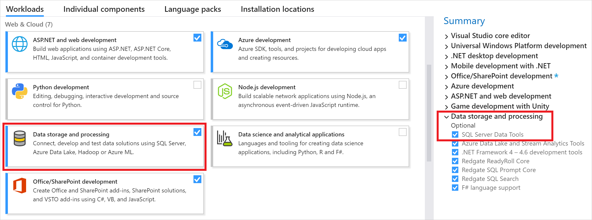
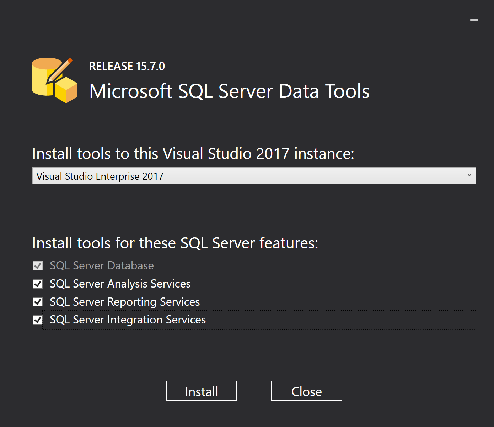

---
title: "Download SQL Server Data Tools (SSDT) | Microsoft Docs"
ms.custom: ""
ms.date: 01/19/2019
ms.prod: sql
ms.prod_service: "sql-tools"
ms.reviewer: ""
ms.technology: ssdt
ms.topic: conceptual
keywords: 
  - "install ssdt, download ssdt, latest ssdt"
ms.assetid: b0fc4987-d260-4d0a-9dd1-98099835b361
author: "stevestein"
ms.author: "sstein"
manager: craigg
monikerRange: ">=aps-pdw-2016||=azuresqldb-current||=azure-sqldw-latest||>=sql-server-2016||=sqlallproducts-allversions||=azuresqldb-mi-current"
---
# Download and install SQL Server Data Tools (SSDT) for Visual Studio
[!INCLUDE[appliesto-ss-asdb-asdw-pdw-md.md](../includes/appliesto-ss-asdb-asdw-pdw-md.md)]

**SQL Server Data Tools** is a modern development tool for building SQL Server relational databases, Azure SQL databases, Analysis Services (AS) data models, Integration Services (IS) packages, and Reporting Services (RS) reports. With SSDT, you can design and deploy any SQL Server content type with the same ease as you would develop an application in Visual Studio.

*For most users, SQL Server Data Tools (SSDT) is installed during Visual Studio installation. Installing SSDT using the Visual Studio installer adds the base SSDT functionality, so you still need to run the [SSDT standalone installer](#ssdt-for-vs-2017-standalone-installer) to get AS, IS, and RS tools.*

## Install SSDT with Visual Studio 2017

To install SSDT during [Visual Studio installation](https://docs.microsoft.com/visualstudio/install/install-visual-studio), select the **Data storage and processing** workload, and then select **SQL Server Data Tools**. If Visual Studio is already installed, you can [edit the list of workloads](https://docs.microsoft.com/visualstudio/install/modify-visual-studio) to include SSDT:

## Install Analysis Services, Integration Services, and Reporting Services tools

To install AS, IS, and RS project support, run the [SSDT standalone installer](#ssdt-for-vs-2017-standalone-installer). 

The installer lists available Visual Studio instances to add the SSDT tools to. If Visual Studio is not installed, selecting **Install a new SQL Server Data Tools instance** installs SSDT with a minimal version of Visual Studio, but for the best experience we recommend using SSDT with [the latest version of Visual Studio](https://www.visualstudio.com/downloads). 

## SSDT for VS 2017 (standalone installer)

[ Download SSDT for Visual Studio 2017 (15.9.0)](https://go.microsoft.com/fwlink/?linkid=2052454) 

> [!IMPORTANT]
> - Before installing SSDT for Visual Studio 2017 (15.9.0), uninstall *Analysis Services Projects* and *Reporting Services Projects* extensions if they are already installed, and close all VS instances.
> - Please use SSDT for Visual Studio 2017 (15.8.0) or the previous versions for designing SSIS packages that contain Teradata Source/Destination. SSDT for Visual Studio 2017 after 15.8.0 can’t design SSIS packages that contain Teradata Source/Destination by Attunity.

**Version Information**  
  
Release number: 15.9.0  
Build Number: 14.0.16186.0  
Release date: January 28, 2019  

For a complete list of changes, see the [Release notes for SQL Server Data Tools (SSDT)](release-notes-ssdt.md).

SSDT for Visual Studio 2017 has the same [system requirements](https://docs.microsoft.com/visualstudio/productinfo/vs2017-system-requirements-vs) as Visual Studio.  

### Available Languages - SSDT for VS 2017

This release of **SSDT for VS 2017** can be installed in the following languages:

- [Chinese (Simplified)]( https://go.microsoft.com/fwlink/?linkid=2052454&clcid=0x804)
- [Chinese (Traditional)]( https://go.microsoft.com/fwlink/?linkid=2052454&clcid=0x404)
- [English (United States)]( https://go.microsoft.com/fwlink/?linkid=2052454&clcid=0x409)
- [French]( https://go.microsoft.com/fwlink/?linkid=2052454&clcid=0x40c)
- [German]( https://go.microsoft.com/fwlink/?linkid=2052454&clcid=0x407)
- [Italian]( https://go.microsoft.com/fwlink/?linkid=2052454&clcid=0x410)
- [Japanese]( https://go.microsoft.com/fwlink/?linkid=2052454&clcid=0x411)
- [Korean]( https://go.microsoft.com/fwlink/?linkid=2052454&clcid=0x412)
- [Portuguese (Brazil)]( https://go.microsoft.com/fwlink/?linkid=2052454&clcid=0x416)
- [Russian]( https://go.microsoft.com/fwlink/?linkid=2052454&clcid=0x419)
- [Spanish]( https://go.microsoft.com/fwlink/?linkid=2052454&clcid=0x40a)

## Offline install

To install SSDT when you're not connected to the internet follow the steps in this section. For more information, see [Create a network installation of Visual Studio 2017](https://docs.microsoft.com/visualstudio/install/create-a-network-installation-of-visual-studio).

First, complete the following steps while online:

1. [Download the SSDT standalone installer](#ssdt-for-vs-2017-standalone-installer).
2. [Download vs_sql.exe](https://aka.ms/vs/15/release/vs_sql.exe).
3. While still online, execute one of the following commands to download all the files required for installing offline. Using the `--layout` option is the key, it will download the actual files for the offline installation. Replace `<filepath>` with the actual layouts path to save the files.

   
   a.	For a specific language, pass the locale: `vs_sql.exe --layout c:\<filepath> --lang en-us` (a single language is ~1GB)  
   b. For all languages, omit the `--lang` argument: `vs_sql.exe --layout c:\<filepath>` (all languages are ~3.9GB).

4. Execute `SSDT-Setup-ENU.exe /layout c:\<filepath>` to extract the SSDT payload into the same `<filepath>` location where the VS2017 files were downloaded. This ensure that all files from both are combined into a single layouts folder.

After completing the previous steps, the following can be done while offline:

1. Run `vs_setup.exe --NoWeb` to install the VS2017 Shell and SQL Server Data Project.
2. From the layouts folder run `SSDT-Setup-ENU.exe /install` and select SSIS/SSRS/SSAS.

   - Or for an unattended installation, run `SSDT-Setup-ENU.exe /INSTALLALL[:vsinstances] /passive`  

For available options, run `SSDT-Setup-ENU.exe /help`

> [!NOTE]
> If using a full version of Visual Studio 2017, create an offline folder for SSDT only, and run `SSDT-Setup-ENU.exe` from this newly created folder (don't add SSDT to another Visual Studio 2017 offline layout). If you add the SSDT layout to an existing Visual Studio offline layout the necessary runtime (.exe) components are not created there.

## Supported SQL versions
  
|Project Templates|SQL Platforms Supported|  
|-------------------|--------------------|  
|Relational databases|  SQL Server 2005\* - SQL Server 2017  (use SSDT 17.x or SSDT for Visual Studio 2017 to connect to [SQL Server on Linux](../linux/sql-server-linux-overview.md))  Azure SQL Database  Azure SQL Data Warehouse (supports queries only; database projects are not yet supported)   \* SQL Server 2005 support is deprecated,   please move to an officially supported SQL version|
|Analysis Services models  Reporting Services reports | SQL Server 2008 - SQL Server 2017|
|Integration Services packages| SQL Server 2012 - SQL Server 2019 |
  
## DacFx

SSDT for Visual Studio 2015, and SSDT for Visual Studio 2017 both use DacFx 17.4.1: [Download Data-Tier Application Framework (DacFx) 17.4.1](https://www.microsoft.com/download/details.aspx?id=56508).

## Previous versions

To download and install SSDT for Visual Studio 2015, or an older version of SSDT, see [Previous releases of SQL Server Data Tools (SSDT and SSDT-BI)](previous-releases-of-sql-server-data-tools-ssdt-and-ssdt-bi.md).

## Next steps

After installing SSDT, work through these tutorials to learn how to create databases, packages, data models, and reports using SSDT:  

- [Project-Oriented Offline Database Development](project-oriented-offline-database-development.md)  
- [SSIS Tutorial: Create a Simple ETL Package](../integration-services/ssis-how-to-create-an-etl-package.md)  
- [Analysis Services tutorials](../analysis-services/analysis-services-tutorials-ssas.md)  
- [Create a Basic Table Report (SSRS Tutorial)](../reporting-services/create-a-basic-table-report-ssrs-tutorial.md)  

[!INCLUDE[get-help-options](../includes/paragraph-content/get-help-options.md)]

## See Also

[SSDT MSDN Forum](https://social.msdn.microsoft.com/Forums/sqlserver/home?forum=ssdt)  
[SSDT Team Blog](https://blogs.msdn.com/b/ssdt/)  
[DACFx API Reference](https://msdn.microsoft.com/library/dn645454.aspx)  
[Download SQL Server Management Studio (SSMS)](../ssms/download-sql-server-management-studio-ssms.md)  
