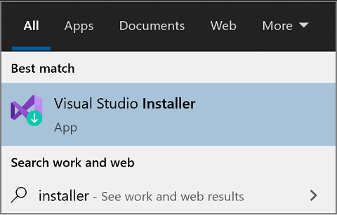
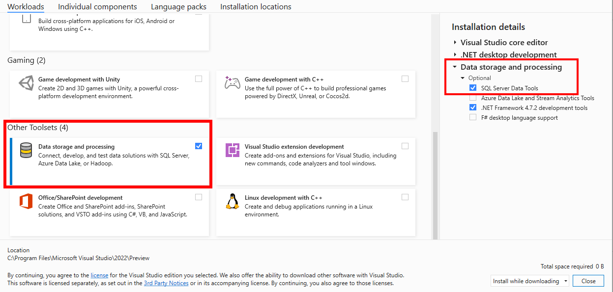
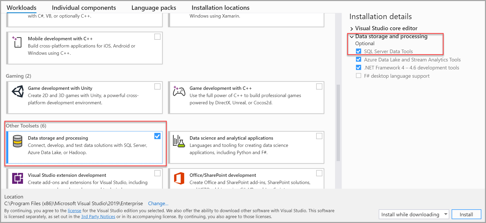

# Download SQL Server Data Tools (SSDT) for Visual Studio

[!INCLUDE [sql-asdb-asa](../includes/applies-to-version/sql-asdb-asa.md)]

**SQL Server Data Tools (SSDT)** is a modern development tool for building SQL Server relational databases, databases in Azure SQL, Analysis Services (AS) data models, Integration Services (IS) packages, and Reporting Services (RS) reports. With SSDT, you can design and deploy any SQL Server content type with the same ease as you would develop an application in Visual Studio.

## SSDT for Visual Studio 2022

### Changes in SSDT for Visual Studio 2022

The core SSDT functionality to create database projects has remained integral to Visual Studio.

> [!NOTE]
> There's no SSDT standalone installer for Visual Studio 2022.

### Install SSDT with Visual Studio 2022

If [Visual Studio 2022](/visualstudio/install/install-visual-studio?preserve-view=true&view=vs-2022) is already installed, you can edit the list of workloads to include SSDT. If you don't have Visual Studio 2022 installed, then you can download and install [Visual Studio 2022](https://visualstudio.microsoft.com/downloads/).

To modify the installed Visual Studio workloads to include SSDT, use the Visual Studio Installer.

1. Launch the Visual Studio Installer. In the Windows Start menu, you can search for "installer".

   

2. In the installer, select for the edition of Visual Studio that you want to add SSDT to, and then choose **Modify**.

3. Select **SQL Server Data Tools** under **Data storage and processing** in the list of workloads.

   

For Analysis Services, Integration Services, or Reporting Services projects, you can install the appropriate [extensions](/visualstudio/ide/finding-and-using-visual-studio-extensions) from within Visual Studio with **Extensions** > **Manage Extensions** or from the [Marketplace](https://marketplace.visualstudio.com/search?term=services&target=VS&category=All%20categories&vsVersion=&sortBy=Relevance).

* [Analysis Services](https://marketplace.visualstudio.com/items?itemName=ProBITools.MicrosoftAnalysisServicesModelingProjects2022)
* [Integration Services](https://marketplace.visualstudio.com/items?itemName=SSIS.MicrosoftDataToolsIntegrationServices)
* [Reporting Services](https://marketplace.visualstudio.com/items?itemName=ProBITools.MicrosoftReportProjectsforVisualStudio2022)

### Supported SQL versions

|Project Templates|SQL Platforms Supported|
|-------------------|--------------------|
|Relational databases| [!INCLUDE [sssql16-md](../includes/sssql16-md.md)] - [!INCLUDE [sssql22-md](../includes/sssql22-md.md)]  Azure SQL Database, Managed Instance  Azure Synapse Analytics (dedicated pools only)|
|Analysis Services models  Reporting Services reports | SQL Server 2016 - SQL Server 2019|
|Integration Services packages| SQL Server 2019 - SQL Server 2022 |

## SSDT for Visual Studio 2019

### Changes in SSDT for Visual Studio 2019

The core SSDT functionality to create database projects has remained integral to Visual Studio.

With Visual Studio 2019, the required functionality to enable Analysis Services, Integration Services, and Reporting Services projects has moved into the respective Visual Studio (VSIX) extensions only.

> [!NOTE]
> There's no SSDT standalone installer for Visual Studio 2019.

### Install SSDT with Visual Studio 2019

If [Visual Studio 2019](/visualstudio/install/install-visual-studio?preserve-view=true&view=vs-2019) is already installed, you can edit the list of workloads to include SSDT. If you don't have Visual Studio 2019 installed, then you can download and install [Visual Studio 2019 Community](https://visualstudio.microsoft.com/downloads/).

To modify the installed Visual Studio workloads to include SSDT, use the Visual Studio Installer.

1. Launch the Visual Studio Installer. In the Windows Start menu, you can search for "installer".

   

2. In the installer, select for the edition of Visual Studio that you want to add SSDT to, and then choose **Modify**.

3. Select **SQL Server Data Tools** under **Data storage and processing** in the list of workloads.

   

For Analysis Services, Integration Services, or Reporting Services projects, you can install the appropriate [extensions](/visualstudio/ide/finding-and-using-visual-studio-extensions) from within Visual Studio with **Extensions** > **Manage Extensions** or from the [Marketplace](https://marketplace.visualstudio.com/search?term=services&target=VS&category=All%20categories&vsVersion=&sortBy=Relevance).

* [Analysis Services](https://marketplace.visualstudio.com/items?itemName=ProBITools.MicrosoftAnalysisServicesModelingProjects)
* [Integration Services](https://marketplace.visualstudio.com/items?itemName=SSIS.SqlServerIntegrationServicesProjects)
* [Reporting Services](https://marketplace.visualstudio.com/items?itemName=ProBITools.MicrosoftReportProjectsforVisualStudio)

### Supported SQL versions

|Project Templates|SQL Platforms Supported|
|-------------------|--------------------|
|Relational databases| SQL Server 2012 - SQL Server 2019  Azure SQL Database, Managed Instance  Azure Synapse Analytics (dedicated pools only)|
|Analysis Services models  Reporting Services reports | SQL Server 2008 - SQL Server 2019|
|Integration Services packages| SQL Server 2012 - SQL Server 2019 |

## Previous versions

To download and install SSDT for Visual Studio 2017, or an older version of SSDT, see [Previous releases of SQL Server Data Tools (SSDT and SSDT-BI)](previous-releases-of-sql-server-data-tools-ssdt-and-ssdt-bi.md).

## See Also

* [SSDT MSDN Forum](https://social.msdn.microsoft.com/Forums/sqlserver/home?forum=ssdt) 

* [SSDT Team Blog](/archive/blogs/ssdt/)

* [DACFx API Reference](/previous-versions/sql/sql-server-2014/dn645454(v=sql.120))

* [Download SQL Server Management Studio (SSMS)](../ssms/download-sql-server-management-studio-ssms.md)

## Next steps

After installing SSDT, work through these tutorials to learn how to create databases, packages, data models, and reports using SSDT.

* [Project-Oriented Offline Database Development](project-oriented-offline-database-development.md)

* [SSIS Tutorial: Create a Simple ETL Package](../integration-services/ssis-how-to-create-an-etl-package.md)

* [Analysis Services tutorials](/analysis-services/analysis-services-tutorials-ssas)

* [Create a Basic Table Report (SSRS Tutorial)](../reporting-services/create-a-basic-table-report-ssrs-tutorial.md)

[!INCLUDE[get-help-options](../includes/paragraph-content/get-help-options.md)]
