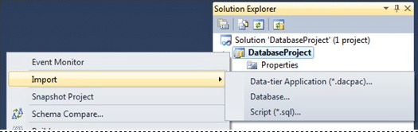
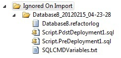
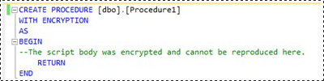

# Import into a Database Project
You can use Import to populate a project with new objects from a live database or a .dacpac, or to update existing objects in your project with a new definition from a script. There are some behavior differences to note between these three paths, which are described below.  
  
**Import Menu**  
  
  
  
**Sections in this topic**  
  
[Import Source: Database or Data-tier Application (*.dacpac)](#bkmk_import_source_db)  
  
[Import Source: Script (*.sql)](#bkmk_import_source_script)  
  
[Import Encrypted Objects](#bkmk_import_encrypted)  
  
## Import Source: Database or Data-tier Application (*.dacpac)  
The ability to import schema from a database or a .dacpac file is only available if there are no schema objects already defined in the project. This does not include RefactorLogs or Pre/Post-Deployment scripts.  
  
On import, object definitions will be scripted into project files using SSDT's organizational defaults for new objects: new files for top level objects, hierarchical children defined in the same file as the parent, table/column constraints defined inline where possible. For more targeted visibility and control for each object, use Schema Compare instead of Import.  
  
If the import source contains Pre- and Post-Deployment Scripts, RefactorLogs, or SQLCMD variable definitions, they will be imported into the project. If the project already contains any one of these artifacts, the imported files will be added to an **Ignored on Import** folder in the project.  
  
**Ignored on Import Folder**  
  
  
  
## Import Source: Script (*.sql)  
All objects from the import source that *do not* already exist in the project will be added, and all objects in the import source that *do already* exist in the project will overwrite the object definition in the project.  
  
> [!NOTE]  
> There are two known bugs in this path that will be fixed in a future release:  
>   
> -   If table/column constraints are defined outside of the CREATE TABLE statement in the project's table definition, import will overwrite the table definition such that the constraint is inline. However, it will leave the out of line constraint, resulting in duplicate constraints in the project.  
> -   Any master keys or database encryption keys from your source script that already exist in the project will be duplicated on import. Remove duplicates in order to build the project.  
  
The Import from Script process will not comprehend Pre/Post-Deployment scripts, SQLCMD variables, or RefactorLog files. These and any other unsupported constructs that are detected on import will be placed in a **ScriptsIgnoredOnImport.sql** file in a **Scripts** folder in your project.  
  
 
## Import Encrypted Objects  
When importing encrypted objects into a database project, the full body of the object definition cannot always be retrieved from the server. As such, import behavior can be different when dealing with this class of objects.  
  
When the full body definition cannot be retrieved, the object header/footer, along with a dummy body, will be scripted. You can expect to encounter this behavior when you Import or use Schema Compare where the source is a live database or a .dacpac extracted from a database.  
  
**Script with Dummy Body**  
  
  
  
In the case where the full object definition is available and can be retrieved, Import and Schema Compare will bring it into the project in its entirety. This happens when updating the project from a script, a .dacpac built from a database project, or another database project.  
  
