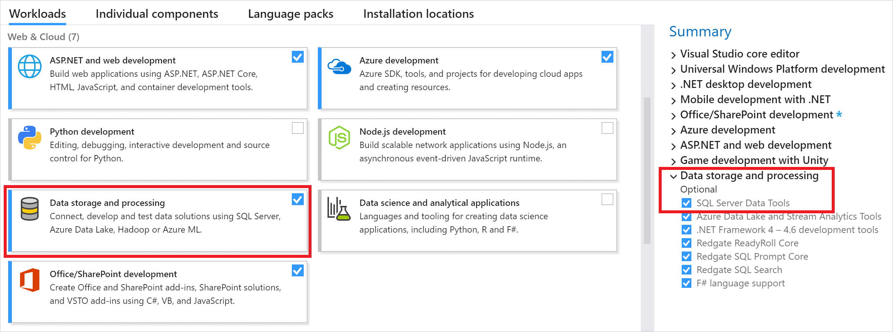
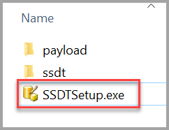

# Previous releases of SQL Server Data Tools (SSDT and SSDT-BI)

[!INCLUDE[SQL Server Azure SQL Database Synapse Analytics PDW ](../includes/applies-to-version/sql-asdb-asdbmi-asa-pdw.md)]

SQL Server Data Tools (SSDT) provides project templates and design surfaces for building SQL Server content types - relational databases, Analysis Services models, Reporting Services reports, and Integration Services packages.

SSDT is backwards compatible, so you can always use [the newest SSDT](download-sql-server-data-tools-ssdt.md) to design and deploy databases, models, reports, and packages that run on older versions of SQL Server.

Historically, the Visual Studio shell used to create SQL Server content types has been released under various names, including **SQL Server Data Tools**, **SQL Server Data Tools - Business Intelligence**, and **Business Intelligence Development Studio**. Previous versions came with distinct sets of project templates. To get all of the project templates together in one SSDT, you need [the newest version](download-sql-server-data-tools-ssdt.md). Otherwise, you probably need to install multiple previous versions to get all of the templates used in SQL Server. Only one shell is installed per version of Visual Studio; installing a second SSDT just adds the missing templates.

## SSDT for Visual Studio 2017

### Changes in SSDT for Visual Studio 2017

Starting with Visual Studio 2017, the functionality of creating Database Projects has been integrated into the Visual Studio installation. There's no need to install the SSDT standalone installer for the core SSDT experience.

Now to create Analysis Services, Integration Services, or Reporting Services projects, you still need the SSDT standalone installer.

### Install SSDT with Visual Studio 2017

To install SSDT during [Visual Studio installation](/visualstudio/install/install-visual-studio), select the **Data storage and processing** workload, and then select **SQL Server Data Tools**.

If Visual Studio is already installed, use the Visual Studio Installer to modify the installed workloads to include SSDT.

1. Launch the Visual Studio Installer. In the Windows Start menu, you can search for "installer".

   

2. In the installer, select for the edition of Visual Studio that you want to add SSDT to, and then choose **Modify**.

3. Select **SQL Server Data Tools** under **Data storage and processing** in the list of workloads.

   

### Install Analysis Services, Integration Services, and Reporting Services tools

To install Analysis Services, Integration Services, and Reporting Services project support, run the [SSDT standalone installer](#ssdt-for-vs-2017-standalone-installer).

The installer lists available Visual Studio instances to add SSDT tools. If Visual Studio isn't already installed, selecting **Install a new SQL Server Data Tools instance** installs SSDT with a minimal version of Visual Studio, but for the best experience, we recommend using SSDT with [the latest version of Visual Studio](https://www.visualstudio.com/downloads).


### Supported SQL versions

|Project Templates|SQL Platforms Supported|
|-------------------|--------------------|
|Relational databases| SQL Server 2005\* - SQL Server 2017<br /><br />Azure SQL Database<br /><br />Azure Synapse Analytics (supports queries only; database projects aren't yet supported)<br /><br /> \* SQL Server 2005 support is deprecated,<br /><br /> move to an officially supported SQL version|
|Analysis Services models<br /><br />Reporting Services reports | SQL Server 2008 - SQL Server 2017|
|Integration Services packages| SQL Server 2012 - SQL Server 2019 |


### SSDT for VS 2017 (standalone installer)

:::image type="icon" source="../includes/media/download.svg" border="false"::: **[Download SSDT for Visual Studio 2017 (15.9.10)](https://go.microsoft.com/fwlink/?linkid=2192400)**

> [!IMPORTANT]
> * Before installing SSDT for Visual Studio 2017 (15.9.10), uninstall *Analysis Services Projects* and *Reporting Services Projects* extensions if they are already installed, and close all VS instances. 
> * Removed the inbox component Power Query Source for SQL Server 2017. Now we have announced Power Query Source for SQL Server 2017 & 2019 as out-of-box component, which can be downloaded [here](https://www.microsoft.com/download/details.aspx?id=100619).
> * To design packages using Oracle and Teradata connectors and targeting an earlier version of SQL Server prior to SQL 2019, in addition to the [Microsoft Oracle Connector for SQL 2019](https://www.microsoft.com/download/details.aspx?id=58228) and [Microsoft Teradata Connector for SQL 2019](https://www.microsoft.com/download/details.aspx?id=100599), you need to also install the corresponding version of Microsoft Connector for Oracle and Teradata by Attunity.
>    * [Microsoft Connector Version 5.0 for Oracle and Teradata by Attunity targeting SQL Server 2017](https://www.microsoft.com/download/details.aspx?id=55179)
>    * [Microsoft Connector Version 4.0 for Oracle and Teradata by Attunity targeting SQL Server 2016](https://www.microsoft.com/download/details.aspx?id=52950)
>    * [Microsoft Connector Version 3.0 for Oracle and Teradata by Attunity targeting SQL Server 2014](https://www.microsoft.com/download/details.aspx?id=44582)
>    * [Microsoft Connector Version 2.0 for Oracle and Teradata by Attunity targeting SQL Server 2012](https://www.microsoft.com/download/details.aspx?id=29283)

### Release Notes

For a complete list of changes, see [Release notes for SQL Server Data Tools (SSDT)](release-notes-ssdt.md).

### System requirements

SSDT for Visual Studio 2017 has the same [system requirements](/visualstudio/productinfo/vs2017-system-requirements-vs) as Visual Studio.

### Available Languages - SSDT for VS 2017

This release of **SSDT for VS 2017** can be installed in the following languages:

* [Chinese (Simplified)](https://go.microsoft.com/fwlink/?LinkID=2192400&clcid=0x804)
* [Chinese (Traditional)](https://go.microsoft.com/fwlink/?LinkID=2192400&clcid=0x404)
* [English (United States)](https://go.microsoft.com/fwlink/?LinkID=2192400&clcid=0x409)
* [French](https://go.microsoft.com/fwlink/?LinkID=2192400&clcid=0x40C)
* [German](https://go.microsoft.com/fwlink/?LinkID=2192400&clcid=0x407)
* [Italian](https://go.microsoft.com/fwlink/?LinkID=2192400&clcid=0x410)
* [Japanese](https://go.microsoft.com/fwlink/?LinkID=2192400&clcid=0x411)
* [Korean](https://go.microsoft.com/fwlink/?LinkID=2192400&clcid=0x412)
* [Portuguese (Brazil)](https://go.microsoft.com/fwlink/?LinkID=2192400&clcid=0x416)
* [Russian](https://go.microsoft.com/fwlink/?LinkID=2192400&clcid=0x419)
* [Spanish](https://go.microsoft.com/fwlink/?LinkID=2192400&clcid=0x40A)

### Considerations and limitations

* You can't install the community version offline

* To upgrade SSDT, you need to follow the same path used to install SSDT. For example, if you added SSDT using the VSIX extensions, then you must upgrade via the VSIX extensions. If you installed SSDT via a separate install, then you need to upgrade using that method.

### Offline install

To install SSDT when you're not connected to the internet, follow the steps in this section. For more information, see [Create a network installation of Visual Studio 2017](/visualstudio/install/create-a-network-installation-of-visual-studio).

First, complete the following steps while **online**:

1. [Download the SSDT standalone installer](#ssdt-for-vs-2017-standalone-installer).

2. [Download vs_sql.exe](https://aka.ms/vs/15/release/vs_sql.exe).

3. While still online, execute one of the following commands to download all the files required for installing offline. Using the `--layout` option is the key, it downloads the actual files for the offline installation. Replace `<filepath>` with the actual layouts path to save the files.
  
   a. For a specific language, pass the locale: `--lang`. A single language is ~1 GB in size.
   
   ```dos
   vs_sql.exe --layout c:\<filepath> --lang en-us
   ```
   
   b. For all languages, omit the `--lang` argument. All languages are ~3.9 GB.
   
   ```dos
   vs_sql.exe --layout c:\<filepath>
   ```

  After completing the previous steps, the following steps below can be done **offline**:

4. Run this command to install the VS2017 Shell and SQL Server Data Project.

   ```dos
   vs_setup.exe --NoWeb
   ```

5. Run this command to install SSDT 

   a. For an interactive installation, from the layouts folder, run this command and select SSIS/SSRS/SSAS

   ```dos
   SSDT-Setup-ENU.exe /install
   ```

   b. For an unattended installation, run this command
   
   ```dos
   SSDT-Setup-ENU.exe /INSTALLALL[:vsinstances] /passive
   ```
   
   c. For an unattended installation to a specific VS Instance that you may have previously installed, you can query the instance ID of the desired VS instance 
   
   ```dos
   cd C:\Program Files (x86)\Microsoft Visual Studio\Installer
   C:\Program Files (x86)\Microsoft Visual Studio\Installer> vswhere.exe -all
   ```
 
    Then run this command by replacing the VS_INSTANCE_ID_HERE with your instanceID (it will look something like this: 49cf420b)
    
    ```dos
    SSDT-Setup-ENU.exe /INSTALLALL[:VS_INSTANCE_ID_HERE] /passive
    ```
 
   

For available options, run `SSDT-Setup-ENU.exe /help`

> [!NOTE]
> If using a full version of Visual Studio 2017, create an offline folder for SSDT only, and run `SSDT-Setup-ENU.exe` from this newly created folder (don't add SSDT to another Visual Studio 2017 offline layout). If you add the SSDT layout to an existing Visual Studio offline layout, the necessary runtime (.exe) components are not created there.


## Previous SSDT releases

Download previous SSDT versions by selecting the download link in the related section.

| SSDT version | Visual Studio version |
|--------------|-----------------------|
| [15.8](#ssdt-for-visual-studio-vs-2017) | 2017 |
| [17.4](#ssdt-for-visual-studio-vs-2015) | 2015 |
| [16.5](#ssdt-for-visual-studio-vs-2013) | 2013 |
| [11.1.50727.1](#ssdt-for-visual-studio-vs-2012) | 2012 |

### SSDT for Visual Studio (VS) 2017

**[Download SSDT for Visual Studio 2017 (15.8)](https://go.microsoft.com/fwlink/?linkid=2124319)**

This **SSDT for Visual Studio 2017** release can be installed in the following languages:

[Chinese (Simplified)](https://go.microsoft.com/fwlink/?linkid=2124319&clcid=0x804) | [Chinese (Traditional)](https://go.microsoft.com/fwlink/?linkid=2124319&clcid=0x404) | [English (United States)](https://go.microsoft.com/fwlink/?linkid=2124319&clcid=0x409) | [French](https://go.microsoft.com/fwlink/?linkid=2124319&clcid=0x40c) | [German](https://go.microsoft.com/fwlink/?linkid=2124319&clcid=0x407) | [Italian](https://go.microsoft.com/fwlink/?linkid=2124319&clcid=0x410) | [Japanese](https://go.microsoft.com/fwlink/?linkid=2124319&clcid=0x411) | [Korean](https://go.microsoft.com/fwlink/?linkid=2124319&clcid=0x412) | [Portuguese (Brazil)](https://go.microsoft.com/fwlink/?linkid=2124319&clcid=0x416) | [Russian](https://go.microsoft.com/fwlink/?linkid=2124319&clcid=0x419) | [Spanish](https://go.microsoft.com/fwlink/?linkid=2124319&clcid=0x40a)

### SSDT for Visual Studio (VS) 2015

To install this version of SSDT, you must download an ISO image. The ISO file is a self-contained file that contains all of the components needed by SSDT and it can be downloaded using a restartable download manager, useful for situations with limited, or less reliable network bandwidth. Once downloaded, the ISO can be mounted as a drive.

Steps to install:

1. **[Download SSDT for Visual Studio 2015 (17.4)](https://go.microsoft.com/fwlink/?linkid=2132817)**.

2. Open the ISO image.

3. Run the *SSDTSetup.exe* file.

    

This **SSDT for Visual Studio 2015** release can be installed in the following languages:

| Language | SHA256 Hash |
|----------|-------------|
| [Chinese (Simplified)](https://go.microsoft.com/fwlink/?linkid=2132817&clcid=0x804) | 79A958B122DDEC2857F1F4B9F0272A6BD2106BB17B4DA94CC68CACFCDDC16EAE |
| [Chinese (Traditional)](https://go.microsoft.com/fwlink/?linkid=2132817&clcid=0x404) | 8F9661883F2D2D28D6928AE66242DB465DBB25696EDFE0348D222421CEAB000A |
| [English (United States)](https://go.microsoft.com/fwlink/?linkid=2132817&clcid=0x409) | 7727BA227A9E49C2DFCC1E9F2A10924CC472E3425653DC7DE8E4B830712B302E |
| [French](https://go.microsoft.com/fwlink/?linkid=2132817&clcid=0x40c) | 2DF6655819F604E8D20A396CA9FDFEE279C5A9E50776FFC143A5BA4C3E2F1849 |
| [German](https://go.microsoft.com/fwlink/?linkid=2132817&clcid=0x407) | 5C44502DEE8B31675D0B10B4CE8CA6F5D96A2692CC498B9859A77C24F30EF870 |
| [Italian](https://go.microsoft.com/fwlink/?linkid=2132817&clcid=0x410) | 6A616F6E3A1C7DD52457FB8C8692E5C1C551032FF46AD8C5112CF9364F17C631 |
| [Japanese](https://go.microsoft.com/fwlink/?linkid=2132817&clcid=0x411) | 1244A5EADF673E4BD36E9967A2008F65CA2A1D40E8E7DD4D17640A6FC1EACA9A |
| [Korean](https://go.microsoft.com/fwlink/?linkid=2132817&clcid=0x412) | 6E0E057A853F54AB87F3F8984954F590FCCD3BE2EC2139F02EFA085FEA6D3E61 |
| [Portuguese (Brazil)](https://go.microsoft.com/fwlink/?linkid=2132817&clcid=0x416) | 24122C092464B299F41A7644814F375F0CC2786877BCAE0282221FF8D73BD100 |
| [Russian](https://go.microsoft.com/fwlink/?linkid=2132817&clcid=0x419) | 2CDE208C241C3F13D2EC37294C10503C7A9D1222ED33F6FE54849169F30BE697 |
| [Spanish](https://go.microsoft.com/fwlink/?linkid=2132817&clcid=0x40a) | BD12844E6F0A0ECFD5815D01EDFB8018CE9B4A1044DE8DF96AC740D85E800FD6 |

### SSDT for Visual Studio (VS) 2013

To install this version of SSDT, you must download an ISO image. The ISO file is a self-contained file that contains all of the components needed by SSDT and it can be downloaded using a restartable download manager, useful for situations with limited, or less reliable network bandwidth. Once downloaded, the ISO can be mounted as a drive.

Steps to install:

1. **[Download SSDT for Visual Studio 2013 (16.5)](https://go.microsoft.com/fwlink/?linkid=832312)**

2. Open the ISO image.

3. Run the *SSDTSetup.exe* file.

    

This **SSDT for Visual Studio 2013** release can be installed in the following languages:

| Language | SHA256 Hash |
|----------|-------------|
| [Chinese (Simplified)](https://go.microsoft.com/fwlink/?linkid=832312&clcid=0x804) | 79A958B122DDEC2857F1F4B9F0272A6BD2106BB17B4DA94CC68CACFCDDC16EAE |
| [Chinese (Traditional)](https://go.microsoft.com/fwlink/?linkid=832312&clcid=0x404) | 8F9661883F2D2D28D6928AE66242DB465DBB25696EDFE0348D222421CEAB000A |
| [English (United States)](https://go.microsoft.com/fwlink/?linkid=832312&clcid=0x409) | 7727BA227A9E49C2DFCC1E9F2A10924CC472E3425653DC7DE8E4B830712B302E |
| [French](https://go.microsoft.com/fwlink/?linkid=832312&clcid=0x40c) | 2DF6655819F604E8D20A396CA9FDFEE279C5A9E50776FFC143A5BA4C3E2F1849 |
| [German](https://go.microsoft.com/fwlink/?linkid=832312&clcid=0x407) | 5C44502DEE8B31675D0B10B4CE8CA6F5D96A2692CC498B9859A77C24F30EF870 |
| [Italian](https://go.microsoft.com/fwlink/?linkid=832312&clcid=0x410) | 6A616F6E3A1C7DD52457FB8C8692E5C1C551032FF46AD8C5112CF9364F17C631 |
| [Japanese](https://go.microsoft.com/fwlink/?linkid=832312&clcid=0x411) | 1244A5EADF673E4BD36E9967A2008F65CA2A1D40E8E7DD4D17640A6FC1EACA9A |
| [Korean](https://go.microsoft.com/fwlink/?linkid=832312&clcid=0x412) | 6E0E057A853F54AB87F3F8984954F590FCCD3BE2EC2139F02EFA085FEA6D3E61 |
| [Portuguese (Brazil)](https://go.microsoft.com/fwlink/?linkid=832312&clcid=0x416) | 24122C092464B299F41A7644814F375F0CC2786877BCAE0282221FF8D73BD100 |
| [Russian](https://go.microsoft.com/fwlink/?linkid=832312&clcid=0x419) | 2CDE208C241C3F13D2EC37294C10503C7A9D1222ED33F6FE54849169F30BE697 |
| [Spanish](https://go.microsoft.com/fwlink/?linkid=832312&clcid=0x40a) | BD12844E6F0A0ECFD5815D01EDFB8018CE9B4A1044DE8DF96AC740D85E800FD6 |

### SSDT for Visual Studio (VS) 2012

To install this version of SSDT, you must download an ISO image. The ISO file is a self-contained file that contains all of the components needed by SSDT and it can be downloaded using a restartable download manager, useful for situations with limited, or less reliable network bandwidth. Once downloaded, the ISO can be mounted as a drive.

Steps to install:

1. **[Download SSDT for Visual Studio 2012 (11.1.50727.1)](https://go.microsoft.com/fwlink/?linkid=518814)**

2. Open the ISO image.

3. Run the *SSDTSetup.exe* file.

    

This **SSDT for Visual Studio 2012** release can be installed in the following languages:

| Language | SHA256 Hash |
|----------|-------------|
| [Chinese (Simplified)](https://go.microsoft.com/fwlink/?linkid=518814&clcid=0x804) | 78F20325648CFF49D9C58A26186E0AC199D104B3CF634E5663B4B262BEC69C07 |
| [Chinese (Traditional)](https://go.microsoft.com/fwlink/?linkid=518814&clcid=0x404) | A2722380AF2EE1E8BB52B4FA54A61BAB411E5E5FD5B050108F81ED23DC87366D |
| [English (United States)](https://go.microsoft.com/fwlink/?linkid=518814&clcid=0x409) | 748EF78D3F9CC6FE360432C378EA690DE51AEB2C747E87D43E08448D26F93A91 |
| [French](https://go.microsoft.com/fwlink/?linkid=518814&clcid=0x40c) | 40E6504169BF618EDC7EB5B62D1215DC96726D6EEC3CA8EC3EEB49044E4B6FB7 |
| [German](https://go.microsoft.com/fwlink/?linkid=518814&clcid=0x407) | C45C974E6B8F9611BA2AC1EE90C5C507992BCE5693BF46F6C7C138591ED6A123 |
| [Italian](https://go.microsoft.com/fwlink/?linkid=518814&clcid=0x410) | C1B20CDB41C7B1B5DE76A71F9A091A6FDF5186B12F6AA269DA6338B3CB2D91A6 |
| [Japanese](https://go.microsoft.com/fwlink/?linkid=518814&clcid=0x411) | BF56958B904C1C5F28084BD0B16928B6CBFEC83EB3F0C913EC364FA335241943 |
| [Korean](https://go.microsoft.com/fwlink/?linkid=518814&clcid=0x412) | 9023B0656785C357A67E39EB76A2806B923C2BD17342D7226A8ADA384A9F4E28 |
| [Portuguese (Brazil)](https://go.microsoft.com/fwlink/?linkid=518814&clcid=0x416) | ACAD9FE03729E289ECE821D92C56CFB1D7FCCEA8423ABF1E164BF3C67ABEFEFB |
| [Russian](https://go.microsoft.com/fwlink/?linkid=518814&clcid=0x419) | E2191D787BA833DF4A85B064C5373DC44099E76214FBF9505728702D4D6B83F0 |
| [Spanish](https://go.microsoft.com/fwlink/?linkid=518814&clcid=0x40a) | 6D81FB572A7003C54C29D2ACF076D2CED4A1CA80F329BFF9D41A806920D64EEE |

> [!Note]
> SSDT supports the two most recent versions of Visual Studio. With the release of Visual Studio 2019, SSDT versions for Visual Studio 2015 and earlier are no longer updated. SSDT for Visual Studio 2010 is no longer available. For more information, see the *FAQ* section of [this SSDT team blog post](/archive/blogs/ssdt/sql-server-data-tools-17-0-rc-and-ssdt-in-vs2017).

## SQL BI: Analysis Services, Reporting Services, Integration services

BI templates are used to create SSAS models, SSRS reports, and SSIS packages. BI Designers are tied to specific releases of SQL Server. To use the newer BI features, install a newer versioned BI designer.

## BI Designers

[Download SSDT-BI for Visual Studio 2013](https://www.microsoft.com/download/details.aspx?id=42313) (SQL Server 2014, SQL Server 2012, SQL Server 2008, and 2008 R2)

[Download SSDT-BI for Visual Studio 2012](https://www.microsoft.com/download/details.aspx?id=36843) (SQL Server 2014, SQL Server 2012, SQL Server 2008, and 2008 R2

Business Intelligence Development Studio (BIDS) is installed via SQL Server Setup. There's no web download (SQL Server 2008, and 2008 R2).

For SQL Server 2012 or 2014, you can use either **SSDT-BI for Visual Studio 2012** or **SSDT-BI for Visual Studio 2013**. The only difference between the two is the Visual Studio version.

## Next steps

- [Download SQL Server Data Tools (SSDT)](../ssdt/download-sql-server-data-tools-ssdt.md)
- [SQL Server Data Tools (SSDT) Release Notes](release-notes-ssdt.md)
- [Download SQL Server Management Studio (SSMS)](../ssms/download-sql-server-management-studio-ssms.md)
- [Download Azure Data Studio](../azure-data-studio/download-azure-data-studio.md)
- [SQL Tools and Utilities](../tools/overview-sql-tools.md)