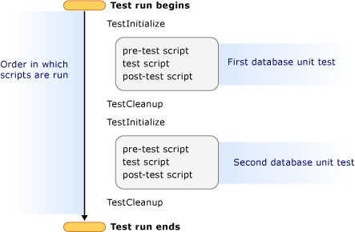

# Scripts in SQL Server Unit Tests

Each SQL Server unit test contains a single pre-test action, test action, and post-test action. Each of these actions in turn contains the following:  
  
-   A Transact\-SQL script that executes on a database.  
  
-   Zero or more test conditions that evaluate the results returned from script execution.  
  
The Transact\-SQL test script in the test action is the only component that you must include in every SQL Server unit test. In addition to the test script itself, you probably also want to specify test conditions to verify whether the test script returned the value or set of values that you expected. The test action exercises or changes a particular object in that database and then evaluates that change.  
  
For each test action, you can include one pre-test action and one post-test action. Similar to the test action, each pre-test action and each post-test action contains one Transact\-SQL script and zero or more test conditions. You can use a pre-test action to make sure that the database is in a state that allows your test action to run and return meaningful results. For example, you can use a pre-test action to verify that a table contains data before the test script performs an operation on that data. After the pre-test action prepares the database and the test action returns meaningful results, the post-test action can be used to return the database to the state that it was in before the pre-test action ran. Or, in some cases, you might use the post-test action to validate the results of the test action. This is because the post-test action can have greater database privileges than the test action. For more information, see [Overview of Connection Strings and Permissions](../ssdt/overview-of-connection-strings-and-permissions.md).  
  
In addition to these three actions, there are also two test scripts (referred to as common scripts), which run before and after every SQL Server unit test runs. As a result, up to five Transact\-SQL scripts can be run during execution of a single SQL Server unit test. Only the Transact\-SQL script that is contained within the test action is required; the common scripts and the pre-test and post-test action scripts are optional.  
  
The following table provides a complete list of scripts that are associated with any SQL Server unit test.  
  
|**Action**|**Script type**|**Description**|  
|--------------|-------------------|-------------------|  
|TestInitialize|Common script (initialization)|(Optional) This script precedes all pre-test and test actions in the unit test. The TestInitialize script runs before each unit test in a given test class. This script executes using the privileged context.|  
|Pre-test|Test script|(Optional) This script is part of the unit test. The pre-test script runs before the test action within a unit test. This script executes using the privileged context.|  
|Test|Test script|(Required) This script is part of the unit test. This script might, for example, run a stored procedure that gets, inserts, or updates table values. This script executes using the execution context.|  
|Post-test|Test script|(Optional) This script is part of the unit test. The post-test script runs after an individual unit test. This script executes using the privileged context.|  
|TestCleanup|Common script (cleanup)|(Optional) This script follows the unit test. The TestCleanup script runs after all unit tests in a given test class. This script executes using the privileged context.|  
  
For more information about the different security contexts in which each of these scripts execute, see [Overview of Connection Strings and Permissions](../ssdt/overview-of-connection-strings-and-permissions.md) and the SQL Server unit testing permissions section in [Required Permissions for SQL Server Data Tools](../ssdt/required-permissions-for-sql-server-data-tools.md).  
  
## Order in which Scripts are Run  
It is important to understand the order in which each script runs. Although you cannot change that order, you can decide which scripts you want to run. The following illustration includes the selection of scripts that you could use in a test run that contains two SQL Server unit tests and shows the order in which they run:  
  
  
  
> [!NOTE]  
> If SQL Server database project deployment has been configured, this occurs at the start of the test run, under the privileged context connection string. For more information, see [How to: Configure SQL Server Unit Test Execution](../ssdt/how-to-configure-sql-server-unit-test-execution.md).  
  
## Initialization and Cleanup Scripts  
In the SQL Server Unit Test Designer, the TestInitialize and TestCleanup scripts are referred to as the common scripts. The earlier example assumes that the two unit tests are part of the same test class. As a result, they share the same TestInitialize and TestCleanup scripts. For all unit tests within a single test class, this is always the case. However, if your test run contains unit tests from different test classes, the common scripts for the associated test class will be run before and after the unit test runs.  
  
If you write unit tests only using the SQL Server Unit Test Designer, you might not be familiar with the concept of a test class. Each time that you create a unit test by opening the **Test** menu and clicking **New Test**, SQL Server Data Tools generates a test class. Test classes appear in **Solution Explorer** with the test name that you specified, followed by a .cs or .vb extension. Within each test class, individual unit tests are stored as test methods. However, regardless of the number of test methods (that is, unit tests), each test class can have zero or one TestInitialize and TestCleanup scripts.  
  
You can use the TestInitialize script to prepare the test database, and you can use the TestCleanup script to return the test database to a known state. For example, you could use TestInitialize to create a helper stored procedure that you run later, in the test script, to test a different stored procedure.  
  
## Pre-Test and Post-Test Scripts  
The scripts that are associated with pre-test and post-test actions are likely to vary from one unit test to the next. You can use these scripts to establish incremental changes to the database and then clean up those changes.  
  
## See Also  
[Creating and Defining SQL Server Unit Tests](../ssdt/creating-and-defining-sql-server-unit-tests.md)  
[Using Test Conditions in SQL Server Unit Tests](../ssdt/using-test-conditions-in-sql-server-unit-tests.md)  
  
