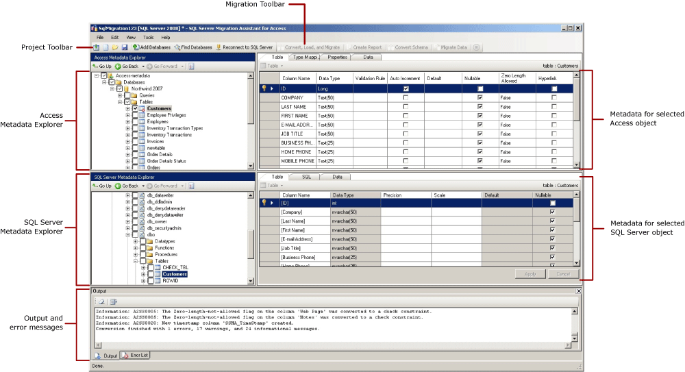

# Getting started with SQL Server Migration Assistant for Access (AccessToSQL)
[!INCLUDE[ssNoVersion](../../includes/ssnoversion-md.md)] Migration Assistant (SSMA) for Access allows you to quickly convert Access database objects to [!INCLUDE[ssNoVersion](../../includes/ssnoversion-md.md)] or Azure SQL Database objects, upload the resulting objects into [!INCLUDE[ssNoVersion](../../includes/ssnoversion-md.md)] or Azure SQL Database, and migrate data from Access to [!INCLUDE[ssNoVersion](../../includes/ssnoversion-md.md)] or Azure SQL Database. If necessary, you can also link Access tables to [!INCLUDE[ssNoVersion](../../includes/ssnoversion-md.md)] or Azure SQL Database tables so that you can continue to use your existing Access front-end applications with [!INCLUDE[ssNoVersion](../../includes/ssnoversion-md.md)] or Azure SQL Database.  
  
This topic introduces the installation process and helps to familiarize you with the SSMA user interface.  
  
## Installing SSMA  
To use SSMA, you first must install the SSMA client program on a computer that can access both the databases you want to migrate and the target instance of [!INCLUDE[ssNoVersion](../../includes/ssnoversion-md.md)] or Azure SQL Database. For installation instructions, see [Installing SQL Server Migration Assistant for Access &#40;AccessToSQL&#41;](../../ssma/access/installing-sql-server-migration-assistant-for-access-accesstosql.md).  
  
To start SSMA, click **Start**, point to **All Programs**, point to **SQL Server Migration Assistant for Access**, and then select **SQL Server Migration Assistant for Access**.  
  
## Using SSMA  
After installing SSMA, it helps to become familiar with the SSMA user interface before using the tool to migrate Access databases to [!INCLUDE[ssNoVersion](../../includes/ssnoversion-md.md)] or Azure SQL Database. The SSMA user interface, including the metadata explorers, metadata, toolbars, output pane, and error list pane are shown in the following diagram:  
  
  
  
To start a migration, create a new project, and then add Access databases to Access Metadata Explorer. You can then right-click objects in Access Metadata Explorer to perform tasks such as:
- Exporting an inventory of Access database objects to [!INCLUDE[ssNoVersion](../../includes/ssnoversion-md.md)] or Azure SQL Database.
- Creating reports that assess conversions to [!INCLUDE[ssNoVersion](../../includes/ssnoversion-md.md)] or Azure SQL Database.
- Converting Access schemas to [!INCLUDE[ssNoVersion](../../includes/ssnoversion-md.md)] or Azure SQL Database schemas.

You can also perform these tasks by using the toolbars and menus.  
  
You must also connect to an instance of [!INCLUDE[ssNoVersion](../../includes/ssnoversion-md.md)]. After a successful connection, a hierarchy of [!INCLUDE[ssNoVersion](../../includes/ssnoversion-md.md)] databases appears in [!INCLUDE[ssNoVersion](../../includes/ssnoversion-md.md)] Metadata Explorer. After you convert Access schemas to [!INCLUDE[ssNoVersion](../../includes/ssnoversion-md.md)] schemas, you can select those converted schemas in [!INCLUDE[ssNoVersion](../../includes/ssnoversion-md.md)] Metadata Explorer, and then load the schemas into [!INCLUDE[ssNoVersion](../../includes/ssnoversion-md.md)].  
  
If you have selected Azure SQL Database from the Migrate to dropdown in new project dialog box, you must connect to Azure SQL Database. After a successful connection, a hierarchy of Azure SQL Database databases appears in Azure SQL Database Metadata Explorer. After you convert Access schemas to Azure SQL Database schemas, you can select those converted schemas in Azure SQL Database Metadata Explorer, and then load the schemas into [!INCLUDE[ssNoVersion](../../includes/ssnoversion-md.md)].  
  
After you load converted schemas into [!INCLUDE[ssNoVersion](../../includes/ssnoversion-md.md)] or Azure SQL Database, you can return to Access Metadata Explorer and migrate data from Access databases into [!INCLUDE[ssNoVersion](../../includes/ssnoversion-md.md)] or Azure SQL Database databases. If necessary, you can also link Access tables to [!INCLUDE[ssNoVersion](../../includes/ssnoversion-md.md)] or Azure SQL Database tables.  
  
For more information about these tasks and how to perform them, see the following topics:  
  
-   [Preparing Access Databases for Migration](preparing-access-databases-for-migration-accesstosql.md)  
  
-   [Migrating Access Databases to SQL Server](migrating-access-databases-to-sql-server-azure-sql-db-accesstosql.md)  
  
-   [Linking Access Applications to SQL Server](linking-access-applications-to-sql-server-azure-sql-db-accesstosql.md)  
  
The following sections describe the features of the SSMA user interface.  
  
### Metadata explorers  
SSMA contains two metadata explorers that you can use to browse and perform actions on Access and [!INCLUDE[ssNoVersion](../../includes/ssnoversion-md.md)] or Azure SQL Database databases.  
  
#### Access Metadata Explorer  
Access Metadata Explorer shows information about the Access databases that have been added to the project. When you add an Access database, SSMA retrieves metadata about that database, which is the metadata that is available in Access Metadata Explorer.  
  
You can use Access Metadata Explorer to perform the following tasks:  
  
-   Browse the tables in each Access database.  
  
-   Select objects for conversion and convert the objects to [!INCLUDE[ssNoVersion](../../includes/ssnoversion-md.md)] syntax. For more information, see [Converting Access Database Objects](converting-access-database-objects-accesstosql.md).  
  
-   Select objects for data migration and migrate the data from those objects to [!INCLUDE[ssNoVersion](../../includes/ssnoversion-md.md)]. For more information, see [Migrating Access Data into SQL Server](migrating-access-data-into-sql-server-azure-sql-db-accesstosql.md).  
  
-   Link and unlink Access and [!INCLUDE[ssNoVersion](../../includes/ssnoversion-md.md)] tables.  
  
#### SQL Server or Azure SQL Database Metadata Explorer  
[!INCLUDE[ssNoVersion](../../includes/ssnoversion-md.md)] or Azure SQL Database Metadata Explorer shows information about an instance of [!INCLUDE[ssNoVersion](../../includes/ssnoversion-md.md)] or Azure SQL Database. When you connect to an instance of [!INCLUDE[ssNoVersion](../../includes/ssnoversion-md.md)] or Azure SQL Database, SSMA retrieves metadata about that instance and stores it in the project file.  
  
You can use the SQL Server or Azure SQL Database Metadata Explorer to select converted Access database objects and load (synchronize) those objects into the instance of [!INCLUDE[ssNoVersion](../../includes/ssnoversion-md.md)] or Azure SQL Database.  
  
For more information, see [Loading Converted Database Objects into SQL Server](loading-converted-database-objects-into-sql-server-accesstosql.md).  
  
### Metadata  
To the right of each metadata explorer are tabs that describe the selected object. For example, if you select a table in Access Metadata Explorer, four tabs appear: **Table**, **Type Mapping**, **Properties**, and **Data**. If you select a table in [!INCLUDE[ssNoVersion](../../includes/ssnoversion-md.md)] Metadata Explorer, three tabs appear: **Table**, **SQL**, and **Data**.  
  
Most metadata settings are read-only. However, you can alter the following metadata:  
  
-   In Access Metadata Explorer, you can alter type mappings. Be sure to make these changes before you create reports or convert schemas.  
  
-   In [!INCLUDE[ssNoVersion](../../includes/ssnoversion-md.md)] Metadata Explorer, you can alter table and index properties on the **Table** tab. Make these changes before you load the schemas into [!INCLUDE[ssNoVersion](../../includes/ssnoversion-md.md)]. For more information, see [Converting Access Database Objects](converting-access-database-objects-accesstosql.md).  
  
### Toolbars  
SSMA has two toolbars: a project toolbar and a migration toolbar.  
  
#### The project toolbar  
The project toolbar contains buttons for working with projects, adding Access database files, and connecting to [!INCLUDE[ssNoVersion](../../includes/ssnoversion-md.md)] or Azure SQL Database. These buttons resemble the commands on the **File** menu.  
  
#### The migration toolbar  
The migration toolbar contains the following commands:  
  
|Button|Function|  
|----------|------------|  
|**Convert, Load, and Migrate**|Converts Access databases, loads the converted objects into [!INCLUDE[ssNoVersion](../../includes/ssnoversion-md.md)] or Azure SQL Database, and migrates data into [!INCLUDE[ssNoVersion](../../includes/ssnoversion-md.md)] or Azure SQL Database, all in one step.|  
|**Create Report**|Converts the selected Access schema to [!INCLUDE[ssNoVersion](../../includes/ssnoversion-md.md)] or Azure SQL Database syntax, and then creates a report that shows how successful the conversion was.  This command is available only when objects are selected in Access Metadata Explorer.|  
|**Convert Schema**|Converts the selected Access schema to [!INCLUDE[ssNoVersion](../../includes/ssnoversion-md.md)] or Azure SQL Database schemas.  This command is available only when objects are selected in Access Metadata Explorer.|  
|**Migrate Data**|Migrates data from the Access database to [!INCLUDE[ssNoVersion](../../includes/ssnoversion-md.md)] or Azure SQL Database. Before you run this command, you must convert the Access schemas to [!INCLUDE[ssNoVersion](../../includes/ssnoversion-md.md)] or Azure SQL Database schemas, and then load the objects into [!INCLUDE[ssNoVersion](../../includes/ssnoversion-md.md)] or Azure SQL Database.  This command is available only when objects are selected in Access Metadata Explorer.|  
|**Stop**|Stops the current process, such as converting objects to [!INCLUDE[ssNoVersion](../../includes/ssnoversion-md.md)] or Azure SQL Database syntax.|  
  
### Menus  
SSMA contains the following menus:  
  
|Menu|Description|  
|--------|---------------|  
|**File**|Contains commands for the Migration Wizard, working with projects, adding and removing Access database files, and connecting to [!INCLUDE[ssNoVersion](../../includes/ssnoversion-md.md)] or Azure SQL Database.|  
|**Edit**|Contains commands for finding and working with text in the details pages, such as copying [!INCLUDE[tsql](../../includes/tsql-md.md)] from the SQL details pane. To open the **Manage Bookmarks** dialog, on the Edit menu, click Manage Bookmarks. In the dialog, you will see a list of existing bookmarks. You can use the buttons on the right side of the dialog to manage the bookmarks.|  
|**View**|Contains the **Synchronize Metadata Explorers** command. This synchronizes the objects between Access Metadata Explorer and [!INCLUDE[ssNoVersion](../../includes/ssnoversion-md.md)] or Azure SQL Database Metadata Explorer. Also contains commands to display and hide the **Output** and **Error List** panes and an option **Layouts** to manage with the Layouts.|  
|**Tools**|Contains commands to create reports, export data, migrate objects and data, link tables, and provides access to global and project settings dialog boxes.|  
|**Help**|Provides access to SSMA Help and to the **About** dialog box.|  
  
### Output pane and Error List pane  
The **View** menu provides commands to toggle the visibility of the Output pane and the Error List pane:  
  
-   The Output pane shows status messages from SSMA during object conversion, object synchronization, and data migration.  
  
-   The Error List pane shows error, warning, and informational messages in a list that you can sort.  
  
## See also  
[Migrating Access Databases to SQL Server](migrating-access-databases-to-sql-server-azure-sql-db-accesstosql.md)  
  
