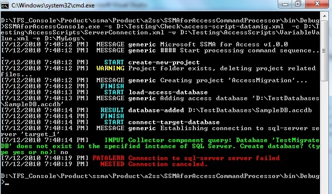

# Getting Started with SSMA for Access Console (AccessToSQL)
This section describes the procedure to launch and get started with the Access console application. Also listed, herein, are the conventions used in a typical SSMA Console output window.  
  
## Launching SSMA Console  
Use the following steps to start the SSMA console application:  
  
1.  Go to **Start** and point to **All Programs**.  
  
2.  Click the **SQL Server Migration Assistant for Access Command Prompt** shortcut.  
  
    It displays the SSMA Console usage menu and `(/? Help)`, to help you get started with the console application.  
  
## Procedure for Using the SSMA Console  
After the console is successfully launched on your Windows system, you could use the following steps to work on it:  
  
1.  Configure SSMA Console through the script files. For more information on this section, see [Creating Script Files &#40;AccessToSQL&#41;](../../ssma/access/creating-script-files-accesstosql.md).  
  
2.  [Creating Variable Value Files &#40;AccessToSQL&#41;](../../ssma/access/creating-variable-value-files-accesstosql.md)  
  
3.  [Creating the Server Connection Files &#40;AccessToSQL&#41;](../../ssma/access/creating-the-server-connection-files-accesstosql.md)  
  
4.  [Executing the SSMA Console &#40;AccessToSQL&#41;](../../ssma/access/executing-the-ssma-console-accesstosql.md) based on your project needs  
  
Additional features:  
  
1.  [Specify a password](http://msdn.microsoft.com/en-us/b099d0f9-dd37-4c87-8b6f-ed0177881ea4) and export/ import it onto other Window machines  
  
2.  [Generate Reports](http://msdn.microsoft.com/en-us/abb4264a-622e-4215-af5b-14e309b8a399) to view the detailed xml output reports for assessment /conversion and data migration. Detailed error reports can also be generated for refresh and synchronization commands.  
  
## SSMA Console Output Conventions  
Upon executing the SSMA script commands and options, the console program displays the results and messages (information, error, etc.) to the user on the console or if required, redirects to an xml output file. Each type of message in the output is signified by a unique color. For example, the text message in white color denotes script file commands; the one in green color represents a prompt for user-input, and so on.  
  
  
  
Color-interpretation of the console output in the following table:  
  
|Color|Description|  
|---------|---------------|  
|Red|Fatal error during execution|  
|Gray|Date and Time stamp, message to the user|  
|White|Script file commands, message type|  
|Yellow|Warning|  
|Green|Prompt for user-input|  
|Cyan|Start, Finish and Result of an operation|  
  
## See Also  
[Installing SQL Server Migration Assistant for Access](http://msdn.microsoft.com/en-us/dd50eebd-75df-4e0d-8c4d-88b511aae4c7)  
  
