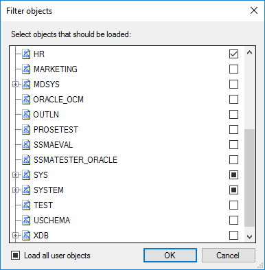
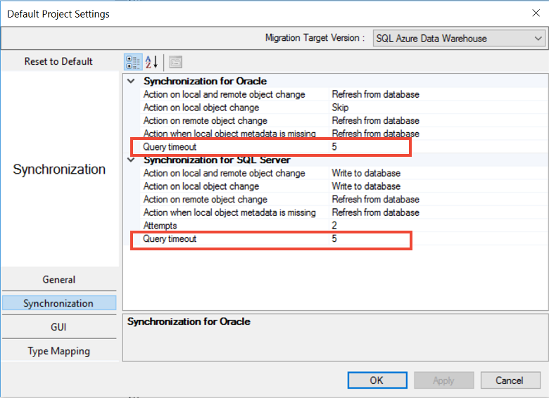
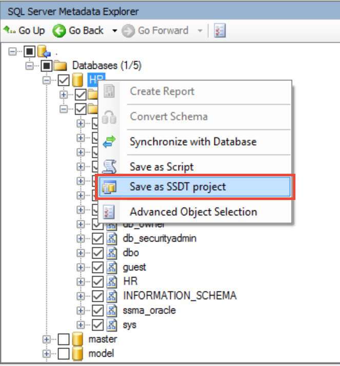

# What's New in SSMA for DB2 (DB2ToSQL)
This article lists SQL Server Migration Assistant (SSMA) for DB2 changes in each release.

## SSMA v8.1
The v8.1 release of SSMA for DB2 is enhanced to provide targeted fixes that are designed to improve quality and conversion metrics.

> [!NOTE]
> A known issue with auto-update may cause the failure of an update from SSMA v8.0 to v8.1. If you encounter this error, please download the new version and install it manually.

> [!IMPORTANT]
> With SSMA v7.4 and later versions, .Net 4.5.2 is an installation pre-requisite.

## SSMA v8.0
The v8.0 release of SSMA for DB2 is enhanced to provide targeted fixes designed to improve quality and conversion metrics. This release also offers the following new features:

* Support for **Azure SQL Database Managed Instance** as a target. You can now create new projects targeting Azure SQL Database Managed Instance:

    

*	Post-conversion **Fix advisor**. Learn more about it [here](https://blogs.msdn.microsoft.com/datamigration/2019/02/17/%20accelerate-your-oracle-migrations-with-new-machine-learning-capabilities-in-ssma/).

*	Preliminary database/schema selection.

    When connecting to the source, the user can now select databases/schemas of interest. Selecting only the schemas that you plan to migrate will save time during initial connection and improve overall SSMA performance.

    

## SSMA v7.10
The v7.10 release of SSMA for DB2 contains the following changes:
- Targeted fixes designed to provide additional security and privacy protections to meet changes in global requirements.
- A fix for conversion of BEGIN-END blocks.

## SSMA v7.9
The v7.9 release of SSMA for DB2 contains the following changes:
- Targeted fixes that improve quality and conversion metrics.
- Support in SSMA command line to alter Data Type mapping and Project Preferences.
- Support for migrating data using SQL Server Integration Services (SSIS). After converting the schema, it's possible to create an SSIS package by using a right-click context menu option.
- The Azure SQL Database connection dialog in SSMA has also been altered to specify the fully qualified server name. In previous versions of SSMA, the Azure SQL Database prefix had to be explicitly mentioned inside projects settings.

## SSMA v7.8
The v7.8 release of SSMA for DB2 contains the following changes:
- Change type mapping highlighted in Project Settings.
- The ability for users to disable telemetry.

## SSMA v7.7
The v7.7 release of SSMA for DB2 contains the following changes:
- Targeted fixes that improve quality and conversion metrics.
- Based on the popular demand, the 32-bit version of SSMA for DB2 is back. Compared to the previous implementation (prior to v7.4), there are two installer packages, but they can't be installed side by side. As a result, you must choose the most appropriate version based on the connectivity components you have. It's always preferable to use the 64-bit version, if possible.

## SSMA v7.6
The v7.6 release of SSMA for DB2 is enhanced with targeted fixes that improve quality and conversion metrics and with support for SQL Server 2017 (public preview). Support for SQL Server 2017 on Windows and Linux is in public preview and shouldn't be used for production migrations.

## SSMA v7.5
The v7.5 release of SSMA for DB2 is enhanced with several improvements to ensure greater accessibility for people with disabilities.

## SSMA v7.4
The v7.4 release of SSMA for DB2 contains the following changes:
- The **Query timeout** option is now available during schema object discovery at source and target.

    

- The quality and conversion metric has been improved with targeted fixes, based on customer feedback.

> [!IMPORTANT]
> .Net 4.5.2 is a pre-requisite for installing SSMA v7.4. In addition, beginning with v7.4, the 32-bit version of SSMA has been discontinued.

## SSMA v7.3
The v7.3 release of SSMA for DB2 contains the following changes:
- Improved quality and conversion metric with targeted fixes based on customer feedback.
- SSMA extensibility framework exposed via the following items:
  - Export functionality to a SQL Server Data Tools (SSDT) project.
    - You can now export schema scripts from SSMA to an SSDT project. You can use the schema scripts to make additional schema changes and deploy your database.

        
  - Libraries that can be consumed by SSMA for performing custom conversions.
    - You can now construct code that can handle custom syntax conversions and conversions that weren't previously handled by SSMA.
      - Instructions on how to construct a custom converter are available in this blog post, [Extending SQL Server Migration Assistant's conversion capabilities](https://blogs.msdn.microsoft.com/datamigration/2017/02/21/2185/).
      - Download a sample project for conversion from this [blog post](https://blogs.msdn.microsoft.com/datamigration/ssmafororacleconversionsample/).

## SSMA v7.2
The v7.2 release of SSMA for DB2 contains the following changes:
- Improved quality and conversion metric with targeted fixes based on customer feedback.
- Telemetry enhancements to provide better data points to troubleshoot customer issues and improve SSMA's conversion rates.

## SSMA v7.1
The v7.1 release of SSMA for DB2 contains the following changes:
- SQL Server 2017 on Windows and Linux CTP1 is now a supported target platform for migration. This feature is in technical preview and allows schema and data movement to target SQL servers.
- Support for automatic updates to download the latest version of SSMA as soon as it's available.
- SSMA installable binaries are now delivered through Windows installer package files (.msi).

**Resources**

[Extending SQL Server Migration Assistant's conversion capabilities](https://blogs.msdn.microsoft.com/datamigration/2017/02/21/2185/)

[Assess and migrate data from non Microsoft data platforms to SQL Server *(with Oracle example)*](https://blogs.msdn.microsoft.com/datamigration/2016/11/16/sql-server-migration-assistant-how-to-assess-and-migrate-databases-from-non-microsoft-data-platforms-to-sql-server/) 

## May 2016  
The May 2016 release of SSMA for DB2 contains the following changes:  

-  Added support for SQL Server 2016.
-  Added conversion of DB2 in-memory and regular tables to SQL Server in-memory and hekaton features.
-  Added conversion of DB2 access controls to SQL Server Policy objects (Row Level Security for DB2).
-  Added conversion of DB2 system-versioned tables to SQL Server temporal tables.
-  Improved DB2 parser and resolver.
-  Removed installer check for .Net 2.0.
-  Removed unnecessary *.dll from Db2 installer.
-  Fixed "save project" and "open project" commands for SSMA Console.
-  Fixed "securepassword" command for SSMA Console.
-  Fixed counting of objects for initial loading.
-  Fixed bug in global settings.
  
## March 2016  
The March 2016 preview release of SSMA for DB2 adds support for migration to SQL Server 2016.

## January 2016  
The January 2016 maintenance release of SSMA for DB2 contains the following changes:  
  
-  Added support for a number of standard functions.  
-  Fixed DB2 Parser Errors.  
-  Fixed DB2 v9 zOS Support (RFC 5690920).  
-  Fixed DB2 unresolved identifier errors during conversion.  
-  Added View Log Menu Item to SSMA (RFC 5706203).  
-  Added Telemetry.
  
## November 2014  
The November 2014 release of SSMA for DB2 was the initial release.
