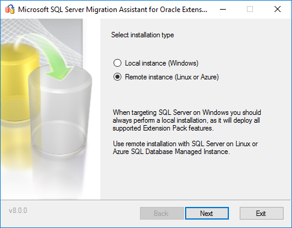
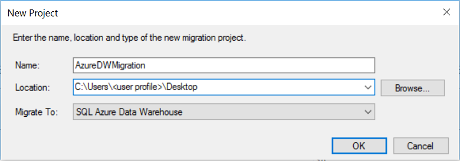
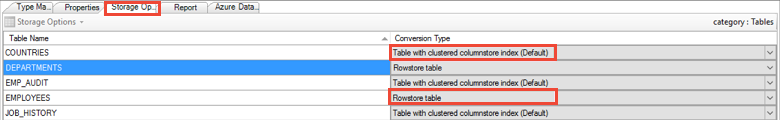
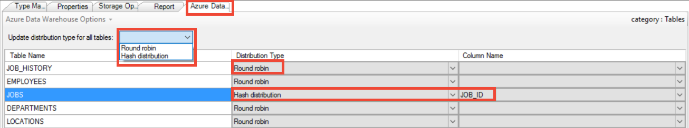

# What's New in SSMA for Oracle (OracleToSQL)
This article lists SQL Server Migration Assistant (SSMA) for Oracle changes in each release.

## SSMA v8.0
The v8.0 release of SSMA for Oracle has been enhanced to provide targeted fixes designed to improve quality and conversion metrics. This release also offers the following new features:

* Support for **Azure SQL Database Managed Instance** as a target. You can now create new projects targeting Azure SQL Database Managed Instance:

  

    > [!NOTE]
    > The SSMA for Oracle Extension Pack was also updated to allow remote installations on Azure SQL Database Managed Instance:
    >
    > 

    Some features, including Tester and Server-side data migration, aren't supported when targeting Azure SQL Database Managed Instance. Read more about it [here](https://blogs.msdn.microsoft.com/datamigration/2019/02/17/migrate-your-oracle-database-to-azure-sql-database-managed-instance-using-ssma-8-0/).

*	Post-conversion **Fix advisor**. Learn more about it [here](https://blogs.msdn.microsoft.com/datamigration/2019/02/17/%20accelerate-your-oracle-migrations-with-new-machine-learning-capabilities-in-ssma/).

* Preliminary database/schema selection.

    When connecting to the source, the user can now select databases/schemas of interest. Selecting only the schemas that you plan to migrate will save time during initial connection and improve overall SSMA performance.

    

* The ability to use the official, managed NET driver to connect to Oracle. The OCI driver is no longer a prerequisite for using SQL Server Migration Assistant for Oracle.

* The ability to map ROWID and UROWID to VARCHAR by default. Changed from ‘uniqueidentifier’ to accommodate data migration for explicit ROWID columns.

> [!IMPORTANT]
> With SSMA v7.4 and later versions, .Net 4.5.2 is an installation pre-requisite.

## SSMA v7.10
The v7.10 release of SSMA for Oracle contains the following changes:
- Targeted fixes designed to provide additional security and privacy protections to meet changes in global requirements.
- A conversion improvement related to hierarchical queries.

> [!IMPORTANT]
> With SSMA v7.4 and later versions, .Net 4.5.2 is an installation pre-requisite.

## SSMA v7.9
The v7.9 release of SSMA for Oracle contains the following changes:
- Targeted fixes that improve quality and conversion metrics.
- Support for migrating "Continue" statements from Oracle to SQL Server.
- Support in SSMA command line to alter Data Type mapping and Project Preferences.
- Support for migrating data using SQL Server Integration Services (SSIS). After converting the schema, it's possible to create an SSIS package by using a right-click context menu option.
- The Azure SQL Database connection dialog in SSMA has also been altered to specify the fully qualified server name. In previous versions of SSMA, the Azure SQL Database prefix had to be explicitly mentioned inside projects settings.

> [!IMPORTANT]
> With SSMA v7.4 and later versions, .Net 4.5.2 is an installation pre-requisite.

## SSMA v7.8
The v7.8 release of SSMA for Oracle contains the following changes:
-	Added support for:
    - Row expression for the IN clause.
    - Implicit type casts.
    - UID conversion for Azure SQL Database.
- Highlighted change type mapping in Project Settings.
- Provided the ability for users to disable telemetry.

> [!IMPORTANT]
> With SSMA v7.4 and later versions, .Net 4.5.2 is an installation pre-requisite.

## SSMA v7.7
The v7.7 release of SSMA for Oracle contains the following changes:
- SSMA for Oracle has been enhanced with targeted fixes that improve quality and conversion metrics.
- Based on the popular demand, the 32-bit version of SSMA for Oracle is back. Compared to the previous implementation (prior to v7.4), there are two installer packages, but they can't be installed side by side. As a result, you must choose the most appropriate version based on the connectivity components you have. It's always preferable to use the 64-bit version, if possible.
- SQL Server 2017 support is now official with the Oracle Extension Pack supported on Linux as well (new remote installation option). Note that Extension Pack functionality is limited when installed on Linux, as the tester and server-side data migration features aren't supported.
- SSMA for Oracle allows you to migrate Materialized Views as regular tables (configurable through the settings at **Project Settings** -> **Synchronization** -> **Discover backing tables for Materialized Views**).

> [!IMPORTANT]
> With SSMA v7.4 and later versions, .Net 4.5.2 is an installation pre-requisite.

## SSMA v7.6
The v7.6 release of SSMA for Oracle has been enhanced with targeted fixes that improve quality and conversion metrics and with support for SQL Server 2017 (public preview). Support for SQL Server 2017 on Windows and Linux is in public preview and shouldn't be used for production migrations.

> [!IMPORTANT]
> With SSMA v7.4 and later versions, .Net 4.5.2 is an installation pre-requisite, and the 32-bit version of the tool has been discontinued.

## SSMA v7.5
The v7.5 release of SSMA for Oracle contains the following changes:
- Enhanced with several improvements to ensure greater accessibility for people with disabilities.
- Updated to improve the quality and conversion metric with targeted fixes, such as improved handling of date and float data types during data migration, based on customer feedback.

> [!IMPORTANT]
> .Net 4.5.2 is a pre-requisite for installing SSMA v7.5. In addition, beginning with v7.4, the 32-bit version of SSMA is being discontinued.

## SSMA v7.4
The v7.4 release of SSMA for Oracle contains the following changes:

- SSMA for Oracle now supports Azure SQL Data Warehouse as a target platform for migration.

    
  - Supports the Data Warehouse storage options as shown in the following image:

    
  - Supports the data distribution options as shown in the following image:

    

- The **Query timeout** option is now available during schema object discovery at source and target.

    

- The quality and conversion metric has been improved with targeted fixes, based on customer feedback.

> [!IMPORTANT]
> .Net 4.5.2 is a pre-requisite for installing SSMA v7.4. In addition, beginning with v7.4, the 32-bit version of SSMA is being discontinued.

## SSMA v7.3
The v7.3 release of SSMA for Oracle contains the following changes:
- Improved quality and conversion metric with targeted fixes based on customer feedback.
- SSMA extensibility framework exposed via the following items:
  - Export functionality to a SQL Server Data Tools (SSDT) project.
    -   You can now export schema scripts from SSMA to an SSDT project. You can use the schema scripts to make additional schema changes and deploy your database.

  - Libraries that can be consumed by SSMA for performing custom conversions.
    - You can now construct code that can handle custom syntax conversions and conversions that weren't previously handled by SSMA.
      - Instructions on how to construct a custom converter are available in this blog post, [Extending SQL Server Migration Assistant's conversion capabilities](https://blogs.msdn.microsoft.com/datamigration/2017/02/21/2185/).
      - Download a sample project for conversion from this [blog post](https://blogs.msdn.microsoft.com/datamigration/ssmafororacleconversionsample/).

## SSMA v7.2
The v7.2 release of SSMA for Oracle contains the following changes:
- Improved quality and conversion metric with targeted fixes based on customer feedback.
- Telemetry enhancements to provide better data points to troubleshoot customer issues and improve SSMA's conversion rates.

## SSMA v7.1
The v7.1 release of SSMA for Oracle contains the following changes:
- SQL Server 2017 on Windows and Linux CTP1 is now a supported target platform for migration. This feature is in technical preview and allows schema and data movement to target SQL servers.
- SSMA now supports automatic updates to download the latest version of SSMA as soon as it's available.
- SSMA installable binaries are now delivered through Windows installer package files (.msi).

**Resources**

[Extending SQL Server Migration Assistant's conversion capabilities](https://blogs.msdn.microsoft.com/datamigration/2017/02/21/2185/)

[Assess and migrate data from non Microsoft data platforms to SQL Server *(with Oracle example)*](https://blogs.msdn.microsoft.com/datamigration/2016/11/16/sql-server-migration-assistant-how-to-assess-and-migrate-databases-from-non-microsoft-data-platforms-to-sql-server/) 

## May 2016  
The May 2016 release of SSMA for Oracle contains the following changes:  

- Added support for SQL Server 2016.
- Added conversion of Oracle flashback archive tables to SQL Server temporal tables.

    **Note** - SSMA doesn't copy history data from Oracle Flashback Data Archive tables. As a result, the history data must be copied manually during the migration process. In addition, while SSMA doesn't display the history table in the SQL Server metadata explorer because it's treated as a system table, you can view the history table in SQL Server Management Studio.
    SQL Server 2016 doesn't support several Oracle Flashback features, including:
    - Oracle Flashback Transaction Query
    - DBMS_FLASHBACK Package
    - Flashback Transaction
    - Flashback Data Archive
    - Flashback Table
    - Flashback Drop
    - Flashback Database
- Added conversion of Oracle VPD Policy to SQL Server Policy objects (Row Level Security for Oracle).
- Decreased time of initial loading for Oracle.
- Improved parser and resolver.
- Removed installer check for .Net 2.0.
- Updated Extension Pack dependency from .Net 3.5 to .Net 4.0.
- Fixed "save project" and "open project" commands for SSMA Console.
- Fixed "securepassword" command for SSMA Console.
- Fixed counting of objects for initial loading.
- Fixed converting of character data types for Oracle.
- Fixed bug in global settings.
  
## March 2016  
The March 2016 preview release of SSMA for Oracle contains the following changes:  
  
-   Added support for migration to SQL Server 2016.  
-   Added support for migrating Oracle Row Level Security (with some limitations).  
-   Added support for migrating Oracle in memory tables to SQL Server Column Store.  
  
## January 2016  
The January 2014 Maintenance release of SSMA for Oracle contains the following changes:  
  
-   Added support for Clustered Indexes.  
-   Fixed slow Oracle schema queries (RFC 5076207).  
-   Fixed connect to Azure from console.  
-   Added View Log Menu Item to SSMA (RFC 5706203). 
-   Added Telemetry.  
  
## July 2014  
The July 2014 release of SSMA for Oracle contains the following changes:  
  
-   Added support for Azure SQL DB.  
-   Extension pack functionality moved to schema to support Azure SQL DB.  
-   Added support for Oracle Materialized views.  
-   Added support for SQL Server 2014 Memory optimized tables.  
-   Included performance improvements tested for databases with over 10k objects.  
-   Added UI improvements for dealing with large number of objects.  
-   Added highlighting of "well known" LOB schemas.  
-   Included conversion speed improvements.  
-   Added support for showing object counts in UI.  
-   Reduced report size by more than 25%.
-   Improved error messages for unparsed constructs.  
  
## April 2014  
The April 2014 release of SSMA for Oracle contains the following changes:  
  
-   Added support of MS SQL Server 2014.  
-   Added support of Oracle 12 and query optimization.  
-   Fixed bugs regarding conversion to Azure.  
-   Fixed bugs regarding invisible report pages in IE 10.  
  
## January 2012  
The January 2012 release of SSMA for Oracle contains the following changes:  
  
-   Added support for RowType and RecordType input parameters defaulted to NULL.  
  
## July 2011  
The July 2011 release of SSMA for Oracle contains the following changes:  
  
-   Added support for conversion of Oracle sequence to [!INCLUDE[ssNoVersion](../../includes/ssnoversion-md.md)] "Denali" sequence generator.  
-   Improved error reporting during data migration.  
-   Improved conversion of statement using reserved words.  
-   Improved implicit conversion of date value in a function.  
  
## April 2011  
The April 2011 release of SSMA for Oracle contains the following changes:  
  
-   Consolidated "SSMA for Oracle" product, which supports [!INCLUDE[ssNoVersion](../../includes/ssnoversion-md.md)] 2005, [!INCLUDE[ssNoVersion](../../includes/ssnoversion-md.md)] 2008 and [!INCLUDE[ssNoVersion](../../includes/ssnoversion-md.md)] "Denali."  
-   Added support for connecting and migrating to [!INCLUDE[ssNoVersion](../../includes/ssnoversion-md.md)] "Denali."  
-   Enhanced client-side data migration engine, supporting parallel migration of data.  
-   Improved data migration performance with Simple and Bulk logged recovery models.  
-   Added support for backward compatibility of projects created by earlier versions of SSMA (v4.0 and v4.2).  
-   Added the ability to install SSMA for Oracle v5.0 product side by side (SxS) with older versions of SSMA (v4.0 and v4.2).  
-   Added support for reporting User-Defined Types (includes subtype, VARRAY, NESTED TABLE, object table, and object view) and their usages in PL/SQL blocks with special error messages.  

## July 2010  
The July 2010 release of SSMA for Oracle contains the following changes:  
  
-   Added support for migrating to SQL Server 2008 R2.  
-   Added a new SSMA Console application for command-line execution.  
-   Added support for Data Migration using both Server-Side and Client-Side Data Migration Engines.  
-   Added support for "Custom SELECT" statement in data migration.  
-   Added support for migrating from Oracle 11g R2.  
  
## June 2008  
The June 2008 release of SSMA for Oracle contains the following changes:  
  
-   Added improvements to the Assessment Report, including additional information for synonyms, raw source for parsable objects, panels and SQL Server logo removal, and layout persistence.  
-   Added improvements in object conversion:  
    -   Packages DBMS_LOB, DBMS_SQL conversion added.  
    -   Joins conversion revised.  
    -   Modification of collections and records conversion, now conversion of records in simple cases released via separate variables for each field.  
    -   Improvements of records and collections implementation.  
    -   Windowing aggregation functions added.  
    -   ROLLUP/CUBE clause added.  
    -   Improvement for NEXTVAL/CURVAL.  
    -   Columns grouping in SET clause, Grouping sets, and grouping ID were added.  
    -   MERGE statement added.  
    -   Support of new datetime types and conversion of records and collections as CLR data types added.  
-   Added new features of Tester. Tables now can be tested as objects using Tester, a call order of several testable objects in test case can be altered, user can test procedures and functions with records and collections as parameters and return values, and a dependencies analyzer was added to check only used tables.  
  
## August 2007  
The August 2007 release of SSMA for Oracle contains the following changes:  
  
-   Added a new TESTER component lets you create, manage, and run test cases to verify converted SQL code.  
-   Added support for conversion of Oracle subtypes, collections, and local modules have been added to SQL converter.  
-   Added a new synchronization feature lets you synchronize specific objects with SQL Server database.  
-   Added new conversion options.  
  
## April 2007  
The April 2007 release of SSMA for Oracle was the initial release.
