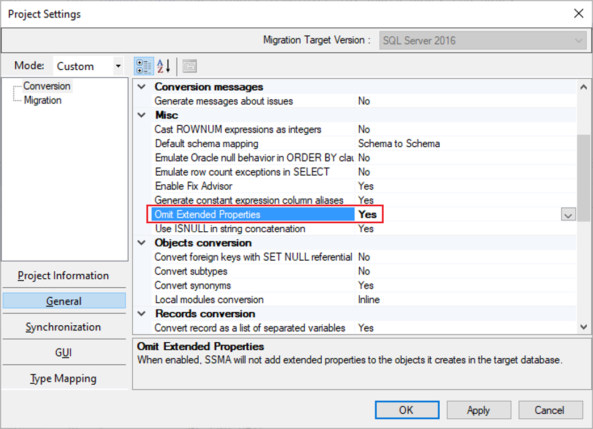

# What's New in SSMA for Oracle (OracleToSQL)

This article lists SQL Server Migration Assistant (SSMA) for Oracle changes in each release.

## SSMA v9.2

The v9.2 release of SSMA for Oracle contains the following changes:
 * Added Support for legacy unicode string literals
 * Added Support for arbitary expressions in ESCAPE clause
 * Conversion Support for EXTRACT(XML) and XMLQUERY
 * Enhanced data pipeline monitoring for at scale migration
 * Conversion Support for EXTRACT(XML),EXTRACTVALUE and XMLQUERY
 * Support for Azure Data Factory (ADF) pipeline monitoring

## SSMA v9.1

The v9.1 release of SSMA for Oracle contains the following changes:

* Support for at scale data migration from Oracle to SQL with integration of Azure Data factory
* Add support for exclusion of system generated invisble column for conversion and data migration 
* Improve get help experience

## SSMA v9.0

The v9.0 release of SSMA for Oracle contains the following changes:

* Add support for VARRAY and TABLE  user defined types at schema level
* Add support for conversion for arguments, parameter and local declaration for user defined types

## SSMA v8.24

The v8.24 release of SSMA for Oracle contains the following changes:

* Add support for LISTAGG function
* Add support for Oracle compound triggers
* Improve detection logic for JOIN clause and PIPELINED functions
* Improve naming for "Save As" statements

## SSMA v8.23

The v8.23 release of SSMA for Oracle contains the following changes:

* Support for mapping of DATE type from Oracle to the SQL Server DATE type in the Type Mapping setting
* Support for table partition added for Azure SQL Database targets with all table partition mapped to primary filegroup
* New option "Allow Statements from Files", for adding statements from file system
* Enhanced XML output when running in console mode
* New "Feedback" link in reports to send feedback
* In reports, enhanced visualization experience

## SSMA v8.22

The v8.22 release of SSMA for Oracle contains the following changes:

* Allow to specify additional connection string options for target database connection
* Introduce summary charts in assessment reports
* Improve messages navigation in assessment reports

## SSMA v8.21

The v8.21 release of SSMA for Oracle contains the following changes:

* Fix OLE DB connection string mode to respect the provider name
* Add missing `ssma_oracle.fn_getColEntryByRange` emulation function
* Use `COUNT_BIG` in row count queries for the target database
* Add setting to emulate Oracle's empty string behavior in coalesce operations

## SSMA v8.20

The v8.20 release of SSMA for Oracle contains the following changes:

* Add support for partitioned tables
* Add conversion of SKIP LOCKED clause

## SSMA v8.19

The v8.19 release of SSMA for Oracle contains the following changes:

* Store and run test cases on the client-side
* Improve resolution logic in `SELECT` list when user-defined column names match system functions
* Ignore system-defined columns (`SYS_STS*`) and indexes (`SYS_IL*`)
* Fix issue with packages disappearing from the objects tree after reconnect to Oracle database
* Fix CLR assemblies deployment issue on [!INCLUDE [ssazure](../../includes/ssazure_md.md)] in 32-bit SSMA package

## SSMA v8.18

The v8.18 release of SSMA for Oracle contains the following changes:

* Fix sequences loading for Oracle 12c Release 1 (12.1)

## SSMA v8.17

The v8.17 release of SSMA for Oracle contains the following changes:

* Add support for computed columns
* Fix parser issues when culture-specific operator characters are used in expressions
* Update HTML assessment reports to use modern editor to display SQL text

## SSMA v8.16

The v8.16 release of SSMA for Oracle contains the following changes:

* Add support for identity columns
* Remove support for legacy parser
* Fix issue with objects not refreshing from database

## SSMA v8.15

In addition to several accessibility improvements, the v8.15 release of SSMA for Oracle contains the following changes:

* Add setting to use full type specification for `%type` and `%rowtype` attributes
* Revamp assessment reports to work in modern browsers
* Use authority provided by the database for Azure AD authentication
* Improve naming for statements loaded from files

## SSMA v8.14

In addition to several improvements to ensure greater accessibility for people with disabilities, the v8.14 release of SSMA for Oracle contains the following changes:

* Stores full source/target server version in the project metadata (requires project upgrade)
* Use DBA data dictionaries for objects discovery when possible
* Fix multiple parsers issues (`PIVOT`/`UNPIVOT`, `MERGE`, alternative quoting)
* Fix conversion of `INSERTING`/`DELETING`/`UPDATING` special functions in triggers

## SSMA v8.13

The v8.13 release of SSMA for Oracle contains the following changes:

* Fix conversion of `SQLCODE` and `SQLERRM` special functions in local procedures
* Consider implicit type casts when converting procedure and function calls
* Improve logging for source connection string to help troubleshoot connection issues

## SSMA v8.12

The v8.12 release of SSMA for Oracle contains the following changes:

* Support for subquery factoring clauses within `INSERT`/`UPDATE`/`MERGE`/`DELETE` statements
* Conversion message for `ON DELETE SET NULL` clause in cases of multi-path or circular references
* Improved conversion of cursors created from dynamic SQL string
* Update ODP.NET to v19.8

## SSMA v8.11

The v8.11 release of SSMA for Oracle contains the following changes:

* Support for subqueries in `INSERT ... VALUES` statement
* Improved conversion of `COMMIT` statement
* Fix bug in `CONNECT BY LEVEL` clause conversion
* Updated parser error recovery logic to be less greedy
* Use MSAL.NET library for interactive Azure Active Directory authentication

## SSMA v8.10

The v8.10 release of SSMA for Oracle contains minor performance improvements as well as the following changes:

* Fix for the Tester issue with index-organized tables
* Fix for the names of extended stored procedures in extension pack

## SSMA v8.9

The v8.9 release of SSMA for Oracle contains the following changes:

* Conversion of dynamic SQL string literals
* Conversion for `LAG`, `FIRST_VALUE` and `LAST_VALUE` analytical functions
* Add support for basic `ALTER TRIGGER`/`ALTER INDEX` DDL (enable/disable, etc.)
* Improved conversion for columns that match built-in function names
* Generate filtered unique indexes for `NULL`-able columns
* Improved variable declaration conversion for Azure Synapse Analytics
* Fix for the issue with special characters in project name

## SSMA v8.8

The v8.8 release of SSMA for Oracle includes:

* SQL Server objects synchronization stability improvements
* GUI performance improvements during assessment and conversion
* Improved conversion of analytical `OVER PARTITION` clauses
* New conversion for `LEAD` analytical function
* New conversion for subquery factoring clauses
* New `REPLICATE` distribution option for Azure Synapse Analytics
* Brand new Oracle syntax parser to further improve conversion performance

## SSMA v8.7

The v8.7 release of SSMA for Oracle has minor fixes and performance improvements in graphical user interface.

In addition, SSMA for Oracle now allows to filter objects based on validity state in 'Advanced Object Selection' dialog.

> [!IMPORTANT]
> With SSMA v8.5 and later, .NET 4.7.2 is an installation pre-requisite. If you need to install this version, you can download the runtime file from [here](https://dotnet.microsoft.com/download/dotnet-framework/net472).

## SSMA v8.6

In addition to a targeted set of fixes designed to improve usability and performance, the v8.6 release of SSMA for Oracle has been enhanced by adding a setting that enables users to omit SSMA extended properties in the converted code.

To leverage this setting, in SSMA for Oracle, navigate to **Tools** > **Project Settings** > **General** > **Conversion**, and then under **Misc**, update the value of the **Omit Extended Properties** setting to **Yes**.

In addition, SSMA for Oracle now provides improved parsing of the `XMLTABLE` clause.

> [!IMPORTANT]
> With SSMA v8.5 and later, .NET 4.7.2 is an installation pre-requisite. If you need to install this version, you can download the runtime file from [here](https://dotnet.microsoft.com/download/dotnet-framework/net472).

## SSMA v8.5

The v8.5 release of SSMA for Oracle is enhanced with support for Azure Active Directory authentication and basic support for JSON features in SQL server, together with a targeted set of fixes designed to improve usability and performance.

In addition, SSMA for Oracle has been enhanced with support for:

* Limiting the number of selected objects for discovery to 990 (Oracle's `WHERE .. IN (..)` clause limit is 1000 items).
* Data migration from `RAW` to `UNIQUEIDENTIFIER`.
* Parsing of `PARALLEL_ENABLE` clause.

Finally, the v8.5 release of SSMA for Oracle now provides:

* Improved performance of converted packaged constants.
* An update for Oracle Data Provider for .NET to version 19.5.0.

> [!IMPORTANT]
> With SSMA v8.5, .NET 4.7.2 is an installation pre-requisite. If you need to install this version, you can download the runtime file from [here](https://dotnet.microsoft.com/download/dotnet-framework/net472).

## SSMA v8.4

The v8.4 release of SSMA for Oracle is enhanced with targeted fixes that are designed to address accessibility issues and fix a bug related to max index columns (to allow 32 instead of 16) for SQL Server 2016 and later versions.

In addition, this release of SSMA for Oracle adds conversion for `SYS_REFCURSOR` as stored procedure `OUT` parameters.

> [!IMPORTANT]
> With SSMA versions 7.4 through 8.4, .NET 4.5.2 is an installation pre-requisite.

## SSMA v8.3

The v8.3 release of SSMA for Oracle is enhanced with targeted fixes that are designed to improve quality and conversion metrics. In addition, this release of SSMA for Oracle provides fixes that:

* Address accessibility issues.
* Add basic support for `hierarchyid` type in SQL Server.
* Address an issue with an unknown return type for a function called through synonym.
* Update ODP.NET to v19.3.

## SSMA v8.2

The v8.2 release of SSMA for Oracle is enhanced to:

* Add support for `DBMS_OUTPUT.ENABLE`/`DISABLE`.
* Remove `CAST AS FLOAT` for `BINARY_FLOAT` and `BINARY_DOUBLE` columns in default data migration query.
* Fix sequences refresh if the current value has changed.
* Fix bug related to misinterpretation of pseudo-columns (`ROWNUM`, etc.) if a column with the same name exists.
* Fix a crash that occurs converting `FOR` loops with ambiguous unresolved identifier.

In addition, this version includes a targeted set of fixes designed to improve quality and conversion metrics, as well as fixes for:

* An issue with disabled non-clustered indexes after data migration.
* Detection of .NET Framework during silent installation.
* An intermittent crash that occurs when a new version is downloaded.

> [!NOTE]
> A known issue with auto-update may cause the failure of an update from SSMA v8.1 to v8.2. If you encounter this error, please download the new version and install it manually.

## SSMA v8.1

The v8.1 release of SSMA for Oracle is enhanced with targeted fixes that are designed to improve quality and conversion metrics.

> [!NOTE]
> A known issue with auto-update may cause the failure of an update from SSMA v8.0 to v8.1. If you encounter this error, please download the new version and install it manually.

## SSMA v8.0

The v8.0 release of SSMA for Oracle is enhanced with targeted fixes designed to improve quality and conversion metrics. This release also offers the following new features:

* Support for **Azure SQL Managed Instance** as a target. You can now create new projects targeting Azure SQL Managed Instance:

  

  > [!NOTE]
  > The SSMA for Oracle Extension Pack was also updated to allow remote installations on Azure SQL Managed Instance:
  >
  > 

  Some features, including Tester and Server-side data migration, are not supported when targeting Azure SQL Managed Instance. Read more about it [here](https://blogs.msdn.microsoft.com/datamigration/2019/02/17/migrate-your-oracle-database-to-azure-sql-database-managed-instance-using-ssma-8-0/).

* Post-conversion **Fix advisor**. Learn more about it [here](https://blogs.msdn.microsoft.com/datamigration/2019/02/17/%20accelerate-your-oracle-migrations-with-new-machine-learning-capabilities-in-ssma/).

* Preliminary database/schema selection.

  When connecting to the source, the user can now select databases/schemas of interest. Selecting only the schemas that you plan to migrate will save time during initial connection and improve overall SSMA performance.

  

* The ability to use the official, managed .NET driver to connect to Oracle. The OCI driver is no longer a prerequisite for using SQL Server Migration Assistant for Oracle.

* The ability to map `ROWID` and `UROWID` to `VARCHAR` by default. Changed from `uniqueidentifier` to accommodate data migration for explicit `ROWID` columns.

## SSMA v7.10

The v7.10 release of SSMA for Oracle contains the following changes:

* Targeted fixes designed to provide additional security and privacy protections to meet changes in global requirements.
* A conversion improvement related to hierarchical queries.

## SSMA v7.9

The v7.9 release of SSMA for Oracle contains the following changes:

* Targeted fixes that improve quality and conversion metrics.
* Support for migrating "Continue" statements from Oracle to SQL Server.
* Support in SSMA command line to alter Data Type mapping and Project Preferences.
* Support for migrating data using SQL Server Integration Services (SSIS). After converting the schema, it's possible to create an SSIS package by using a right-click context menu option.
* The Azure SQL Database connection dialog in SSMA has also been altered to specify the fully qualified server name. In previous versions of SSMA, the Azure SQL Database prefix had to be explicitly mentioned inside projects settings.

## SSMA v7.8

The v7.8 release of SSMA for Oracle contains the following changes:

* Support for:
  * Row expression for the `IN` clause.
  * Implicit type casts.
  * `UID` conversion for Azure SQL Database.
* Change type mapping highlighted in **Project Settings**.
* The ability for users to disable telemetry.

## SSMA v7.7

The v7.7 release of SSMA for Oracle contains the following changes:

* SSMA for Oracle has been enhanced with targeted fixes that improve quality and conversion metrics.
* Based on the popular demand, the 32-bit version of SSMA for Oracle is back. Compared to the previous implementation (before v7.4), there are two installer packages, but they can't be installed side by side. As a result, you must choose the most appropriate version based on the connectivity components you have. It's always preferable to use the 64-bit version, if possible.
* SQL Server 2017 support is now official with the Oracle Extension Pack supported on Linux as well (new remote installation option). Note that Extension Pack functionality is limited when installed on Linux, as the tester and server-side data migration features aren't supported.
* SSMA for Oracle allows you to migrate Materialized Views as regular tables (configurable through the settings at **Project Settings** -> **Synchronization** -> **Discover backing tables for Materialized Views**).

## SSMA v7.6

The v7.6 release of SSMA for Oracle is enhanced with targeted fixes that improve quality and conversion metrics and with support for SQL Server 2017 (public preview). Support for SQL Server 2017 on Windows and Linux is in public preview and shouldn't be used for production migrations.

## SSMA v7.5

The v7.5 release of SSMA for Oracle contains the following changes:

* Enhanced with several improvements to ensure greater accessibility for people with disabilities.
* Updated to improve the quality and conversion metric with targeted fixes, such as improved handling of date and float data types during data migration, based on customer feedback.

## SSMA v7.4

The v7.4 release of SSMA for Oracle contains the following changes:

* SSMA for Oracle now supports Azure Synapse Analytics as a target platform for migration.

  
  * Supports the Data Warehouse storage options as shown in the following image:

  
  * Supports the data distribution options as shown in the following image:

  

* The **Query timeout** option is now available during schema object discovery at source and target.

  

* The quality and conversion metric has been improved with targeted fixes, based on customer feedback.

> [!IMPORTANT]
> .NET 4.5.2 is a pre-requisite for installing SSMA v7.4. In addition, beginning with v7.4, the 32-bit version of SSMA is being discontinued.

## SSMA v7.3

The v7.3 release of SSMA for Oracle contains the following changes:

* Improved quality and conversion metric with targeted fixes based on customer feedback.
* SSMA extensibility framework exposed via the following items:
  * Export functionality to a SQL Server Data Tools (SSDT) project.
    * You can now export schema scripts from SSMA to an SSDT project. You can use the schema scripts to make additional schema changes and deploy your database.

      
  * Libraries that can be consumed by SSMA for performing custom conversions.
    * You can now construct code that can handle custom syntax conversions and conversions that weren't previously handled by SSMA.
      * Instructions on how to construct a custom converter are available in this blog post, [Extending SQL Server Migration Assistant's conversion capabilities](https://blogs.msdn.microsoft.com/datamigration/2017/02/21/2185/).
      * Download a sample project for conversion from this [blog post](https://blogs.msdn.microsoft.com/datamigration/ssmafororacleconversionsample/).

## SSMA v7.2

The v7.2 release of SSMA for Oracle contains the following changes:

* Improved quality and conversion metric with targeted fixes based on customer feedback.
* Telemetry enhancements to provide better data points to troubleshoot customer issues and improve SSMA's conversion rates.

## SSMA v7.1

The v7.1 release of SSMA for Oracle contains the following changes:

* SQL Server 2017 on Windows and Linux CTP1 is now a supported target platform for migration. This feature is in technical preview and allows schema and data movement to target SQL servers.
* SSMA now supports automatic updates to download the latest version of SSMA as soon as it's available.
* SSMA installable binaries are now delivered through Windows Installer package files (.msi).

## May 2016

The May 2016 release of SSMA for Oracle contains the following changes:

* Added support for SQL Server 2016.
* Added conversion of Oracle flashback archive tables to SQL Server temporal tables.

  > [!NOTE]
  > SSMA doesn't copy history data from Oracle Flashback Data Archive tables. As a result, the history data must be copied manually during the migration process. In addition, while SSMA doesn't display the history table in the SQL Server metadata explorer because it's treated as a system table, you can view the history table in SQL Server Management Studio.
  >
  > SQL Server 2016 doesn't support several Oracle Flashback features, including:
  >
  >   * Oracle Flashback Transaction Query
  >   * `DBMS_FLASHBACK` Package
  >   * Flashback Transaction
  >   * Flashback Data Archive
  >   * Flashback Table
  >   * Flashback Drop
  >   * Flashback Database

* Added conversion of Oracle VPD Policy to SQL Server Policy objects (Row Level Security for Oracle).
* Decreased time of initial loading for Oracle.
* Improved parser and resolver.
* Removed installer check for .NET 2.0.
* Updated Extension Pack dependency from .NET 3.5 to .NET 4.0.
* Fixed `save-project` and `open-project` commands for SSMA Console.
* Fixed `securepassword` command for SSMA Console.
* Fixed counting of objects for initial loading.
* Fixed converting of character data types for Oracle.
* Fixed bug in Global Settings.

## March 2016

The March 2016 preview release of SSMA for Oracle added support for:

* Migration to SQL Server 2016.
* Migrating Oracle Row Level Security (with some limitations).
* Migrating Oracle in memory tables to SQL Server Column Store.

## January 2016

The January 2014 Maintenance release of SSMA for Oracle contains the following changes:

* Added support for Clustered Indexes.
* Fixed slow Oracle schema queries (RFC 5076207).
* Fixed connect to Azure from console.
* Added View Log Menu Item to SSMA (RFC 5706203).
* Added Telemetry.

## July 2014

The July 2014 release of SSMA for Oracle contains the following changes:

* Added support for Azure SQL Database.
* Extension pack functionality moved to schema to support Azure SQL Database.
* Added support for Oracle Materialized views.
* Added support for SQL Server 2014 Memory optimized tables.
* Included performance improvements tested for databases with over 10k objects.
* Added UI improvements for dealing with large number of objects.
* Added highlighting of well-known LOB schemas.
* Included conversion speed improvements.
* Added support for showing object counts in UI.
* Reduced report size by more than 25%.
* Improved error messages for unparsed constructs.

## April 2014

The April 2014 release of SSMA for Oracle contains the following changes:

* Added support of MS SQL Server 2014.
* Added support of Oracle 12 and query optimization.
* Fixed bugs regarding conversion to Azure.
* Fixed bugs regarding invisible report pages in IE 10.

## January 2012

The January 2012 release of SSMA for Oracle adds support for `RowType` and `RecordType` input parameters defaulted to `NULL`.

## July 2011

The July 2011 release of SSMA for Oracle contains the following changes:

* Added support for conversion of Oracle sequence to [!INCLUDE [ssSQL11](../../includes/sssql11-md.md)] sequence generator.
* Improved error reporting during data migration.
* Improved conversion of statement using reserved words.
* Improved implicit conversion of date value in a function.

## April 2011

The April 2011 release of SSMA for Oracle contains the following changes:

* Consolidated "SSMA for Oracle" product, which supports [!INCLUDE [ssVersion2005](../../includes/ssversion2005-md.md)], [!INCLUDE [ssSQL10](../../includes/sssql10-md.md)] and [!INCLUDE [ssSQL11](../../includes/sssql11-md.md)].
* Added support for connecting and migrating to [!INCLUDE [ssSQL11](../../includes/sssql11-md.md)].
* Enhanced client-side data migration engine, supporting parallel migration of data.
* Improved data migration performance with `Simple` and `Bulk` logged recovery models.
* Added support for backward compatibility of projects created by earlier versions of SSMA (v4.0 and v4.2).
* Added the ability to install SSMA for Oracle v5.0 product side by side (SxS) with older versions of SSMA (v4.0 and v4.2).
* Added support for reporting User-Defined Types (includes subtype, `VARRAY`, `NESTED TABLE`, object table, and object view) and their usages in PL/SQL blocks with special error messages.

## July 2010

The July 2010 release of SSMA for Oracle added:

* Support for migrating to SQL Server 2008 R2.
* A new SSMA Console application for command-line execution.
* Support for Data Migration using both Server-Side and Client-Side Data Migration Engines.
* Support for "Custom SELECT" statement in data migration.
* Support for migrating from Oracle 11g R2.

## June 2008

The June 2008 release of SSMA for Oracle contains the following changes:

* Added improvements to the Assessment Report, including additional information for synonyms, raw source for parsable objects, panels and SQL Server logo removal, and layout persistence.
* Added improvements in object conversion:
  * Packages `DBMS_LOB`, `DBMS_SQL` conversion added.
  * Joins conversion revised.
  * Modification of collections and records conversion, now conversion of records in simple cases released via separate variables for each field.
  * Improvements of records and collections implementation.
  * Windowing aggregation functions added.
  * `ROLLUP`/`CUBE` clause added.
  * Improvement for `NEXTVAL`/`CURVAL`.
  * Columns grouping in `SET` clause, Grouping sets, and grouping ID were added.
  * `MERGE` statement added.
  * Support of new datetime types and conversion of records and collections as CLR data types added.
* Added new features of Tester. Tables now can be tested as objects using Tester, a call order of several testable objects in test case can be altered, user can test procedures and functions with records and collections as parameters and return values, and a dependencies analyzer was added to check only used tables.
  
## August 2007

The August 2007 release of SSMA for Oracle added:

* A new Tester component lets you create, manage, and run test cases to verify converted SQL code.
* Support for conversion of Oracle subtypes, collections, and local modules have been added to SQL converter.
* A new synchronization feature lets you synchronize specific objects with SQL Server database.
* New conversion options.
  
## April 2007

The April 2007 release of SSMA for Oracle was the initial release.
