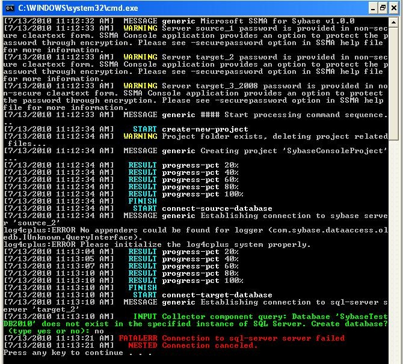

# Getting Started with the SSMA for Sybase Console (SybaseToSQL)
This section describes the procedure for launching and getting started with the SSMA for Sybase console application. Also listed herein are the conventions used in a typical SSMA Console output window.  
  
## Launching the SSMA Console  
Use the following steps to start the SSMA console application:  
  
1.  Go to Start, and then point to All Programs.  
  
2.  Click the **SQL Server Migration Assistant for Sybase Command Prompt** shortcut.  
  
    It displays the SSMA Console usage menu and `(/? Help)`, to help you get started with the console application.  
  
## Using the SSMA Console  
After the console is successfully launched on your Windows system, you can use the following steps to work on it:  
  
1.  Configure SSMA Console through the script files. For more information on this section, see [Creating Script Files &#40;SybaseToSQL&#41;](../../ssma/sybase/creating-script-files-sybasetosql.md).  
  
2.  [Creating Variable Value Files &#40;SybaseToSQL&#41;](../../ssma/sybase/creating-variable-value-files-sybasetosql.md)  
  
3.  [Creating the Server Connection Files &#40;SybaseToSQL&#41;](../../ssma/sybase/creating-the-server-connection-files-sybasetosql.md)  
  
4.  [Executing the SSMA Console &#40;SybaseToSQL&#41;](../../ssma/sybase/executing-the-ssma-console-sybasetosql.md) based on your project needs. 
  
Additional features:  
  
1.  [Specify a password](managing-passwords-sybasetosql.md) and export/import it to other Window computers.  
  
2.  [Generate reports](generating-reports-sybasetosql.md) to view the detailed xml output reports for assessment/conversion and data migration. You can also generate detailed error reports for refresh and synchronization commands.  
  
## SSMA Console output conventions  
Upon executing the SSMA script commands and options, the console program displays the results and messages (information, error, etc.) to the user on the console or, if necessary, redirects to an xml output file. Each type of message in the output is signified by a unique color. For example, the text message in white color denotes script file commands; the one in green color represents a prompt for user-input, and so on.  
  
  
  
Color-interpretation of the console output appears in the following table:  
  
|Color|Description|  
|---------|---------------|  
|Red|Fatal error during execution|  
|Gray|Date and Time stamp, message to the user|  
|White|Script file commands, message type|  
|Yellow|Warning|  
|Green|Prompt for user-input|  
|Cyan|Start, Finish, and Result of an operation|  
  
## See also  
[Installing SSMA for SAP ASE &#40;SybaseToSQL&#41;](../../ssma/sybase/installing-ssma-for-sybase-sybasetosql.md)  
