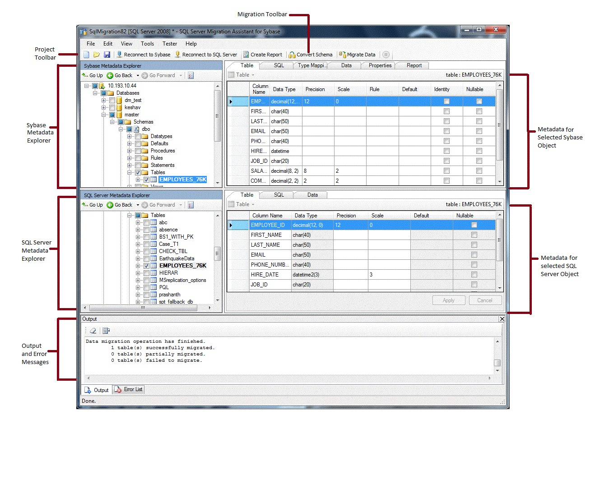

# Getting Started with SSMA for SAP ASE (SybaseToSQL)
[!INCLUDE[ssNoVersion](../../includes/ssnoversion-md.md)] Migration Assistant (SSMA) for SAP ASE lets you quickly convert SAP Adaptive Server Enterprise (ASE) database schemas to [!INCLUDE[ssNoVersion](../../includes/ssnoversion-md.md)] or Azure SQL Database schemas, upload the resulting schemas into [!INCLUDE[ssNoVersion](../../includes/ssnoversion-md.md)] or Azure SQL Database, and migrate data from SAP ASE to [!INCLUDE[ssNoVersion](../../includes/ssnoversion-md.md)] or Azure SQL Database.  
  
This topic introduces the installation process, and then helps familiarize you with the SSMA user interface.  
  
## Installing and licensing SSMA  
To use SSMA, you first must install the SSMA client program on a computer that can access both the source instance of SAP ASE and the target instance of [!INCLUDE[ssNoVersion](../../includes/ssnoversion-md.md)] or Azure SQL Database. To use server-side data migration, you must install extension pack and at least one of the SAP ASE providers (OLE DB or ADO.NET) on the computer that is running [!INCLUDE[ssNoVersion](../../includes/ssnoversion-md.md)]. These components support data migration and the emulation of SAP ASE system functions. For installation instructions, see [Installing SSMA for SAP ASE &#40;SybaseToSQL&#41;](../../ssma/sybase/installing-ssma-for-sybase-sybasetosql.md).  
  
To start SSMA, click **Start**, point to **All Programs**, point to **[!INCLUDE[msCoName](../../includes/msconame-md.md)][!INCLUDE[ssNoVersion](../../includes/ssnoversion-md.md)] Migration Assistant for Sybase**, and then select **[!INCLUDE[msCoName](../../includes/msconame-md.md)][!INCLUDE[ssNoVersion](../../includes/ssnoversion-md.md)] Migration Assistant for Sybase**. The first time that you start SSMA, a licensing dialog box appears. You must license SSMA by using a Windows Live ID before you can use SSMA. Licensing instructions are included with the installation instructions in the [Installing SSMA  for Sybase Client &#40;SybaseToSQL&#41;](../../ssma/sybase/installing-ssma-for-sybase-client-sybasetosql.md) topic.  
  
## SSMA for SAP ASE user interface  
After SSMA is installed and licensed, you can use SSMA to migrate SAP ASE databases to [!INCLUDE[ssNoVersion](../../includes/ssnoversion-md.md)] or Azure SQL Database. It helps to become familiar with the SSMA user interface before you start. The following diagram shows the user interface for SSMA, including the metadata explorers, metadata, toolbars, output pane, and error list pane:  
  
  
  
To start a migration, you must first create a new project. Then, you connect to SAP ASE. After a successful connection, a hierarchy of SAP ASE databases will appear in Sybase Metadata Explorer. You can then right-click objects in Sybase Metadata Explorer to do tasks such as create reports that assess conversions to [!INCLUDE[ssNoVersion](../../includes/ssnoversion-md.md)] or Azure SQL Database. You can also do these tasks through the toolbars and menus.  
  
You also must connect to an instance of [!INCLUDE[ssNoVersion](../../includes/ssnoversion-md.md)] or Azure SQL Database. After a successful connection, a hierarchy of [!INCLUDE[ssNoVersion](../../includes/ssnoversion-md.md)] or Azure SQL databases will appear in [!INCLUDE[ssNoVersion](../../includes/ssnoversion-md.md)] or SQL Azure Metadata Explorer. After you convert SAP ASE schemas to [!INCLUDE[ssNoVersion](../../includes/ssnoversion-md.md)] or Azure SQL Database schemas, select those converted schemas in [!INCLUDE[ssNoVersion](../../includes/ssnoversion-md.md)] or SQL Azure Metadata Explorer, and then load the schemas into [!INCLUDE[ssNoVersion](../../includes/ssnoversion-md.md)] or Azure SQL Database.  
  
After you load converted schemas into [!INCLUDE[ssNoVersion](../../includes/ssnoversion-md.md)] or Azure SQL Database, you can return to Sybase Metadata Explorer and migrate data from SAP ASE databases into [!INCLUDE[ssNoVersion](../../includes/ssnoversion-md.md)] or Azure SQL databases.  
  
For more information about these tasks and how to perform them, see [Migrating SAP ASE Databases to SQL Server - Azure SQL Database &#40;SybaseToSQL&#41;](../../ssma/sybase/migrating-sybase-ase-databases-to-sql-server-azure-sql-db-sybasetosql.md).  
  
The following sections describe the features of the SSMA user interface.  
  
### Metadata explorers  
SSMA contains two metadata explorers to browse and perform actions on SAP ASE and [!INCLUDE[ssNoVersion](../../includes/ssnoversion-md.md)] or Azure SQL databases.  
  
#### Sybase Metadata Explorer  
Sybase Metadata Explorer shows information about databases on the source instance of SAP ASE.  
  
By using Sybase Metadata Explorer, you can perform the following tasks:  
  
-   Browse the tables in each database.  
  
-   Select objects for conversion, and then convert the objects to [!INCLUDE[ssNoVersion](../../includes/ssnoversion-md.md)] or Azure SQL Database syntax. For more information, see [Converting SAP ASE Database Objects &#40;SybaseToSQL&#41;](../../ssma/sybase/converting-sybase-ase-database-objects-sybasetosql.md).  
  
-   Select objects for data migration, and then migrate the data from those objects to [!INCLUDE[ssNoVersion](../../includes/ssnoversion-md.md)] or Azure SQL Database. For more information, see [Migrating SAP ASE Data into SQL Server - Azure SQL Database &#40;SybaseToSQL&#41;](../../ssma/sybase/migrating-sybase-ase-data-into-sql-server-azure-sql-db-sybasetosql.md).  
  
#### SQL Server or SQL Azure Metadata Explorer  
[!INCLUDE[ssNoVersion](../../includes/ssnoversion-md.md)] or SQL Azure Metadata Explorer shows information about an instance of [!INCLUDE[ssNoVersion](../../includes/ssnoversion-md.md)] or Azure SQL Database. When you connect to an instance of [!INCLUDE[ssNoVersion](../../includes/ssnoversion-md.md)] or Azure SQL Database, SSMA retrieves metadata about that instance and stores it in the project file.  
  
You can use [!INCLUDE[ssNoVersion](../../includes/ssnoversion-md.md)] or SQL Azure Metadata Explorer to select converted SAP ASE database objects, and then load (synchronize) those objects into the instance of [!INCLUDE[ssNoVersion](../../includes/ssnoversion-md.md)] or Azure SQL Database.  
  
For more information, see [Loading Converted Database Objects into SQL Server &#40;SybaseToSQL&#41;](../../ssma/sybase/loading-converted-database-objects-into-sql-server-sybasetosql.md).  
  
### Metadata  
To the right of each metadata explorer are tabs that describe the selected object. For example, if you select a table in Sybase Metadata Explorer, six tabs appear: **Table**, **SQL**, **Type Mapping**, **Data**, **Properties**, and **Report**. The **Report** tab contains information only after you create a report containing the selected object. If you select a table in [!INCLUDE[ssNoVersion](../../includes/ssnoversion-md.md)] or SQL Azure Metadata Explorer, three tabs appear: **Table**, **SQL**, and **Data**.  
  
Most metadata settings are read-only. However, you can alter the following metadata:  
  
-   In Sybase Metadata Explorer, you can alter procedures and type mappings. Make these changes before you convert schemas.  
  
-   In [!INCLUDE[ssNoVersion](../../includes/ssnoversion-md.md)] or SQL Azure Metadata Explorer, you can alter the [!INCLUDE[tsql](../../includes/tsql-md.md)] for stored procedures. Make these changes before you load the schemas into [!INCLUDE[ssNoVersion](../../includes/ssnoversion-md.md)].  
  
Changes made in a metadata explorer are reflected in the project metadata, not in the source or target databases.  
  
### Toolbars  
SSMA has two toolbars: a project toolbar and a migration toolbar.  
  
#### The Project toolbar  
The project toolbar contains buttons for working with projects, connecting to SAP ASE, and connecting to [!INCLUDE[ssNoVersion](../../includes/ssnoversion-md.md)] or Azure SQL Database. These buttons resemble the commands on the **File** menu.  
  
#### The Migration toolbar  
The migration toolbar contains the following commands:  
  
|Button|Function|  
|----------|------------|  
|**Create Report**|Converts the selected SAP ASE objects to [!INCLUDE[ssNoVersion](../../includes/ssnoversion-md.md)] syntax, and then creates a report that shows how successful the conversion was.  This command is available only when objects are selected in Sybase Metadata Explorer.|  
|**Convert Schema**|Converts the selected SAP ASE objects to [!INCLUDE[ssNoVersion](../../includes/ssnoversion-md.md)] or Azure SQL Database objects.  This command is available only when objects are selected in Sybase Metadata Explorer.|  
|**Migrate Data**|Migrates data from the SAP ASE database to [!INCLUDE[ssNoVersion](../../includes/ssnoversion-md.md)] or Azure SQL Database. Before you run this command, you must convert the SAP ASE schemas to [!INCLUDE[ssNoVersion](../../includes/ssnoversion-md.md)] or Azure SQL Database schemas, and then load the objects into [!INCLUDE[ssNoVersion](../../includes/ssnoversion-md.md)] or Azure SQL Database.  This command is available only when objects are selected in Sybase Metadata Explorer.|  
|**Stop**|Stops the current process, such as converting objects to [!INCLUDE[ssNoVersion](../../includes/ssnoversion-md.md)] or Azure SQL Database syntax.|  
  
### Menus  
SSMA contains the following menus:  
  
|Menu|Description|  
|--------|---------------|  
|**File**|Contains commands for working with projects, connecting to SAP ASE, and connecting to [!INCLUDE[ssNoVersion](../../includes/ssnoversion-md.md)] or Azure SQL Database.|  
|**Edit**|Contains commands for finding and working with text in the details pages, such as copying [!INCLUDE[tsql](../../includes/tsql-md.md)] from the SQL details pane. Also contains the **Manage Bookmarks** option, where you can see a list of existing bookmarks. You can use the buttons on the right side of the dialog to manage the bookmarks.|  
|**View**|Contains the **Synchronize Metadata Explorers** command. This synchronizes the objects between Sybase Metadata Explorer and [!INCLUDE[ssNoVersion](../../includes/ssnoversion-md.md)] or SQL Azure Metadata Explorer. Also contains commands to display and hide the **Output** and **Error List** panes and an option **Layouts** to manage the Layouts.|  
|**Tools**|Contains commands to create reports, export data, and migrate objects and data. Also provides access to the **Global Settings** and **Project Settings** dialog boxes.|  
|**Tester**|Contains commands to create test cases, view test results, and commands for database backup management.|  
|**Help**|Provides access to SSMA Help and to the **About** dialog box.|  
  
### Output pane and Error List pane  
The **View** menu provides commands to toggle the visibility of the Output pane and the Error List pane:  
  
-   The Output pane shows status messages from SSMA during object conversion, object synchronization, and data migration.  
  
-   The Error List pane shows error, warning, and informational messages in a list that you can sort.  
  
## See also  
[Migrating SAP ASE Databases to SQL Server - Azure SQL Database &#40;SybaseToSQL&#41;](../../ssma/sybase/migrating-sybase-ase-databases-to-sql-server-azure-sql-db-sybasetosql.md)  
[User Interface Reference &#40;SybaseToSQL&#41;](../../ssma/sybase/user-interface-reference-sybasetosql.md)  
