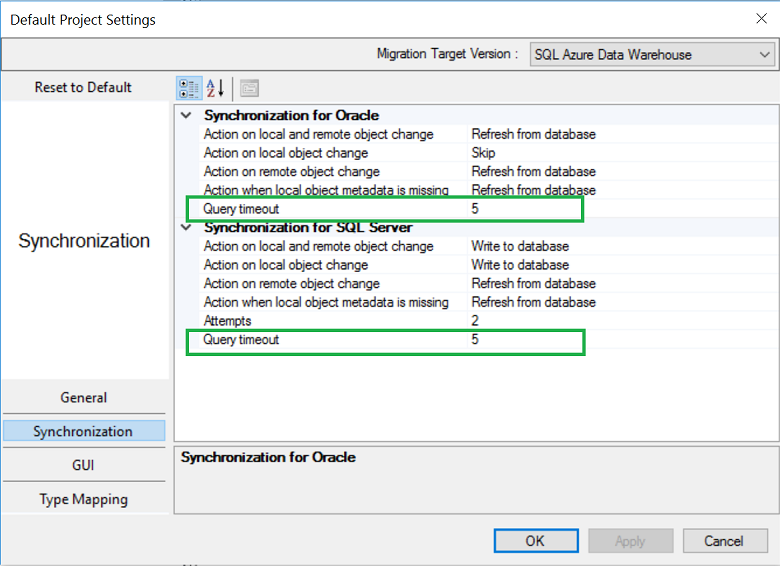
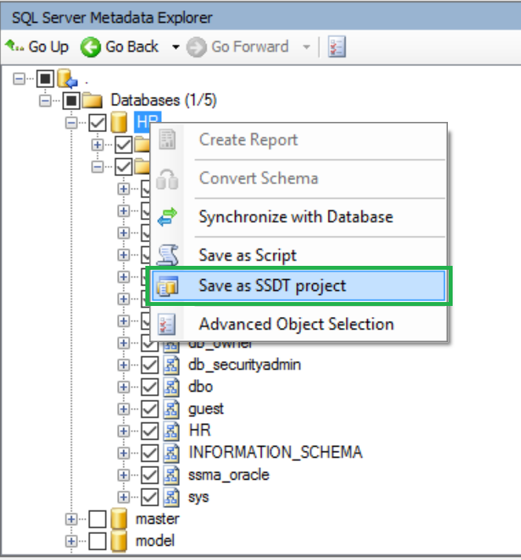

# What&#39;s New in SSMA  for Sybase (SybaseToSQL)
This topic lists SSMA for Sybase changes in each release. 

## SSMA v7.4
The v7.4 release of SSMA for Sybase contains the following changes.
- The **Query timeout** option is now available during schema object discovery at source and target.

- The quality and conversion metric has been improved with targeted fixes, based on customer feedback.

> [!IMPORTANT]
> .Net 4.5.2 is a pre-requisite for installing SSMA v7.4. In addition, beginning with v7.4, the 32-bit version of SSMA is being discontinued.  

## SSMA v7.3
The v7.3 release of SSMA for Sybase contains the following changes.
- Improved quality and conversion metric with targeted fixes based on customer feedback.
- SSMA extensibility framework exposed via the following items.
  - Export functionality to a SQL Server Data Tools (SSDT) project.
    -   You can now export schema scripts from SSMA to an SSDT project. You can use the schema scripts to make additional schema changes and deploy your database.

  - Libraries that can be consumed by SSMA for performing custom conversions.
    - You can now construct code that can handle custom syntax conversions and conversions that weren't previously handled by SSMA.
      - Instructions on how to construct a custom converter are available in this blog post, [Extending SQL Server Migration Assistant's conversion capabilities](https://blogs.msdn.microsoft.com/datamigration/2017/02/21/2185/).
      - Sample project for conversion can be download this [blog post](https://blogs.msdn.microsoft.com/datamigration/ssmafororacleconversionsample/).

## SSMA v7.2
The v7.2 release of SSMA for Sybase contains the following changes.
- Improved quality and conversion metric with targeted fixes based on customer feedback.
- Telemetry enhancements to provide better data points to troubleshoot customer issues and improve SSMA’s conversion rates.

## SSMA v7.1
The v7.1 release of SSMA for Access contains the following changes.
- SQL Server 2017 on Windows and Linux CTP1 is now a supported target platform for migration. This feature is in technical preview and will allow schema and data movement to target SQL servers.
- SSMA now supports automatic updates to download the latest version of SSMA as soon as it is available.
- SSMA installable binaries are now delivered through Windows installer package files (.msi).

**Resources**

[Extending SQL Server Migration Assistant's conversion capabilities](https://blogs.msdn.microsoft.com/datamigration/2017/02/21/2185/)

[Assess and migrate data from non Microsoft data platforms to SQL Server *(with Oracle example)*](https://blogs.msdn.microsoft.com/datamigration/2016/11/16/sql-server-migration-assistant-how-to-assess-and-migrate-databases-from-non-microsoft-data-platforms-to-sql-server/) 

## May 2016  
The May  2016 release of SSMA for Sybase contains  the following changes:  

1.  Added support for SQL Server 2016
2.  Removed installer check for .Net 2.0
3.  Updated Extension Pack dependency from .Net 3.5 to .Net 4.0
4.  Fixed "save project" and "open project" commands for SSMA Console
5.  Fixed "securepassword" command for SSMA Console
6.  Fixed counting of objects for initial loading
7.  Fixed bug in global settings

## March 2016  
The March 2016 preview release of SSMA for Sybase contains  the following changes:  
  
1.  Support migration to SQL Server 2016  
  
## January 2016  
The January 2016 maintenance release of SSMA for Sybase contains the following changes:  
  
1.  Added View Log Menu Item to SSMA (RFC 5706203)  
  
2.  Added Telemetry  
  
## July 2014  
The July 2014 release of SSMA for Sybase contains the following changes:  
  
1.  Improved Azure SQL DB code conversion  
  
2.  Extension pack functionality moved to schema to support Azure SQL DB  
  
3.  Performance improvements tested for databases with over 10k objects  
  
4.  UI improvements for dealing with large number of objects  
  
5.  Highlighting of “well known” LOB schemas (so they can be ignored in conversion)  
  
6.  Conversion speed improvements  
  
7.  Show object counts in UI  
  
8.  Report size reduction by more than 25%  
  
9. Improved error messages for unparsed constructs.  
  
## April 2014  
The April 2014 release of SSMA for Sybase contains the following changes:  
  
-   Added support of MS SQL Server 2014.  
  
-   Fixed bugs regarding conversion to Azure  
  
-   Fixed bugs regarding invisible report pages in IE 10.  
  
## January 2012  
The January 2012 release of SSMA for Sybase contains the following changes:  
  
-   Support for rollback trigger conversion.  
  
-   Provided fix for converting @@ROWCOUNT and @@ERROR in the same SET statement.  
  
## July 2011  
The July 2011 release of SSMA for Sybase contains the following changes:  
  
-   Improved error reporting during data migration.  
  
## April 2011  
The April 2011 release of SSMA for Sybase contains the following changes:  
  
-   Consolidated “SSMA for Sybase” product, which supports [!INCLUDE[ssNoVersion](../../includes/ssnoversion_md.md)] 2005, [!INCLUDE[ssNoVersion](../../includes/ssnoversion_md.md)] 2008, [!INCLUDE[ssNoVersion](../../includes/ssnoversion_md.md)] “Denali” and SQL Azure.  
  
-   Support for connecting and migrating to [!INCLUDE[ssNoVersion](../../includes/ssnoversion_md.md)] “Denali”.  
  
-   Brand new feature to convert and migrate Sybase databases to SQL Azure.  
  
-   Enhanced client side data migration engine, supporting parallel migration of data.  
  
-   Improved data migration performance with Simple and Bulk logged recovery models.  
  
-   Case sensitive Sybase databases can be properly converted and migrated to case sensitive SQL Server.  
  
-   Support for conversion of Sybase ASE Non-ANSI join statements to SQL Server ANSI join statements has been extended to DELETE and UPDATE statements.  
  
-   Additional connectivity options for connecting to Sybase ASE servers using Sybase ASE ODBC provider and Sybase ASE ADO.Net providers.  
  
-   Removal of dependency on a separate database called **SysDB** which contains the Sybase emulation functions (installed as part of Extension Pack).  
  
-   SSMA for Sybase Extension Pack can now be installed on [!INCLUDE[ssNoVersion](../../includes/ssnoversion_md.md)] clusters.  
  
-   Backward compatibility of projects created by earlier versions of SSMA (v4.0 and v4.2).  
  
-   SSMA for Sybase v5.0 product can be installed side by side (SxS) with older versions of SSMA (v4.0 and v4.2).  
  
## July 2010  
The July 2010 release of SSMA for Sybase contains the following changes:  
  
-   Support for migrating to SQL Server 2008 R2  
  
-   New SSMA Console application for command line execution  
  
-   Support for Data Migration using both Server Side and Client Side Data Migration Engines  
  
-   Support for “Custom SELECT” statement in data migration  
  
-   Support for migrating from Sybase ASE 15.0.3 and 15.5  
  
## June 2008  
The June 2008 release of SSMA for Sybase contains the following changes:  
  
-   SSMA Tester added, it automatically tests the database object conversion and the data migration made by SSMA. After all SSMA migration steps are finished, use SSMA Tester to verify that converted objects work the same way and that all data was transferred properly.  
  
-   Pre-SQL conversion added. User now can specify temporary tables (and other objects) declarations for each source procedure to be used in conversion.  
  
-   Improvements in object conversion:  
  
    -   Joins conversion revised.  
  
    -   Aggregates and non-aggregates without having/group by clauses.  
  
    -   The IDENTITY function with a SELECT INTO statement.  
  
    -   Clustered constraints and indexes on data-only-locked.  
  
    -   Temporary tables created by SELECT INTO.  
  
    -   Constraints / Indexes for temporary tables.  
  
    -   New [!INCLUDE[ssNoVersion](../../includes/ssnoversion_md.md)] 2008 datetime types are supported.  
  
    -   Sybase 15.0 connectivity and datatypes support.  
  
## May 2007  
The May 2007 release of SSMA for Sybase contains the following changes:  
  
-   When you save a project, loading database content is faster.  
  
-   Support for user-entered comments the SQL Server formatted SQL mode.  
  
-   Improvements in object conversion.  
  
Note that the Help file was not updated for this release. For more information, see the Documentation Notes section later in this topic.  
  
## November 2006  
The November 2006 release of SSMA for Sybase contains the following changes:  
  
-   New global settings:  
  
    -   You can opt to show line numbers in editor windows.  
  
    -   You can configure SSMA to prompt to replace duplicate objects, or always or never replace duplicate objects during schema conversion.  
  
-   New conversion options let you configure how SSMA handles the following situations:  
  
    -   A CAST or CONVERT statement that contains a binary string  
  
    -   Checks for null values in equality expressions  
  
    -   Proxy tables  
  
    -   User message error numbers for RAISERROR  
  
    -   UPDATE statements that contain unresolved identifiers  
  
-   A new migration option lets you specify how SSMA should handle dates that are outside the [!INCLUDE[ssNoVersion](../../includes/ssnoversion_md.md)] date range.  
  
-   A **Formatted SQL** setting on the **SQL** tab, which formats the code for improved readability.  
  
-   Bug fixes that include the following:  
  
    -   SSMA now converts LOCK TABLE *table* IN { SHARED | EXCLUSIVE } MODE statements by adding a TABLOCK or TABLOCKX hint to the subsequent SELECT query on the table.  
  
    -   The necessary casts are now added when binary types are used in character expressions.  
  
    -   Memory and performance improvements.  
  
## July 2006  
The July 2006 release of SSMA for Sybase was the initial release.  
  
## See Also  
[Getting Started with SSMA for Sybase &#40;SybaseToSQL&#41;](../../ssma/sybase/getting-started-with-ssma-for-sybase-sybasetosql.md)  
  
