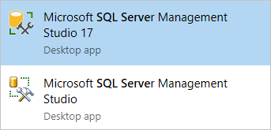

# Download SQL Server Management Studio (SSMS)

SSMS is an integrated environment for managing any SQL infrastructure, from SQL Server to SQL Database. SSMS provides tools to configure, monitor, and administer instances of SQL. Use SSMS to deploy, monitor, and upgrade the data-tier components used by your applications, as well as build queries and scripts.

Use SQL Server Management Studio (SSMS) to query, design, and manage your databases and data warehouses, wherever they are - on your local computer, or in the cloud.

**SSMS is free!**

SSMS 17.x is the latest generation of *SQL Server Management Studio* and provides support for SQL Server 2017.

**[ Download SQL Server Management Studio 17.2](https://go.microsoft.com/fwlink/?linkid=849819)**

**[ Download SQL Server Management Studio 17.2 Upgrade Package (upgrades 17.x to 17.2)](https://go.microsoft.com/fwlink/?linkid=849821)**

The SSMS 17.x installation does not upgrade or replace SSMS versions 16.x or earlier. SSMS 17.x installs side by side with previous versions so both versions are available for use.
If a computer contains side by side installations of SSMS, verify you start the correct version for your specific needs. The latest version is labeled *Microsoft SQL Server Management Studio 17*, and has a new icon: 
 
   

> [!NOTE]
> The SQL Server PowerShell module is now a separate install through the PowerShell Gallery.  For more information, see [download instructions](download-sql-server-ps-module.md).

## SQL Server Management Studio

**Version Information**

The release number: 17.2
The build number for this release: **TBD**

## New in this Release

SSMS 17.2 is the latest version of SQL Server Management Studio. The 17.x generation of SSMS provides support for almost all feature areas on SQL Server 2008 through SQL Server 2017. Version 17.x also supports SQL Analysis Service PaaS.

Version 17.2 includes:

- Multi-Factor Authentication (MFA)
  - Multiple-user Azure AD authentication for Universal Authentication with Multi-factor authentication (UA with MFA)
  - A new user credential input field was added for Universal Authentication with MFA to support multi-user authentication.
- The connection dialog box now supports the following 5 authentication methods:
  - Windows Authentication
  - SQL Server Authentication
  - Active Directory - Universal with MFA support
  - Active Directory - Password
  - Active Directory - Integrated

- Database import/export for DacFx wizard can now use Universal Authentication with MFA.
- ADAL managed library used by Azure AD Universal Authentication with MFA was upgraded to version 3.13.9.
- A new CLI interface supporting Azure AD admin setting for SQL Database and SQL Data Warehouse.

 For more information on the Active Directory authentication methods, see [Universal Authentication with SQL Database and SQL Data Warehouse (SSMS support for MFA)](https://docs.microsoft.com/azure/sql-database/sql-database-ssms-mfa-authentication) and [Configure Azure SQL Database multi-factor authentication for SQL Server Management Studio](https://docs.microsoft.com/azure/sql-database/sql-database-ssms-mfa-authentication-configure).

- Output window has entries for queries run during expansion of Object Explorer nodes
- Enabled View designer for Azure SQL Databases
- The default scripting options for scripting objects from Object Explorer in SSMS have changed:
  - Previously, the default on a new install was to have the generated script target the latest version of SQL Server (currently SQL Server 2017).
	- In SSMS 17.2 a new option has been added - *Match Script Settings to Source*. When set to *True*, the generated script targets the same version, engine type, and engine edition as the server the object being scripted is from.
	- The *Match Script Settings to Source* value is set to *True* by default, so new installs of SSMS will automatically default to always scripting objects to the same target as the original server.
	- When the *Match Script Settings to Source* value is set to *False*, the normal scripting target options will be enabled and function as they did previously.
	- Additionally, all the scripting options have been moved to their own section - *Version Options*. They are no longer under *General Scripting Options*.

- Added support for National Clouds in "Restore from URL"
- QueryStoreUI reports now supports additional metrics (RowCount, DOP, CLR Time etc.) from sys.query_store_runtime_stats.
- IntelliSense is now supported for Azure SQL Database
	- https://connect.microsoft.com/SQLServer/feedback/details/3100677/ssms-2016-would-be-nice-to-have-intellisense-on-azure-sql-databases
- Security: connection dialog will default to not trusting server certificates and to requesting encryption for Azure SQL Database connections
- General improvements around support for SQL Server on Linux:
 - Database Mail node is back
 - Addressed some issues related to paths
 - Activity Monitor stability improvements
 - Connection Properties dialog displays the correct platform

For the full list of changes, see [SQL Server Management Studio - Changelog (SSMS)](../ssms/sql-server-management-studio-changelog-ssms.md).

For information about user data collection, see [SQL Server Privacy Statement](http://www.microsoft.com/privacystatement/en-us/SQLServer/Default.aspx).

## Supported SQL offerings

* This version of SSMS works with all [supported versions of SQL Server 2008 - SQL Server 2017](https://support.microsoft.com/lifecycle?C2=1044) and provides the greatest level of support for working with the latest cloud features in Azure SQL Database and Azure SQL Data Warehouse.
* There is no explicit block for SQL Server 2000 or SQL Server 2005, but some features may not work properly.
* Additionally, SSMS 17.x can be installed side by side with SSMS 16.x or SQL Server 2014 SSMS and earlier.

## Supported Operating systems

This release of SSMS supports the following platforms when used with the latest available service pack:

* Windows 10
* Windows 8.1
* Windows 8
* Windows 7 (SP1)
* Windows Server 2016*
* Windows Server 2012 (64-bit)
* Windows Server 2012 R2 (64-bit)
* Windows Server 2008 R2 (64-bit)

*SSMS 17.x is based on the Visual Studio 2015 Isolated shell, which was released before Windows Server 2016. Microsoft takes app compatibility seriously and ensures that already-shipped applications continue to run on the latest Windows releases. To minimize issues running SSMS on Windows Server 2016, ensure SSMS has all of the latest updates applied. If you experience any issues with SSMS on Windows Server 2016, contact support. The support team determines if the issue is with SSMS, Visual Studio, or with Windows compatibility. The support team then routes the issue to the appropriate team for further investigation.

## SSMS installation tips and issues

### Minimize Installation Reboots

* Take the following actions to reduce the chances of SSMS setup requiring a reboot at the end of installation:
  * Make sure you are running an up-to-date version of the Visual C++ 2013 Redistributable Package. Version 12.00.40649.5 (or greater) is required. Only the x64 version is needed.
  * Verify the version of .NET Framework on the computer is 4.6.1 (or greater).
  * Close any other instances of Visual Studio that are open on the computer.
  * Make sure all the latest OS updates are installed on the computer.
  * The noted actions are typically required only once. There are few cases where a reboot is required during additional upgrades to the same major version of SSMS. For minor upgrades, all the prerequirements for SSMS are already be installed on the computer.

* To see the list of known issues and work-arounds, see [SQL Server Management Studio -  Release Notes](../ssms/sql-server-management-studio-release-notes.md)

## Available Languages

> [!NOTE]
> Non-English localized releases of SSMS require the [KB 2862966 security update package](https://support.microsoft.com/en-us/kb/2862966) if installing on: Windows 8, Windows 7, Windows Server 2012, and Windows Server 2008 R2.

This release of SSMS can be installed in the following languages:

SQL Server Management Studio 17.1: 
[Chinese (People's Republic of China)](https://go.microsoft.com/fwlink/?linkid=849819&clcid=0x804) | [Chinese (Taiwan)](https://go.microsoft.com/fwlink/?linkid=849819&clcid=0x404) | [English (United States)](https://go.microsoft.com/fwlink/?linkid=849819&clcid=0x409) | [French](https://go.microsoft.com/fwlink/?linkid=849819&clcid=0x40c) | [German](https://go.microsoft.com/fwlink/?linkid=849819&clcid=0x407) | [Italian](https://go.microsoft.com/fwlink/?linkid=849819&clcid=0x410) | [Japanese](https://go.microsoft.com/fwlink/?linkid=849819&clcid=0x411) | [Korean](https://go.microsoft.com/fwlink/?linkid=849819&clcid=0x412) | [Portuguese (Brazil)](https://go.microsoft.com/fwlink/?linkid=849819&clcid=0x416) | [Russian](https://go.microsoft.com/fwlink/?linkid=849819&clcid=0x419) | [Spanish](https://go.microsoft.com/fwlink/?linkid=849819&clcid=0x40a)

SQL Server Management Studio 17.1 Upgrade Package (upgrades 17.0 to 17.1): 
[Chinese (People's Republic of China)](https://go.microsoft.com/fwlink/?linkid=849821&clcid=0x804) | [Chinese (Taiwan)](https://go.microsoft.com/fwlink/?linkid=849821&clcid=0x404) | [English (United States)](https://go.microsoft.com/fwlink/?linkid=849821&clcid=0x409) | [French](https://go.microsoft.com/fwlink/?linkid=849821&clcid=0x40c) | [German](https://go.microsoft.com/fwlink/?linkid=849821&clcid=0x407) | [Italian](https://go.microsoft.com/fwlink/?linkid=849821&clcid=0x410) | [Japanese](https://go.microsoft.com/fwlink/?linkid=849821&clcid=0x411) | [Korean](https://go.microsoft.com/fwlink/?linkid=849821&clcid=0x412) | [Portuguese (Brazil)](https://go.microsoft.com/fwlink/?linkid=849821&clcid=0x416) | [Russian](https://go.microsoft.com/fwlink/?linkid=849821&clcid=0x419) | [Spanish](https://go.microsoft.com/fwlink/?linkid=849821&clcid=0x40a)

## Release Notes

The following are issues and limitations with this 17.2 release:

- Query windows using "Active Directory - Universal with MFA Support" authentication may experience an error similar to the following, when attempting to execute a query after being open for about an hour or more:

   `Msg 0, Level 11, State 0, Line 0
The connection is broken and recovery is not possible. The client driver attempted to recover the connection one or more times and all attempts failed. Increase the value of *ConnectRetryCount* to increase the number of recovery attempts.`

   Re-running the query should get past the error and succeed.

- The following SSMS functionality is not supported for Azure AD using Universal Authentication with MFA:
  - The **New Table/View** designer shows the old-style login prompt, and does not work for Azure AD authentication.
  - The **Edit Top 200 Rows** feature doesn't support Azure AD authentication.
  - The **Registered Server** component does not support Azure AD authentication.
  - The **Database Engine Tuning Advisor** is not supported for Azure AD authentication. There is a known issue where the error message presented to the user is less than helpful: *Could not load file or assembly 'Microsoft.IdentityModel.Clients.ActiveDirectory,…* instead of the expected *Database Engine Tuning Advisor does not support Microsoft Azure SQL Database. (DTAClient)*.

**AS**

- Object Explorer in SSAS will not show the Windows Auth username in AS Azure connection properties.
For more information, see the [SSMS changelog](sql-server-management-studio-changelog-ssms.md).

## Previous releases

[Previous SQL Server Management Studio Releases](../ssms/sql-server-management-studio-changelog-ssms.md#previous-ssms-releases)

## Feedback

 [SQL Client Tools Forum](https://social.msdn.microsoft.com/Forums/en-US/home?forum=sqltools) |  [Log an issue or suggestion at Microsoft Connect](https://connect.microsoft.com/SQLServer/Feedback)

## See Also

- [Tutorial: SQL Server Management Studio](tutorials/tutorial-sql-server-management-studio.md)
- [SQL Server Management Studio documentation](sql-server-management-studio-ssms.md)
- [Additional updates and service packs](https://technet.microsoft.com/sqlserver/ff803383.aspx)
- [Download SQL Server Data Tools (SSDT)](../ssdt/download-sql-server-data-tools-ssdt.md)
