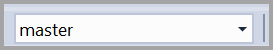
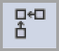
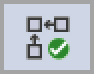

# SSMS Query Editor (database engine)

[!INCLUDE[appliesto-ss-asdb-asdw-xxx-md.md](../../includes/appliesto-ss-asdb-asdw-xxx-md.md)]

The Query Editor creates and runs scripts containing [!INCLUDE[tsql](../../includes/tsql-md.md)] statements and **sqlcmd** commands.

The Query Editor is one of four editors implemented in [!INCLUDE[ssManStudioFull](../../includes/ssmanstudiofull-md.md)]. For a description of the functionality implemented in the Query Editor and the main tasks you can perform using the editor, see [Query and Text Editors](../scripting/query-and-text-editors-sql-server-management-studio.md)

You can add the SQL Editor toolbar by selecting the **View** menu, selecting **Toolbars**, and then selecting **SQL Editor**. If you add the SQL Editor toolbar when no [!INCLUDE[ssDE](../../includes/ssde-md.md)] Query Editor windows are open, all the buttons are unavailable.

## Transact-SQL F1 Help

The Query Editor supports linking you to the reference topic for a specific [!INCLUDE[tsql](../../includes/tsql-md.md)] statement when you select F1. To do so, highlight the name of a Transact-SQL statement and then select F1. The help search engine then searches for a topic that has an F1 help attribute that matches the string you highlighted.

If the help search engine doesn't find a topic with an F1 help keyword that exactly matches the string you highlighted, then this topic is displayed. In that case, there are two approaches to finding the help you're looking for:

- Copy and paste the editor string you highlighted into the search tab of SQL Server Books Online and do a search.

- Highlight only the part of the Transact-SQL statement likely to match an F1 help keyword applied to a topic and select F1 again. The search engine requires an exact match between the string you highlighted and an F1 help keyword assigned to a topic. If the string you highlighted contains elements unique to your environment, such as column or parameter names, the search engine doesn't get a match. Examples of the strings to highlight include:

  - The name of a Transact-SQL statement, such as SELECT, CREATE DATABASE or BEGIN TRANSACTION.
  
  - The name of a built-in function, such as SERVERPROPERTY, or @@VERSION.
  
  - The name of a system stored procedure table, or view, such as sys.data_spaces or sp_tableoption.

## SQL Editor Toolbar

When the [!INCLUDE[ssDE](../../includes/ssde-md.md)] Query Editor is open, the SQL Editor toolbar appears with the following buttons.

### Connect

Opens the **Connect to Server** dialog box. Use this dialog box to establish a connection to a server.

### Change Connection

Opens the **Connect to Server** dialog box. Use this dialog box to establish a connection to a different server.

### Available Databases

Change the connection to a different database on the same server.

### Execute

Executes the selected code or, if no code is selected, executes all the code in the Query Editor.

### Cancel Executing Query

Sends a cancellation request to the server. Some queries can't be canceled immediately, but must wait for a suitable cancellation condition. When transactions are canceled, delays might occur while transactions are rolled back.

### Parse

Check the syntax of the selected code. If no code is selected, it checks the syntax of the all code in the Query Editor window.

### Display Estimated Execution Plan

Requests a query execution plan from the query processor without actually executing the query, and displays the plan in the **Execution plan** window. This plan uses index statistics as an estimate of the number of rows that are expected to be returned during each part of the query execution. The actual query plan that is used can be different from the estimated execution plan. This can occur if the number of rows that are returned is significantly different from the estimate, and the query processor changes the plan to be more efficient.

### Query Options

Opens the **Query Options** dialog box. Use this dialog box to configure the default options for query execution and for query results.

### IntelliSense Enabled

Specifies whether IntelliSense functionality is available in the [!INCLUDE[ssDE](../../includes/ssde-md.md)] Query Editor.

### Include Actual Execution Plan

Executes the query, returns the query results, and the execution plan that was used for the query. These appear as a graphical query plan in the ### Execution plan###  window.

### Include Live Query Statistics

Provides real-time insights into the query execution process as the controls flow from one query plan operator to another.

### Include Client Statistics

Includes a **Client Statistics** window that contains statistics about the query and about the network packets, and the elapsed time of the query.

### Results to Text

Returns the query results as text in the **Results** window.

### Results to Grid

Returns the query results as one or more grids in the **Results** window.

### Results to File

When the query executes, the **Save Results** dialog box opens. In **Save In**, select the folder in which you want to save the file. In **File name**, type the name of the file, and then select **Save** to save the query results as a **Report** file that has the .rpt extension. For advanced options, click the down-arrow on the **Save** button, and then select **Save with Encoding**.

### Comment out the selected lines

Makes the current line a comment by adding a comment operator (--) at the beginning of the line.

### Uncomment the selected lines

Makes the current line an active source statement by removing any comment operator (--) at the beginning of the line.

### Decrease Indent

Moves the text of the line to the left by removing blanks at the beginning of the line.

### Increase Line Indent

Moves the text of the line to the right by adding blanks at the beginning of the line.

### Specify Values for Template Parameters

Opens a dialog box that you can use to specify values for parameters in stored procedures and functions.

## See also

[SQL Server Management Studio Keyboard Shortcuts](../../ssms/sql-server-management-studio-keyboard-shortcuts.md)