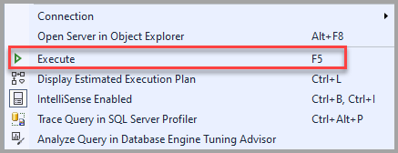
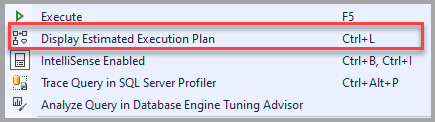
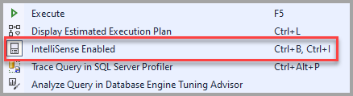
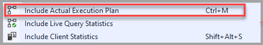
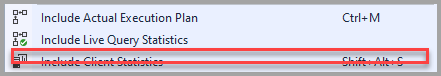

# SSMS Query Editor

[!INCLUDE[appliesto-ss-asdb-asdw-xxx-md.md](../../includes/appliesto-ss-asdb-asdw-xxx-md.md)]

The Database Engine Query Editor is one of four editors implemented in [!INCLUDE[ssManStudioFull](../../includes/ssmanstudiofull-md.md)]. For a description of the functionality implemented in the Query Editor and the main tasks you can perform using the editor, see [Query and Text Editors](../scripting/query-and-text-editors-sql-server-management-studio.md)

Use the Query Editor to create and run scripts containing Transact-SQL statements. The editor also supports running scripts that contain **sqlcmd** commands.

You can add the SQL Editor toolbar by selecting the **View** menu, selecting **Toolbars**, and then selecting **SQL Editor**. If you add the SQL Editor toolbar when no [!INCLUDE[ssDE](../../includes/ssde-md.md)] Query Editor windows are open, all the buttons are unavailable.

## Transact-SQL F1 Help

The Query Editor supports linking you to the reference topic for a specific [!INCLUDE[tsql](../../includes/tsql-md.md)] statement when you select F1. To do so, highlight the name of a Transact-SQL statement and then select F1. The help search engine then searches for a topic that has an F1 help attribute that matches the string you highlighted.

If the help search engine doesn't find a topic with an F1 help keyword that exactly matches the string you highlighted, then this topic is displayed. In that case, there are two approaches to finding the help you're looking for:

- Copy and paste the editor string you highlighted into the search tab of SQL Server Books Online and do a search.

- Highlight only the part of the Transact-SQL statement likely to match an F1 help keyword applied to a topic and select F1 again. The search engine requires an exact match between the string you highlighted and an F1 help keyword assigned to a topic. If the string you highlighted contains elements unique to your environment, such as column or parameter names, the search engine doesn't get a match. Examples of the strings to highlight include:

  - The name of a Transact-SQL statement, such as SELECT, CREATE DATABASE or BEGIN TRANSACTION.

  - The name of a built-in function, such as SERVERPROPERTY, or @@VERSION.

  - The name of a system stored procedure table, or view, such as sys.data_spaces or sp_tableoption.

## SQL Editor Toolbar

When the [!INCLUDE[ssDE](../../includes/ssde-md.md)] Query Editor is open, the SQL Editor toolbar appears with the following buttons.

### Connect using the SQL Editor Toolbar

Opens the **Connect to Server** dialog box. Use this dialog box to establish a connection to a server.

You can also connect to your database using the [context menu](#connection-using-the-context-menu).

### Change Connection using the Editor Toolbar

Opens the **Connect to Server** dialog box. Use this dialog box to establish a connection to a different server.

You can also change connections using the [context menu](#connection-using-the-context-menu).

### Available Databases using the Editor Toolbar

Change the connection to a different database on the same server.

### Execute using the Editor Toolbar

Executes the selected code or, if no code is selected, executes all the code in the Query Editor.

You can also **Execute** a query by selecting F5 or from the [context menu](#execute-using-the-context-menu).

### Cancel Executing Query using the Editor Toolbar

Sends a cancellation request to the server. Some queries can't be canceled immediately, but must wait for a suitable cancellation condition. When transactions are canceled, delays might occur while transactions are rolled back.

You can also cancel an executing query by selecting Alt + Break.

### Parse using the Editor Toolbar

Checks the syntax of the selected code. If no code is selected, it checks the syntax of all the code in the Query Editor window.

You can also check the code in the Query Editor by selecting Ctrl + F5.

### Display Estimated Execution Plan using the Editor Toolbar

Requests a query execution plan from the query processor without actually executing the query, and displays the plan in the **Execution plan** window. This plan uses index statistics as an estimate of the number of rows that are expected to be returned during each part of the query execution. The actual query plan that is used can be different from the estimated execution plan. This can occur if the number of rows that are returned is significantly different from the estimate, and the query processor changes the plan to be more efficient.

You can also display an estimated execution plan by selecting Ctrl + L or from the [context menu](#display-estimated-execution-plan-using-the-context-menu).

### Query Options using the Editor Toolbar

Opens the **Query Options** dialog box. Use this dialog box to configure the default options for query execution and for query results.

You can also select **Query Options** from the [context menu](#query-options-using-the-context-menu).

### IntelliSense Enabled using the Editor Toolbar

Specifies whether IntelliSense functionality is available in the [!INCLUDE[ssDE](../../includes/ssde-md.md)] Query Editor. This option is set by default.

You can also select **IntelliSense Enabled** by selecting Ctrl + B then Ctrl I, or from the [context menu](#intellisense-enabled-using-the-context-menu).

### Include Actual Execution Plan using the Editor Toolbar

Executes the query, returns the query results, and the execution plan that was used for the query. These appear as a graphical query plan in the **Execution plan** window.

You can also select the **Include Actual Execution Plan** by selecting Ctrl + M or from the [context menu](#include-actual-execution-plan-from-the-context-menu).

### Include Live Query Statistics using the Editor Toolbar

.

Provides real-time insights into the query execution process as the controls flow from one query plan operator to another.

You can also select the **Include Live Query Statistics** from the [context menu](#include-live-query-statistics-from-the-context-menu)

### Include Client Statistics using the Editor Toolbar

Includes a **Client Statistics** window that contains statistics about the query and about the network packets, and the elapsed time of the query.

You can also select the **Include Live Query Statistics** by selecting Shift + Alt + S or from the [context menu](#include-client-statistics-from-the-context-menu).

### Results to Text using the Editor Toolbar

Returns the query results as text in the **Results** window.

You can also return results to text by selecting Ctrl + T or from the [context menu](#results-to-text-using-the-context-menu).

### Results to Grid using the Editor Toolbar

Returns the query results as one or more grids in the **Results** window. This option is usually enabled by default.

You can also return results to text by selecting Ctrl + D or from the [context menu](#results-to-grid-using-the-context-menu).

### Results to File using the Editor Toolbar

When the query executes, the **Save Results** dialog box opens. In **Save In**, select the folder in which you want to save the file. In **File name**, type the name of the file, and then select **Save** to save the query results as a **Report** file that has the .rpt extension. For advanced options, click the down-arrow on the **Save** button, and then select **Save with Encoding**.

You can also return results to text by selecting Ctrl + Shift + F or from the [context menu](#results-to-file-using-the-context-menu).

### Comment out the selected lines using the Editor Toolbar

Makes the current line a comment by adding a comment operator (--) at the beginning of the line.

You can also comment out a line by selecting Ctrl + K then Ctrl + C.

### Uncomment the selected lines using the Editor Toolbar

Makes the current line an active source statement by removing any comment operator (--) at the beginning of the line.

You can also comment out a line by selecting Ctrl + K then Ctrl + U.

### Decrease Indent using the Editor Toolbar

Moves the text of the line to the left by removing blanks at the beginning of the line.

### Increase Line Indent using the Editor Toolbar

Moves the text of the line to the right by adding blanks at the beginning of the line.

### Specify Values for Template Parameters using the Editor Toolbar

Opens a dialog box that you can use to specify values for parameters in stored procedures and functions.

## Context menu

You can access the context menu by *right-clicking* anywhere in the query editor. The options in the context menu are similar to the SQL Editor Toolbar. With the context menu, you see the same options as **Connect** and **Execute**, but you also get other options listed such as **Insert Snippet** and **Surround With**.

### Insert Snippet

### Surround With

### Connection using the context menu

There are more **Connection** options in the context menu compared to the toolbar options in SSMS.

- **Connect** - Opens the Connect to Server dialog box. Use this dialog box to establish a connection to a server.

- **Disconnect** - Disconnects the current Query Editor from the server.

- **Disconnect All Queries** - Disconnects all query connections.

- **Change Connection** - Opens the Connect to Server dialog box. Use this dialog box to establish a connection to a different server.

### Open Server in Object Explorer

### Execute using the context menu

Executes the selected code or, if no code is selected, executes all the code in the Query Editor.

### Display Estimated Execution Plan using the context menu

Requests a query execution plan from the query processor without actually executing the query, and displays the plan in the **Execution plan** window. This plan uses index statistics as an estimate of the number of rows that are expected to be returned during each part of the query execution. The actual query plan that is used can be different from the estimated execution plan. This can occur if the number of rows that are returned is significantly different from the estimate, and the query processor changes the plan to be more efficient.

### IntelliSense Enabled using the context menu

Specifies whether IntelliSense functionality is available in the [!INCLUDE[ssDE](../../includes/ssde-md.md)] Query Editor. This option is set by default.

### Trace Query in SQL Server Profiler

### Analyze Query in Database Engine Tuning Advisor

### Design Query in Editor

### Include Actual Execution Plan using the context menu

Executes the query, returns the query results, and the execution plan that was used for the query. These appear as a graphical query plan in the **Execution plan** window.

### Include Live Query Statistics using the context menu

Provides real-time insights into the query execution process as the controls flow from one query plan operator to another.

### Include Client Statistics using the context menu

Includes a **Client Statistics** window that contains statistics about the query and about the network packets, and the elapsed time of the query.

### Results

You can select any of the *Result* options you want from the context menu.

- **Results to Text** - Returns the query results as text in the **Results** window.

- **Results to Grid** - Returns the query results as one or more grids in the **Results** window.

- **Results to File** - When the query executes, the **Save Results** dialog box opens. In **Save In**, select the folder in which you want to save the file. In **File name**, type the name of the file, and then select **Save** to save the query results as a **Report** file that has the .rpt extension. For advanced options, click the down-arrow on the **Save** button, and then select **Save with Encoding**.

### Properties Window

### Query Options using the context menu

Opens the **Query Options** dialog box. Use this dialog box to configure the default options for query execution and for query results.

## See also

[SQL Server Management Studio Alternatives](../../ssms/sql-server-management-studio-keyboard-shortcuts.md)