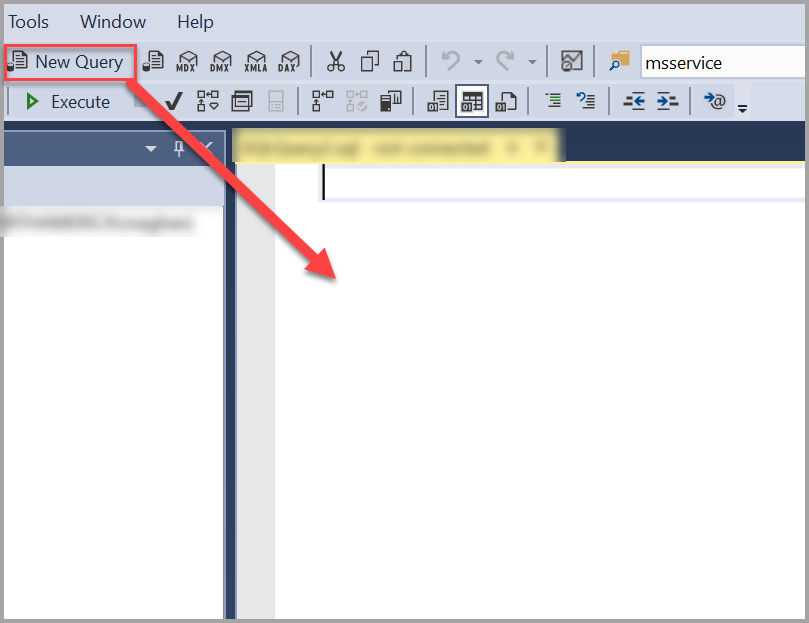
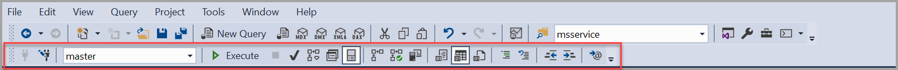
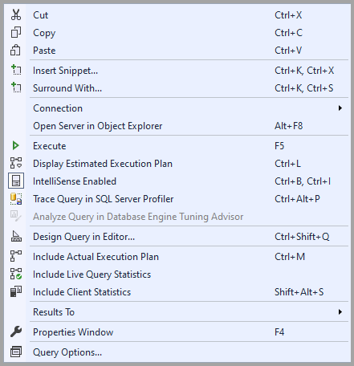
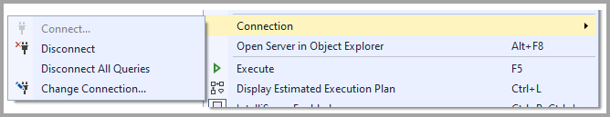
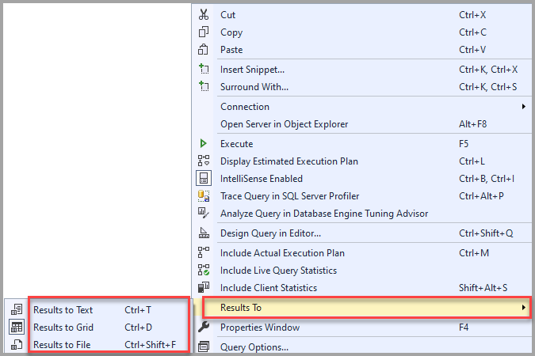

# SQL Server Management Studio (SSMS) Query Editor

[!INCLUDE [SQL Server ASDB, ASDBMI, ASDW](../../includes/applies-to-version/sql-asdb-asdbmi-asa.md)]

This article explains the query editor's features and functions in SQL Server Management Studio (SSMS).

> [!Note]
> If you want to learn how to use Transact-SQL (T-SQL) F1 Help, please view the [Transact-SQL F1 Help](#transact-sql-f1-help) section.
>
> If you want to learn about tasks that you can do with the editor, please visit the [Editor tasks](#editor-tasks) section.

The editors in SSMS share a typical architecture. The text editor implements the base level of functionality and can be used as a basic editor for text files. The other editors, or query editors, extend this functionality base by including a language service that defines the syntax of one of the languages supported in SQL Server. The query editors also implement varying levels of support for editor features such as IntelliSense and debugging. The query editors include the Database Engine Query Editor for use in building scripts containing T-SQL and XQuery statements, the MDX editor for the MDX language, the DMX editor for the DMX language, and the XML/A editor for the XML for Analysis language.
You can use the Query Editor to create and run scripts containing Transact-SQL statements.

## SQL Editor toolbar

When the Query Editor is open, the SQL Editor toolbar appears with the following buttons.

You can also add the SQL Editor toolbar by selecting the **View** menu, selecting **Toolbars**, and then selecting **SQL Editor**. If you add the SQL Editor toolbar when no Query Editor windows are open, all the buttons are unavailable.

### Connect using the editor toolbar

Opens the **[Connect to Server](connect-to-server-database-engine.md)** dialog box. Use this dialog box to establish a connection to a server.

You can also connect to your database using the [context menu](#connection-using-the-context-menu).

### Change Connection using the editor toolbar

Opens the **Connect to Server** dialog box. Use this dialog box to establish a [connection to a different server](f1-help-for-server-connections-sql-server-management-studio.md).

You can also change connections using the [context menu](#connection-using-the-context-menu).

### Available Databases using the editor toolbar

Change the connection to a different database on the same server.

### Execute using the editor toolbar

Executes the selected code or, if no code is selected, it executes all the Query Editor code.

You can also **Execute** a query by selecting F5 or from the [context menu](#execute-using-the-context-menu).

### Cancel Executing Query using the editor toolbar

Sends a cancellation request to the server. Some queries can't be canceled immediately but must wait for a suitable cancellation condition. When transactions are canceled, delays might occur while transactions are rolled back.

You can also cancel an executing query by selecting Alt + Break.

### Parse using the editor toolbar

Checks the syntax of the selected code. If no code is selected, it checks all the code's syntax in the Query Editor window.

You can also check the code in the Query Editor by selecting Ctrl + F5.

### Display Estimated Execution Plan using the editor toolbar

Requests a query execution plan from the query processor without executing the query, and displays the plan in the **Execution plan** window. This plan uses index statistics to estimate the number of rows expected to return during each part of the query execution. The actual query plan that is used can be different from the estimated execution plan. If the number of returned rows is different from the estimate, and the query processor changes the plan to be more efficient, this can occur.

You can also display an estimated execution plan by selecting Ctrl + L or from the [context menu](#display-estimated-execution-plan-using-the-context-menu).

### Query Options using the editor toolbar

Opens the **Query Options** dialog box. Use this dialog box to configure the default options for query execution and for query results.

You can also select **Query Options** from the [context menu](#query-options-using-the-context-menu).

### IntelliSense Enabled using the editor toolbar

Specifies whether [IntelliSense](../scripting/configure-intellisense-sql-server-management-studio.md) functionality is available in the Database Engine Query Editor. This option is set by default.

You can also select **IntelliSense Enabled** by selecting Ctrl + B then Ctrl + I, or from the [context menu](#intellisense-enabled-using-the-context-menu).

### Include Actual Execution Plan using the editor toolbar

Executes the query, returns the query results, and uses the execution plan for the query. The queries appear as a graphical query plan in the **Execution plan** window.

You can also select the **Include Actual Execution Plan** by selecting Ctrl + M or from the [context menu](#include-actual-execution-plan-using-the-context-menu).

### Include Live Query Statistics using the editor toolbar

Provides real-time insights into the query execution process as the controls flow from one query plan operator to another.

You can also select the **Include Live Query Statistics** from the [context menu](#include-live-query-statistics-using-the-context-menu).

### Include Client Statistics using the editor toolbar

Includes a **Client Statistics** window that contains statistics about the query and about the network packets, and the elapsed time of the query.

You can also select the **Include Live Query Statistics** by selecting Shift + Alt + S or from the [context menu](#include-client-statistics-using-the-context-menu).

### Results to Text using the editor toolbar

Returns the query results as text in the **Results** window.

You can also return results to text by selecting Ctrl + T or from the [context menu](#results-using-the-context-menu).

### Results to Grid using the editor toolbar

Returns the query results as one or more grids in the **Results** window. This option is enabled by default.

You can also return results to text by selecting Ctrl + D or from the [context menu](#results-using-the-context-menu).

### Results to File using the editor toolbar

When the query executes, the **Save Results** dialog box opens. In **Save In**, select the folder in which you want to save the file. In **Filename**, type the name of the file, and then select **Save** to save the query results as a **Report** file that has the .rpt extension. For advanced options, select the down-arrow on the **Save** button, and then select **Save with Encoding**.

You can also return results to text by selecting Ctrl + Shift + F or from the [context menu](#results-using-the-context-menu).

### Comment out the selected lines using the editor toolbar

Makes the current line a comment by adding a comment operator (--) at the beginning of the line.

You can also comment out a line by selecting Ctrl + K, then Ctrl + C.

### Uncomment the selected lines using the editor toolbar

Makes the current line an active source statement by removing any comment operator (--) at the beginning of the line.

You can also uncomment a line by selecting Ctrl + K, then Ctrl + U.

### Decrease Indent using the editor toolbar

Moves the text of the line to the left by removing blanks at the beginning of the line.

### Increase Line Indent using the editor toolbar

Moves the text of the line to the right by adding blanks at the beginning of the line.

### Specify Values for Template Parameters using the editor toolbar

Opens a dialog box that you can use to specify values for parameters in stored procedures and functions.

## Context menu

You can access the context menu by *right-clicking* anywhere in the query editor. The options in the context menu are similar to the SQL Editor Toolbar. With the context menu, you see the same options as **Connect** and **Execute**, but you also get other options listed, such as **Insert Snippet** and **Surround With**.

### Insert Snippet using the context menu

A [T-SQL Code Snippets](../scripting/add-transact-sql-snippets.md) is a template you can use as a starting point when writing new Transact-SQL statements in the Query Editor.

### Surround With using the context menu

A surround-with snippet is a template you can use as a starting point when enclosing a set of Transact-SQL statements in a BEGIN, IF, or WHILE block.

### Connection using the context menu

There are more **Connection** options in the context menu compared to the toolbar options in SSMS.

- **Connect** - Opens the Connect to Server dialog box. Use this dialog box to establish a connection to a server.

- **Disconnect** - Disconnects the current Query Editor from the server.

- **Disconnect All Queries** - Disconnects all query connections.

- **Change Connection** - Opens the Connect to Server dialog box. Use this dialog box to establish a connection to a different server.

### Open Server in Object Explorer using the context menu

Object Explorer provides a hierarchical user interface to view and manage the objects in each instance of SQL Server. The Object Explorer Details pane presents a tabular view of instance objects, and the capability to search for specific objects. The capabilities of Object Explorer vary slightly depending on the type of server, but generally include the development features for databases, and management features for all server types.

### Execute using the context menu

Executes the selected code or, if no code is selected, executes all the code in the Query Editor.

### Display Estimated Execution Plan using the context menu

Requests a query execution plan from the query processor without actually executing the query, and displays the plan in the **Execution plan** window. This plan uses index statistics to estimate the number of rows expected to return during each part of the query execution. The actual query plan that is used can be different from the estimated execution plan. If the number of rows that are returned is different from the estimate, and the query processor changes the plan to be more efficient, this can occur

### IntelliSense Enabled using the context menu

Specifies whether IntelliSense functionality is available in the Database Engine Query Editor. This option is set by default.

### Trace Query in SQL Server Profiler using the context menu

SQL Server Profiler is an interface to create and manage traces and analyze and replay trace results. Events are saved in a trace file that can later be analyzed or used to replay a specific series of steps when trying to diagnose a problem.

### Analyze Query in Database Engine Tuning Advisor using the context menu

The Microsoft Database Engine Tuning Advisor (DTA) analyzes databases and makes recommendations that you use to optimize query performance. You use the Database Engine Tuning Advisor to select and create an optimal set of indexes, indexed views, or table partitions without having an expert understanding of the database structure or the internals of SQL Server. Using the DTA, you can perform the following tasks.

### Design Query in Editor using the context menu

The Query and View Designer opens when you open the definition of a view, show the results for a query or view, or create or open a query.

### Include Actual Execution Plan using the context menu

Executes the query, returns the query results, and uses the execution plan for the query. The queries appear as a graphical query plan in the **Execution plan** window.

### Include Live Query Statistics using the context menu

Provides real-time insights into the query execution process as the controls flow from one query plan operator to another.

### Include Client Statistics using the context menu

Includes a **Client Statistics** window that contains statistics about the query and about the network packets, and the elapsed time of the query.

### Results using the context menu

You can select any of the *Result* options you want from the context menu.

- **Results to Text** - Returns the query results as text in the **Results** window.

- **Results to Grid** - Returns the query results as one or more grids in the **Results** window.

- **Results to File** - When the query executes, the **Save Results** dialog box opens. In **Save In**, select the folder in which you want to save the file. In **File name**, type the file's name, and then select **Save** to save the query results as a **Report** file with the .rpt extension. For advanced options, select the down-arrow on the **Save** button, and then select **Save with Encoding**.

### Properties Window using the context menu

The [Properties Window](../menu-help/properties-window-f1-help-management-studio.md) describes the state of an item in SQL Server Management Studio, such as a connection or a Showplan operator, and information about database objects such as tables, views, and designers.

You use the Properties window to view the properties of the current connection. Many properties are read-only in the Properties window but can be changed elsewhere in the Management Studio. For example, the Database property of a query is read-only in the Properties window but can be changed on the tool bar.

### Query Options using the context menu

Opens the **Query Options** dialog box. Use this dialog box to configure the default options for query execution and query results.

## Transact-SQL F1 Help

The Query Editor supports linking you to the reference topic for a specific Transact-SQL statement when you select F1. To do so, highlight the name of a Transact-SQL statement and then select F1. The help search engine then searches for a topic that has an F1 help attribute that matches the string you highlighted.

If the help search engine doesn't find a topic with an F1 help keyword that exactly matches the string you highlighted, then this topic is displayed. In that case, there are two approaches to finding the help you're looking for:

- Copy and paste the editor string you highlighted into the search tab of SQL Server Books Online and do a search.

- Highlight only the part of the Transact-SQL statement likely to match an F1 help keyword applied to a topic and select F1 again. The search engine requires an exact match between the string you highlighted and an F1 help keyword assigned to a topic. If the string you highlighted contains elements unique to your environment, such as column or parameter names, the search engine doesn't get a match. Examples of the strings to highlight include:

  - The name of a Transact-SQL statement, such as SELECT, CREATE DATABASE, or BEGIN TRANSACTION.

  - The name of a built-in function, such as SERVERPROPERTY, or @@VERSION.

  - The name of a system stored procedure table, or views, such as sys.data_spaces or sp_tableoption.

## Editor Tasks

| Task Description | Topic |
|------------------|-------|
| Describes the various ways you can open the editors in SSMS.| [Open an Editor](../scripting/open-an-editor-sql-server-management-studio.md) |
| Configure options for the various editors, such as line numbering and IntelliSense options. | [Configure Editors](../scripting/configure-editors-sql-server-management-studio.md) |
| How to manage the view mode, such as word wrap, splitting a window, or tabs.| [Manage the Editor and View Mode](../scripting/manage-the-editor-and-view-mode.md) |
| Set formatting options, such as hidden text or indentation. | [Manage Code Formatting](../scripting/manage-code-formatting.md) |
| Navigate through the text in an editor window by using features such as incremental search or go to. | [Navigate Code and Text](../scripting/navigate-code-and-text.md) |
| Set color coding options for various classes of syntax, which makes it easier to read complex statements. | [Color Coding in Query Editors](../scripting/color-coding-in-query-editors.md) |
| Drag text from one location in a script and drop it in a new location.| [Drag and drop text](../scripting/drag-and-drop-text.md) |
| How to set bookmarks in order to more easily find important pieces of code. | [Manage bookmarks](../scripting/manage-bookmarks.md) |
| How to print scripts or the results in a window or grid.| [Print Code and Results](../scripting/print-code-and-results.md) |
| View and use the basic features in the MDX Query Editor. | [Create Analysis Services Scripts](/analysis-services/instances/create-analysis-services-scripts-in-management-studio) |
| View and use the basic features in the DMX Query Editor. | [Create a DMX Query](/analysis-services/data-mining/create-a-dmx-query-in-sql-server-management-studio) |
| View and use the basic features in the XML/A Editor. | [XML Editor](../scripting/xml-editor-sql-server-management-studio.md) |
| How to use the sqlcmd features in the Database Engine Query Editor.| [Edit SQLCMD Scripts](../scripting/edit-sqlcmd-scripts-with-query-editor.md) |
| How to use code snippets in the Database Engine Query Editor. Snippets are templates for commonly used statements or blocks, and can be customized or extended to include site-specific snippets.| [T-SQL Code Snippets](../scripting/add-transact-sql-snippets.md) |
| How to use the Transact\-SQL debugger to step through code and view debugging information such as the values in variables and parameters.| [T-SQL Debugger](../scripting/transact-sql-debugger.md) |

## See also

- [Customize menus and shortcut keys](../customize-menus-and-shortcut-keys.md)
- [SQL Server Management Studio Keyboard Shortcuts](../../ssms/sql-server-management-studio-keyboard-shortcuts.md)