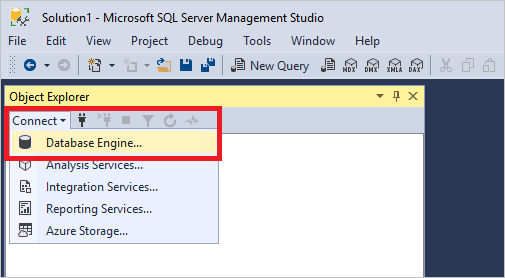
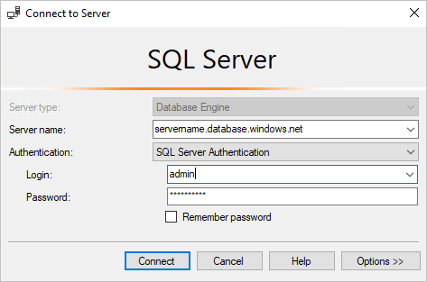
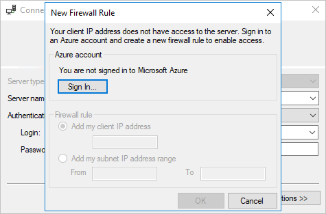
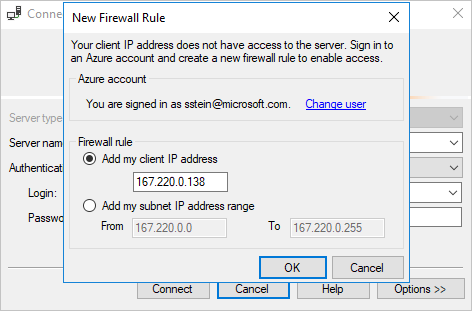
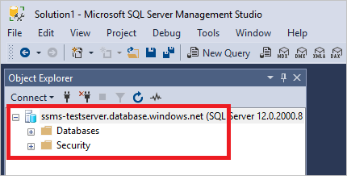

# Connect to a SQL Server or Azure SQL Database

[!INCLUDE[appliesto-ss-asdb-asdw-pdw-md](../../includes/appliesto-ss-asdb-asdw-pdw-md.md)]
To work with servers and databases, you must first connect to the server. You can connect to multiple servers at the same time.

[SQL Server Management Studio (SSMS)](../download-sql-server-management-studio-ssms.md) supports several types of connections. This article provides details for connecting to SQL Server and Azure SQL Database (connecting to an Azure SQL standalone database or elastic pool). For information on the other connection options, see the [links](#see-also) at the bottom of this page.
  
## Connecting to a Server  

1. On **Object Explorer**, click **Connect > Database Engine...**.

   

1. Fill out the **Connect to Server** form and click **Connect**:

   

1. If you're connecting to an Azure SQL Server, you might get prompted to sign in to create a firewall rule. Click **Sign In...** (if not, skip to step 6 below)

   

1. After successfully signing in, the form is pre-populated with your specific IP address. If your IP address changes often, it might be easier to grant access to a range, so select the option that's best for your environment. 

   

1. To create the firewall rule and connect to the server, click **OK**.

1. The server appears in **Object Explorer** after successfully connecting:

   

## Next Steps

[Design, Create, and Update Tables](../visual-db-tools/design-tables-visual-database-tools.md)

## See Also

[SQL Server Management Studio (SSMS)](../sql-server-management-studio-ssms.md)  
[Download SQL Server Management Studio (SSMS)](../download-sql-server-management-studio-ssms.md)

[Analysis Services](https://docs.microsoft.com/sql/analysis-services/instances/connect-to-analysis-services)  
[Integration Services](https://docs.microsoft.com/sql/integration-services/sql-server-integration-services)  
[Reporting Services](https://docs.microsoft.com/sql/reporting-services/tools/connect-to-a-report-server-in-management-studio)  
[Azure Storage](../f1-help/connect-to-microsoft-azure-storage.md)  
