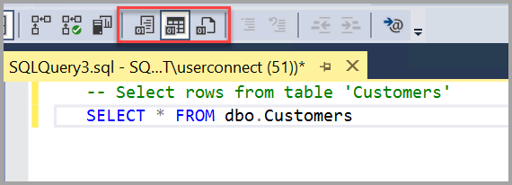

# Quickstart: Connect and query a SQL Server instance using SQL Server Management Studio (SSMS)

[!INCLUDE [sqlserver](../../includes/applies-to-version/sqlserver.md)]

Get started using SQL Server Management Studio (SSMS) to connect to your SQL Server instance and run some Transact-SQL (T-SQL) commands.

The article demonstrates how to follow the below steps:

> [!div class="checklist"]
> - Connect to a SQL Server instance
> - Create a database
> - Create a table in your new database
> - Insert rows into your new table
> - Query the new table and view the results
> - Use the query window table to verify your connection properties


This article covers connecting and querying an instance of SQL Server. For Azure SQL, see [Connect and query Azure SQL Database & SQL Managed Instance](/azure/azure-sql/database/connect-query-ssms). 

To use [Azure Data Studio](../../azure-data-studio/download-azure-data-studio.md), see connect and query [SQL Server](../../azure-data-studio/quickstart-sql-server.md), [Azure SQL Database](../../azure-data-studio/quickstart-sql-database.md), and [Azure Synapse Analytics](../../azure-data-studio/quickstart-sql-dw.md).

To learn more about SQL Server Management Studio, see [Additional Tips and Tricks](../tutorials/ssms-tricks.md).

## Prerequisites

To complete this quickstart, you need the following prerequisites: 


- Install [SQL Server Management Studio](../download-sql-server-management-studio-ssms.md).
- [Install](../../database-engine/install-windows/install-sql-server-from-the-installation-wizard-setup.md) and configure a [SQL Server instance](https://www.microsoft.com/sql-server/sql-server-downloads). 

## Connect to a SQL Server instance

To connect to your SQL Server instance, follow these steps: 

1. Start SQL Server Management Studio. The first time you run SSMS, the **Connect to Server** window opens. If it doesn't open, you can open it manually by selecting **Object Explorer** > **Connect** > **Database Engine**.

    :::image type="content" source="media/ssms-connect-query-sql-server/connect-object-explorer.png" alt-text="Connect link in Object Explorer":::

2. The **Connect to Server** dialog box appears. Enter the following information:

    |   Setting   |   Suggested Value(s)   |   Description   |
    |--------------|-----------------------|-----------------|
    | **Server type** | Database engine | For **Server type**, select **Database Engine** (usually the default option). |
    | **Server name** | The fully qualified server name | For **Server name**, enter the name of your SQL Server (you can also use *localhost* as the server name if you're connecting locally). If you're NOT using the default instance - ***MSSQLSERVER*** - you must enter in the server name and the instance name. </br> </br> If you're unsure how to determine your SQL Server instance name, see [Additional tips and tricks for using SSMS](../tutorials/ssms-tricks.md#find-sql-server-instance-name). |
    | **Authentication** | Windows Authentication </br> </br> SQL Server Authentication | Windows Authentication is set as default. </br> </br> You can also use **SQL Server Authentication** to connect. However, if you select **SQL Server Authentication**, a username and password are required. </br> </br> For more information about authentication types, see [Connect to the server (database engine)](../f1-help/connect-to-server-database-engine.md). |
    | **Login** | Server account user ID | The user ID from the server account used to log in to the server. A login is required when using **SQL Server Authentication**. |
    | **Password** | Server account password | The password from the server account used to log in the server. A password is required when using **SQL Server Authentication**. |

    :::image type="content" source="media/ssms-connect-query-sql-server/connect-to-sql-server-object-explorer.png" alt-text="Server name field for SQL Server":::

3. After you've completed all the fields, select **Connect**.

    You can also modify additional connection options by selecting **Options**. Examples of connection options are the database you're connecting to, the connection timeout value, and the network protocol. This article uses the default values for all the fields.

4. To verify that your SQL Server connection succeeded, expand and explore the objects within **Object Explorer** where the server name, the SQL Server version, and the username are displayed. These objects are different depending on the server type.

    :::image type="content" source="media/ssms-connect-query-sql-server/connect-on-prem.png" alt-text="Connecting to an on-premises server":::

## Create a database

Now let's create a database named TutorialDB by following the below steps:

1. Right-click your server instance in Object Explorer, and then select **New Query**:

   :::image type="content" source="media/ssms-connect-query-sql-server/new-query.png" alt-text="The New Query link":::

2. Paste the following T-SQL code snippet into the query window:

    ```sql
    USE master
    GO
    IF NOT EXISTS (
       SELECT name
       FROM sys.databases
       WHERE name = N'TutorialDB'
    )
    CREATE DATABASE [TutorialDB]
    GO
   ```

3. Execute the query by selecting **Execute** or selecting F5 on your keyboard.

   :::image type="content" source="media/ssms-connect-query-sql-server/execute.png" alt-text="The Execute command":::
  
    After the query is complete, the new TutorialDB database appears in the list of databases in Object Explorer. If it isn't displayed, right-click the **Databases** node, and then select **Refresh**.

## Create a table

In this section, you create a table in the newly created TutorialDB database. Because the query editor is still in the context of the *master* database, switch the connection context to the *TutorialDB* database by doing the following steps:

1. In the database drop-down list, select the database that you want, as shown here:

   :::image type="content" source="media/ssms-connect-query-sql-server/change-db.png" alt-text="Change database":::

2. Paste the following T-SQL code snippet into the query window:

    ```sql
    USE [TutorialDB]
    -- Create a new table called 'Customers' in schema 'dbo'
    -- Drop the table if it already exists
    IF OBJECT_ID('dbo.Customers', 'U') IS NOT NULL
    DROP TABLE dbo.Customers
    GO
    -- Create the table in the specified schema
    CREATE TABLE dbo.Customers
    (
       CustomerId        INT    NOT NULL   PRIMARY KEY, -- primary key column
       Name      [NVARCHAR](50)  NOT NULL,
       Location  [NVARCHAR](50)  NOT NULL,
       Email     [NVARCHAR](50)  NOT NULL
    );
    GO
    ```

3. Execute the query by selecting **Execute** or selecting F5 on your keyboard.

After the query is complete, the new Customers table is displayed in the list of tables in Object Explorer. If the table isn't displayed, right-click the **TutorialDB** > **Tables** node in Object Explorer, and then select **Refresh**.

   :::image type="content" source="media/ssms-connect-query-sql-server/new-table.png" alt-text="New table":::

## Insert rows

Now let's insert some rows into the Customers table that you created. Paste the following T-SQL code snippet into the query window, and then select **Execute**:

   ```sql
   -- Insert rows into table 'Customers'
   INSERT INTO dbo.Customers
      ([CustomerId],[Name],[Location],[Email])
   VALUES
      ( 1, N'Orlando', N'Australia', N''),
      ( 2, N'Keith', N'India', N'keith0@adventure-works.com'),
      ( 3, N'Donna', N'Germany', N'donna0@adventure-works.com'),
      ( 4, N'Janet', N'United States', N'janet1@adventure-works.com')
   GO
   ```

## Query the table and view the results

The results of a query are visible below the query text window. To query the Customers table and view the rows that were inserted, follow the steps below:

1. Paste the following T-SQL code snippet into the query window, and then select **Execute**:

   ```sql
   -- Select rows from table 'Customers'
   SELECT * FROM dbo.Customers;
   ```

    The results of the query are displayed under the area where the text was entered.

   :::image type="content" source="media/ssms-connect-query-sql-server/query-results.png" alt-text="The Results list":::

    You can also modify the way results are presented by selecting one of the following options:

   

   - The first button displays the results in **Text View**, as shown in the image in the next section.
   - The middle button displays the results in **Grid View**, which is the default option.
       - This is set as default
   - The third button lets you save the results to a file whose extension is .rpt by default.

## Verify your connection properties by using the query window table

You can find information about the connection properties under the results of your query. After you run the previously mentioned query in the preceding step, review the connection properties at the bottom of the query window.

- You can determine which server and database you're connected to, and the username that you use.
- You can also view the query duration and the number of rows that are returned by the previously executed query.

   :::image type="content" source="media/ssms-connect-query-sql-server/connection-properties.png" alt-text="Connection properties":::

## Troubleshoot connectivity issues

To review troubleshooting techniques to use when you can't connect to an instance of your SQL Server Database Engine on a single server, visit [Troubleshoot connecting to the SQL Server Database Engine](/troubleshoot/sql/connect/network-related-or-instance-specific-error-occurred-while-establishing-connection).

## Next steps

The best way to get acquainted with SSMS is through hands-on practice. These articles help you with various features available within SSMS.

- [SQL Server Management Studio (SSMS) Query Editor](../f1-help/database-engine-query-editor-sql-server-management-studio.md)
- [Scripting](../tutorials/scripting-ssms.md)
- [Using Templates in SSMS](../template/templates-ssms.md)
- [SSMS Configuration](../tutorials/ssms-configuration.md)
- [Additional Tips and Tricks for using SSMS](../tutorials/ssms-tricks.md)
