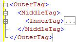

# Code Outlining
[!INCLUDE[SQL Server Azure SQL Database Synapse Analytics PDW](../../includes/applies-to-version/sql-asdb-asdbmi-asa-pdw.md)]
  You can use the outlining feature in the [!INCLUDE[ssManStudioFull](../../includes/ssmanstudiofull-md.md)] query editors to selectively hide code when you edit queries. This enables you to more easily view the code you are working on, especially in large query files.  
  
## Outlining Overview  
 By default, all code is visible when you open a query editor window. Regions of the code can be collapsed to hide it from view. A vertical line on the left edge of the editor window uses a square with a minus sign (-) to identify the start of each collapsible code region. When you click a minus sign, the text of the code region is replaced with a box that contains three periods (...), and the minus sign changes to a plus sign (+). When you click a plus sign, the collapsed code appears and the plus sign changes to a minus sign. When you move the pointer over a box that has three periods, a tooltip appears that shows the code in the collapsed section.  
  
## System Outline Regions  
 Each SQL Server Management Studio editor generates a set of default, system-defined outline regions.  
  
 The MDX and DMX code editors create outline regions for each multiline statement. This is the only level of outlining that these editors support.  
  
### Analysis Services XMLA Query Editor Regions  
 The [!INCLUDE[ssASnoversion](../../includes/ssasnoversion-md.md)] XMLA Query Editor generates an outline region for each multiline XML attribute. The editor nests the outline regions for nested tags. For example, the XMLA Editor creates three outline regions for the following document.  
  
   
  
 When you click the minus sign on the \<InnerTag> line, just the InnerTag is collapsed, as shown in the following illustration.  
  
   
  
 When you move the pointer over the box that has the three periods (...), the code in the collapsed region appears in a tooltip, as shown in the following illustration.  
  
   
  
 When you click the minus sign on the \<MiddleTag> line, both the MiddleTag and InnerTag are collapsed, as shown in the following illustration.  
  
   
  
 When you click the minus sign on the \<OuterTag> line, all three lines are collapsed, as shown in the following illustration.  
  
   
  
### Database Engine Query Editor Regions  
 The [!INCLUDE[ssDE](../../includes/ssde-md.md)] Query Editor generates outline regions for each element in the following hierarchy:  
  
1.  Batches. The first batch is the code from the start of the file to either the first GO command or the end of the file when there are no GO commands. After the first GO, there is one batch from each GO command to either the next GO command or the end of the file.  
  
2.  Blocks delimited by the following keywords:  
  
    -   BEGIN - END  
  
    -   BEGIN TRY - END TRY  
  
    -   BEGIN CATCH - END CATCH  
  
3.  Multiline statements.  
  
 For example, the [!INCLUDE[ssDE](../../includes/ssde-md.md)] Query Editor creates three outline regions for the following query:  
  
```  
CREATE PROCEDURE Sales.SampleProc --Outline region 1  
AS  
BEGIN --Outline region 2   
  SELECT GETDATE() AS TimeOfQuery;  
  SELECT * --Outline region 3  
  FROM sys.transmission_queue;  
  SELECT @@VERSION;  
END;  
GO  
```  
  
 You can click the minus sign on the `SELECT *` line to collapse just that `SELECT` statement. To collapse the whole `BEGIN - END` block, click the minus sign on the `BEGIN` line. To collapse the whole batch to the `GO` command, click the minus sign on the `CREATE PROCEDURE` line. You cannot collapse the `SELECT GETDATE()` or `SELECT @@VERSION` lines individually because they are single line statements and do not get outlining regions.  
  
  
