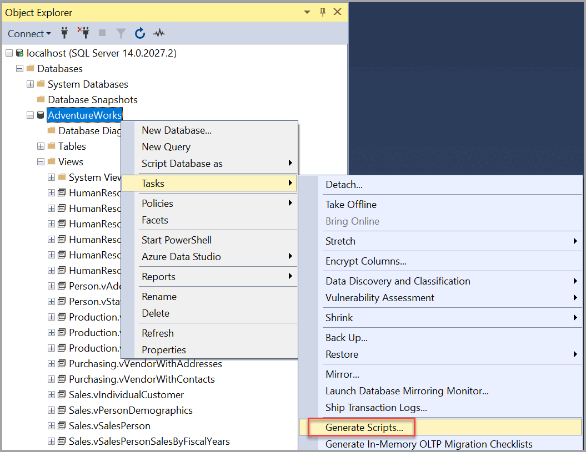
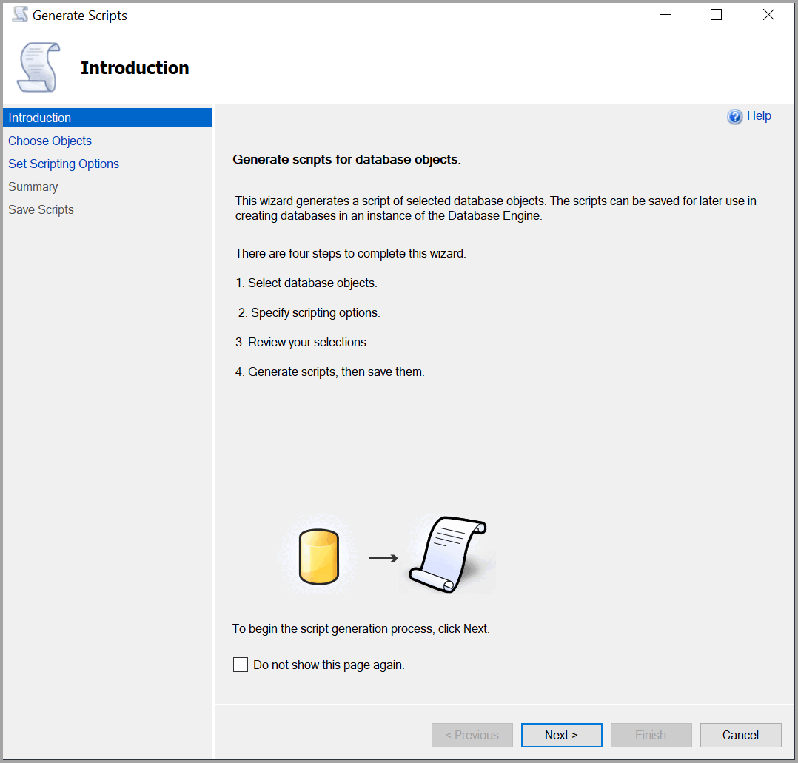
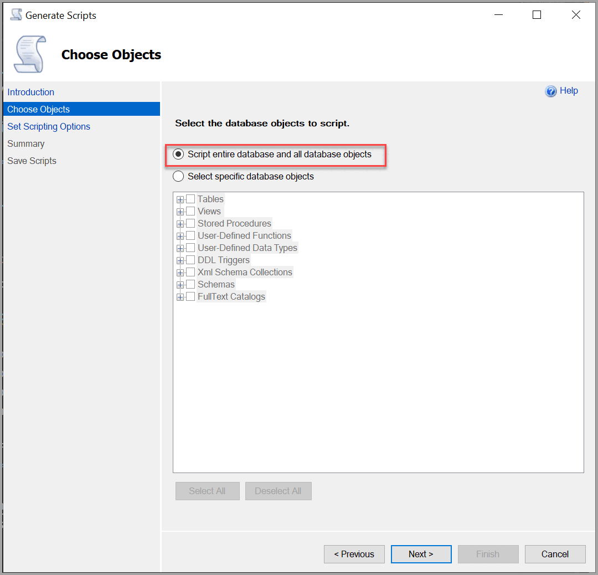
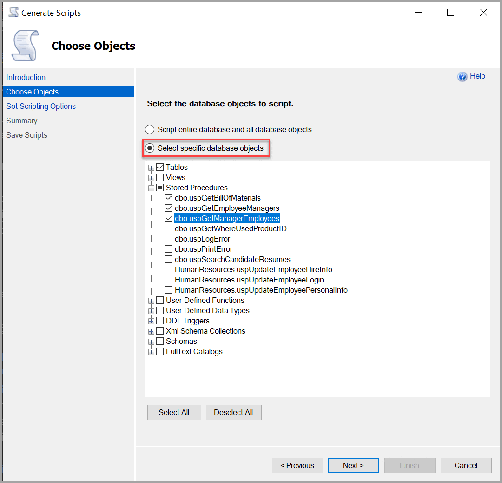
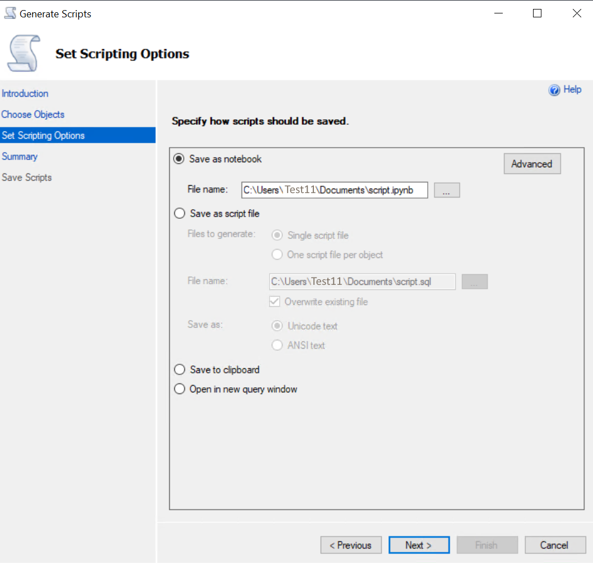
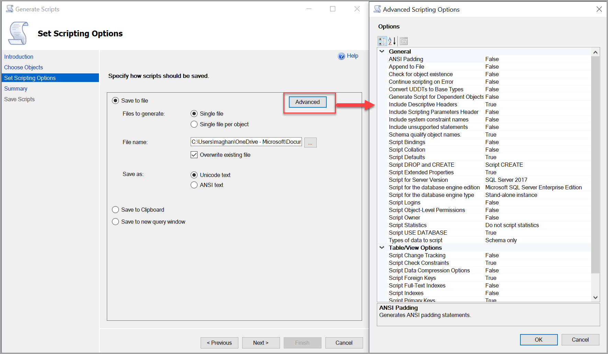
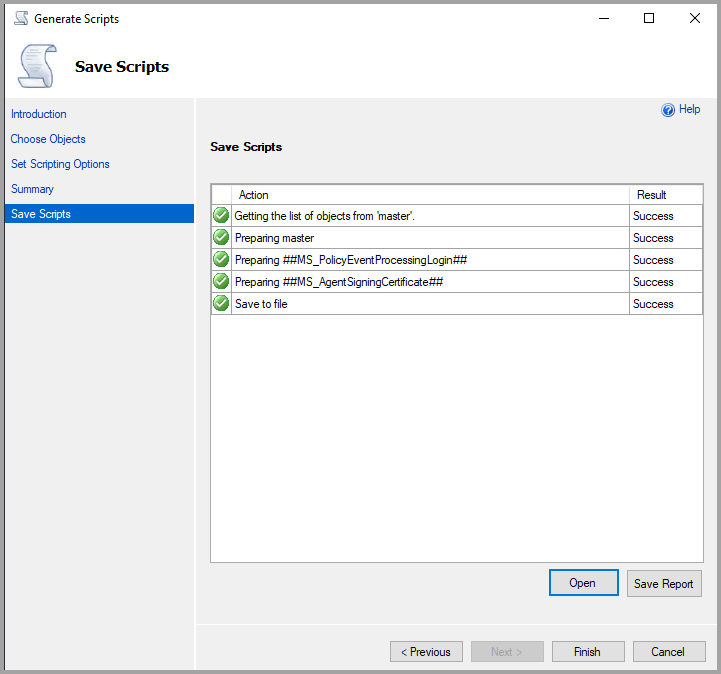

# Generate and Publish Scripts Wizard

[!INCLUDE[SQL Server Azure SQL Database Synapse Analytics PDW](../../includes/applies-to-version/sql-asdb-asdbmi-asa-pdw.md)]

You can use the **Generate and Publish Scripts Wizard** to create scripts for transferring a database between instances of the [!INCLUDE[ssDEnoversion](../../includes/ssdenoversion-md.md)] or [!INCLUDE[ssSDSFull](../../includes/sssdsfull-md.md)]. You can generate scripts for a database on an instance of the Database Engine in your local network, or from [!INCLUDE[ssSDS](../../includes/sssds-md.md)]. The generated scripts can be run on another instance of the Database Engine or [!INCLUDE[ssSDS](../../includes/sssds-md.md)]. You can also use the wizard to publish the contents of a database directly to a Web service created by using the Database Publishing Services. You can create scripts for an entire database, or limit it to specific objects.

For a more detailed Tutorial on using the Generate and Publish Scripts wizard, see [Tutorial: Generate Scripts Wizard](../tutorials/scripting-ssms.md#script-databases).

## Before You Begin

The source and target database can be on [!INCLUDE[ssSDS](../../includes/sssds-md.md)], or an instance of the [!INCLUDE[ssDE](../../includes/ssde-md.md)] running [!INCLUDE[ssVersion2005](../../includes/ssversion2005-md.md)] or later.

###  Publishing to a Hosted Service

In addition to creating scripts, the **Generate and Publish Scripts Wizard** can be used to publish a database to a specific type of hosted SQL Server Web service. The SQL Server Hosting Toolkit provides Database Publishing Services as a shared source project on CodePlex. The Database Publishing Services project can be used by Web hosting providers to build a set of Web services that make it easy for their customers to deploy databases to the Web service. For more information about downloading the SQL Server Hosting Toolkit, see [SQL Server Database Publishing Services](../../relational-databases/databases/publish-a-database-sql-server-management-studio.md).

To publish a database to a Web hosting service, select the **Publish to Web Service** option on the **Set Scripting Options** page of the wizard.

###  Permissions

The minimum permission to publish a database is membership in the db_ddladmin fixed database role on the origin database. The minimum permission to publish a database script to an instance of [!INCLUDE[ssNoVersion](../../includes/ssnoversion-md.md)] at the hosting provider is membership in the db_ddladmin fixed database role on the target database.

The user also has to supply a user name and password to access their hosting provider account to publish with the wizard. The target database must be created at the hosting provider before the source database is published. Publishing overwrites objects in that existing database.

##  Using the Generate and Publish Scripts Wizard

**To generate a publish a script**

1. In **Object Explorer**, expand the node for the instance containing the database to be scripted.

2. Point to **Tasks**, and then select **Generate Scripts**.

    

3. Complete the wizard dialogs:

    - [Introduction Page](#Introduction)
    - [Choose Objects Page](#ChooseObjects)
    - [Set Scripting Options Page](#SetScriptOpt)
    - [Advanced Scripting Options Page](#AdvScriptOpt)
    - [Summary Page](#Summary)
    - [Save or Publish Scripts Page](#SavePubScripts)

###   Introduction Page

This page describes the steps for generating or publishing a script.

**Do not show this page again** - Skip this page the next time you start the 
**Generate and Publish Scripts Wizard**.

  

###  Choose Objects Page

Use this page to choose which objects you want to include in the scripts generated by this wizard. In the following wizard page, you have an option to save these scripts to the location of your choice or use them to publish database objects to a remote Web hosting provider that has installed the [SQL Server Database Publishing Services](../../relational-databases/databases/publish-a-database-sql-server-management-studio.md).

**Script Entire Database Option** - Select to generate scripts for all objects in the database and to include a script for the database itself.

   

**Select specific database objects** - Select to limit the wizard to generate scripts for only the specific objects in the database that you choose:

- **Database objects** - Select at least one object to include in the script.

- **Select All** - Selects all available check boxes.

- **Deselect All** - Clears all the check boxes. You must select at least one database object to continue.

   

###  Set Scripting Options Page

Use this page to specify if you want the wizard to save scripts to the location of your choice or to use them to publish database objects to a remote Web hosting provider. To publish, you must get access to a Web service installed by using the Database Publishing Services Web service.

**Options** - If you want the wizard to save scripts to a location of your choice, select **Save scripts to a specific location**. You can later run the scripts against either an instance of the Database Engine, or against [!INCLUDE[ssSDS](../../includes/sssds-md.md)]. If you want the wizard to publish your database objects to a remote Web hosting provider, select **Publish to Web service**.

**Save Scripts to a Specific Location** - save one or more Transact-SQL script files to a location you specify.

- **[Save as notebook](../../azure-data-studio/notebooks/notebooks-guidance.md)** - Save the script to one or more .sql files. Select the browse button (**...**) to specify a name and location for the file.

- **Save as script file** Save the script to one or more .sql files. Select the browse button **(...)** to specify a name and location for the file. Select the **Overwrite existing file** check box to replace the file if one already exists with the same name. Select **Single script file** or **One script file per object** to specify how the scripts should be generated. Select **Unicode text** or **ANSI text** to specify the kind of text that should be used in the script.

- **Save to Clipboard** - Save the Transact-SQL script to the Clipboard.

- **Open in new query window** - Generate the script to a Database Engine Query Editor window. If no editor window is open, a new editor window is opened as the target for the script.

- **Advanced** - Display the **Advanced Publishing Options** dialog box where you can select advanced options for publishing scripts.

- **Provider** - Select the provider that specifies the connection information for the Web hosting service that hosts the database where you want to publish the objects that you selected. You must have at least one provider in the **Manage Providers** dialog box to select a provider.

- **Target database** - Select the target database where you want to publish the objects that you selected. You must select a provider before selecting a target database.

###  Advanced Scripting Options Page

Use this page to specify how you want this wizard to generate scripts. Many different options are available. Options are greyed out if they are not supported by the version of SQL Server or [!INCLUDE[ssSDS](../../includes/sssds-md.md)] specified in **Database engine type**.

**Options** - Specify advanced options by selecting a value from the list of available settings to the right of each option.

**General** - The following options apply to the entire script.

- **ANSI Padding** - Includes **ANSI PADDING ON** in the script. The default is **True**.

- **Append to file** - When **True**, this script is added to the bottom of an existing script, specified on the **Set Scripting Options** page. When **False**, the new script overwrites a previous script. The default is **False**.

- **Check for object existence** - When **True**, adds the existence check before generating the create statement for your SQL Objects. For example: tables, views, functions, or stored procedures. The CREATE statement is wrapped in an IF statement. If you know your target is clean, the script is a lot cleaner. If you do NOT expect the objects to exist on the target, you get an error. The default is **False**.

- **Continue scripting on error** - When **False**, scripting stops when an error occurs. When **True**, scripting continues. The default is **False**.

- **Convert UDDTs to base types** - When **True**, user-defined data types (UDDT) are converted into the underlying base data types that were used to create them. Use **True** when the UDDT does not exist in the database where the script runs. When **False**, UDDTs are used. The default is **False**.

- **Generate script for dependent objects** - Generates a script for any object that is required to be present when the script for the selected object is executed. The default is **True**.

- **Include descriptive headers** - When **True**, descriptive comments are added to the script separating the script into sections for each object. The default is **False**.

- **Include if NOT EXISTS** - When **True**, the script includes a statement to check whether the object already exists in the database, and does not try to create a new object if the object already exists. The default is **False**.

- **Include system constraint names** - When **False**, the default value of constraints that were automatically named on the origin database are automatically renamed on the target database. When **True**, constraints have the same name on the origin and target databases.

- **Include unsupported statements** - When **False**, the script does not contain statements for objects that are not supported on the selected server version or engine type. When **True**, the script contains the unsupported objects. Each statement for an unsupported object has a comment that the statement must be edited before the script can be run against the selected SQL Server version or engine type. The default is **False**.

- **Schema qualify object names** - Includes the schema name in the name of objects that are created. The default is **True**.

- **Script binding** - Generates a script for binding default and rule objects. The default is **False**. For more information, see [CREATE DEFAULT &#40;Transact-SQL&#41;](../../t-sql/statements/create-default-transact-sql.md) and [CREATE RULE &#40;Transact-SQL&#41;](../../t-sql/statements/create-rule-transact-sql.md).

- **Script collation** - Includes collation information in the script. The default is **False**. For more information, see [Collation and Unicode Support](../../relational-databases/collations/collation-and-unicode-support.md).

- **Script defaults** - Includes default objects used to set default values in table columns. The default is **True**. For more information, see [CREATE DEFAULT &#40;Transact-SQL&#41;](../../t-sql/statements/create-default-transact-sql.md).

- **Script drop and create** - When **Script CREATE**, [!INCLUDE[tsql](../../includes/tsql-md.md)] statements are included to create objects. When **Script DROP**, [!INCLUDE[tsql](../../includes/tsql-md.md)] statements are included to drop objects. When **Script DROP and CREATE**, the [!INCLUDE[tsql](../../includes/tsql-md.md)] drop statement is included in the script, followed by the create statement, for each scripted object. The default is **Script CREATE**.

- **Script extended properties** - Includes extended properties in the script if the object has extended properties. The default is **True**.

- **Script for engine type** - Creates a script that can be run on the selected type of either [!INCLUDE[ssSDS](../../includes/sssds-md.md)] or an instance of the SQL Server Database Engine. Objects not supported on the specified type are not included in the script. The default is the type of the origin server.

- **Script for server version** - Creates a script that can be run on the selected version of [!INCLUDE[ssNoVersion](../../includes/ssnoversion-md.md)]. Features new to a version cannot be scripted for earlier versions. The default is the version of the origin server.

- **Script logins** - When the object to be scripted is a database user, this option creates the logins on which the user depends. The default is **False**.

- **Script object-Level permissions** - Includes scripts to set permission on the objects in the database. The default is **False**.

- **Script statistics** - When set to **Script Statistics**, this option includes the **CREATE STATISTICS** statement to re-create statistics on the object. The **Script statistics and histograms** option also creates histogram information. The default is **Do not script statistics**. For more information, see [CREATE STATISTICS &#40;Transact-SQL&#41;](../../t-sql/statements/create-statistics-transact-sql.md).

- **Script USE DATABASE** - Adds the **USE DATABASE** statement to the script. To make sure that database objects are created in the correct database, include the **USE DATABASE** statement. When the script is expected to be used in a different database, select **False** to omit the **USE DATABASE** statement. The default is **True**. For more information, see [USE &#40;Transact-SQL&#41;](../../t-sql/language-elements/use-transact-sql.md).

- **Types of data to script** - Selects what should be scripted: **Data only**, **Schema only**, or both. The default is **Schema only**.

**Table/View Options** - The following options apply only to scripts for tables or views.

- **Script change tracking** - Scripts change tracking if it is enabled on the origin database or tables in the origin database. The default is **False**. For more information, see [About Change Tracking &#40;SQL Server&#41;](../../relational-databases/track-changes/about-change-tracking-sql-server.md).

- **Script check constraints** - Adds **CHECK** constraints to the script. The default is **True**. **CHECK** constraints require data that is entered into a table to meet some specified condition. For more information, see [Unique Constraints and Check Constraints](../../relational-databases/tables/unique-constraints-and-check-constraints.md).

- **Script data compression options** - Scripts data compression options if they are configured on the origin database or tables in the origin database. For more information, see [Data Compression](../../relational-databases/data-compression/data-compression.md). The default is **False**.

- **Script foreign keys** - Adds foreign keys to the script. The default is **True**. Foreign keys indicate and enforce relationships between tables.

- **Script full-text indexes** - Scripts the creation of full-text indexes. The default is **False**.

- **Script indexes** - Scripts the creation of indexes. The default is **True**. Indexes help you find data quickly.

- **Script primary keys** - Scripts the creation of primary keys on tables. The default is **True**. Primary keys uniquely identify each row of a table.

- **Script triggers** - Scripts the creation of DML triggers on tables. The default is **False**. A DML trigger is an action programmed to execute when a data manipulation language (DML) event occurs in the database server. For more information, see [DML Triggers](../../relational-databases/triggers/dml-triggers.md).

- **Script unique keys** - Scripts the creation of unique keys on tables. Unique keys prevent duplicate data from being entered. The default is **True**. For more information, see [Unique Constraints and Check Constraints](../../relational-databases/tables/unique-constraints-and-check-constraints.md).

###  Summary page

This page summarizes the options that you have selected in this wizard. To change an option, select **Previous**. To begin generating scripts that are saved or published, select **Next**.

**Review your selections** - Displays the selections you have made for each page of the wizard. Expand a node to see the selected options for the corresponding page.

###  Save or Publish Scripts page  

Use this page to monitor the progress of the wizard as it occurs.

**Details** - View the **Action** column to see the progress of the wizard. After generating the scripts, the wizard saves the scripts to a file or uses them to publish to a Web service, depending on your selections. When each of these steps is complete, select the value in the **Result** column to see the outcome of the corresponding step.

**Save Report** - Select to save the results of the wizard's progress to a file.

**Cancel** - Select to close the wizard before processing has completed, or if an error occurs.

**Finish** - Select to close the wizard after processing has completed, or if an error occurs.

### Save scripts

If all the settings are correct, your configuration finishes successfully.

## Generating scripts on Azure Synapse Analytics

If the syntax generated when using "Script As..." does not look like [!INCLUDE[ssSDW_md](../../includes/sssdw-md.md)] syntax or if you receive an error message, you may need to set your scripting options in SQL Server Management Studio to [!INCLUDE[ssSDW_md](../../includes/sssdw-md.md)].

### How to set default scripting options to SQL Data Warehouse

In order to script objects with [!INCLUDE[ssSDW_md](../../includes/sssdw-md.md)] syntax, set the default scripting option to [!INCLUDE[ssSDW_md](../../includes/sssdw-md.md)] as follows:

1. Select **Tools** then **Options**. 
1. Select **SQL Server Object Explorer**, and **Scripting**.
1. Under **Version options**, set **Match script settings to source** to **False**.
    1. Set **Script for database engine type** to **Microsoft Azure SQL Database Edition**.
    1. For dedicated SQL pools in Azure Synapse Analytics, set **Script for the database engine edition** to **Microsoft Azure SQL Data Warehouse Edition**.
1. Select **OK**.

### How to generate scripts for SQL Data Warehouse when it is not the default scripting option

If you set [!INCLUDE[ssSDW_md](../../includes/sssdw-md.md)] as your default scripting option as shown above, these instructions can be ignored. However, if you choose to use different default scripting options, you may encounter an error. To avoid errors, follow these steps in order to Generate and Publish Scripts for [!INCLUDE[ssSDW_md](../../includes/sssdw-md.md)]:

1. In **Object Explorer**, right-click your dedicated SQL pool under **Databases**.
2. Select **Generate Scripts**.
3. **Choose Objects** you wish to script.
4. In **Scripting Options**, select **Advanced**. Under **General** set:
    1. Script for the database engine type: **Microsoft Azure SQL Database**.
    2. Script for the database engine edition: **Microsoft Azure SQL Data Warehouse Edition**.
5. Select **Save or Publish Scripts** then **Finish**.

The options set in Step 4 aren't remembered. If you prefer for these options to be remembered, follow the instructions in [How to set default scripting options to SQL Data Warehouse](#how-to-set-default-scripting-options-to-sql-data-warehouse).

## See also

- [Installing SMO](../../relational-databases/server-management-objects-smo/installing-smo.md)

- [Copy Databases to Other Servers](../../relational-databases/databases/copy-databases-to-other-servers.md)